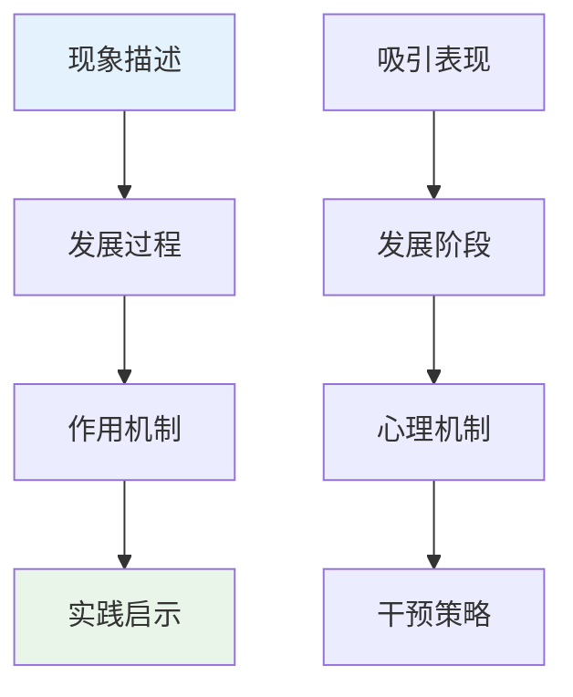

# Professional Attraction Case Studies (职业吸引案例研究报告)

> 📘 **文档导航**: 本报告通过典型案例分析，深入探讨职业吸引现象的实际表现和发展规律。相关文档：
> - [职业吸引概览](Professional_Attraction_Overview.md) - 理论基础
> - [职业吸引研究方法](Professional_Attraction_Research_Methods.md) - 研究方法学
> - [各职业专门文档](aviation/Aviation_Professional_Attraction.md) - 职业分析

## 案例研究方法论 (Case Study Methodology)

### 研究设计框架

采用多案例比较研究设计，通过深度访谈、观察记录和文档分析等方法，系统收集和分析职业吸引现象的典型案例。

#### 案例选择标准

**典型性原则**:
- 具有代表性的发展轨迹
- 体现核心理论概念
- 反映普遍存在问题

**多样性原则**:
- 不同年龄阶段案例
- 不同职业领域案例
- 不同发展结果案例

**可获得性原则**:
- 当事人同意参与研究
- 相关资料完整可得
- 研究条件具备可行

### 案例分析框架

采用"现象-过程-机制-启示"的四维分析框架：

## 典型案例分析 (Typical Case Analysis)

### 案例一：航空职业吸引发展轨迹

#### 案例背景
**当事人**: 李明，男，25岁，民航飞行员
**吸引起点**: 12岁时观看飞行表演产生浓厚兴趣
**发展过程**: 从小学到大学持续13年的职业追求

#### 发展阶段分析

##### 1. 初始接触阶段 (12-15岁)
**关键事件**: 首次观看空军飞行表演
**心理特征**: 好奇驱动、理想化倾向
**行为表现**: 收集航空杂志、制作飞机模型
**影响因素**: 媒体影响、家庭支持

##### 2. 兴趣培养阶段 (16-18岁)
**关键事件**: 参加航空夏令营、首次乘坐民航客机
**心理特征**: 主动了解、技能向往
**行为表现**: 学习航空知识、参加模拟飞行
**影响因素**: 教育引导、个人努力

##### 3. 深度认同阶段 (19-22岁)
**关键事件**: 考入民航大学、首次独自飞行
**心理特征**: 价值认同、身份融合
**行为表现**: 专业学习投入、职业准备积极
**影响因素**: 教育背景、社会支持

##### 4. 情感依恋阶段 (23-25岁)
**关键事件**: 获得商业飞行员执照、首次载客飞行
**心理特征**: 情感投入、理想升华
**行为表现**: 持续关注行业发展、情感寄托明显
**影响因素**: 工作体验、成就获得

#### 心理机制解析

**认知机制**:
- 职业形象建构过程
- 专业认同形成机制
- 理想与现实的平衡

**情感机制**:
- 兴趣情感的深化发展
- 职业自豪感的建立
- 成就动机的持续激发

**行为机制**:
- 学习行为的自我调节
- 职业准备的系统规划
- 挫折应对的策略选择

#### 实践启示
1. **早期启蒙的重要性**: 儿童期的职业接触体验对长期发展具有奠基作用
2. **持续支持的必要性**: 家庭、学校、社会的多方支持是成功的关键因素
3. **现实检验的价值**: 通过实践活动修正理想化认知，建立合理期望

### 案例二：芭蕾舞职业吸引转化过程

#### 案例背景
**当事人**: 王雅，女，22岁，芭蕾舞演员
**吸引起点**: 6岁观看《天鹅湖》演出深受触动
**发展过程**: 从业余爱好者到专业舞者的转变历程

#### 关键转折点分析

##### 转折点一：兴趣觉醒 (6-8岁)
**触发事件**: 首次观看专业芭蕾演出
**心理变化**: 从一般喜好转向深度着迷
**行为改变**: 主动要求学习芭蕾舞
**家庭反应**: 从观望到支持的态度转变

##### 转折点二：专业选择 (12-14岁)
**关键决策**: 决定报考专业舞蹈学校
**心理冲突**: 兴趣与学业压力的平衡
**支持系统**: 专业老师的鼓励、同伴的影响
**家庭妥协**: 家长对孩子兴趣的尊重和投入

##### 转折点三：职业危机 (18-20岁)
**挑战事件**: 青春期身体变化影响技术表现
**心理困扰**: 对职业前途的担忧和焦虑
**应对策略**: 专业技术指导、心理疏导支持
**重新定位**: 从技术型向艺术型舞者转型

#### 身心发展特点

**身体发展**:
- 青春期身体变化对舞蹈技术的影响
- 身体意象与自我认同的关系
- 伤病预防与健康管理的重要性

**心理发展**:
- 艺术创造力的培养和发展
- 舞台表现力的逐步提升
- 职业压力的心理调适能力

#### 干预策略效果
1. **早期识别**: 及时发现身体变化对技术的影响
2. **专业指导**: 提供针对性的技术调整方案
3. **心理支持**: 帮助建立积极的自我认知
4. **家庭配合**: 获得家庭的理解和支持

### 案例三：护理职业吸引的社会影响

#### 案例背景
**当事人**: 张慧，女，28岁，ICU护士
**吸引起点**: 高中时期照顾生病祖母的经历
**发展过程**: 从个人经历到职业使命感的升华

#### 社会文化因素分析

##### 家庭文化影响
**传统观念**: "救死扶伤"的家庭价值传承
**榜样作用**: 医护人员亲属的职业示范
**情感纽带**: 家庭成员的健康需求体验

##### 社会认知变迁
**职业地位提升**: 社会对医护人员尊重度的提高
**媒体形象塑造**: 正面的医护职业宣传报道
**疫情催化效应**: 突发公共卫生事件强化职业认同

##### 同辈群体影响
**专业学习环境**: 护理学院的集体氛围熏陶
**临床实习体验**: 与资深护士的师徒关系建立
**职业群体认同**: 同行间的支持和理解

#### 职业发展轨迹

**初级阶段**: 基础护理技能学习和适应
**成长阶段**: 专科护理能力提升和经验积累
**成熟阶段**: 临床决策能力和领导力发展
**专家阶段**: 专业影响力扩展和传承带教

#### 社会贡献价值
1. **医疗服务保障**: 为患者提供专业护理服务
2. **健康知识传播**: 向公众普及健康教育理念
3. **职业精神传承**: 培养新一代护理专业人才
4. **社会和谐促进**: 缓解医患关系，增进社会理解

### 案例四：教育职业吸引的时代特征

#### 案例背景
**当事人**: 陈老师，男，35岁，中学语文教师
**吸引起点**: 大学时期参与支教活动的深刻体验
**发展过程**: 从志愿者到专业教师的身份转变

#### 新时代教育职业特点

##### 数字化教学转型
**技术适应**: 在线教学平台的熟练运用
**教学创新**: 多媒体教学资源的整合应用
**学习方式**: 学生个性化学习需求的满足

##### 社会期待变化
**综合素质要求**: 从知识传授向全人教育转变
**创新能力培养**: 注重学生批判性思维和创造力发展
**心理健康关注**: 重视学生心理发展和情感需求

##### 职业发展挑战
**工作压力增加**: 教学任务和社会期待的双重压力
**专业发展需求**: 持续学习和能力提升的迫切要求
**职业倦怠风险**: 长期高强度工作的身心消耗

#### 个人成长路径

**专业能力发展**:
- 学科知识的持续深化
- 教学方法的不断创新
- 教育理念的与时俱进

**领导力培养**:
- 班主任工作经验积累
- 教研组长职责承担
- 青年教师指导工作

**社会影响力扩展**:
- 参与教育政策咨询
- 开展公益教育活动
- 分享教学经验心得

#### 成功要素总结
1. **教育情怀坚守**: 对教育事业的热爱和执着
2. **专业能力提升**: 持续学习和实践改进
3. **创新精神发扬**: 适应时代变化，勇于教学改革
4. **社会责任担当**: 关注学生全面发展，承担教育使命

## 跨案例比较分析 (Cross-case Comparative Analysis)

### 共同发展模式特征

#### 发展阶段规律性
所有案例都体现出明显的阶段性发展特征：
1. **启蒙期**: 外部刺激引发初步兴趣
2. **探索期**: 主动了解和尝试相关活动
3. **定向期**: 明确职业选择和发展方向
4. **成熟期**: 专业能力形成和职业身份确立

#### 影响因素共性
- **早期经历的关键作用**: 儿童期和青少年期的重要体验
- **家庭支持的基础地位**: 家长态度和资源投入的重要性
- **教育引导的促进作用**: 专业指导和同伴影响的价值
- **社会实践的验证功能**: 实际体验对职业认知的修正

### 差异性特征分析

#### 职业领域差异
| 职业类型 | 发展周期 | 关键挑战 | 成功要素 |
| :--- | :--- | :--- | :--- |
| **航空职业** | 较长(10-15年) | 技术门槛高、身体要求严格 | 持续学习、身体素质 |
| **芭蕾职业** | 中等(8-12年) | 青春期转型、伤病风险 | 身体管理、艺术修养 |
| **护理职业** | 较短(5-8年) | 情感消耗大、工作强度高 | 心理韧性、人文关怀 |
| **教育职业** | 中等(6-10年) | 社会期待高、创新要求强 | 专业发展、创新精神 |

#### 个体特征差异
- **性别因素**: 不同性别在不同职业领域的分布特点
- **性格特质**: 外向性、尽责性等人格特征的影响
- **家庭背景**: 社会经济地位、文化资本的作用
- **教育经历**: 不同学历背景和专业训练的影响

### 理论验证与拓展

#### 理论假设验证
1. **社会认同理论**: 职业群体归属感对发展的重要作用得到证实
2. **权威心理学**: 专家权威和制度权威在不同职业中的体现方式
3. **uniform fetishism理论**: 制服符号在特定职业吸引中的特殊作用

#### 理论发展建议
1. **动态发展模型**: 需要考虑发展过程中的非线性变化
2. **文化适应理论**: 应重视不同文化背景下的职业吸引特点
3. **代际差异理论**: 新生代职业吸引模式的特殊性值得关注

## 实践指导意义 (Practical Guidance Significance)

### 对个人发展的启示

#### 职业规划建议
1. **早期探索**: 鼓励多元化的职业接触和体验
2. **理性选择**: 基于自身特点和现实条件做出选择
3. **持续发展**: 重视专业能力提升和终身学习
4. **风险防范**: 建立合理的期望和应对机制

#### 心理调适策略
1. **认知重构**: 建立对目标职业的理性认知
2. **情感管理**: 学会处理职业发展中的情绪波动
3. **压力应对**: 掌握有效的压力管理和放松技巧
4. **支持寻求**: 建立良好的社会支持网络

### 对教育实践的指导

#### 职业教育改进
1. **体验式教学**: 增加职业实践和实地考察机会
2. **个性化指导**: 根据学生特点提供针对性建议
3. **生涯规划教育**: 系统开展职业发展指导课程
4. **家校合作**: 加强与家庭的沟通协作

#### 心理健康服务
1. **早期识别**: 及时发现职业发展中的心理问题
2. **预防干预**: 提供职业规划和心理调适指导
3. **危机处理**: 建立完善的心理危机干预机制
4. **跟踪服务**: 提供持续的职业发展支持

### 对社会政策的建议

#### 政策支持体系
1. **教育资源配置**: 优化职业教育资源的区域分布
2. **就业环境改善**: 营造公平公正的就业市场环境
3. **社会保障完善**: 建立健全的职业发展保障机制
4. **文化环境营造**: 培育尊重劳动、崇尚技能的社会风尚

#### 服务体系构建
1. **信息服务**: 建立权威的职业信息服务平台
2. **指导服务**: 完善职业规划和就业指导体系
3. **培训服务**: 提供多样化的职业技能培训项目
4. **支持服务**: 建立困难群体的职业发展帮扶机制

## 研究局限与展望 (Research Limitations and Prospects)

### 研究局限性

#### 方法学限制
- 案例数量有限，难以完全代表总体特征
- 回顾性数据可能存在记忆偏差
- 缺乏长期追踪数据验证发展轨迹

#### 理论框架局限
- 现有理论对某些新兴现象解释力不足
- 跨文化比较研究相对缺乏
- 数字化时代新特征的理论整合不够

### 未来研究方向

#### 理论发展重点
1. **整合性理论模型**: 构建更加综合的理论解释框架
2. **动态发展理论**: 关注发展过程中的变化机制
3. **跨文化理论**: 深化不同文化背景下的比较研究

#### 实证研究拓展
1. **纵向追踪研究**: 开展长期发展轨迹的追踪调查
2. **大样本研究**: 扩大研究规模，提高结果代表性
3. **国际比较研究**: 开展跨国跨地区的比较分析

#### 应用研究深化
1. **干预效果研究**: 验证不同干预措施的实际效果
2. **政策评估研究**: 评估相关政策的实施效果
3. **技术创新应用**: 探索新技术在职业发展中的应用

---
*📚 本案例研究报告通过深入的个案分析和系统的比较研究，为职业吸引现象的理解和指导提供了丰富的实证基础和实践启示。*