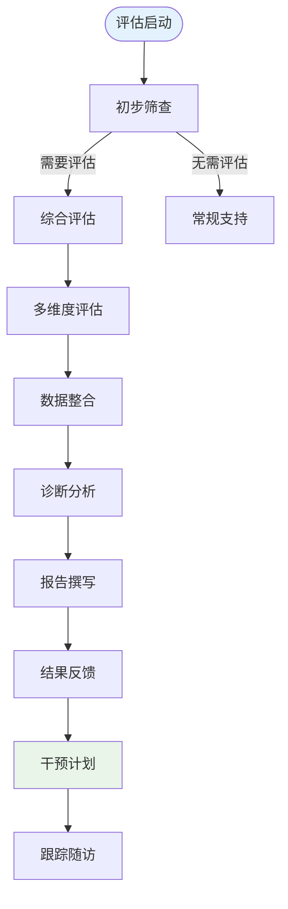
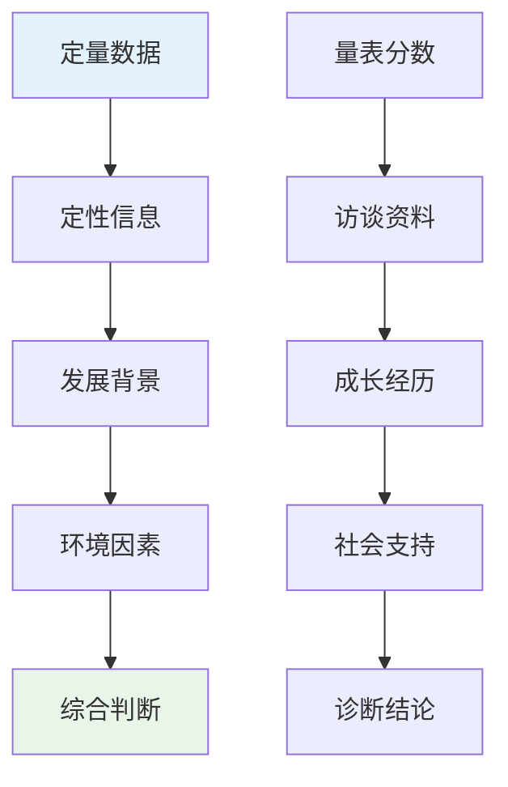
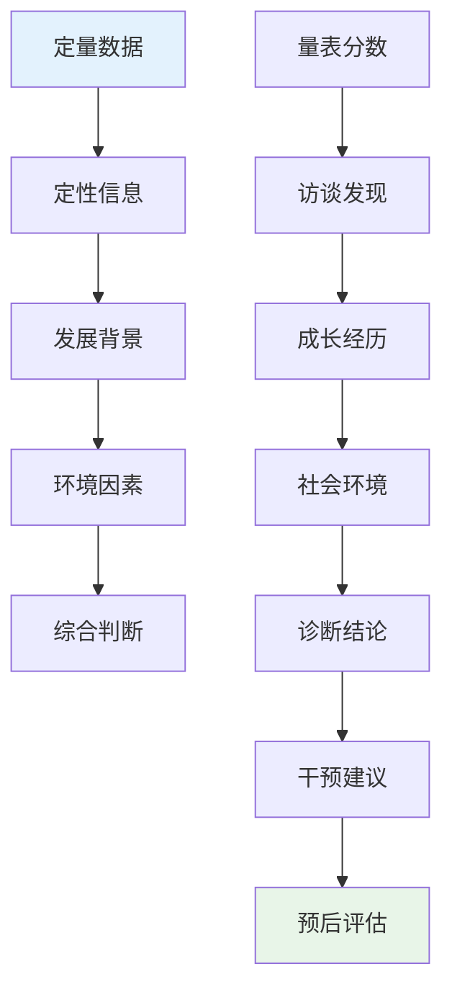

# Professional Attraction Clinical Assessment (职业吸引临床评估)

> 📘 **文档导航**: 本指南提供职业吸引现象的专业临床评估方法和实践指导。相关文档：
> - [职业吸引概览](Professional_Attraction_Overview.md) - 理论基础
> - [职业吸引术语标准](Professional_Attraction_Terminology_Standards.md) - 概念框架
> - [各职业专门文档](aviation/Aviation_Professional_Attraction.md) - 具体职业分析

## 临床评估框架与原则 (Clinical Assessment Framework and Principles)

### 评估基本原则

#### 1. 科学性原则
- **循证基础**: 采用经过验证的标准化评估工具
- **客观公正**: 避免评估者主观偏见和价值判断
- **系统全面**: 多维度、多层次的综合评估体系

#### 2. 人性化原则
- **尊重个体**: 充分尊重被评估者的主观体验和感受
- **保护隐私**: 严格保密评估过程中的个人信息
- **知情同意**: 确保被评估者充分了解评估目的和过程

#### 3. 发展性原则
- **动态评估**: 关注吸引现象的发展变化过程
- **个体差异**: 考虑不同个体的特点和发展阶段
- **积极导向**: 注重发现和培养积极的发展潜力

### 评估伦理规范

#### 专业伦理要求
| 伦理原则 | 具体要求 | 实施要点 | 监督机制 |
| :--- | :--- | :--- | :--- |
| **保密原则** | 严格保护被评估者隐私信息 | 签署保密协议、限制信息访问 | 伦理委员会监督 |
| **自愿原则** | 被评估者自主决定是否参与 | 提供充分信息、不得强制参与 | 过程记录存档 |
| **无害原则** | 避免评估过程造成心理伤害 | 风险评估、应急预案 | 专业督导支持 |
| **公正原则** | 平等对待所有被评估者 | 标准化流程、避免歧视 | 质量控制审查 |

## 标准化评估流程 (Standardized Assessment Process)

### 评估流程图



### 各阶段详细说明

#### 1. 初步筛查阶段

**筛查工具**:
- 职业吸引简易筛查量表(SAS)
- 职业兴趣快速评估问卷(QAI)
- 一般心理健康状况评估(GHQ-12)

**筛查标准**:
| 筛查维度 | 阳性标准 | 评估要点 | 后续处理 |
| :--- | :--- | :--- | :--- |
| **吸引强度** | SAS≥15分 | 吸引程度是否异常 | 进入综合评估 |
| **功能影响** | GHQ-12≥5分 | 是否影响正常功能 | 心理健康评估 |
| **持续时间** | 持续≥6个月 | 吸引现象的稳定性 | 发展性观察 |

#### 2. 综合评估阶段

**评估维度体系**:

##### 认知维度评估
| 评估内容 | 评估工具 | 评估要点 | 临床意义 |
| :--- | :--- | :--- | :--- |
| **职业认知** | 职业认知问卷(OCQ) | 对目标职业的了解程度 | 判断认知合理性 |
| **现实检验** | 现实检验能力量表(RTS) | 对职业现实的准确判断 | 评估认知偏差 |
| **信息处理** | 信息偏向问卷(IBQ) | 职业相关信息的选择性关注 | 发现认知偏见 |

##### 情感维度评估
| 评估内容 | 评估工具 | 评估要点 | 临床意义 |
| :--- | :--- | :--- | :--- |
| **情感强度** | 职业情感投入量表(OEI) | 情感投入的程度和性质 | 判断情感适宜性 |
| **情绪状态** | 抑郁焦虑量表(DASS-21) | 相关情绪困扰水平 | 评估心理健康状况 |
| **情感调节** | 情绪调节问卷(ERQ) | 情感管理和调节能力 | 了解应对资源 |

##### 行为维度评估
| 评估内容 | 评估工具 | 评估要点 | 临床意义 |
| :--- | :--- | :--- | :--- |
| **行为表现** | 职业行为倾向量表(OBT) | 相关行为的频率和强度 | 评估行为适宜性 |
| **社交影响** | 社交功能评估量表(SFS) | 对人际关系的影响 | 判断社会功能 |
| **生活干扰** | 生活质量问卷(WHOQOL-BREF) | 对日常生活的影响 | 评估功能损害 |

#### 3. 数据整合与分析

**综合分析框架**:


**诊断分类标准**:
| 诊断类别 | 诊断标准 | 核心特征 | 干预方向 |
| :--- | :--- | :--- | :--- |
| **适应性吸引** | 吸引强度适中，促进积极发展 | 健康发展、功能良好 | 支持引导 |
| **关注性吸引** | 吸引强度较高，需要关注引导 | 发展潜能、轻度困扰 | 教育干预 |
| **问题性吸引** | 吸引强度过高，影响正常功能 | 功能损害、明显困扰 | 临床干预 |
| **病理性吸引** | 吸引达到病理程度，严重影响生活 | 严重功能损害、痛苦显著 | 治疗干预 |

## 专业化评估工具体系 (Specialized Assessment Tool System)

### 核心评估量表

#### 1. 职业吸引力量表(Professional Attraction Scale, PAS)

**量表结构**:
- **总题数**: 35题
- **维度划分**: 4个主维度，12个子维度
- **计分方式**: 5点李克特量表(1-5分)
- **适用人群**: 16岁以上成年人

**维度构成**:
| 维度名称 | 题目数量 | 核心内容 | 信效度指标 |
| :--- | :--- | :--- | :--- |
| **认知吸引** | 10题 | 职业认知、信息关注、理想化程度 | α=0.87, ICC=0.83 |
| **情感吸引** | 9题 | 情感投入、情绪体验、依恋程度 | α=0.85, ICC=0.81 |
| **行为吸引** | 8题 | 行为倾向、模仿表现、追求行为 | α=0.83, ICC=0.79 |
| **价值吸引** | 8题 | 价值认同、意义建构、使命感 | α=0.89, ICC=0.85 |

**评分解释**:
- **总分范围**: 35-175分
- **临界值**: ≥105分为显著吸引
- **严重程度**: 
  - 35-70分: 轻度吸引
  - 71-104分: 中度吸引
  - 105-140分: 重度吸引
  - 141-175分: 极重度吸引

#### 2. 职业认同问卷(Professional Identity Questionnaire, PIQ)

**问卷结构**:
- **总题数**: 28题
- **维度划分**: 4个核心维度
- **计分方式**: 6点李克特量表(1-6分)
- **适用人群**: 相关职业群体及潜在从业者

**维度构成**:
| 维度名称 | 题目数量 | 核心内容 | 信效度指标 |
| :--- | :--- | :--- | :--- |
| **认知认同** | 7题 | 对职业价值和意义的认知认同 | α=0.91, CVI=0.94 |
| **情感认同** | 7题 | 对职业的积极情感体验和归属感 | α=0.89, CVI=0.92 |
| **行为认同** | 7题 | 从事或支持该职业的行为倾向 | α=0.87, CVI=0.90 |
| **社会认同** | 7题 | 认为自己属于该职业群体的程度 | α=0.92, CVI=0.95 |

**评分标准**:
- **总分范围**: 28-168分
- **认同水平**:
  - 28-56分: 低认同
  - 57-84分: 中低认同
  - 85-112分: 中等认同
  - 113-140分: 中高认同
  - 141-168分: 高认同

### 专业辅助评估工具

#### 1. 深度访谈指南

**访谈结构框架**:
```
I. 背景信息收集 (10-15分钟)
   - 个人基本信息
   - 教育和工作经历
   - 家庭背景和成长环境

II. 职业吸引体验探索 (20-25分钟)
   - 吸引起源和发展历程
   - 具体吸引体验和感受
   - 对目标职业的认知和理解

III. 影响评估 (15-20分钟)
   - 对学习工作的影响
   - 对人际关系的影响
   - 对生活质量的影响

IV. 未来规划探讨 (10-15分钟)
   - 职业发展规划
   - 现实可行性评估
   - 支持需求识别
```

**关键访谈技巧**:
- **开放式提问**: 鼓励详细表达和深入探讨
- **积极倾听**: 全神贯注地理解和共情
- **澄清确认**: 确保准确理解被评估者的意思
- **非评判态度**: 营造安全的表达环境

#### 2. 行为观察记录

**观察维度**:
| 观察领域 | 具体内容 | 观察方法 | 记录要点 |
| :--- | :--- | :--- | :--- |
| **言语表达** | 职业相关话题的提及频率和情感色彩 | 自然交谈观察 | 关键词、语调、表情 |
| **行为表现** | 模仿行为、相关信息搜集行为 | 日常行为观察 | 行为频率、持续时间 |
| **情感反应** | 提及相关职业时的情绪表现 | 情境观察 | 情绪强度、持续时间 |
| **社交互动** | 与相关职业群体的互动模式 | 社交场合观察 | 互动频率、质量 |

### 特殊人群评估考虑

#### 青少年群体评估

**年龄适应性调整**:
- 语言表达更加通俗易懂
- 增加图画和情境描述
- 缩短评估时间，增加趣味性
- 重视家庭环境因素评估

**发展性评估重点**:
- 职业兴趣的正常发展轨迹
- 同伴影响和社会化过程
- 家庭期望与个人意愿的平衡
- 学业压力与职业兴趣的关系

#### 职业转换期评估

**评估特殊考虑**:
- 现有职业满意度评估
- 转换动机和期望分析
- 能力匹配度评估
- 风险承受能力评估

**支持性评估内容**:
- 社会支持网络评估
- 经济状况评估
- 家庭责任评估
- 个人资源评估

## 评估结果解释与报告 (Assessment Result Interpretation and Reporting)

### 结果解释框架

#### 综合解释原则

**多维度整合解释**:


#### 诊断分类标准

**适应性发展类别**:
- **健康吸引**: 吸引强度适中，促进积极发展，不影响正常功能
- **积极关注**: 吸引程度较高但仍在正常范围内，具有发展潜力

**需要关注类别**:
- **轻度困扰**: 吸引强度偏高，伴有轻微功能影响
- **中度关注**: 明显吸引表现，对某些功能产生影响

**临床干预类别**:
- **问题吸引**: 吸引强度过高，显著影响正常生活功能
- **病理吸引**: 达到临床病理程度，需要专业治疗干预

### 专业报告撰写

#### 报告结构模板

**标题**: 职业吸引临床评估报告

**基本信息**:
- 被评估者编号:
- 评估日期:
- 评估师签名:
- 报告日期:

**一、评估概况**
- 评估目的
- 评估方法
- 评估过程简述

**二、评估结果**
- 定量评估结果(量表分数及解释)
- 定性评估发现(访谈和观察结果)
- 综合分析结论

**三、诊断意见**
- 诊断分类
- 严重程度评定
- 发展趋势判断

**四、干预建议**
- 短期目标
- 长期规划
- 具体措施
- 资源推荐

**五、随访安排**
- 随访时间
- 评估重点
- 预警指标

### 质量控制与标准化

#### 评估质量保障

**标准化操作程序**:
- 评估师资质要求(相关专业背景和培训认证)
- 评估环境标准化(安静、私密、舒适的评估环境)
- 评估时间控制(每次评估不超过2小时，必要时分次进行)
- 数据记录规范(详细、准确、及时的记录保存)

**质量监控机制**:
- 定期内部审核(每月抽样复查10%的评估档案)
- 外部质量评估(每年邀请外部专家进行质量评估)
- 持续培训更新(定期参加专业培训和学术交流)
- 反馈改进机制(根据评估效果持续优化评估流程)

#### 信效度保障

**工具质量控制**:
- 定期修订更新评估工具
- 多样本验证工具适用性
- 跨文化适应性检验
- 技术更新跟进

**过程质量控制**:
- 评估师间一致性检验
- 重测信度定期检测
- 效标关联效度验证
- 预测效度追踪研究

---
*📚 本文档提供职业吸引现象的专业临床评估体系，确保评估的科学性、规范性和有效性。*