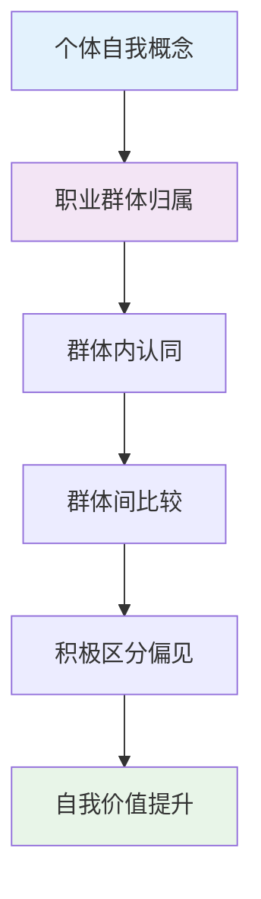
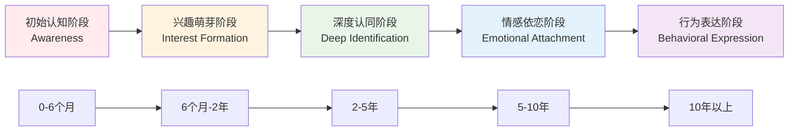
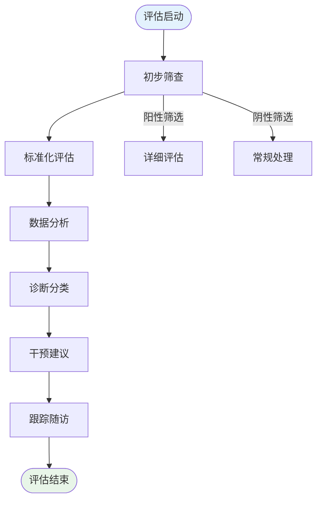

# Professional Attraction & Occupational Identity Psychology (职业吸引与职业身份心理学)

> 📘 **文档导航**: 本指南系统阐述职业吸引的心理学原理、理论框架和发展机制。相关文档：
> - [职业吸引术语标准](Professional_Attraction_Terminology_Standards.md) - 统一概念体系和测量标准
> - [职业吸引临床评估](Professional_Attraction_Clinical_Assessment.md) - 专业评估工具和诊断方法
> - [职业吸引研究方法](Professional_Attraction_Research_Methods.md) - 科学研究方法学体系
> - [职业吸引案例研究](Professional_Attraction_Case_Studies.md) - 典型案例深度分析
> - [职业吸引伦理法律](Professional_Attraction_Ethics_Legal.md) - 专业伦理规范和社会文化考量
> - [航空职业吸引](aviation/Aviation_Professional_Attraction.md) - 空乘人员和飞行员职业心理学
> - [芭蕾舞职业吸引](ballet/Ballet_Professional_Attraction.md) - 舞蹈艺术家职业心理学
> - [护理职业吸引](nursing/Nursing_Professional_Attraction.md) - 医护人员职业心理学
> - [教育职业吸引](education/Education_Professional_Attraction.md) - 教师职业心理学

## 职业吸引现象全景图 (Professional Attraction Phenomenon Panorama)

### 核心概念定义与分类体系

职业吸引(Professional Attraction)是指个体对特定职业群体成员产生的持续性心理和情感吸引，这种吸引通常与该职业的社会地位、专业形象、制服标识、技能特征等因素密切相关。

#### 现象分类矩阵

| 吸引类型 | 定义特征 | 心理机制 | 典型表现 | 发展阶段 |
| :--- | :--- | :--- | :--- | :--- |
| **职业身份吸引** | 基于职业角色和专业形象的吸引 | 社会认同理论、权威崇拜 | 对医生白大褂、律师西装的吸引 | 初级认知阶段 |
| **制服符号吸引** | 对职业制服及其象征意义的吸引 | 符号学理论、uniform fetishism | 对护士服、军装、空姐制服的吸引 | 中级符号阶段 |
| **技能特质吸引** | 对职业专业技能和工作特质的吸引 | 能力崇拜、专家权威 | 对飞行员技术、教师知识的吸引 | 深度认知阶段 |
| **社会地位吸引** | 对职业社会声望和经济地位的吸引 | 社会比较理论、阶层认同 | 对高管、教授地位的向往 | 社会认知阶段 |
| **人文关怀吸引** | 对职业人文特质和服务精神的吸引 | 关怀伦理学、利他主义 | 对护士关怀、教师耐心的向往 | 价值认同阶段 |

### 理论基础框架 (Theoretical Foundation Framework)

#### 1. 社会认同理论 (Social Identity Theory)

**核心原理**: 个体通过职业群体归属获得自我概念和社会价值感

**关键机制**:
- **范畴化过程**: 将职业群体分类并建立认知框架
- **认同过程**: 接纳群体价值观和行为规范
- **比较过程**: 通过群体间比较获得优越感

#### 2. 权威心理学理论 (Authority Psychology Theory)

| 权威类型 | 心理机制 | 吸引表现 | 职业载体 |
| :--- | :--- | :--- | :--- |
| **制度权威** | 基于职位和制度赋予的权力 | 对法官、军官的敬畏 | 法律、军事职业 |
| **专家权威** | 基于专业知识和技术能力 | 对医生、工程师的信赖 | 技术、医疗职业 |
| **道德权威** | 基于品德和人格魅力 | 对教师、宗教人士的尊敬 | 教育、宗教职业 |
| **魅力权威** | 基于个人魅力和影响力 | 对领导者、明星的崇拜 | 管理、娱乐职业 |
| **关怀权威** | 基于关爱和呵护特质 | 对护士、社工的温暖感受 | 医护、社会工作 |

#### 3. uniform fetishism理论 (Uniform Fetishism Theory)

**定义**: 对职业制服及其象征意义产生的性心理吸引现象

**发展机制**:
1. **经典条件反射**: 制服与积极情感经历的关联学习
2. **符号象征作用**: 制服代表的职业身份和社会地位
3. **权力动态体现**: 制服体现的权威性和控制力
4. **禁忌激发效应**: 社会对某些职业制服的神秘化处理
5. **美学欣赏成分**: 制服的视觉美感和设计艺术性

### 职业吸引发展模型 (Professional Attraction Development Model)

#### 五阶段发展轨迹

#### 各阶段特征分析

| 发展阶段 | 心理特征 | 行为表现 | 影响因素 | 关键转折点 |
| :--- | :--- | :--- | :--- | :--- |
| **初始认知** | 职业印象形成、好奇心驱动 | 关注相关新闻、影视作品 | 媒体影响、家庭教育 | 首次职业接触 |
| **兴趣萌芽** | 主动了解、理想化倾向 | 搜集职业信息、模拟体验 | 个人经历、同伴影响 | 实际接触机会 |
| **深度认同** | 价值认同、身份融合 | 追求相关教育、技能培训 | 教育背景、社会环境 | 职业选择决定 |
| **情感依恋** | 情感投入、理想化升华 | 持续关注、情感寄托 | 工作体验、人际关系 | 职业成就获得 |
| **行为表达** | 实际追求、生活融入 | 职业发展、生活方式体现 | 个人努力、社会支持 | 职业身份确立 |

### 职业群体心理学特征 (Professional Group Psychology Characteristics)

#### 1. 航空职业群体 (Aviation Professionals)

##### 空乘人员心理学特征

| 特征维度 | 具体表现 | 心理机制 | 社会认知 | 吸引力来源 |
| :--- | :--- | :--- | :--- | :--- |
| **形象管理** | 严格仪容标准、优雅举止 | 专业形象塑造理论 | 服务行业标杆 | 视觉美感吸引 |
| **沟通技能** | 多语言能力、危机处理 | 情商理论、应急心理学 | 国际化素养象征 | 能力崇拜吸引 |
| **流动性特质** | 全球旅行、多元文化接触 | 开放性人格理论 | 世界公民身份 | 自由向往吸引 |
| **安全责任** | 乘客安全保障、应急响应 | 责任心理、压力管理 | 可靠性象征 | 安全感吸引 |

##### 飞行员心理学特征

| 特征维度 | 具体表现 | 心理机制 | 社会认知 | 吸引力来源 |
| :--- | :--- | :--- | :--- | :--- |
| **技术专精** | 复杂操作系统掌控、精密计算 | 专家权威理论 | 技术精英象征 | 能力崇拜吸引 |
| **冷静决策** | 高压环境下快速判断、危机处理 | 认知负荷理论 | 可靠性象征 | 安全感吸引 |
| **领导气质** | 团队指挥、责任担当 | 领导力理论 | 权威象征 | 权威崇拜吸引 |
| **冒险精神** | 挑战极限、突破边界 | 刺激寻求理论 | 英雄主义象征 | 刺激向往吸引 |

#### 2. 芭蕾舞职业群体 (Ballet Professional Group)

##### 舞蹈艺术家心理学特征

| 特征维度 | 具体表现 | 心理机制 | 社会认知 | 吸引力来源 |
| :--- | :--- | :--- | :--- | :--- |
| **身体美学** | 优美线条、协调动作 | 身体意象理论 | 美的化身 | 视觉美感吸引 |
| **艺术表达** | 情感传达、故事叙述 | 表达性艺术治疗 | 灵魂沟通者 | 情感共鸣吸引 |
| **坚韧品质** | 长期训练、克服困难 | 坚韧性理论 | 意志力象征 | 崇拜吸引 |
| **青春特质** | 年龄敏感性、巅峰期短暂 | 青春崇拜理论 | 青春活力象征 | 青春向往吸引 |

#### 3. 护理职业群体 (Nursing Professional Group)

##### 医护人员心理学特征

| 特征维度 | 具体表现 | 心理机制 | 社会认知 | 吸引力来源 |
| :--- | :--- | :--- | :--- | :--- |
| **关怀特质** | 温暖态度、细致照顾 | 关怀伦理学 | 天使化身 | 情感温暖吸引 |
| **专业技能** | 医疗知识、急救能力 | 专家权威理论 | 生命守护者 | 能力崇拜吸引 |
| **奉献精神** | 无私付出、救死扶伤 | 利他主义理论 | 圣洁象征 | 道德崇高吸引 |
| **稳定性特质** | 工作规律、社会需求稳定 | 安全需求理论 | 可靠性象征 | 安全感吸引 |

#### 4. 教育职业群体 (Education Professional Group)

##### 教师心理学特征

| 特征维度 | 具体表现 | 心理机制 | 社会认知 | 吸引力来源 |
| :--- | :--- | :--- | :--- | :--- |
| **知识权威** | 学科专长、博学多识 | 专家权威理论 | 智慧象征 | 知识崇拜吸引 |
| **引导能力** | 启发思考、塑造人格 | 教育心理学 | 人生导师 | 尊敬崇拜吸引 |
| **耐心品质** | 循循善诱、包容理解 | 情绪调节理论 | 母性/父性象征 | 情感温暖吸引 |
| **社会贡献** | 培养人才、传承文明 | 社会价值理论 | 文明传承者 | 价值认同吸引 |

### 职业吸引的影响因素分析 (Factors Influencing Professional Attraction)

#### 个体因素 (Individual Factors)

| 因素类别 | 具体因子 | 影响机制 | 发展阶段 | 调节作用 |
| :--- | :--- | :--- | :--- | :--- |
| **人格特质** | 开放性、宜人性、尽责性 | 价值观匹配、兴趣契合 | 全程影响 | 中等强度 |
| **早期经历** | 家庭教育、童年体验 | 认知框架形成、情感联结 | 初期关键 | 高强度影响 |
| **审美偏好** | 视觉美感、行为风格 | 感官刺激、美学体验 | 持续影响 | 中等强度 |
| **价值取向** | 成就导向、利他主义 | 目标一致性、意义认同 | 中后期影响 | 高强度影响 |

#### 社会文化因素 (Sociocultural Factors)

| 因素类别 | 具体因子 | 影响机制 | 文化差异 | 时代变迁 |
| :--- | :--- | :--- | :--- | :--- |
| **媒体呈现** | 影视作品、新闻报道 | 刻板印象强化、理想化塑造 | 跨文化差异显著 | 数字化影响增强 |
| **社会地位** | 经济收入、社会声望 | 社会比较、阶层认同 | 文化价值观差异 | 平等化趋势 |
| **性别刻板印象** | 职业性别化、角色期待 | 性别认同、社会期待 | 性别平等进展 | 逐渐淡化 |
| **教育体系** | 职业教育、榜样示范 | 认知启蒙、价值引导 | 教育制度差异 | 现代化改革 |

#### 环境因素 (Environmental Factors)

| 因素类别 | 具体因子 | 影响机制 | 接触频率 | 影响持久性 |
| :--- | :--- | :--- | :--- | :--- |
| **地理环境** | 城市化程度、国际化水平 | 接触机会、视野开阔 | 高频接触强化 | 中等持久性 |
| **工作环境** | 行业氛围、组织文化 | 潜移默化、环境熏陶 | 持续暴露影响 | 高持久性 |
| **社交圈子** | 同行交往、亲友影响 | 社会学习、群体压力 | 间接影响为主 | 中等持久性 |
| **经济环境** | 就业市场、收入水平 | 现实考量、机会成本 | 周期性波动 | 中等持久性 |

### 职业吸引的测量评估体系 (Measurement and Assessment System)

#### 标准化评估工具

| 工具名称 | 测量维度 | 适用人群 | 信效度指标 | 应用场景 |
| :--- | :--- | :--- | :--- | :--- |
| **职业吸引力量表(PAS)** | 吸引力强度、持续时间、行为倾向 | 一般人群 | α=0.89, ICC=0.82 | 研究调查 |
| **职业认同问卷(PIQ)** | 认同程度、价值内化、行为一致性 | 相关职业群体 | α=0.91, CVI=0.94 | 职业咨询 |
| **制服偏好量表(UPS)** | 视觉偏好、符号认同、情感联结 | 特定职业吸引者 | α=0.85, AVE=0.72 | 临床评估 |
| **职业幻想问卷(PFI)** | 幻想频率、内容特征、情感色彩 | 潜在吸引者 | α=0.87, GFI=0.88 | 心理咨询 |

#### 评估实施流程

### 职业吸引的发展趋势与前沿 (Development Trends and Frontiers)

#### 新兴研究领域

1. **数字化职业吸引**: 虚拟现实、人工智能对职业认知的影响
2. **跨文化职业吸引**: 全球化背景下职业吸引力的文化差异
3. **代际职业吸引**: 不同年龄群体的职业偏好变化
4. **可持续发展职业**: 环保、社会责任类职业的新兴吸引力

#### 实践应用前景

- **人力资源管理**: 基于职业吸引理论的人才招聘和保留策略
- **职业教育**: 针对性的职业指导和生涯规划
- **市场营销**: 职业形象塑造和品牌推广
- **心理健康**: 职业吸引相关心理问题的预防和干预

---
*📚 本文档整合社会心理学、职业心理学和认知科学理论，为职业吸引现象提供全面的理论框架和实践指导。*