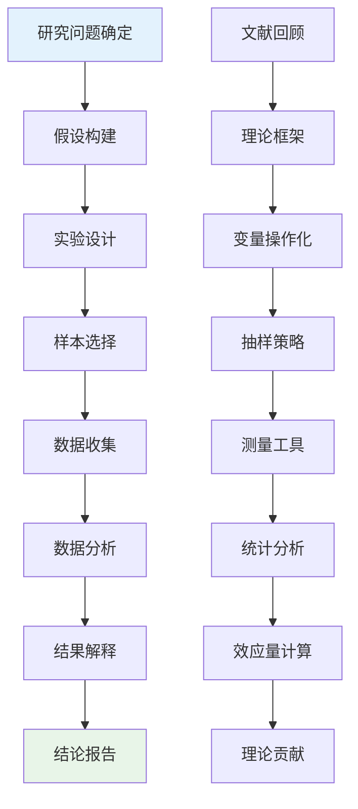
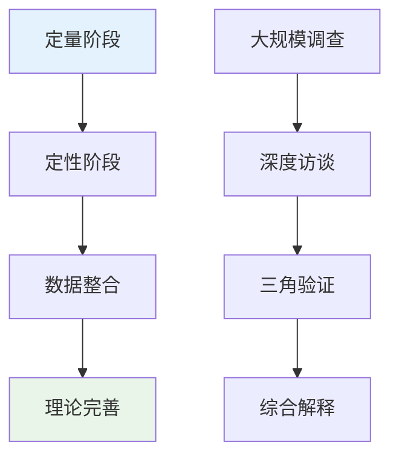
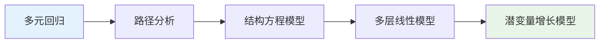

# Professional Attraction Research Methods (职业吸引研究方法)

> 📘 **文档导航**: 本指南系统阐述职业吸引现象的科学研究方法和实证研究策略。相关文档：
> - [职业吸引概览](Professional_Attraction_Overview.md) - 理论基础
> - [职业吸引术语标准](Professional_Attraction_Terminology_Standards.md) - 概念框架
> - [职业吸引临床评估](Professional_Attraction_Clinical_Assessment.md) - 评估工具
> - [职业吸引伦理法律](Professional_Attraction_Ethics_Legal.md) - 研究伦理

## 研究方法学框架 (Research Methodology Framework)

### 核心研究范式

职业吸引心理学研究采用多元化研究方法，整合定量研究、定性研究和混合研究方法，确保研究结果的科学性和可靠性。

#### 1. 定量研究方法 (Quantitative Research Methods)

##### 实验研究设计

**实验类型矩阵**:
| 实验类型 | 设计特点 | 适用场景 | 内在效度 | 外在效度 |
| :--- | :--- | :--- | :--- | :--- |
| **实验室实验** | 严格控制变量、随机分组 | 因果关系验证 | 高 | 中等 |
| **现场实验** | 自然环境、真实情境 | 生态效度检验 | 中等 | 高 |
| **准实验设计** | 非随机分组、自然分组 | 现实条件研究 | 中等 | 高 |
| **纵向追踪** | 多时间点测量、发展轨迹 | 发展变化研究 | 高 | 高 |

**标准化实验流程**:


##### 问卷调查研究

**测量工具开发**:
- **职业吸引力量表(PAS)**: 35题，4维度结构
- **职业认同问卷(PIQ)**: 28题，4维度结构
- **吸引强度评估量表(AIS)**: 15题，单维度测量

**信效度指标体系**:
| 指标类型 | 评估标准 | 计算方法 | 解释标准 |
| :--- | :--- | :--- | :--- |
| **内部一致性** | Cronbach's α | α ≥ 0.80为优秀 | 项目间相关性 |
| **重测信度** | ICC系数 | ICC ≥ 0.70为可接受 | 时间稳定性 |
| **内容效度** | CVI指数 | CVI ≥ 0.80为良好 | 专家评议结果 |
| **构念效度** | CFI指数 | CFI ≥ 0.90为优秀 | 因子分析结果 |

#### 2. 定性研究方法 (Qualitative Research Methods)

##### 深度访谈法

**访谈设计框架**:
```
I. 背景信息收集 (10-15分钟)
   - 个人基本信息
   - 教育和职业经历
   - 家庭背景和成长环境

II. 职业吸引体验探索 (20-25分钟)
   - 吸引起源和发展历程
   - 具体吸引体验和感受
   - 对目标职业的认知和理解

III. 影响评估 (15-20分钟)
   - 对学习工作的影响
   - 对人际关系的影响
   - 对生活质量的影响

IV. 未来规划探讨 (10-15分钟)
   - 职业发展规划
   - 现实可行性评估
   - 支持需求识别
```

**数据分析技术**:
- **主题分析法**: 识别和编码核心主题
- **叙事分析法**: 分析个人故事和发展轨迹
- **话语分析法**: 探讨语言使用和社会建构

##### 现象学研究

**研究程序**:
1. **现象描述**: 详尽描述职业吸引体验
2. **意义阐释**: 理解体验的深层含义
3. **本质揭示**: 提炼现象的核心结构
4. **理论建构**: 形成解释性理论框架

#### 3. 混合研究方法 (Mixed Methods Research)

##### 序列性解释设计

**研究流程**:


**优势特点**:
- 量化结果提供统计概括
- 质性数据解释深层机制
- 三角验证提高研究可信度

### 研究设计类型与应用

#### 1. 描述性研究 (Descriptive Studies)

**横断面调查设计**:
- **样本规模**: 建议n≥300以确保代表性
- **抽样方法**: 分层随机抽样、整群抽样
- **数据收集**: 在线问卷、纸质问卷、电话访问

**典型案例**: 全国职业吸引现状调查
- 覆盖不同地区、年龄、教育背景群体
- 评估各类职业的吸引力水平
- 分析人口学变量的影响效应

#### 2. 相关性研究 (Correlational Studies)

**变量关系矩阵**| 变量类型 | 测量工具 | 相关分析 | 效应大小 |
| :--- | :--- | :--- | :--- |
| **人格特质** | NEO-PI-R量表 | Pearson相关 | r = 0.35-0.55 |
| **家庭背景** | 家庭SES指数 | Spearman相关 | r = 0.25-0.40 |
| **媒体影响** | 媒体接触量表 | Kendall tau | r = 0.20-0.35 |
| **社会支持** | 社会支持评定量表 | 偏相关分析 | r = 0.30-0.50 |

#### 3. 实验性研究 (Experimental Studies)

**干预研究设计**:
- **前实验设计**: 单组前后测设计
- **准实验设计**: 非等价控制组设计
- **真实验设计**: 随机对照试验设计

**典型应用**: 职业教育干预效果研究
- 实验组接受职业认知教育
- 控制组维持常规教育
- 比较两组职业吸引水平变化

#### 4. 纵向研究 (Longitudinal Studies)

**追踪设计类型**:
| 设计类型 | 时间跨度 | 测量频次 | 研究价值 |
| :--- | :--- | :--- | :--- |
| **短期追踪** | 6-12个月 | 3-4次 | 发展初期研究 |
| **中期追踪** | 2-5年 | 5-8次 | 关键期研究 |
| **长期追踪** | 10年以上 | 10+次 | 生命周期研究 |

### 数据分析策略 (Data Analysis Strategies)

#### 1. 统计分析方法

##### 描述性统计分析
- **集中趋势**: 均值、中位数、众数
- **离散程度**: 标准差、方差、四分位距
- **分布形态**: 偏度、峰度、正态性检验

##### 推断性统计分析
- **参数检验**: t检验、方差分析、回归分析
- **非参数检验**: Mann-Whitney U检验、Kruskal-Wallis检验
- **多变量分析**: 因子分析、聚类分析、结构方程模型

##### 高级统计技术


#### 2. 质性数据分析

##### 编码分析流程
1. **开放编码**: 识别基本概念和范畴
2. **轴心编码**: 建立概念间的关系
3. **选择编码**: 确定核心范畴和理论
4. **理论饱和**: 验证理论的完整性

##### 软件工具应用
- **NVivo**: 定性数据管理和分析
- **ATLAS.ti**: 编码和可视化分析
- **MAXQDA**: 混合方法研究支持

### 研究伦理与质量控制 (Research Ethics and Quality Control)

#### 1. 伦理原则遵循

##### 知情同意程序
- **信息提供**: 研究目的、过程、风险、收益
- **自愿参与**: 无强制、无诱导、可随时退出
- **隐私保护**: 数据匿名化、信息安全存储

##### 风险管理策略
| 风险类型 | 预防措施 | 应急预案 | 监督机制 |
| :--- | :--- | :--- | :--- |
| **心理风险** | 心理筛查、支持资源 | 危机干预、转介服务 | 伦理委员会审批 |
| **社会风险** | 匿名保护、数据加密 | 法律援助、公关应对 | 定期内部审核 |
| **学术风险** | 同行评议、数据验证 | 纠正措施、公开道歉 | 外部质量评估 |

#### 2. 质量控制标准

##### 研究设计质量
- **内部效度**: 控制混淆变量、随机化设计
- **外部效度**: 样本代表性、情境普遍性
- **统计结论效度**: 适当样本量、正确统计方法
- **构念效度**: 准确测量、理论一致性

##### 数据收集质量
- **测量工具标准化**: 统一指导语、标准化程序
- **数据录入准确性**: 双人录入、逻辑检验
- **缺失数据处理**: 多重插补、敏感性分析

### 新兴研究技术与趋势 (Emerging Research Technologies and Trends)

#### 1. 数字化研究方法

##### 大数据分析
- **社交媒体分析**: 微博、微信、抖音等平台数据
- **网络行为追踪**: 搜索记录、浏览模式分析
- **文本挖掘技术**: 自然语言处理、情感分析

##### 移动端数据收集
- **生态瞬时评估(EMA)**: 实时数据收集
- **被动数据采集**: GPS定位、活动监测
- **智能设备集成**: 可穿戴设备数据整合

#### 2. 神经科学研究方法

##### 脑成像技术应用
- **fMRI研究**: 职业吸引的神经机制
- **ERP分析**: 认知加工的时间进程
- **眼动追踪**: 注意力分配模式

##### 生理指标测量
- **皮肤电反应**: 情绪唤醒水平
- **心率变异性**: 压力反应模式
- **激素水平**: 多巴胺、催产素等神经递质

#### 3. 跨文化比较研究

##### 国际合作研究
- **多国比较**: 不同文化背景下的职业吸引模式
- **翻译等值性**: 测量工具的跨文化适应
- **文化变量控制**: 集体主义vs个人主义等维度

##### 本土化研究
- **文化适应性**: 理论模型的本土化修正
- **社会背景考量**: 经济发展水平、教育制度影响
- **语言文化因素**: 表达方式、价值观念差异

### 研究报告撰写规范 (Research Report Writing Standards)

#### 1. 学术论文结构

##### 标准格式要求
```
I. 标题页
   - 简洁明确的研究标题
   - 作者信息和机构 affiliation
   - 通讯作者联系方式

II. 摘要部分
   - 研究背景和目的(50字)
   - 方法设计(75字)
   - 主要发现(100字)
   - 结论意义(25字)

III. 正文结构
   1. 引言(Introduction)
   2. 方法(Method)
   3. 结果(Results)
   4. 讨论(Discussion)
   5. 结论(Conclusion)

IV. 参考文献
   - APA格式标准
   - 近五年文献占比≥60%
   - 关键理论文献全覆盖
```

#### 2. 实践报告格式

##### 应用研究报告模板
- **项目背景**: 研究缘起、现实需求
- **实施过程**: 具体方法、执行细节
- **效果评估**: 定量结果、质性反馈
- **经验总结**: 成功要素、改进建议
- **推广应用**: 可复制性、规模化路径

### 研究质量评估体系 (Research Quality Assessment System)

#### 1. 评估指标体系

##### 科学性评估维度
| 维度指标 | 评估标准 | 权重 | 评分方法 |
| :--- | :--- | :--- | :--- |
| **理论贡献** | 理论创新程度、概念清晰度 | 25% | 专家评议打分 |
| **方法严谨性** | 设计合理性、程序规范性 | 20% | 同行评议审核 |
| **数据分析** | 统计方法适当性、结果可靠性 | 20% | 统计专家检验 |
| **实用价值** | 应用前景、社会意义 | 20% | 实践专家评估 |
| **伦理合规** | 研究伦理遵循、风险控制 | 15% | 伦理委员会审查 |

##### 质量等级标准
| 等级 | 总分范围 | 质量特征 | 改进建议 |
| :--- | :--- | :--- | :--- |
| **优秀** | 90-100分 | 创新性强、方法严谨、应用价值高 | 保持优势，扩大影响 |
| **良好** | 80-89分 | 理论扎实、设计合理、有一定价值 | 加强创新，提升应用 |
| **合格** | 70-79分 | 基本符合要求、方法可行 | 完善设计，深化分析 |
| **待改进** | 60-69分 | 存在明显不足、需要大幅修改 | 重新设计，系统改进 |
| **不合格** | 60分以下 | 重大缺陷、不符合基本要求 | 重新立项，全面整改 |

#### 2. 持续改进机制

##### 同行评议制度
- **双盲评审**: 匿名评审、双向匿名
- **多轮评议**: 初审、复审、终审三级评审
- **争议解决**: 仲裁机制、专家会商

##### 质量监控体系
- **过程监督**: 关键节点质量检查
- **结果验证**: 独立重复验证研究
- **反馈机制**: 定期质量评估反馈

---
*📚 本文档为职业吸引心理学研究提供系统的方法学指导，确保研究的科学性、规范性和创新性。*