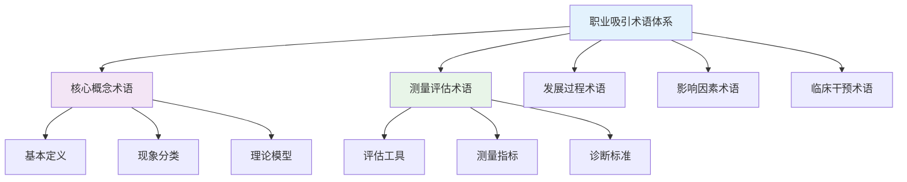

# Professional Attraction Terminology Standards (职业吸引术语标准)

> 📘 **文档导航**: 本标准文档建立职业吸引领域的统一术语体系和概念框架。相关文档：
> - [职业吸引概览](Professional_Attraction_Overview.md) - 理论基础和整体框架
> - [职业吸引临床评估](Professional_Attraction_Clinical_Assessment.md) - 专业评估方法
> - [职业吸引研究方法](Professional_Attraction_Research_Methods.md) - 科学研究方法学
> - [职业吸引案例研究](Professional_Attraction_Case_Studies.md) - 实证案例分析
> - [职业吸引伦理法律](Professional_Attraction_Ethics_Legal.md) - 社会文化考量

## 术语体系构建原则 (Terminology Construction Principles)

### 标准化原则

1. **准确性原则**: 术语定义精确，避免歧义和模糊表述
2. **一致性原则**: 同一概念在不同语境下使用相同术语
3. **系统性原则**: 术语间逻辑关系清晰，形成完整概念体系
4. **实用性原则**: 便于学术交流、临床应用和大众理解
5. **发展性原则**: 预留扩展空间，适应学科发展需要

### 术语分类体系

## 核心概念术语标准 (Core Concept Terminology Standards)

### 基本定义术语

| 中文术语 | 英文术语 | 定义标准 | 概念内涵 | 使用范围 |
| :--- | :--- | :--- | :--- | :--- |
| **职业吸引** | Professional Attraction | 个体对特定职业群体成员产生的持续性心理和情感吸引现象，包含认知、情感、行为三个层面的表现 | 涵盖职业身份认同、制服符号吸引、技能特质崇拜等多种形式 | 学术研究、临床实践、社会调查 |
| **职业身份吸引** | Occupational Identity Attraction | 基于职业角色认同和社会地位所产生的吸引，主要体现为对该职业群体的价值认同和身份向往 | 强调社会认同和群体归属感 | 社会心理学、职业咨询 |
| **制服符号吸引** | Uniform Symbol Attraction | 对特定职业制服及其象征意义产生的心理吸引，常伴随性心理成分 | 涉及符号学、性心理学理论 | 临床心理学、性学研究 |
| **技能特质吸引** | Skill Trait Attraction | 对职业专业技能、工作能力和专家权威产生的崇拜和向往 | 侧重能力认知和专家崇拜 | 教育心理学、人力资源 |
| **职业幻想** | Occupational Fantasy | 个体对从事特定职业或与该职业群体互动的想象性心理活动 | 包含愿望满足和逃避现实成分 | 心理咨询、精神分析 |

### 现象分类术语

| 分类维度 | 中文术语 | 英文术语 | 分类标准 | 典型特征 | 临床意义 |
| :--- | :--- | :--- | :--- | :--- | :--- |
| **吸引强度** | 轻度职业吸引 | Mild Professional Attraction | 吸引力评分1-3分(10分制) | 偶尔关注、轻微兴趣 | 正常范围 |
|  | 中度职业吸引 | Moderate Professional Attraction | 吸引力评分4-7分 | 持续关注、积极参与 | 需要引导 |
|  | 重度职业吸引 | Severe Professional Attraction | 吸引力评分8-10分 | 强烈渴望、行为表现 | 需要干预 |
| **吸引性质** | 适应性吸引 | Adaptive Attraction | 促进建设性行为和发展 | 积极正面 | 健康发展 |
|  | 病理性吸引 | Pathological Attraction | 导致功能损害和痛苦 | 消极负面 | 需要治疗 |
| **表现形式** | 认知型吸引 | Cognitive Attraction | 主要表现为认知关注和信息搜集 | 理性成分为主 | 正常发展 |
|  | 情感型吸引 | Emotional Attraction | 主要表现为情感投入和情绪体验 | 感性成分为主 | 需要关注 |
|  | 行为型吸引 | Behavioral Attraction | 主要表现为行为模仿和实际追求 | 实践成分突出 | 重点关注 |

### 理论模型术语

| 理论名称 | 中文术语 | 英文术语 | 核心概念 | 关键机制 | 应用领域 |
| :--- | :--- | :--- | :--- | :--- | :--- |
| **社会认同理论** | 群体内认同 | Ingroup Identification | 个体对所属群体的认同和归属感 | 范畴化-认同-比较过程 | 群体心理学 |
|  | 群体间偏见 | Intergroup Bias | 不同群体间的区别对待倾向 | 积极区分机制 | 社会心理学 |
| **权威心理学** | 制度权威 | Institutional Authority | 基于职位和制度的权威 | 职位权力基础 | 组织心理学 |
|  | 专家权威 | Expert Authority | 基于专业知识的权威 | 专业能力基础 | 职业心理学 |
| **uniform fetishism理论** | 制服恋物 | Uniform Fetishism | 对制服的性心理吸引现象 | 条件反射机制 | 性心理学 |
|  | 符号象征 | Symbolic Representation | 制服代表的意义和价值 | 符号学机制 | 文化心理学 |

## 测量评估术语标准 (Measurement and Assessment Terminology Standards)

### 评估工具术语

| 工具名称 | 中文全称 | 英文全称 | 测量维度 | 适用人群 | 信效度指标 |
| :--- | :--- | :--- | :--- | :--- | :--- |
| **PAS** | 职业吸引力量表 | Professional Attraction Scale | 吸引力强度、持续时间、行为倾向 | 一般成年人群 | α=0.89, ICC=0.82 |
| **PIQ** | 职业认同问卷 | Professional Identity Questionnaire | 认同程度、价值内化、行为一致性 | 相关职业从业者 | α=0.91, CVI=0.94 |
| **UPS** | 制服偏好量表 | Uniform Preference Scale | 视觉偏好、符号认同、情感联结 | 特定职业吸引者 | α=0.85, AVE=0.72 |
| **PFI** | 职业幻想问卷 | Professional Fantasy Inventory | 幻想频率、内容特征、情感色彩 | 潜在吸引者群体 | α=0.87, GFI=0.88 |

### 测量指标术语

| 指标类别 | 中文术语 | 英文术语 | 定义标准 | 测量方法 | 临床意义 |
| :--- | :--- | :--- | :--- | :--- | :--- |
| **频率指标** | 关注频率 | Attention Frequency | 单位时间内对目标职业的关注次数 | 自报频率、行为记录 | 量化吸引强度 |
|  | 幻想频率 | Fantasy Frequency | 单位时间内职业相关幻想出现次数 | 日记记录、访谈评估 | 评估内在驱动力 |
| **强度指标** | 吸引强度 | Attraction Intensity | 对目标职业吸引的主观感受强烈程度 | Likert量表评估 | 核心评估指标 |
|  | 情感投入 | Emotional Investment | 在职业吸引上投入的情感资源 | 情感量表测量 | 评估发展程度 |
| **行为指标** | 模仿行为 | Imitation Behavior | 模仿目标职业群体的行为表现 | 行为观察记录 | 评估外显表现 |
|  | 追求行为 | Pursuit Behavior | 主动接近和追求目标职业的行为 | 行为频率统计 | 评估实际行动力 |

### 诊断标准术语

| 诊断维度 | 中文术语 | 英文术语 | 诊断标准 | 临床表现 | 干预指征 |
| :--- | :--- | :--- | :--- | :--- | :--- |
| **功能损害** | 社会功能受损 | Social Function Impairment | 职业吸引严重影响正常社交和工作 | 人际关系退缩、工作效率下降 | 需要临床干预 |
|  | 情绪困扰 | Emotional Distress | 因职业吸引产生显著焦虑、抑郁情绪 | 情绪不稳定、睡眠障碍 | 需要心理支持 |
|  | 认知偏差 | Cognitive Distortion | 对目标职业群体存在不合理认知 | 理想化、刻板印象 | 需要认知矫正 |
| **持续时间** | 短期吸引 | Short-term Attraction | 持续时间少于6个月 | 兴趣阶段 | 观察随访 |
|  | 长期吸引 | Long-term Attraction | 持续时间超过6个月 | 发展阶段 | 重点关注 |
|  | 慢性吸引 | Chronic Attraction | 持续时间超过2年 | 固化阶段 | 需要干预 |

## 发展过程术语标准 (Development Process Terminology Standards)

### 发展阶段术语

| 发展阶段 | 中文术语 | 英文术语 | 年龄范围 | 核心特征 | 关键任务 |
| :--- | :--- | :--- | :--- | :--- | :--- |
| **萌芽期** | 职业意识萌芽 | Occupational Awareness Emergence | 3-12岁 | 职业概念初步形成 | 职业启蒙教育 |
|  | 职业好奇阶段 | Occupational Curiosity Stage | 6-15岁 | 对各种职业产生好奇 | 职业信息接触 |
| **发展期** | 职业兴趣形成 | Occupational Interest Formation | 12-25岁 | 明确职业偏好 | 职业探索实践 |
|  | 职业认同建立 | Occupational Identity Establishment | 18-30岁 | 确立职业发展方向 | 职业技能培养 |
| **成熟期** | 职业稳定阶段 | Occupational Stability Stage | 25-45岁 | 职业能力成熟 | 职业成就追求 |
|  | 职业传承阶段 | Occupational Heritage Stage | 40岁以上 | 职业经验传授 | 职业精神延续 |

### 转折点术语

| 转折类型 | 中文术语 | 英文术语 | 触发因素 | 表现特征 | 发展意义 |
| :--- | :--- | :--- | :--- | :--- | :--- |
| **积极转折** | 职业启发时刻 | Occupational Inspiration Moment | 正面职业接触体验 | 兴趣显著提升 | 发展加速 |
|  | 职业榜样影响 | Occupational Role Model Influence | 优秀从业者示范 | 认同感增强 | 方向明确 |
| **消极转折** | 职业幻灭体验 | Occupational Disillusionment Experience | 负面职业现实冲击 | 兴趣急剧下降 | 重新评估 |
|  | 职业挫折经历 | Occupational Setback Experience | 职业发展受阻 | 动机减弱 | 调整方向 |

## 影响因素术语标准 (Influencing Factors Terminology Standards)

### 个体因素术语

| 因素类别 | 中文术语 | 英文术语 | 定义标准 | 影响机制 | 调节策略 |
| :--- | :--- | :--- | :--- | :--- | :--- |
| **人格特质** | 开放性特质 | Openness Trait | 对新经验和想法的接受程度 | 影响职业兴趣广度 | 多元化体验 |
|  | 宜人性特质 | Agreeableness Trait | 合作友善的人际倾向 | 影响服务类职业偏好 | 团队协作训练 |
|  | 尽责性特质 | Conscientiousness Trait | 自律负责的工作态度 | 影响专业类职业选择 | 责任感培养 |
| **早期经历** | 职业榜样接触 | Occupational Role Model Exposure | 儿童期接触优秀从业者 | 形成职业认知框架 | 榜样示范 |
|  | 家庭职业环境 | Family Occupational Environment | 成长环境中的职业氛围 | 建立职业价值观念 | 环境营造 |
|  | 关键事件影响 | Critical Incident Impact | 重要职业相关经历 | 强化或削弱职业兴趣 | 经验重构 |

### 社会文化因素术语

| 因素类别 | 中文术语 | 英文术语 | 定义标准 | 文化差异 | 时代特征 |
| :--- | :--- | :--- | :--- | :--- | :--- |
| **媒体影响** | 影视作品塑造 | Media Portrayal | 大众媒体对职业的形象刻画 | 不同文化审美差异 | 数字化呈现 |
|  | 新闻报道影响 | News Coverage Impact | 媒体对职业事件的报道倾向 | 价值观导向差异 | 即时性传播 |
| **社会地位** | 经济地位认知 | Economic Status Perception | 对职业经济收入的认知评价 | 经济发展模式差异 | 收入多元化 |
|  | 社会声望评价 | Social Prestige Evaluation | 社会对不同职业的声望认定 | 文化价值体系差异 | 平等化趋势 |
| **性别刻板印象** | 职业性别化 | Occupational Genderization | 职业的性别属性标签化 | 性别平等程度差异 | 去性别化进展 |
|  | 角色期待固化 | Role Expectation Solidification | 社会对性别职业角色的固化期待 | 传统文化影响程度 | 现代化变革 |

## 临床干预术语标准 (Clinical Intervention Terminology Standards)

### 干预方法术语

| 方法类别 | 中文术语 | 英文术语 | 理论基础 | 适用情况 | 干预目标 |
| :--- | :--- | :--- | :--- | :--- | :--- |
| **认知干预** | 认知重构 | Cognitive Restructuring | 认知行为理论 | 认知偏差明显 | 纠正不合理认知 |
|  | 现实检验训练 | Reality Testing Training | 精神分析理论 | 理想化倾向 | 增强现实感 |
| **情感干预** | 情绪调节训练 | Emotion Regulation Training | 情绪心理学 | 情绪困扰严重 | 改善情绪状态 |
|  | 压力管理 | Stress Management | 压力应对理论 | 压力反应过度 | 提高应对能力 |
| **行为干预** | 行为替代 | Behavioral Substitution | 行为主义理论 | 问题行为突出 | 建立适应行为 |
|  | 社交技能训练 | Social Skills Training | 社会学习理论 | 社交能力不足 | 提升交往能力 |

### 干预效果术语

| 效果维度 | 中文术语 | 英文术语 | 评估标准 | 测量工具 | 临床意义 |
| :--- | :--- | :--- | :--- | :--- | :--- |
| **症状改善** | 吸引力降低 | Attraction Reduction | 吸引力评分下降≥30% | PAS量表 | 核心治疗目标 |
|  | 功能恢复 | Functional Recovery | 社会功能恢复正常水平 | GAF量表 | 重要治疗指标 |
|  | 情绪稳定 | Emotional Stability | 情绪困扰显著减轻 | SDS量表 | 基本改善标准 |
| **积极发展** | 职业适应 | Occupational Adaptation | 能够正常从事其他职业 | 职业适应量表 | 发展性目标 |
|  | 兴趣转移 | Interest Transfer | 发展健康的替代兴趣 | 兴趣量表 | 预防性目标 |
|  | 自我成长 | Personal Growth | 人格成熟度提升 | 成熟度量表 | 根本性目标 |

## 专业应用术语对照表 (Professional Application Term Cross-reference)

### 学科交叉术语

| 应用领域 | 中文术语 | 英文术语 | 相关学科 | 应用特点 |
| :--- | :--- | :--- | :--- | :--- |
| **临床心理学** | 职业吸引障碍 | Occupational Attraction Disorder | 临床心理学、精神病学 | 病理化诊断治疗 |
| **职业咨询** | 职业兴趣测评 | Occupational Interest Assessment | 职业心理学、咨询学 | 发展性指导服务 |
| **人力资源** | 职业吸引力分析 | Occupational Attractiveness Analysis | 组织行为学、管理学 | 人才招聘选拔 |
| **教育学** | 职业启蒙教育 | Occupational Enlightenment Education | 教育心理学、生涯教育 | 预防性教育干预 |
| **社会学** | 职业文化现象 | Occupational Cultural Phenomenon | 社会心理学、文化研究 | 社会文化分析 |

### 国际术语对照

| 概念领域 | 中文术语 | 英文标准术语 | 其他语言术语 | 国际使用情况 |
| :--- | :--- | :--- | :--- | :--- |
| **核心概念** | 职业吸引 | Professional Attraction | Attir Professionnel (法)、Berufliche Anziehung (德) | 国际通用 |
|  | 制服恋物 | Uniform Fetishism | Fétichisme d'uniforme (法)、Uniformfetischismus (德) | 专业术语 |
| **评估工具** | 职业吸引力量表 | Professional Attraction Scale | Échelle d'attraction professionnelle (法) | 研究使用 |
|  | 职业认同问卷 | Professional Identity Questionnaire | Questionnaire d'identité professionnelle (法) | 临床使用 |

---
*📚 本文档建立了职业吸引领域的标准化术语体系，为学术研究、临床实践和社会应用提供统一的概念框架和交流基础。*