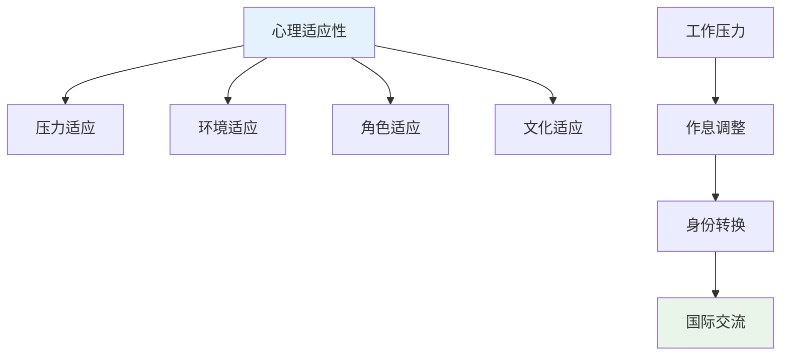
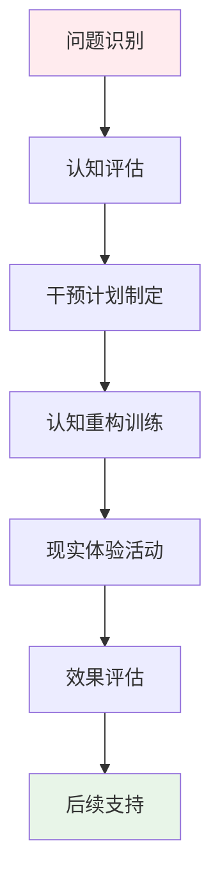
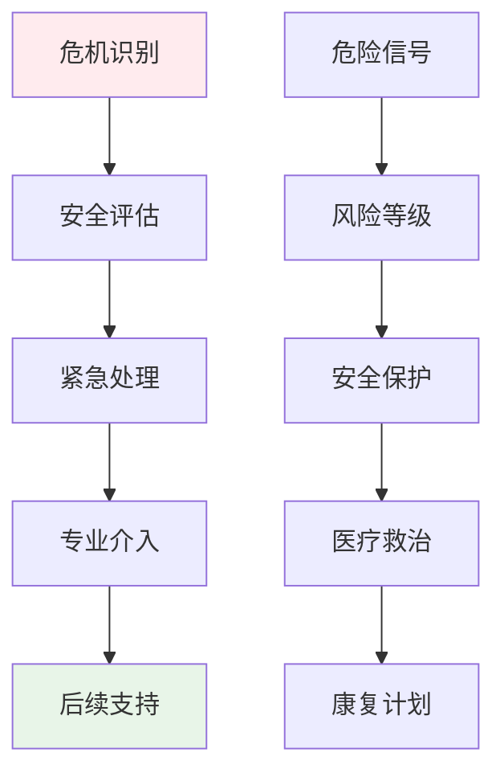

# Aviation Professional Attraction Clinical Assessment (航空职业吸引临床评估)

> 📘 **文档导航**: 本指南提供航空职业吸引现象的专业临床评估方法和实践指导。相关文档：
> - [航空职业吸引心理学](Aviation_Professional_Attraction.md) - 理论基础和职业特征
> - [职业吸引临床评估](../Professional_Attraction_Clinical_Assessment.md) - 通用评估框架
> - [职业吸引伦理法律](../Professional_Attraction_Ethics_Legal.md) - 专业伦理规范

## 航空职业吸引评估专项框架

### 航空领域特殊评估考虑

#### 1. 行业特征适应性评估

**航空职业独特性分析**:
- **高门槛特征**: 严格的体检标准、专业资质要求、持续培训需求
- **国际化特质**: 多语言能力、跨文化交流、全球工作环境
- **技术密集型**: 复杂设备操作、精密计算能力、应急处理技能
- **安全责任重大**: 生命安全保障、零失误要求、高压决策环境

**评估重点调整**:
| 评估维度 | 通用标准 | 航空专项调整 | 调整理由 |
| :--- | :--- | :--- | :--- |
| **认知评估** | 一般智力水平 | 空间认知能力、应急决策能力 | 航空操作特殊要求 |
| **情感评估** | 一般情绪状态 | 压力耐受性、冷静程度 | 高压工作环境需求 |
| **行为评估** | 日常行为模式 | 纪律性、精确性、团队协作 | 航空安全文化要求 |
| **动机评估** | 一般成就动机 | 安全责任动机、服务意识 | 航空职业核心价值 |

#### 2. 航空职业吸引特有量表

##### 航空职业吸引专项量表(Aviation Specific PAS)

**量表结构**:
- **A分量表**: 飞行员吸引维度(8题)
- **B分量表**: 空乘人员吸引维度(8题)
- **C分量表**: 技术权威吸引维度(7题)
- **D分量表**: 国际化特质吸引维度(6题)
- **E分量表**: 安全责任吸引维度(6题)

**题目示例**:
1. "当我看到飞行员制服时，我会感到特别的吸引力"
2. "我对航空器的操作技术有着强烈的兴趣和向往"
3. "我希望能够在国际化的航空环境中工作和生活"
4. "我愿意承担航空安全的重大责任"
5. "我梦想着能够驾驶飞机在蓝天中翱翔"

**评分标准**:
- 5点李克特量表(1=完全不符合, 5=完全符合)
- 总分范围: 35-175分
- 临床临界值: ≥105分为显著航空职业吸引

#### 3. 航空职业技能匹配评估

##### 专业能力评估维度

**技术操作能力**:
| 能力类型 | 评估内容 | 评估方法 | 临床意义 |
| :--- | :--- | :--- | :--- |
| **空间认知** | 三维空间想象、方向感把握 | 空间旋转测验、航线规划任务 | 飞行操作基础 |
| **精细操作** | 手眼协调、精确控制 | 模拟器操作、精密仪器使用 | 仪表飞行关键 |
| **应急反应** | 快速判断、危机处理 | 应急场景模拟、压力测试 | 安全保障核心 |

**心理素质评估**:
| 素质维度 | 评估指标 | 评估工具 | 航空意义 |
| :--- | :--- | :--- | :--- |
| **压力耐受** | 高压环境下的情绪稳定性 | 压力面试、模拟舱训练 | 安全操作保障 |
| **注意力集中** | 长时间专注、细节捕捉 | 注意力持续性测试 | 飞行安全关键 |
| **决策能力** | 快速准确的信息处理 | 决策情境测试 | 应急处置核心 |

### 航空职业吸引发展评估

#### 发展阶段专项评估

##### 青少年期航空兴趣评估

**评估重点**:
- 航空兴趣的起源和发展历程
- 家庭环境对航空兴趣的影响
- 学业成绩与航空兴趣的匹配度
- 同伴关系中的航空话题交流

**评估工具**:
- 航空兴趣发展史访谈
- 家庭环境评估问卷
- 学业-兴趣匹配度量表
- 社交网络分析

##### 职业准备期评估

**评估内容**:
- 专业学习动机和投入程度
- 实习实践经验积累情况
- 职业技能掌握水平
- 职业规划的合理性和可行性

**专项评估**:
- 专业课程成绩分析
- 实习表现评估报告
- 技能证书获得情况
- 职业规划合理性评估

#### 航空职业适应性评估

##### 心理适应性评估

**适应性维度**:

**评估指标**:
| 适应维度 | 具体指标 | 评估方法 | 判定标准 |
| :--- | :--- | :--- | :--- |
| **压力适应** | 工作压力承受能力、情绪调节能力 | 压力情境模拟、情绪量表 | 中等以上水平 |
| **环境适应** | 作息时间调整、生活环境适应 | 生活适应问卷、观察记录 | 良好适应水平 |
| **角色适应** | 职业角色认知、责任意识 | 角色扮演测试、访谈评估 | 准确角色认知 |
| **文化适应** | 跨文化交流能力、国际视野 | 文化适应量表、情境测试 | 较强适应能力 |

##### 生理适应性评估

**身体健康要求**:
- 视力标准(裸眼视力、矫正视力)
- 听力标准(听力敏锐度、噪音耐受)
- 心血管功能(心脏健康、血压稳定)
- 神经系统(反应速度、协调能力)

**评估流程**:
1. 基础体检项目筛查
2. 专项航空体检
3. 持续健康监测
4. 适应性跟踪评估

### 航空职业吸引干预策略

#### 预防性干预措施

##### 教育引导策略

**分级教育模式**:
| 教育阶段 | 目标群体 | 教育内容 | 实施方式 | 预期效果 |
| :--- | :--- | :--- | :--- | :--- |
| **启蒙阶段** | 小学高年级 | 航空基础知识、职业认知 | 科普讲座、参观体验 | 兴趣启蒙 |
| **了解阶段** | 初中阶段 | 航空专业介绍、能力要求 | 职业体验、专家讲座 | 理性认知 |
| **准备阶段** | 高中阶段 | 专业选择指导、备考建议 | 升学指导、技能培训 | 科学规划 |
| **专业阶段** | 大学阶段 | 专业深化、实践训练 | 实习实训、职业规划 | 能力提升 |

##### 家庭支持策略

**家长教育要点**:
- 客观了解航空职业的真实要求
- 合理评估孩子的兴趣和能力匹配度
- 提供情感支持而非过度压力
- 关注孩子的全面发展和身心健康

#### 治疗性干预方法

##### 认知行为干预

**核心干预技术**:
1. **认知重构**: 帮助建立对航空职业的理性认知
2. **现实检验**: 通过实地体验了解职业真实面貌
3. **期望管理**: 调整不合理的过高期望
4. **替代发展**: 培养其他健康的兴趣爱好

**干预流程**:

##### 职业规划指导

**个性化规划原则**:
- 基于个人兴趣和能力特点
- 考虑现实条件和发展机会
- 制定阶段性发展目标
- 建立动态调整机制

**规划工具**:
- SWOT分析矩阵
- 职业兴趣量表
- 能力评估工具
- 发展路径图谱

### 航空职业吸引风险管理

#### 风险识别与评估

##### 潜在风险类型

**心理健康风险**:
| 风险类型 | 表现特征 | 识别指标 | 干预要点 |
| :--- | :--- | :--- | :--- |
| **焦虑抑郁** | 情绪低落、兴趣减退、睡眠障碍 | PHQ-9≥10分、GAD-7≥8分 | 心理治疗介入 |
| **完美主义** | 过度追求完美、害怕失败、自我苛责 | MPS量表高分 | 认知行为治疗 |
| **职业倦怠** | 情感耗竭、去人格化、成就感降低 | MBI量表异常 | 压力管理训练 |

**社会功能风险**:
| 风险类型 | 表现特征 | 识别指标 | 干预要点 |
| :--- | :--- | :--- | :--- |
| **社交退缩** | 人际交往减少、沟通困难 | 社交回避量表高分 | 社交技能训练 |
| **家庭关系紧张** | 与家人沟通减少、理解困难 | 家庭功能评估 | 家庭治疗介入 |
| **学业/工作影响** | 注意力分散、效率下降 | GPA下降、绩效评估 | 环境调整支持 |

#### 危机干预体系

##### 紧急干预程序

**危机识别信号**:
- 直接或间接表达自伤自杀想法
- 明显的情绪崩溃或行为失控
- 严重的社会功能退化
- 重要的支持系统丧失

**应急处理流程**:

**资源配置**:
- 24小时心理危机热线
- 专业医疗救治机构
- 家庭和学校支持网络
- 同伴互助支持系统

### 航空职业吸引跟踪随访

#### 长期跟踪机制

##### 随访时间安排

**阶段性随访计划**:
| 随访阶段 | 时间节点 | 随访重点 | 评估工具 | 频率要求 |
| :--- | :--- | :--- | :--- | :--- |
| **初期跟踪** | 干预后1-3个月 | 症状改善情况 | 症状自评量表 | 每月一次 |
| **中期评估** | 干预后6个月 | 功能恢复程度 | 功能评估量表 | 每季度一次 |
| **长期随访** | 干预后1-2年 | 发展适应情况 | 综合发展评估 | 每半年一次 |
| **远期追踪** | 干预后3-5年 | 长远发展效果 | 长期追踪调查 | 每年一次 |

##### 随访内容体系

**多维度跟踪评估**:
- 心理健康状况监测
- 社会功能恢复评估
- 职业发展适应性
- 生活质量改善情况
- 家庭关系和谐度

**数据收集方法**:
- 定期问卷调查
- 深度访谈记录
- 行为观察记录
- 第三方评估反馈

#### 效果评估与持续改进

##### 干预效果评估

**评估指标体系**:
| 评估维度 | 具体指标 | 评估方法 | 判定标准 |
| :--- | :--- | :--- | :--- |
| **症状改善** | 吸引强度降低程度 | 量表前后对比 | 降低≥30%为有效 |
| **功能恢复** | 社会功能改善水平 | 功能评估量表 | 恢复至正常水平 |
| **生活质量** | 整体生活满意度 | 生活质量问卷 | 显著提升 |
| **职业发展** | 职业适应和发展 | 职业发展评估 | 良好适应 |

##### 持续改进机制

**质量改进循环**:

**改进重点领域**:
- 评估工具的优化完善
- 干预方法的创新升级
- 服务流程的简化高效
- 专业团队的能力提升

---
*📚 本文档为航空职业吸引现象提供专业的临床评估体系和干预指导，确保评估的科学性和干预的有效性。*