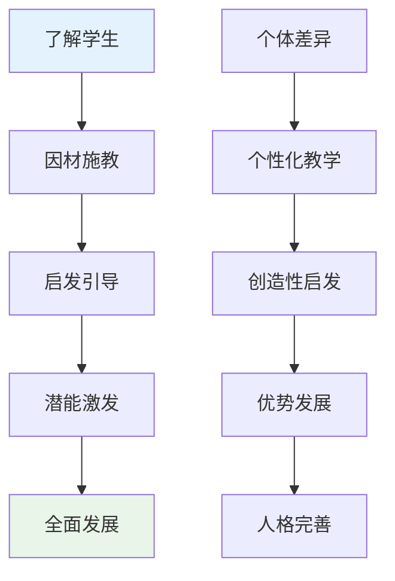
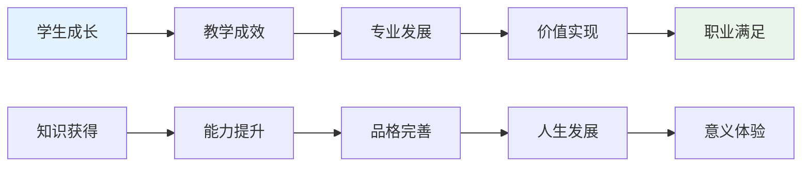
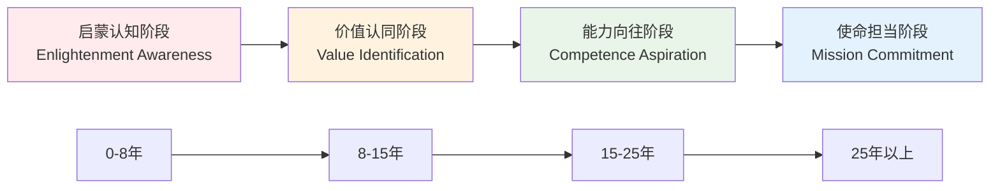

# Education Professional Attraction Psychology (教育职业吸引心理学)

> 📘 **文档导航**: 本专题深入探讨教育职业吸引的心理机制、知识权威特质和育人价值。相关文档：
> - [职业吸引概览](../Professional_Attraction_Overview.md) - 理论基础
> - [教育职业临床评估](Education_Attraction_Clinical_Assessment.md) - 专业评估方法
> - [职业吸引伦理法律](../Professional_Attraction_Ethics_Legal.md) - 社会文化考量
> - [职业吸引术语标准](../Professional_Attraction_Terminology_Standards.md) - 概念框架

## 教育职业吸引现象系统分析 (Education Professional Attraction Phenomenon Systematic Analysis)

### 核心吸引特征与教育心理学机制

教育职业吸引(Education Professional Attraction)是指个体对教师、教育工作者产生的特殊心理和情感吸引，这种吸引融合了知识权威崇拜、育人使命感、智慧传承价值、社会贡献意义等深层教育心理成分。

#### 教师职业吸引特征多维度矩阵

| 吸引维度 | 具体表现 | 心理机制 | 社会认知 | 发展层次 |
| :--- | :--- | :--- | :--- | :--- |
| **知识权威** | 学科专长、博学多识、智慧传承 | 专家权威理论、知识崇拜 | 智慧象征、学问代表 | 认知吸引层 |
| **育人能力** | 启发思考、塑造人格、因材施教 | 教育心理学、发展理论 | 人生导师、灵魂工程师 | 情感吸引层 |
| **耐心品质** | 循循善诱、包容理解、持续陪伴 | 情绪调节理论、母性原型 | 母性/父性象征、温暖依靠 | 品格吸引层 |
| **社会贡献** | 培养人才、传承文明、启迪民智 | 社会价值理论、使命感 | 文明传承者、社会栋梁 | 价值吸引层 |

### 教育职业心理学特征深度剖析

#### 教师职业心理学

##### 1. 知识权威心理学

**专业权威建构机制**:
- **学科专精**: 在特定学科领域的深度知识储备
- **教学智慧**: 将专业知识转化为有效教学的能力
- **学术声誉**: 通过研究成果和专业贡献建立的学术地位

**权威心理发展过程**:
```
专业知识积累 → 教学能力发展 → 学术声誉建立 → 权威形象形成 → 吸引力建构
      ↓              ↓              ↓              ↓              ↓
   知识基础      能力展现      社会认可      身份认同      心理吸引
```

**知识权威心理效应**:
| 效应类型 | 具体表现 | 心理机制 | 教育价值 |
| :--- | :--- | :--- | :--- |
| **认知崇拜** | 对渊博知识的敬佩 | 认知发展理论 | 学习动机激发 |
| **智慧启发** | 思维方式的引导 | 建构主义学习 | 创造力培养 |
| **榜样示范** | 学术品格的影响 | 社会学习理论 | 人格塑造作用 |

##### 2. 育人心理学机制

**教育影响力构成**:
- **认知启发**: 激发学生思维潜能，培养批判性思维
- **情感滋养**: 提供情感支持，建立安全的学习环境
- **品格塑造**: 通过言传身教影响学生的价值观念
- **潜能开发**: 识别并培养学生的天赋和特长

**育人心理过程**:


##### 3. 耐心品质心理学

**教育耐心特征**:
- **情绪稳定性**: 面对学习困难时的情绪控制能力
- **持续关注度**: 对学生长期发展的持续关心和支持
- **包容性态度**: 对学生错误和不足的理解和接纳
- **等待艺术**: 给予学生成长所需的时间和空间

**耐心心理发展机制**:
| 发展阶段 | 心理特征 | 行为表现 | 影响因素 |
| :--- | :--- | :--- | :--- |
| **技能掌握期** | 技术性耐心 | 掌握教学方法和技巧 | 专业培训、经验积累 |
| **情感成熟期** | 情感性耐心 | 真诚关爱和情感投入 | 人格发展、生活阅历 |
| **智慧形成期** | 智慧性耐心 | 深刻理解和长远眼光 | 教育哲学、人生感悟 |

#### 教育职业压力与成就感心理学

##### 1. 职业压力源分析

**工作要求压力**:
- **教学负担**: 备课、授课、批改作业等大量重复性工作
- **学生管理**: 班级管理、行为引导、心理辅导等复杂任务
- **家长期待**: 来自家长和社会对教育效果的高度期望
- **考核评价**: 各种教学评估和绩效考核的压力

**发展挑战压力**:
- **专业发展**: 持续学习新知识、新教学方法的要求
- **技术适应**: 教育信息化带来的技术更新压力
- **改革创新**: 教育理念和方法不断更新的适应压力

##### 2. 职业成就感来源

**内在成就感**:


**成就感构成要素**:
| 要素类型 | 具体表现 | 心理机制 | 激励作用 |
| :--- | :--- | :--- | :--- |
| **学生进步** | 学业成绩提升、能力发展 | 自我效能感理论 | 核心激励源 |
| **同行认可** | 专业水平得到同行肯定 | 社会认同理论 | 专业发展动力 |
| **社会尊重** | 获得社会和家长的认可 | 尊严需求理论 | 职业自豪感 |
| **自我实现** | 发挥个人才能、实现价值 | 自我实现理论 | 最高层次满足 |

### 教育职业吸引发展模型

#### 四阶段发展轨迹



#### 各阶段心理发展特征

| 发展阶段 | 心理特征 | 行为表现 | 影响因素 | 关键转折点 |
| :--- | :--- | :--- | :--- | :--- |
| **启蒙认知** | 职业印象形成、榜样影响 | 关注教师工作、了解教育意义 | 家庭熏陶、学校经历 | 首次被优秀教师感动 |
| **价值认同** | 教育价值认同、使命感萌芽 | 参与教育实践、投入专业学习 | 教育体验、价值引导 | 教育实习深刻体验 |
| **能力向往** | 专业技能崇拜、成长渴望 | 技能提升、教学实践 | 专业发展、成就体验 | 首次成功教学经历 |
| **使命担当** | 职业使命感强化、价值实现 | 专业引领、传承发展 | 经验积淀、社会认可 | 成为骨干教师/专家 |

### 教育职业吸引测量评估体系

#### 专业化评估工具

##### 教育职业吸引力量表(Education PAS)

**量表维度结构**:
- **A分量表**: 知识权威吸引维度(9题)
- **B分量表**: 育人能力吸引维度(8题)
- **C分量表**: 耐心品质吸引维度(7题)
- **D分量表**: 社会贡献吸引维度(6题)

**评分标准体系**:
- 5点李克特量表(1=完全不符合, 5=完全符合)
- 总分范围: 30-150分
- 临床临界值: ≥90分为显著吸引

##### 教育职业认同问卷(Education PIQ)

**核心测量维度**:
1. **专业认同**: 对教育教学专业价值的深度认同
2. **育人认同**: 对学生发展和人格塑造使命的认同
3. **知识认同**: 对知识传承和智慧启发价值的认同
4. **社会认同**: 对教育社会贡献和文明传承意义的认同

**心理测量指标**:
- 内部一致性系数α = 0.88
- 验证性因子分析CFI = 0.90
- 重测信度ICC = 0.84

#### 专业心理评估特色

##### 教育智慧评估

**评估内容维度**:
- **学科智慧**: 对所教学科的深度理解和灵活运用
- **教学智慧**: 将知识有效传递给学生的教学艺术
- **育人智慧**: 促进学生全面发展的教育洞察力
- **反思智慧**: 对教育实践的深度思考和持续改进

**专业评估工具**:
- 教师智慧量表(TWS)
- 教学反思能力问卷(TRQ)
- 教育哲学信念量表(EPBS)

##### 职业幸福感评估

**评估维度**:
- **内在满足感**: 从事教育工作的内在快乐和满足
- **成就感体验**: 教学成效和学生发展的成就感
- **意义感获得**: 教育工作价值和意义的体验
- **归属感建立**: 在教育共同体中的归属感受

**测量工具**:
- 教师职业幸福感量表(TJWS)
- 工作意义感问卷(WMS)
- 教育共同体归属感量表(ECBS)

### 教育职业吸引临床意义

#### 积极发展价值

1. **知识品格培养**: 促进终身学习和智慧发展的品格塑造
2. **育人能力提升**: 培养启发引导和因材施教的教育能力
3. **社会责任意识**: 增强对人才培养和社会发展的责任感
4. **人文素养发展**: 提高文化修养和精神境界

#### 潜在风险警示

1. **完美主义倾向**: 对教育效果的过度追求可能带来心理压力
2. **情感耗竭风险**: 长期情感投入可能导致职业倦怠
3. **价值冲突困扰**: 理想教育理念与现实条件的矛盾
4. **发展瓶颈焦虑**: 专业成长遇到瓶颈时的挫败感

#### 专业干预策略

##### 预防性心理支持

| 支持层次 | 具体措施 | 实施时机 | 目标群体 | 预期效果 |
| :--- | :--- | :--- | :--- | :--- |
| **价值引导** | 教育理念教育、现实介绍 | 职业选择期 | 准教师群体 | 理性认知建立 |
| **能力培养** | 教学技能培训、心理素质训练 | 专业发展期 | 在职教师 | 专业能力提升 |
| **发展指导** | 职业规划指导、成长路径设计 | 职业发展期 | 骨干教师 | 明确发展方向 |

##### 治疗性心理干预

| 干预方法 | 理论基础 | 适用症状 | 核心技术 | 治疗目标 |
| :--- | :--- | :--- | :--- | :--- |
| **意义疗法** | 存在主义心理学 | 价值困惑、意义缺失 | 意义探索、价值重构 | 重建职业意义 |
| **认知行为干预** | 认知行为理论 | 完美主义、焦虑抑郁 | 认知重构、行为激活 | 纠正不合理认知 |
| **正念教育疗法** | 正念理论 | 压力管理、倦怠预防 | 正念练习、慈悲冥想 | 提高心理韧性 |

### 教育职业吸引研究前沿

#### 新兴研究领域

1. **人工智能教育**: AI技术对教师角色和教育职业认知的影响
2. **跨文化教育**: 全球化背景下教育职业吸引的文化差异研究
3. **终身教育发展**: 终身学习时代教师职业吸引力的新特征
4. **教育公平关注**: 教育均衡发展中教师职业价值的重新审视

#### 实践应用前景

- **师资队伍建设**: 基于职业吸引力研究优化教师招聘和培养
- **教师心理健康**: 为教育工作者提供系统的心理支持服务
- **教育改革发展**: 通过职业吸引力研究推动教育理念更新
- **社会认知提升**: 改善社会对教师职业的理解和尊重

---
*📚 本文档整合教育心理学、发展心理学和积极心理学理论，为教育职业吸引现象提供专业的理论分析和实践指导。*