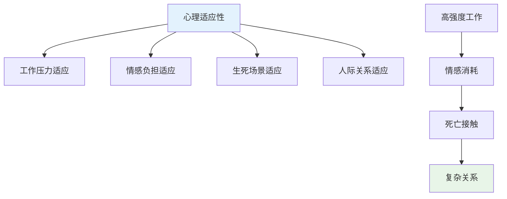
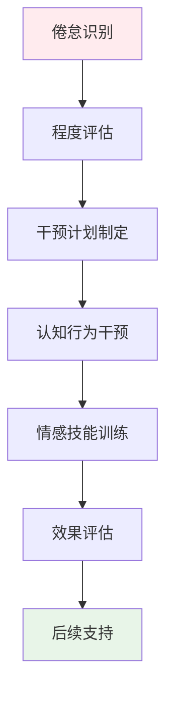
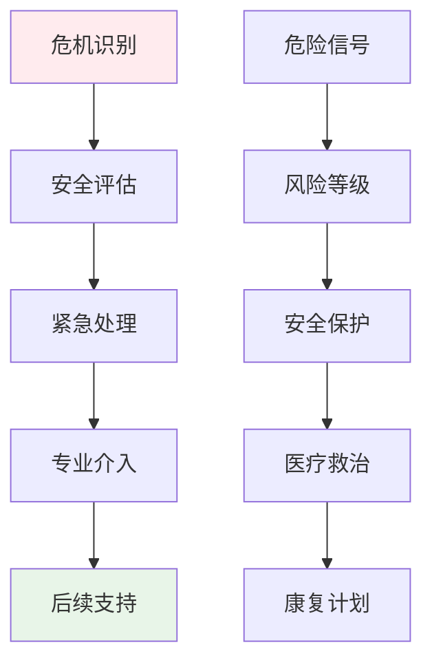
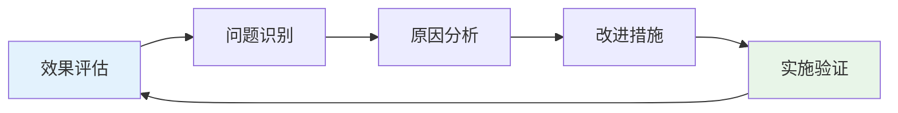

# Nursing Professional Attraction Clinical Assessment (护理职业吸引临床评估)

> 📘 **文档导航**: 本指南提供护理职业吸引现象的专业临床评估方法和实践指导。相关文档：
> - [护理职业吸引心理学](Nursing_Professional_Attraction.md) - 理论基础和职业特征
> - [职业吸引临床评估](../Professional_Attraction_Clinical_Assessment.md) - 通用评估框架
> - [职业吸引伦理法律](../Professional_Attraction_Ethics_Legal.md) - 专业伦理规范

## 护理职业吸引评估专项框架

### 护理领域特殊评估考虑

#### 1. 医疗特征适应性评估

**护理职业独特性分析**:
- **人文关怀特质**: 温暖的态度、细致的照顾、情感的支持
- **专业技能要求**: 扎实的医学知识、熟练的护理技术、应急处理能力
- **奉献精神需求**: 无私的付出、救死扶伤的使命感、持续的学习精神
- **工作环境挑战**: 高强度工作、生死场景接触、复杂人际关系处理

**评估重点调整**:
| 评估维度 | 通用标准 | 护理专项调整 | 调整理由 |
| :--- | :--- | :--- | :--- |
| **共情能力** | 一般情感理解力 | 医疗共情能力、患者情感识别 | 护理工作核心要求 |
| **压力适应** | 一般压力承受力 | 医疗环境压力、生死场景适应 | 工作环境特殊性 |
| **道德判断** | 一般伦理认知 | 医疗伦理决策、生命价值观 | 职业道德高标准 |
| **团队协作** | 一般合作能力 | 医护团队配合、多学科协作 | 医疗工作特点 |

#### 2. 护理职业吸引特有量表

##### 护理职业吸引专项量表(Nursing Specific PAS)

**量表结构**:
- **A分量表**: 关怀特质吸引维度(8题)
- **B分量表**: 专业技能吸引维度(8题)
- **C分量表**: 奉献精神吸引维度(7题)
- **D分量表**: 稳定性特质吸引维度(6题)
- **E分量表**: 白衣天使吸引维度(6题)

**题目示例**:
1. "当我看到护士的白色制服时，会产生特殊的亲切感"
2. "我对护理专业的医疗技能和知识非常向往"
3. "我希望能像白衣天使一样救死扶伤、奉献爱心"
4. "我愿意在稳定的医疗环境中长期发展自己的职业生涯"
5. "我梦想着能够通过护理工作体现自己的人生价值"

**评分标准**:
- 5点李克特量表(1=完全不符合, 5=完全符合)
- 总分范围: 35-175分
- 临床临界值: ≥105分为显著护理职业吸引

#### 3. 护理职业技能匹配评估

##### 专业能力评估维度

**核心护理技能**:
| 技能类型 | 评估内容 | 评估方法 | 临床意义 |
| :--- | :--- | :--- | :--- |
| **基础护理** | 日常护理操作、生活照料 | 技能操作考核、临床实习评估 | 护理工作基础 |
| **专科护理** | 专业疾病护理、特殊技术 | 专科知识测试、案例分析 | 专业发展关键 |
| **急救技能** | 应急处理、生命支持 | 急救技能考核、模拟演练 | 生命安全保障 |
| **沟通协调** | 患者沟通、团队协作 | 沟通情景模拟、团队任务 | 工作效率核心 |

**人文素养评估**:
| 素养维度 | 评估指标 | 评估工具 | 护理价值 |
| :--- | :--- | :--- | :--- |
| **共情能力** | 理解患者情感、提供情感支持 | 杰弗逊共情量表 | 护患关系基础 |
| **耐心品质** | 面对困难患者的耐性、持续关怀 | 耐心行为观察、情境测试 | 护理质量保障 |
| **职业道德** | 职业操守、伦理决策能力 | 医学伦理情景测试 | 职业发展根本 |
| **文化敏感** | 跨文化护理能力、多元包容性 | 文化胜任力量表 | 现代护理要求 |

### 护理职业吸引发展评估

#### 发展阶段专项评估

##### 青少年期护理兴趣评估

**评估重点**:
- 护理兴趣的起源和发展历程
- 家庭医疗背景对兴趣的影响
- 助人价值观的形成过程
- 医疗志愿服务经历情况

**评估工具**:
- 护理兴趣发展史访谈
- 家庭医疗环境评估问卷
- 助人价值观量表
- 志愿服务经历记录

##### 专业学习期评估

**评估内容**:
- 专业学习动机和投入程度
- 理论知识掌握水平
- 临床实习表现情况
- 职业认同感发展程度

**专项评估**:
- 专业课程成绩分析
- 临床技能考核结果
- 实习评价反馈记录
- 职业认同发展评估

#### 护理职业适应性评估

##### 心理适应性评估

**适应性维度**:

**评估指标**:
| 适应维度 | 具体指标 | 评估方法 | 判定标准 |
| :--- | :--- | :--- | :--- |
| **工作压力** | 高强度工作环境适应能力 | 压力适应量表、工作日记分析 | 良好适应水平 |
| **情感负担** | 面对患者痛苦的情感承受力 | 共情疲劳量表、情感调节评估 | 健康情感状态 |
| **生死适应** | 接触生死场景的心理承受力 | 死亡态度量表、创伤暴露评估 | 积极应对态度 |
| **人际适应** | 复杂医护关系处理能力 | 人际关系量表、沟通技能评估 | 良好人际技能 |

##### 身心健康评估

**身体健康监测**:
- 职业相关疾病的预防(腰背痛、静脉曲张等)
- 工作疲劳和恢复情况
- 生物钟调节和睡眠质量
- 营养状况和免疫力水平

**心理健康维护**:
- 职业倦怠预防和管理
- 共情疲劳的识别和干预
- 工作生活平衡的维持
- 心理韧性的培养提升

### 护理职业吸引干预策略

#### 预防性干预措施

##### 教育引导策略

**分级教育模式**:
| 教育阶段 | 目标群体 | 教育内容 | 实施方式 | 预期效果 |
| :--- | :--- | :--- | :--- | :--- |
| **启蒙阶段** | 中学阶段 | 护理职业认知、助人价值 | 职业体验、志愿服务 | 兴趣启蒙 |
| **了解阶段** | 高中阶段 | 专业介绍、能力要求 | 专业讲座、医院参观 | 理性认知 |
| **准备阶段** | 大学预科 | 专业选择指导、备考建议 | 升学指导、技能培训 | 科学规划 |
| **专业阶段** | 护理院校 | 专业深化、实践训练 | 临床实习、职业规划 | 能力提升 |

##### 心理健康维护

**压力管理训练**:
- 正念减压技术培训
- 情绪调节技能训练
- 时间管理能力提升
- 支持系统建设指导

**职业韧性培养**:
- 积极心理学应用
- 成长型思维训练
- 意义感建构指导
- 同伴支持网络建立

#### 治疗性干预方法

##### 职业倦怠干预

**核心干预技术**:
1. **认知重构**: 帮助建立对护理工作的理性认知
2. **情感调节**: 学习有效的情绪管理和压力释放方法
3. **边界设置**: 建立健康的工作生活边界
4. **意义重建**: 重新发现护理工作的价值和意义

**干预流程**:

##### 共情疲劳治疗

**治疗方法**:
- 创伤知情护理方法
- 自我关怀技能训练
- 同伴支持小组治疗
- 艺术表达治疗技术

**恢复策略**:
- 定期心理休假安排
- 专业督导支持系统
- 同行交流互助机制
- 个人成长发展规划

### 护理职业吸引风险管理

#### 风险识别与评估

##### 潜在风险类型

**职业健康风险**:
| 风险类型 | 表现特征 | 识别指标 | 干预要点 |
| :--- | :--- | :--- | :--- |
| **职业倦怠** | 情感耗竭、去人格化、成就感降低 | MBI量表异常 | 压力管理训练 |
| **共情疲劳** | 共情能力下降、情感麻木 | 共情疲劳量表 | 自我关怀训练 |
| **身体疾病** | 职业相关伤病、慢性疲劳 | 健康检查异常 | 预防保健指导 |
| **心理创伤** | 创伤后应激反应、焦虑抑郁 | PTSD量表、PHQ-9量表 | 创伤治疗介入 |

**职业发展风险**:
| 风险类型 | 表现特征 | 识别指标 | 干预要点 |
| :--- | :--- | :--- | :--- |
| **技能停滞** | 专业能力发展缓慢、知识老化 | 技能评估落后 | 继续教育支持 |
| **职业迷茫** | 发展方向不清、价值困惑 | 职业认同量表 | 生涯规划指导 |
| **晋升障碍** | 职业发展受阻、机会缺乏 | 职业发展评估 | 能力提升计划 |

#### 危机干预体系

##### 紧急干预程序

**危机识别信号**:
- 明显的职业倦怠症状加重
- 严重的心理创伤反应
- 自伤或自杀倾向表达
- 重大职业挫折或家庭变故

**应急处理流程**:

**资源配置**:
- 职业健康服务中心
- 心理危机干预团队
- 家庭和同事支持网络
- 专业督导和咨询资源

### 护理职业吸引跟踪随访

#### 长期跟踪机制

##### 随访时间安排

**阶段性随访计划**:
| 随访阶段 | 时间节点 | 随访重点 | 评估工具 | 频率要求 |
| :--- | :--- | :--- | :--- | :--- |
| **初期跟踪** | 干预后1-3个月 | 症状改善情况 | 症状自评量表 | 每月一次 |
| **中期评估** | 干预后6个月 | 功能恢复程度 | 功能评估量表 | 每季度一次 |
| **长期随访** | 干预后1-2年 | 发展适应情况 | 综合发展评估 | 每半年一次 |
| **远期追踪** | 干预后3-5年 | 长远发展效果 | 长期追踪调查 | 每年一次 |

##### 随访内容体系

**多维度跟踪评估**:
- 身心健康状况监测
- 专业技能发展水平
- 职业适应和发展情况
- 工作满意度和生活质量
- 家庭关系和社会支持

**数据收集方法**:
- 定期健康检查记录
- 专业技能考核结果
- 工作表现评估报告
- 深度访谈和问卷调查

#### 效果评估与持续改进

##### 干预效果评估

**评估指标体系**:
| 评估维度 | 具体指标 | 评估方法 | 判定标准 |
| :--- | :--- | :--- | :--- |
| **症状改善** | 吸引强度降低程度 | 量表前后对比 | 降低≥30%为有效 |
| **功能恢复** | 身心功能改善水平 | 功能评估量表 | 恢复至正常水平 |
| **职业发展** | 专业能力和工作适应 | 职业发展评估 | 良好发展态势 |
| **生活质量** | 整体生活满意度 | 生活质量问卷 | 显著提升 |

##### 持续改进机制

**质量改进循环**:

**改进重点领域**:
- 评估工具的护理专业适配
- 干预方法的医疗环境整合
- 服务流程的医疗机构对接
- 专业团队的医护协同合作

---
*📚 本文档为护理职业吸引现象提供专业的临床评估体系和干预指导，特别关注医疗环境下的身心健康发展和职业适应性。*