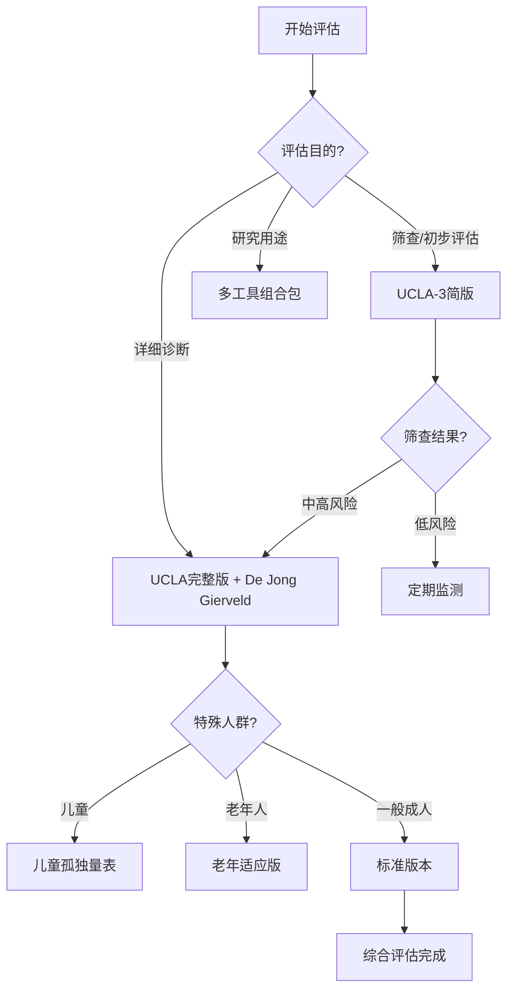

# 孤独测量工具详解与应用指南 (Loneliness Measurement Tools Detailed Guide)

## 核心测量工具标准化详解

### 一、经典孤独量表深度解析

#### 1.1 UCLA孤独量表 (UCLA Loneliness Scale)

**发展历程与版本演进：**
- **初版 (1978)**：80个项目，Russell等人开发
- **修订版 (1980)**：20个项目，删除冗余条目
- **第三版 (1996)**：保留核心20项，微调表述
- **简版 (2015)**：3项快速筛查版本

**完整20项版本条目分析：**

| 条目编号 | 原文条目 | 中文翻译 | 测量维度 | 反向计分 |
|---------|---------|---------|---------|---------|
| 1 | How often do you feel that you are "in tune" with the people around you? | 你有多经常感到与周围的人"合拍"？ | 社会连接感 | 是 |
| 2 | How often do you feel that you lack companionship? | 你有多经常感到缺少陪伴？ | 陪伴缺失感 | 否 |
| 3 | How often do you feel left out? | 你有多经常感到被排斥？ | 社会排斥感 | 否 |
| 4 | How often do you feel isolated from others? | 你有多经常感到与他人隔离？ | 社会孤立感 | 否 |
| 5 | How often do you feel that your relationships with others are not meaningful? | 你有多经常感到与他人的关系没有意义？ | 关系意义感 | 否 |
| 6 | How often do you feel that no one really knows you well? | 你有多经常感到没有人真正了解你？ | 被理解感 | 否 |
| 7 | How often do you feel that you are not a part of a group of friends? | 你有多经常感到不是朋友圈的一员？ | 群体归属感 | 否 |
| 8 | How often do you feel that you have no one to talk to? | 你有多经常感到没有人可以交谈？ | 交流机会 | 否 |
| 9 | How often do you feel alone? | 你有多经常感到孤独？ | 孤独感强度 | 否 |
| 10 | How often do you feel abandoned? | 你有多经常感到被遗弃？ | 被遗弃感 | 否 |
| 11 | How often do you feel that there is no one you can turn to? | 你有多经常感到没有可以求助的人？ | 社会支持感 | 否 |
| 12 | How often do you feel disconnected from other people? | 你有多经常感到与他人脱节？ | 连接感 | 否 |
| 13 | How often do you feel that people are around you but not with you? | 你有多经常感到人在身边但心不在一起？ | 陪伴质量 | 否 |
| 14 | How often do you feel that your interests and ideas are not shared by those around you? | 你有多经常感到周围的人不分享你的兴趣和想法？ | 兴趣共鸣 | 否 |
| 15 | How often do you feel outgoing and friendly? | 你有多经常感到外向和友好？ | 社交意愿 | 是 |
| 16 | How often do you feel close to people? | 你有多经常感到与人亲近？ | 亲密感 | 是 |
| 17 | How often do you feel left out of activities? | 你有多经常感到被活动排除在外？ | 活动参与感 | 否 |
| 18 | How often do you feel that your relationships don't mean as much to you? | 你有多经常感到你的人际关系对你来说没那么重要？ | 关系价值感 | 否 |
| 19 | How often do you feel that nobody understands you? | 你有多经常感到没有人理解你？ | 被理解感 | 否 |
| 20 | How often do you feel shy? | 你有多经常感到害羞？ | 社交焦虑 | 否 |

**评分标准与解释：**
- **频率选项**：几乎从不(1分)、很少(2分)、有时(3分)、经常(4分)
- **总分范围**：20-80分
- **分数解释**：
  - 20-40分：低孤独水平
  - 41-60分：中等孤独水平  
  - 61-80分：高孤独水平

**临床应用注意事项：**
- 建议间隔2-4周重复测量以评估变化趋势
- 考虑文化背景对条目理解的影响
- 注意季节性情绪波动的干扰
- 结合其他评估工具进行综合判断

#### 1.2 De Jong Gierveld孤独量表 (6项版本)

**量表结构：**
- **情感孤独分量表**：3个项目
- **社交孤独分量表**：3个项目

**完整条目列表：**

**情感孤独部分：**
1. "我缺少可以真正依靠的人"
2. "在我生活中缺少给我情感支持的人"  
3. "我缺少可以向其倾诉内心感受的人"

**社交孤独部分：**
1. "我缺少可以一起做事情的人"
2. "我缺少可以真正了解我的人"
3. "总的来说，我缺少可以谈论各种话题的朋友"

**评分与解释：**
- **回答选项**：是(1分)、否(0分)、有时(0.5分)
- **各维度得分**：0-3分
- **总分**：0-6分
- **解释标准**：
  - 0-1分：低孤独水平
  - 1.5-2.5分：中等孤独水平
  - 3-6分：高孤独水平

### 二、特殊人群专用测量工具

#### 2.1 儿童孤独量表 (Children's Loneliness Scale)

**适用年龄**：8-12岁儿童

**核心条目示例：**
- "我没有可以一起玩的好朋友"
- "我觉得班上其他同学都不喜欢我"
- "我想和别人一起玩，但他们不想和我玩"
- "我觉得自己和其他孩子不一样"

**儿童版本特点：**
- 语言表达简单明了
- 采用图画辅助理解
- 考虑儿童认知发展水平
- 区分同伴关系和家庭关系孤独

#### 2.2 老年孤独量表 (UCLA Loneliness Scale-Version 3 for Older Adults)

**针对老年人的适应性修改：**
- 考虑身体功能限制对社交的影响
- 区分居住安排和社会参与
- 考虑代际关系和支持网络
- 关注健康状况对孤独感的影响

### 三、多维度评估工具矩阵

#### 3.1 综合评估工具包

| 评估维度 | 推荐工具 | 评估重点 | 适用场景 |
|---------|---------|---------|---------|
| **总体孤独感** | UCLA孤独量表 | 孤独感强度与频率 | 通用筛查 |
| **孤独类型区分** | De Jong Gierveld量表 | 情感vs社交孤独 | 精确诊断 |
| **社交网络结构** | 社会网络问卷 | 关系数量与质量 | 系统评估 |
| **功能损害程度** | WHO功能评定量表 | 日常功能影响 | 干预决策 |
| **生活质量影响** | SF-36健康调查 | 整体生活质量 | 效果评估 |

#### 3.2 数字化评估工具

**移动应用集成评估：**
- **生态瞬时评估(EMA)**：日常生活中的实时孤独感测量
- **行为数据分析**：通过手机使用模式推断社交状态
- **语音情感分析**：通话和语音消息中的情感线索识别
- **地理位置追踪**：活动范围与社交聚集度分析

### 四、临床评估流程标准化

#### 4.1 三级筛查体系

**第一级：快速筛查**
```
筛查工具：UCLA-3简版或单条目筛查
筛查问题："在过去一周中，你有多少天感到孤独？"
- 0-1天：低风险
- 2-4天：中风险  
- 5-7天：高风险
```

**第二级：详细评估**
```
评估工具组合：
1. UCLA孤独量表(完整版) - 评估总体水平
2. De Jong Gierveld量表 - 区分孤独类型
3. 社会网络绘图 - 可视化关系结构
4. 功能影响评估 - 日常生活损害程度
```

**第三级：深入诊断**
```
综合评估要素：
- 精神健康共病筛查(PHQ-9, GAD-7)
- 社会支持系统详细评估
- 生活事件和创伤史
- 文化背景和个人价值观
- 治疗偏好和资源可用性
```

#### 4.2 动态监测方案

**短期监测(治疗期间)：**
- 频率：每周1次
- 工具：UCLA-3简版
- 目标：跟踪症状变化趋势

**中期评估(阶段性)：**
- 频率：每月1次
- 工具：完整UCLA量表
- 目标：评估干预效果

**长期追踪(维持期)：**
- 频率：每季度1次
- 工具：综合性评估包
- 目标：预防复发和维持效果

### 五、测量工具的信效度指标

#### 5.1 心理测量学特性

| 量表名称 | 内部一致性(α) | 重测信度 | 结构效度 | 效标效度 |
|---------|-------------|---------|---------|---------|
| UCLA孤独量表 | 0.89-0.94 | 0.70-0.85 | 良好 | 良好 |
| De Jong Gierveld | 0.80-0.85 | 0.65-0.80 | 良好 | 中等 |
| 儿童孤独量表 | 0.80-0.88 | 0.70-0.82 | 良好 | 中等 |

#### 5.2 跨文化适应性

**文化敏感性考虑：**
- **集体主义文化**：可能低估个体孤独感
- **个人主义文化**：可能高估社交需求
- **年龄差异**：不同年龄段对孤独的理解不同
- **性别差异**：男女表达孤独的方式存在差异

### 六、新兴测量技术与方法

#### 6.1 生理指标测量

**生物标志物研究：**
- 皮质醇水平变化
- 炎症因子浓度
- 心率变异性
- 睡眠质量指标

#### 6.2 行为大数据分析

**数字足迹分析：**
- 社交媒体使用模式
- 通讯频率和时长
- 地理位置移动轨迹
- 在线社交网络密度

#### 6.3 神经影像测量

**脑成像指标：**
- 默认模式网络活动模式
- 社会疼痛回路激活程度
- 奖赏系统反应性
- 前额叶皮质功能连接

### 七、测量工具选择决策树



### 八、质量控制与标准化操作

#### 8.1 实施标准化流程

**评估前准备：**
- 确保环境安静舒适
- 解释评估目的和保密原则
- 确认参与者理解指导语
- 准备必要的时间(通常15-30分钟)

**实施过程中：**
- 严格按照指导语进行
- 避免引导性提问
- 记录任何异常反应
- 确保填写完整性

**结果解释时：**
- 结合多维度信息
- 考虑测量误差范围
- 避免单一分数决定论
- 提供具体可行的建议

#### 8.2 常见问题与解决方案

| 问题类型 | 典型表现 | 解决策略 |
|---------|---------|---------|
| **理解困难** | 反复询问条目含义 | 简化语言，提供具体例子 |
| **社会期望偏差** | 回答过于积极或消极 | 强调诚实回答的重要性 |
| **情绪反应强烈** | 评估过程中流泪或焦虑 | 提供情感支持，必要时暂停 |
| **文化差异** | 对某些概念理解不同 | 了解文化背景，适当调整表述 |

---

*本指南基于国际标准化的心理测量原则制定，结合了最新的孤独研究证据和临床实践经验，旨在为专业人士提供科学、系统的孤独测量指导。*