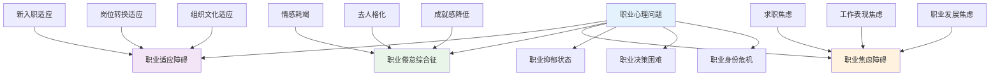
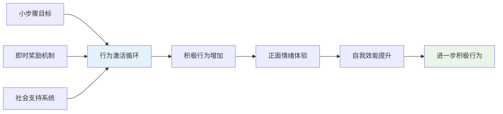
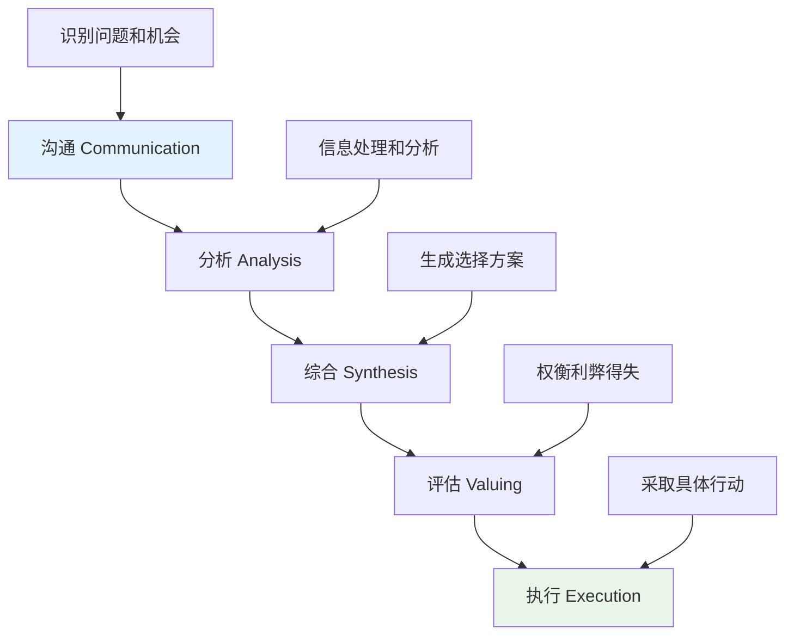
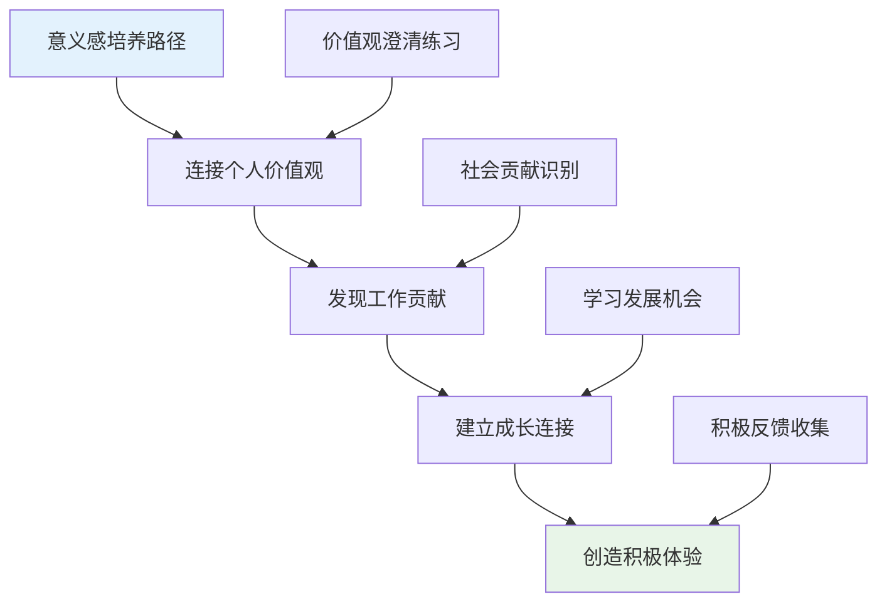
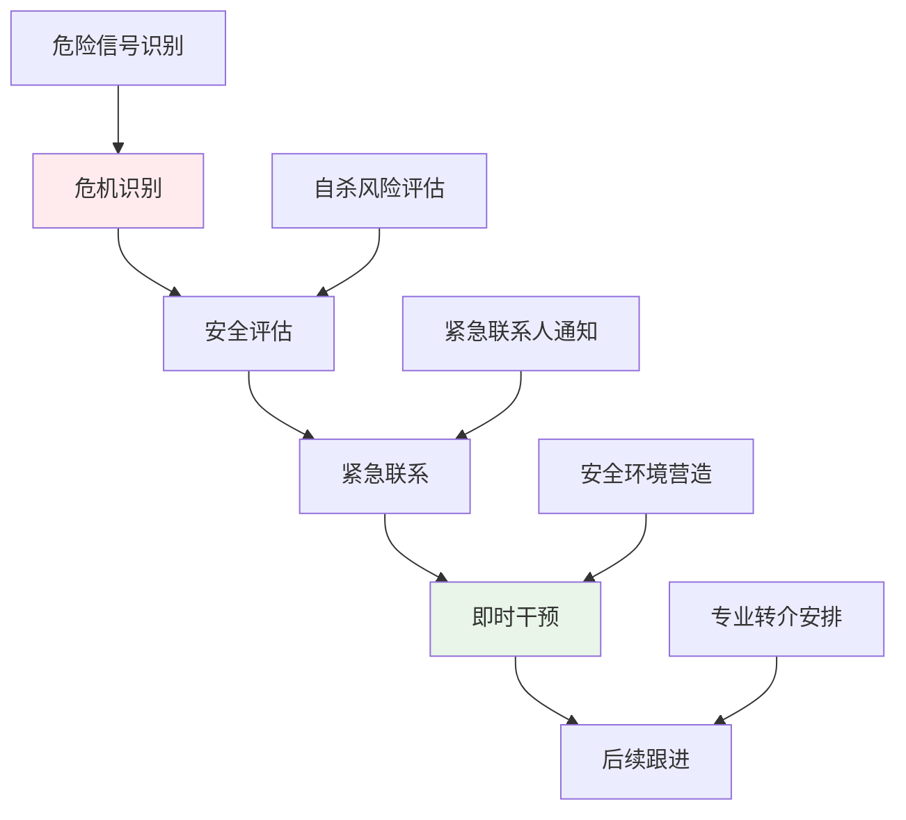

# 职业心理学临床应用与治疗干预 (Vocational Psychology Clinical Applications & Interventions)

> 📘 **文档导航**: 本指南系统阐述职业心理学的临床应用体系、治疗干预技术和危机管理策略。相关文档：
> - [职业心理学概览](../Vocational_Psychology_Overview.md) - 学科全景图和理论基础
> - [职业心理学理论框架](../theory/Vocational_Psychology_Theory_Framework.md) - 核心理论体系
> - [职业心理学评估工具](../assessment/Vocational_Psychology_Assessment_Tools.md) - 测量标准和评估方法
> - [职业心理学术语标准](../Vocational_Psychology_Terminology_Standards.md) - 专业术语定义和使用规范
> - [职业心理学案例指南](../Vocational_Psychology_Case_Studies_Guide.md) - 典型案例分析和实践应用

## 临床应用总体框架 (Clinical Application Framework)

### 职业心理问题分类与识别

**职业心理障碍谱系**:

**问题识别指标体系**:

**职业适应障碍识别标准**:
| 识别维度 | 具体指标 | 评估要点 | 干预阈值 |
| :--- | :--- | :--- | :--- |
| **情绪症状** | 焦虑、抑郁、易怒 | 持续时间>2周、严重影响功能 | 中度以上症状 |
| **行为表现** | 缺勤、迟到、工作效率下降 | 频率增加、质量明显降低 | 影响工作绩效 |
| **认知特征** | 负面思维、自我怀疑 | 持续性消极认知模式 | 认知扭曲明显 |
| **生理反应** | 睡眠障碍、食欲改变 | 身体症状持续存在 | 影响日常生活 |

**职业倦怠综合征诊断框架**:
| MBBI维度 | 核心症状 | 严重程度分级 | 干预策略 |
| :--- | :--- | :--- | :--- |
| **情感耗竭** | 情感枯竭、疲惫不堪 | 轻度:偶尔感到累 中度:经常疲惫 重度:持续耗竭 | 压力管理训练 工作重新设计 休假治疗 |
| **去人格化** | 冷漠疏离、机械化对待 | 轻度:偶尔冷淡 中度:经常疏离 重度:完全麻木 | 人际技能训练 同理心培养 价值观重构 |
| **个人成就感** | 无力感、自我效能低 | 轻度:信心不足 中度:成就感受损 重度:完全无价值感 | 成功体验积累 能力重建 意义感培养 |

### 核心治疗干预技术

#### 1. 认知行为治疗在职业问题中的应用

**职业认知重构技术**:
| 认知扭曲类型 | 典型表现 | 重构策略 | 治疗技术 |
| :--- | :--- | :--- | :--- |
| **全或无思维** | "我要么完美要么失败" | 连续性思维训练 | 分级目标设定 |
| **灾难化思维** | "如果失业我就完了" | 现实检验技术 | 概率评估练习 |
| **过度概括** | "我总是搞砸面试" | 具体化技术 | 成功案例分析 |
| **个人化归因** | "项目失败都是我的错" | 外部归因训练 | 责任合理分配 |

**职业行为激活技术**:

**具体干预技术**:

**求职技能训练模块**:
| 训练内容 | 技术要点 | 实施步骤 | 效果评估 |
| :--- | :--- | :--- | :--- |
| **简历优化** | STAR法则、关键词匹配 | 内容梳理→格式美化→针对性调整 | 获得面试机会数 |
| **面试技巧** | 行为面试法、情景模拟 | 理论学习→角色扮演→实战演练 | 面试表现评分 |
| **网络建设** | LinkedIn优化、人脉拓展 | 平台完善→主动联系→关系维护 | 有效连接数量 |
| **薪资谈判** | 市场调研、价值包装 | 信息收集→策略制定→模拟谈判 | 薪资达成率 |

#### 2. 职业决策治疗技术

**决策困难干预框架**:
| 干预阶段 | 核心任务 | 技术方法 | 预期效果 |
| :--- | :--- | :--- | :--- |
| **问题澄清** | 识别决策困难根源 | 结构化访谈、问题树分析 | 明确核心障碍 |
| **信息补充** | 弥补信息不足 | 职业信息检索、专家访谈 | 信息充分性提升 |
| **技能训练** | 提升决策能力 | 决策模型教学、模拟练习 | 决策技能改善 |
| **动机激发** | 增强行动意愿 | 价值澄清、目标设定 | 行动动力增强 |

**CASVE循环决策模型应用**:

**职业决策治疗技术包**:
- **决策平衡单技术**: 系统比较各选项的利弊得失
- **可能性探索技术**: 扩展职业选择的可能性范围
- **风险评估技术**: 客观评估各种选择的风险水平
- **后悔最小化技术**: 从长远角度考虑决策后果

#### 3. 职业压力管理与韧性培养

**压力管理综合干预方案**:
| 干预层面 | 具体技术 | 实施要点 | 效果指标 |
| :--- | :--- | :--- | :--- |
| **认知层面** | 压力认知重构、威胁评估调整 | 识别压力源、重新框架化 | 压力感知水平 |
| **情绪层面** | 情绪调节训练、放松技术 | 深呼吸、渐进性肌肉放松 | 生理唤醒指标 |
| **行为层面** | 时间管理、边界设定 | 优先级排序、学会说不 | 工作效率指标 |
| **社会层面** | 社会支持激活、求助技能 | 寻求帮助、建立支持网络 | 社会支持感知 |

**心理韧性培养技术**:
| 韧性维度 | 培养技术 | 实施方法 | 测评工具 |
| :--- | :--- | :--- | :--- |
| **接受现实** | 正念训练、现实检验 | 观察当下、接纳现状 | MAAS正念量表 |
| **寻找意义** | 意义建构、价值观澄清 | 回顾经历、发现价值 | PIL意义感量表 |
| **灵活应对** | 认知灵活性训练、问题解决 | 多角度思考、创新方案 | CFI认知弹性量表 |
| **寻求支持** | 社会技能训练、关系建设 | 主动沟通、互助合作 | SSQ社会支持量表 |

#### 4. 职业身份与意义感重建

**职业身份危机干预**:
| 危机类型 | 核心特征 | 干预策略 | 治疗技术 |
| :--- | :--- | :--- | :--- |
| **身份混乱** | 角色不清、价值观冲突 | 身份整合技术 | 叙事治疗、价值观澄清 |
| **身份丧失** | 失业、转行冲击 | 身份重建技术 | 优势识别、新角色探索 |
| **身份固化** | 发展停滞、缺乏成长 | 身份发展技术 | 挑战舒适区、学习新技能 |

**工作意义感培养技术**:

### 特殊群体职业心理干预

#### 1. 青少年职业探索干预

**发展阶段适应性干预**:
| 年龄阶段 | 发展任务 | 干预重点 | 技术方法 |
| :--- | :--- | :--- | :--- |
| **初中阶段 (12-15岁)** | 职业意识启蒙 | 兴趣探索、职业认知 | 职业参观、角色扮演 |
| **高中阶段 (16-18岁)** | 专业方向选择 | 能力评估、决策训练 | 职业测评、信息搜集 |
| **大学阶段 (19-22岁)** | 职业准备完善 | 技能培养、求职训练 | 实习指导、简历辅导 |

**青少年职业干预特色技术**:
- **OH卡职业探索**: 利用图像联想激发职业想象
- **生涯彩虹绘制**: 可视化展现多重生涯角色
- **职业人物访谈**: 通过真实接触了解职业世界
- **模拟职场体验**: 角色扮演增强职业理解

#### 2. 女性职业发展干预

**性别角色影响干预**:
| 影响因素 | 具体表现 | 干预策略 | 支持资源 |
| :--- | :--- | :--- | :--- |
| **家庭责任** | 工作家庭冲突、照顾负担 | 边界管理训练、支持系统建设 | 托儿服务、家庭支持 |
| **社会期待** | 性别刻板印象、职业天花板 | 自我赋权技术、榜样学习 | 女性领导力项目 |
| **内在阻碍** | 自我设限、冒名顶替综合症 | 自信建设、成功经验积累 | 导师指导、同伴支持 |

#### 3. 残疾人群体职业康复

**职业康复整合模式**:
| 康复阶段 | 核心任务 | 干预技术 | 支持措施 |
| :--- | :--- | :--- | :--- |
| **评估阶段** | 能力评估、需求分析 | 功能性评估、职业测评 | 个性化康复计划 |
| **训练阶段** | 技能培养、适应训练 | 职业技能培训、辅助技术 | 无障碍环境改造 |
| **就业阶段** | 岗位匹配、支持就业 | 就业指导、岗位定制 | 雇主教育、政策支持 |
| **维持阶段** | 职业发展、持续支持 | 跟踪服务、能力提升 | 职业发展咨询 |

### 危机干预与紧急处理

#### 职业危机识别与评估

**危机预警信号**:
| 危机类型 | 预警信号 | 评估要点 | 干预优先级 |
| :--- | :--- | :--- | :--- |
| **失业危机** | 突然失业、经济压力 | 经济状况、心理状态 | 紧急(立即) |
| **职场霸凌** | 持续骚扰、恶意对待 | 安全风险、支持系统 | 紧急(立即) |
| **职业倦怠恶化** | 严重抑郁、自杀念头 | 自杀风险、功能损害 | 紧急(立即) |
| **重大职业转变** | 重大损失、身份危机 | 适应能力、支持资源 | 高优先级 |

**危机风险评估工具**:
- **自杀风险评估**: SAD PERSONS量表、Columbia自杀风险评估
- **安全风险评估**: 环境安全性、支持系统完备性
- **功能损害评估**: 日常功能、社会功能受损程度

#### 紧急干预流程

**急性危机处理**:

**危机干预技术要点**:
1. **确保安全**: 移除危险物品、确保环境安全
2. **建立连接**: 表达关心、倾听理解、给予支持
3. **评估风险**: 详细了解当前状况和自杀计划
4. **制定计划**: 协助制定安全计划和求助策略
5. **专业转介**: 及时联系专业机构和相关人员

### 数字化干预技术发展

#### 在线职业心理服务
- **远程咨询**: 视频通话、即时消息等形式的职业咨询
- **AI辅助诊断**: 智能聊天机器人进行初步问题识别
- **虚拟现实治疗**: VR环境中的职业场景暴露和技能训练
- **移动应用程序**: 随时随地的职业心理支持和自助工具

#### 大数据个性化干预
- **预测性分析**: 基于行为数据预测职业风险
- **个性化推荐**: 根据个体特征推荐最适合的干预方案
- **效果追踪**: 实时监测干预效果并动态调整
- **群体洞察**: 发现职业心理问题的群体规律和趋势

### 服务质量保障体系

#### 专业胜任力标准
- **学历要求**: 心理学、职业咨询相关专业背景
- **资质认证**: 持有相关职业资格证书
- **继续教育**: 定期参加专业培训和学术交流
- **督导机制**: 接受资深专家的定期督导

#### 伦理质量控制
- **保密原则**: 严格保护当事人隐私信息
- **知情同意**: 确保当事人充分了解服务内容
- **利益冲突管理**: 避免可能的利益冲突情况
- **质量监控**: 建立服务质量评估和改进机制

---

*📚 本文档提供职业心理学临床应用的系统性指导和技术支持，为职业心理健康服务的专业化发展奠定基础。*