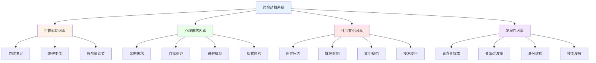
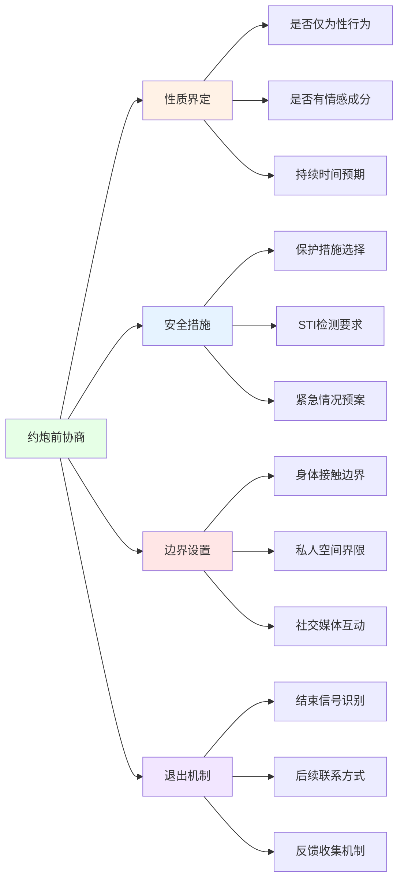

# 约炮心理学与健康实践指南 (Casual Sex Psychology & Healthy Practice Guide)

## 概述与定义框架

### 约炮的学术定义与范畴界定

**核心概念澄清：**
约炮(Casual Sex)指在缺乏承诺关系或长期情感连接的前提下发生的性行为，涵盖从一次性遇到短期重复性关系的各种形式。

| 术语分类 | 中文名称 | 英文术语 | 定义标准 | 关键特征 | 学术引用 |
|---------|---------|---------|---------|---------|---------|
| **核心约炮** | 一次性约炮 | One-night Stand | 单次性接触，无后续预期 | 完全陌生、无联系方式、零承诺 | Herbenick et al. (2010) |
| **重复约炮** | 朋友炮友 | Friends with Benefits | 重复性接触，在友谊基础上 | 熟悉但无恋爱承诺、明确界限 | Mongeau et al. (2013) |
| **短期关系** | 约会炮友 | Casual Dating | 有限次数的约会性接触 | 有一定熟悉度、可能发展为正式关系 | Fielder & Carey (2010) |
| **开放式关系** | 开放式性 | Open Relationship Sex | 在开放关系框架内的性行为 | 明确规则、知情同意、情感连接存在 | Conley et al. (2012) |

### 心理动机与驱动力分析

#### 多元动机理论框架

#### 动机类型学详表

| 动机维度 | 具体类型 | 心理机制 | 行为表现 | 风险等级 | 调节因素 |
|---------|---------|---------|---------|---------|---------|
| **生物性动机** | 生理驱动 | 性激素水平、性冲动调节 | 寻求即时性满足、频繁搜索 | 中等 | 自我控制能力 |
| **情感性动机** | 亲密渴望 | 依恋需求、孤独感补偿 | 寻求身体接触、情感慰藉 | 高 | 依恋安全性 |
| **认知性动机** | 好奇探索 | 新奇寻求、经验扩展 | 尝试不同伴侣、性行为多样性 | 低 | 开放性人格 |
| **逃避性动机** | 问题回避 | 压力释放、情感麻木 | 用性行为逃避现实困扰 | 高 | 应对技能水平 |
| **社交性动机** | 群体融入 | 同伴认同、社会地位 | 跟随时尚潮流、炫耀资本 | 中 | 社会支持网络 |
| **成就性动机** | 自我证明 | 能力展示、自尊提升 | 追求数量成就、征服体验 | 高 | 自我价值感稳定性 |

### 心理健康影响评估

#### 积极效应分析

**心理健康促进机制：**
1. **压力缓解作用**
   - 性高潮释放内啡肽和催产素
   - 短期焦虑和抑郁症状减轻
   - 生理紧张的有效释放渠道

2. **自信增强效应**
   - 性吸引力得到验证
   - 社交技能的实际应用
   - 自我效能感的提升

3. **经验学习价值**
   - 性健康知识的实际获得
   - 沟通技巧的发展
   - 边界设定能力的锻炼

#### 风险因素识别

**心理健康风险矩阵：**

| 风险类型 | 具体表现 | 影响机制 | 易感人群 | 预防策略 |
|---------|---------|---------|---------|---------|
| **情感伤害** | 被拒绝、被利用感 | 期望落差、自尊受损 | 高依恋焦虑者 | 现实期望管理 |
| **后悔反应** | 事后愧疚、自我谴责 | 认知失调、价值观冲突 | 保守价值观持有者 | 价值观澄清 |
| **关系混淆** | 情感投入误解 | 界限模糊、信号误读 | 低沟通技能者 | 明确协商机制 |
| **安全风险** | STI感染、意外怀孕 | 保护措施缺失、冲动决策 | 缺乏性教育者 | 安全性行为教育 |
| **成瘾倾向** | 过度寻求、失控行为 | 多巴胺奖励系统激活 | 冲动控制困难者 | 自我监控训练 |

## 健康约炮实践框架

### 前期准备与风险评估

#### 个人准备清单

**心理准备维度：**
- [ ] 明确个人动机和期望
- [ ] 评估当前情感状态稳定性
- [ ] 确认价值观与行为的一致性
- [ ] 准备承担可能的负面后果
- [ ] 建立清晰的退出机制

**安全准备要素：**
- [ ] 性健康检查记录更新
- [ ] 安全套等防护用品储备
- [ ] 紧急联系人信息确认
- [ ] 法律风险了解(年龄、同意等)
- [ ] 隐私保护措施制定

#### 伙伴筛选标准

**基本安全筛选：**
1. **身份验证**
   - 真实姓名和基本信息确认
   - 社交媒体账号核实
   - 共同朋友网络交叉验证

2. **健康状况评估**
   - 近期性健康检查结果
   - STI检测阴性证明
   - 疫苗接种情况了解

3. **意向一致性确认**
   - 明确约定性质和边界
   - 同意书式的口头确认
   - 紧急情况处理预案

### 沟通协商机制

#### 核心协商议题框架

#### 沟通技巧要点

**有效协商原则：**
1. **直接明确表达**
   - 使用"I"语句表达个人需求
   - 避免模糊暗示和假设
   - 确认对方理解和同意

2. **尊重与平等**
   - 承认对方的自主权
   - 避免权力不对等的压力
   - 接受任何合理的拒绝

3. **持续沟通**
   - 过程中的感受确认
   - 边界调整的及时讨论
   - 结束后的反馈交流

### 实施过程管理

#### 安全性行为协议

**分层保护策略：**
1. **第一层：物理屏障**
   - 正确使用避孕套
   - 口交膜等专用防护
   - 定期更换和检查

2. **第二层：化学预防**
   - PrEP(暴露前预防)药物
   - PEP(暴露后预防)应急
   - 紧急避孕措施

3. **第三层：行为策略**
   - 限制性伴侣数量
   - 避免高风险行为
   - 定期健康监测

#### 情感边界维护

**过程中边界管理：**
- 保持预先商定的身体接触范围
- 及时表达不适或需要调整
- 避免情感投入的无意加深
- 维持适度的理性距离

### 事后处理与反思

#### 立即后续行动

**安全跟进措施：**
1. **健康监测**
   - 记录接触时间和详情
   - 观察身体异常症状
   - 按时进行STI检测

2. **情感处理**
   - 允许正常的情绪反应
   - 避免过度理性化或压抑
   - 寻求信任的朋友支持

3. **关系整理**
   - 按约定处理后续联系
   - 清晰结束当次互动
   - 更新个人边界认知

#### 长期反思框架

**经验学习维度：**
1. **动机审视**
   - 实际体验与预期的对比
   - 动机的真实性和纯粹性
   - 价值观的一致性评估

2. **技能评估**
   - 沟通协商的有效性
   - 边界维护的能力
   - 安全措施的执行情况

3. **成长收获**
   - 获得的自我认识
   - 技能和经验的积累
   - 对未来关系的启发

## 专业支持与资源

### 风险识别与求助时机

**需要专业帮助的警示信号：**
- 持续的后悔或愧疚感
- 情感依赖或痴迷倾向
- 安全行为的反复忽视
- 对正常关系的负面影响
- 自我价值感的严重损害

### 专业服务资源

**可获得的支持类型：**
1. **心理咨询**
   - 性健康心理咨询师
   - 关系治疗专家
   - 创伤处理专业人员

2. **医疗服务**
   - 性病检测和治疗
   - 避孕和生殖健康
   - 心理健康评估

3. **教育资源**
   - 性教育课程和工作坊
   - 安全性行为培训
   - 健康关系指导

---
---
*本指南基于循证心理学研究和临床实践经验，旨在为成年人提供科学、负责任的约炮实践指导。所有建议均遵循知情同意、相互尊重和安全第一的原则。*

**相关文档链接：**
- [出轨心理学与关系干预](../infidelity/Infidelity_Psychology.md) - 深入分析出轨行为的心理机制和影响
- [约炮与出轨关系影响综合分析](../impact-analysis/Relationship_Impact_Comparison.md) - 两种行为对不同类型关系的影响对比
- [约炮与出轨临床实践指南](../clinical-guide/Clinical_Practice_Manual.md) - 专业心理咨询和治疗的技术方法
- [约炮与出轨预防干预指南](../prevention/Prevention_Intervention_Guide.md) - 基于风险因素的预防策略和早期干预
- [约炮与出轨法律伦理考量](../legal-ethics/Legal_Ethical_Considerations.md) - 相关法律风险和伦理道德框架
- [约炮与出轨跨文化视角](../cultural-perspective/Cross_Cultural_Analysis.md) - 不同文化背景下的认知差异和处理方式
- [数字时代约炮出轨影响分析](../digital-age/Digital_Age_Impact.md) - 社交媒体技术对行为模式的影响
- [约炮与出轨多元化群体视角](../diverse-populations/Diverse_Populations_Perspectives.md) - 特殊群体的经历分析和支持策略