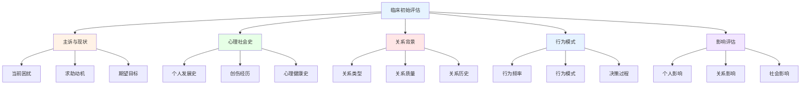

# 约炮与出轨心理咨询临床实践指南 (Clinical Practice Guide for Casual Sex and Infidelity Counseling)

## 临床评估与诊断框架

### 初始评估流程

#### 全面评估协议

**标准化评估维度：**



#### 评估工具选择

**标准化测量工具矩阵：**

| 评估领域 | 推荐工具 | 适用人群 | 评估重点 | 临床意义 |
|---------|---------|---------|---------|---------|
| **依恋风格** | ECR-R成人依恋量表 | 所有来访者 | 依恋焦虑/回避维度 | 预测行为模式 |
| **关系满意度** | RELISH关系满意度量表 | 有伴侣者 | 多维度关系质量 | 指导干预方向 |
| **性健康** | SEXUAL健康问卷 | 性活跃人群 | 安全性行为意识 | 风险评估基础 |
| **创伤反应** | IES-R创伤后应激量表 | 出轨受害者 | 创伤症状严重度 | 治疗紧迫性 |
| **人格特征** | NEO-PI-R人格问卷 | 深入评估需要 | 大五人格维度 | 个性适配治疗 |

### 诊断分类系统

#### DSM-5相关诊断考虑

**可能的相关诊断：**
1. **主要诊断**
   - 适应障碍(出轨道德困扰)
   - 创伤后应激障碍(严重受害反应)
   - 抑郁障碍(情绪症状)
   - 焦虑障碍(担心和恐惧)

2. **相关因素**
   - 关系问题(Z63.0-Z63.9)
   - 职业问题(Z56.0-Z56.9)
   - 生活方式因素(Z72.0-Z72.9)

#### 个案概念化框架

**多维度理解模型：**
1. **生物心理层面**
   - 神经生物学基础
   - 人格特质影响
   - 发展史作用

2. **社会心理层面**
   - 关系动力系统
   - 社会文化背景
   - 同伴群体影响

3. **精神动力层面**
   - 无意识冲突
   - 早期经历重现
   - 防御机制运用

## 治疗目标与方案设计

### 分层治疗目标体系

#### 短期目标(1-3个月)

**危机稳定与基础建设：**
1. **情绪稳定化**
   - 建立情绪调节技能
   - 处理急性应激反应
   - 建立日常作息规律

2. **安全保障**
   - 性健康风险管理
   - 人身安全评估
   - 社会支持网络建立

3. **认知澄清**
   - 行为动机的理性分析
   - 价值观冲突的识别
   - 现实检验能力增强

#### 中期目标(3-12个月)

**深层处理与技能发展：**
1. **创伤处理**
   - 出轨创伤的系统脱敏
   - 被背叛痛苦的哀伤处理
   - 自我价值感的重建

2. **模式改变**
   - 不健康关系模式识别
   - 依恋风格的积极调整
   - 冲突解决技能训练

3. **关系建设**
   - 健康边界设定
   - 有效沟通技能
   - 亲密能力提升

#### 长期目标(12个月以上)

**整合与预防复发：**
1. **身份整合**
   - 经验的意义化整合
   - 新的身份认同建立
   - 人生叙事的重构

2. **能力巩固**
   - 所学技能的生活化应用
   - 预防复发策略的内化
   - 持续成长机制建立

3. **未来导向**
   - 健康关系的选择标准
   - 长期幸福的规划
   - 个人使命的确立

### 治疗方案个性化设计

#### 方案适配原则

**基于评估结果的匹配：**

| 来访者特征 | 推荐治疗取向 | 核心技术 | 治疗频率 | 预期时长 |
|-----------|-------------|---------|---------|---------|
| **高创伤反应** | 创伤聚焦CBT | 暴露疗法、认知重构 | 每周2次 | 12-18个月 |
| **关系修复意愿** | 情感聚焦治疗 | 情绪表达、依恋修复 | 每周1次 | 15-25次 |
| **行为模式问题** | 认知行为治疗 | 行为实验、技能训练 | 每周1次 | 8-16次 |
| **身份认同困惑** | 人本主义治疗 | 真诚共情、无条件积极关注 | 每周1次 | 开放式 |
| **系统性问题** | 系统家庭治疗 | 家庭雕塑、循环提问 | 每两周1次 | 10-20次 |

## 具体治疗技术与方法

### 个体治疗核心技术

#### 认知重构技术

**核心信念工作表：**

```
识别阶段：
□ 自动思维记录
□ 情绪强度评分(0-100)
□ 行为反应描述

挑战阶段：
□ 证据收集(支持/反对)
□ 替代性解释生成
□ 现实检验验证

修正阶段：
□ 新信念形成
□ 行为实验设计
□ 进展监测追踪
```

**常用认知扭曲识别：**
- 全或无思维
- 过度概括化
- 灾难化想象
- 个人化归因
- 读心术谬误

#### 情绪处理技术

**情绪聚焦工作流程：**
1. **情绪识别**
   - 身体感觉觉察
   - 情绪标签命名
   - 强度水平评估

2. **情绪探索**
   - 情绪背后的需求
   - 早期经历的连接
   - 防御机制的识别

3. **情绪转化**
   - 自我慈悲练习
   - 情绪重新框架
   - 建设性表达

#### 行为干预技术

**暴露与反应预防：**
```
恐惧等级建构(0-100)：
□ 10-20：想象相关场景
□ 30-40：观看相关材料
□ 50-60：现实环境接触
□ 70-80：人际互动练习
□ 90-100：高风险情境应对
```

**行为激活计划：**
- 每日愉悦活动安排
- 社交技能渐进练习
- 健康生活习惯建立

### 关系治疗专门技术

#### 情感聚焦治疗(EFT)

**核心干预序列：**

1. **评估阶段(1-3次)**
   - 关系互动模式识别
   - 依恋需求与恐惧探索
   - 负向循环的解构

2. **重构阶段(4-12次)**
   - 情感表达的促进
   - 依恋创伤的处理
   - 新的互动模式建立

3. **整合阶段(13-20次)**
   - 积极模式的巩固
   - 未来应对策略发展
   - 关系安全感的建立

#### 沟通改善技术

**建设性对话结构：**
```
表达者角色：
1. 描述具体行为(而非评判)
2. 表达个人感受(使用"I"语句)
3. 说明影响和需求

倾听者角色：
1. 全神贯注倾听
2. 确认理解准确性
3. 表达共情和支持
```

**冲突解决步骤：**
1. 问题澄清和定义
2. 各自立场和需求表达
3. 共同利益识别
4. 创造性解决方案生成
5. 协议达成和执行

### 创伤治疗专门方法

#### EMDR眼动脱敏技术

**标准八阶段流程：**
1. 病史采集和治疗计划
2. 准备工作和稳定化
3. 评估靶向记忆
4. 脱敏处理
5. 认知植入
6. 身体扫描
7. 结束和再评估
8. 未来模板构建

#### 创伤知情治疗方法

**安全第一原则：**
- 建立治疗联盟作为安全基地
- 逐步暴露避免再次创伤
- 尊重来访者的节奏和边界
- 提供多种应对策略选择

## 特殊情况处理

### 高风险个案管理

#### 自伤自杀风险

**即时风险评估：**
```
风险因子评估：
□ 当前自杀意念强度(0-10)
□ 具体计划详细程度
□ 可得手段的危险性
□ 支持系统可用性
□ 精神症状严重度

保护因子评估：
□ 求助动机水平
□ 社会支持强度
□ 应对技能储备
□ 责任感连接
□ 希望感水平
```

**危机干预流程：**
1. 确保当前安全
2. 建立安全承诺
3. 制定安全计划
4. 联系支持系统
5. 安排密切随访

#### 暴力风险评估

**危险性评估维度：**
- 历史暴力行为模式
- 当前愤怒和失控程度
- 访问武器的可能性
- 被害人安全状况
- 外部压力因素

### 复杂创伤处理

#### 人格障碍共病

**边缘性人格特征的适应：**
- 结构化治疗框架
- 明确的边界设定
- 情绪调节技能优先
- 现实检验的持续强化

#### 多重创伤史

**分层处理策略：**
1. 稳定化优先(前3-6个月)
2. 依恋创伤处理(6-12个月)
3. 复杂创伤整合(12个月以上)

### 文化敏感性考虑

#### 多元文化适应

**文化背景评估要点：**
- 家庭和社区价值观
- 宗教信仰影响
- 性别角色期待
- 表达情感的文化规范
- 寻求帮助的文化态度

**文化适配策略：**
- 语言和表达方式调整
- 家庭系统纳入考虑
- 文化价值观的尊重
- 同伴支持的利用

## 治疗过程管理

### 进展监测系统

#### 定量化评估工具

**定期追踪指标：**
| 测量维度 | 推荐工具 | 评估频率 | 临床意义 |
|---------|---------|---------|---------|
| **症状严重度** | PHQ-9抑郁量表 | 每月 | 治疗效果监测 |
| **关系质量** | RELISH简版 | 每两个月 | 关系改善追踪 |
| **功能水平** | GAF全局评估 | 每季度 | 整体功能评估 |
| **生活质量** | WHOQOL-BREF | 每半年 | 生活满意度 |

#### 质性进展评估

**主观改善指标：**
- 日常生活功能恢复
- 人际关系质量提升
- 情绪稳定性增强
- 自我效能感增长
- 未来希望感恢复

### 治疗联盟维护

#### 联盟质量评估

**治疗关系监测：**
```
联盟质量指标：
□ 来访者满意度评分(1-10)
□ 治疗目标一致性评估
□ 沟通开放性水平
□ 合作程度评价
□ 信任感建立程度
```

**联盟修复策略：**
- 及时处理误解和冲突
- 定期联盟质量回顾
- 灵活调整治疗方法
- 增强来访者自主性

### 终止与随访

#### 终止准备阶段

**终止标准评估：**
- 症状显著缓解且稳定
- 功能水平恢复正常
- 应对技能熟练掌握
- 复发预防计划完善
- 支持系统充分建立

#### 随访计划制定

**分级随访策略：**
1. **密集期(终止后3个月内)**
   - 每月一次随访
   - 重点关注复发预警

2. **过渡期(3-12个月)**
   - 每两月一次随访
   - 巩固治疗成果

3. **维持期(12个月后)**
   - 每季度一次随访
   - 预防性支持

## 专业伦理与法律责任

### 保密原则的平衡

#### 信息披露边界

**必须打破保密的情况：**
- 来访者伤害自己或他人的危险
- 儿童或弱势群体遭受虐待
- 法庭强制要求的信息披露
- 传染病防控的公共卫生需要

#### 知情同意程序

**必要告知内容：**
- 保密的范围和限制
- 信息共享的条件
- 家属参与的可能性
- 记录保存的政策

### 多重关系防范

#### 专业边界维护

**风险情境识别：**
- 社交媒体的私人互动
- 治疗室外的偶遇处理
- 经济往来的避免
- 价值判断的克制

#### 利益冲突管理

**潜在冲突情形：**
- 为朋友或家人提供治疗
- 与来访者发展其他关系
- 商业合作的可能性
- 学术研究的利益相关

## 督导与专业发展

### 临床督导需求

#### 督导频率建议

**不同经验水平的要求：**
- 初级咨询师：每周一次
- 中级咨询师：每两周一次
- 高级咨询师：每月一次
- 特殊案例：按需增加

#### 督导内容重点

**专业成长关注点：**
- 案例概念化能力
- 治疗技术运用
- 伦理决策质量
- 反移情管理
- 文化敏感性

### 持续教育规划

#### 核心能力发展

**必备专业技能：**
- 创伤治疗专门训练
- 关系治疗高级技能
- 危机干预认证
- 文化胜任力培训
- 伦理决策工作坊

#### 学习资源整合

**推荐学习途径：**
- 专业期刊持续阅读
- 学术会议参与
- 同行交流网络
- 案例研讨小组
- 在线专业课程

---

*本指南整合了循证实践、临床经验和专业伦理要求，为心理健康专业人士提供约炮与出轨相关问题的系统性临床工作框架。*