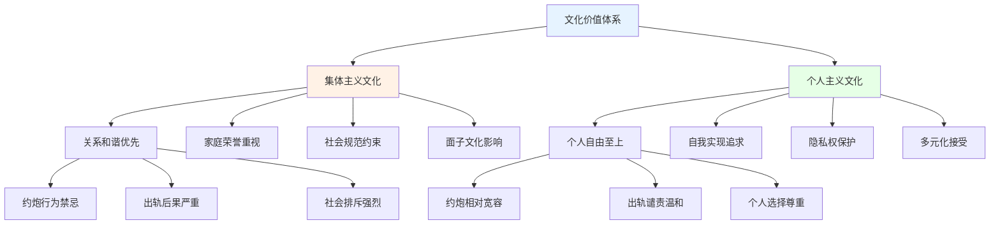
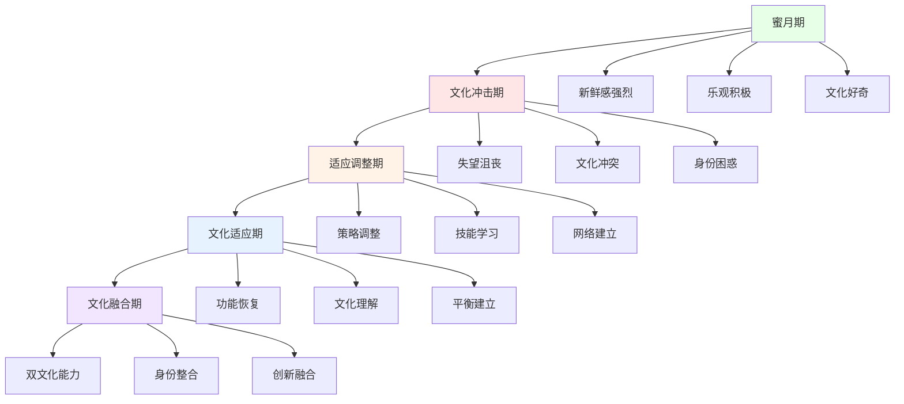

# 约炮与出轨的跨文化视角 (Cross-Cultural Perspectives on Casual Sex and Infidelity)

## 文化差异分析框架

### 东西方文化对比

#### 价值观念的根本差异

**集体主义vs个人主义文化：**



**具体文化态度对比：**

| 文化维度 | 东亚文化(中日韩) | 西方文化(欧美) | 南亚文化(印度等) | 中东文化(伊斯兰) |
|---------|----------------|---------------|----------------|----------------|
| **约炮接受度** | 极低 | 中等偏高 | 极低 | 极低 |
| **出轨容忍度** | 极低 | 低 | 极低 | 极低 |
| **性别差异** | 男相对宽松，女严格 | 相对平等 | 男女都很严格 | 男相对宽松，女极严 |
| **年龄因素** | 年轻人稍宽松 | 各年龄段相对一致 | 各年龄段都很严格 | 各年龄段都很严格 |
| **婚姻观念** | 终身承诺 | 伙伴关系 | 神圣契约 | 宗教义务 |

#### 宗教信仰的影响

**主要宗教的态度差异：**

| 宗教传统 | 核心教义 | 对约炮的态度 | 对出轨的态度 | 影响机制 |
|---------|---------|-------------|-------------|---------|
| **基督教** | 贞洁神圣、婚姻神圣 | 严格禁止 | 绝对禁止 | 罪恶感内化 |
| **伊斯兰教** | 清真饮食、婚姻神圣 | 严格禁止 | 绝对禁止 | 宗教法律约束 |
| **佛教** | 不邪淫戒、因果报应 | 不鼓励但理解 | 强烈反对 | 业力轮回观念 |
| **印度教** | 梵行、家庭责任 | 传统严格，现代宽松 | 传统严格 | 社会规范压力 |
| **儒家文化** | 礼义廉耻、家庭和谐 | 传统严格 | 传统严格 | 道德修养要求 |

### 不同文化背景下的认知模式

#### 情感表达文化的差异

**高语境vs低语境文化：**

**高语境文化特征(东亚、中东)：**
- 间接的情感表达方式
- 重视面子和含蓄
- 非言语信息的重要性
- 群体和谐优先于个人表达

**低语境文化特征(欧美、北欧)：**
- 直接明确的沟通方式
- 个人情感的自由表达
- 言语信息的主导地位
- 个人真实感受的优先性

#### 时间观念的文化差异

**单时制vs多时制文化：**

| 时间观念 | 单时制文化(欧美) | 多时制文化(拉美、中东) |
|---------|----------------|---------------------|
| **关系发展** | 线性、阶段性 | 循环、综合性 |
| **约炮态度** | 相对随意、短期 | 更注重关系基础 |
| **出轨理解** | 明确定义、零容忍 | 情境化理解、相对宽容 |
| **忠诚概念** | 独占性、排他性 | 情感性、情境性 |

### 文化适应与冲突

#### 移民群体的文化调适

**文化冲突的典型表现：**
```
第一代移民面临的挑战：
□ 传统文化价值观与主流文化的冲突
□ 性观念和行为模式的差异
□ 家庭期望与个人选择的矛盾
□ 身份认同的困惑和焦虑
□ 代际之间的价值观念分歧
```

**适应策略分析：**
1. **文化整合模式**
   - 保持传统文化核心价值
   - 适应主流社会行为规范
   - 寻找两种文化的平衡点
   - 建立新的文化认同

2. **文化分离模式**
   - 坚持原有文化传统
   - 与主流社会保持距离
   - 在族裔社区内生活
   - 避免文化融合压力

3. **文化同化模式**
   - 完全接受主流文化
   - 放弃原有文化传统
   - 追求完全的社会融入
   - 可能面临身份迷失

## 特定文化深入分析

### 东亚文化圈分析

#### 中华文化传统视角

**儒家思想的影响：**
- **礼义廉耻**：道德修养的根本要求
- **家庭和谐**：社会稳定的基础单元
- **面子文化**：社会评价的重要标准
- **孝道观念**：代际责任的伦理基础

**现代化变迁：**
```
传统与现代的张力：
传统价值观：贞操观念、从一而终、家庭责任
现代价值观：个人自由、性别平等、多元选择
平衡挑战：如何在保持文化根基的同时适应现代发展
```

**代际差异显著：**
- 老一辈：传统观念根深蒂固
- 中年一代：价值观转换期
- 年轻一代：更加开放包容

#### 日本文化特色

**独特的文化现象：**
- **不伦文化**：文学影视中的浪漫化表达
- **援交现象**：青少年性文化的特殊表现
- **终身雇佣制影响**：职场关系的复杂性
- **集团主义压力**：个人选择的社会制约

**社会变迁趋势：**
- 少子化对婚姻观念的冲击
- 女性地位提升带来的变化
- 经济压力对关系模式的影响
- 国际化程度提高的作用

#### 韩国文化特点

**快速发展的影响：**
- **韩流文化输出**：性观念的国际化
- **经济发达程度**：个人选择自由度提高
- **教育水平提升**：性别平等意识增强
- **社会流动性增加**：传统束缚减弱

**独特社会现象：**
- **剩女问题**：高学历女性的婚恋困境
- **整形文化**：外貌焦虑与关系选择
- **职场文化**：加班文化和社交压力
- **网络文化**：数字化约炮平台兴起

### 西方文化圈分析

#### 北欧模式特点

**社会福利制度的影响：**
- 高度发达的社会保障体系
- 性别平等程度世界领先
- 个人主义文化盛行
- 关系模式更加多元化

**开明态度的表现：**
- 对非传统关系的包容
- 性教育的科学化普及
- 个人选择的最大化尊重
- 法律制度的与时俱进

#### 美国文化特征

**多元文化熔炉效应：**
- 不同族裔文化传统的碰撞
- 宗教信仰的多样化影响
- 个人自由主义的极致体现
- 商业文化对性观念的塑造

**社会分层现象：**
- 不同社会阶层的价值观差异
- 教育水平对性观念的影响
- 地域文化(东西海岸vs中部)的差别
- 宗教虔诚度的调节作用

### 其他重要文化分析

#### 伊斯兰文化圈

**宗教法律的严格约束：**
- 沙里亚法的根本指导
- 严格的性别隔离制度
- 婚姻制度的宗教规范
- 性行为的道德要求

**现代社会的挑战：**
- 全球化进程的冲击
- 青年一代观念的变化
- 城市化带来的影响
- 教育普及的作用

#### 南亚文化传统

**印度文化的复杂性：**
- **种姓制度的历史影响**：社会分层与关系选择
- **宗教多样性的现实**：不同信仰群体的差异
- **经济发展不平衡**：城乡观念的巨大差距
- **传统与现代的交融**：价值观的快速变迁

**特殊社会现象：**
- 包办婚姻制度的延续与变革
- 性话题的社会禁忌程度
- 女性地位提升的缓慢进程
- 网络时代的新挑战

## 跨文化交流与适应

### 文化敏感性训练

#### 文化智商(CQ)提升

**四个维度的培养：**

1. **认知CQ(文化知识)**
   - 了解不同文化的基本特征
   - 掌握文化差异的主要表现
   - 学习跨文化交流的历史背景
   - 理解文化价值观的深层逻辑

2. **动机CQ(文化动机)**
   - 培养对文化差异的好奇心
   - 增强跨文化交往的信心
   - 发展文化适应的内在动力
   - 建立开放包容的心态

3. **行为CQ(文化技能)**
   - 学习适当的沟通方式
   - 掌握文化礼仪规范
   - 发展灵活的适应能力
   - 培养情境化的判断力

4. **情感CQ(文化情感)**
   - 管理文化冲突带来的情绪
   - 发展跨文化共情能力
   - 建立文化间的情感连接
   - 处理文化冲击的心理调适

#### 实用交流技巧

**跨文化沟通原则：**
```
基本原则：
□ 尊重文化差异，避免价值判断
□ 保持开放心态，积极倾听理解
□ 注意非言语信息的文化含义
□ 适时澄清误解，避免想当然
□ 寻找共同点，建立连接基础
```

**具体情境应对：**
- 语言障碍的克服策略
- 非言语沟通的文化差异
- 社交礼仪的不同要求
- 冲突处理的文化敏感性
- 建立信任的文化路径

### 文化适应策略

#### 个人层面适应

**文化适应阶段模型：**


**适应技能发展：**
1. **语言能力提升**
   - 日常交流的基本技能
   - 专业领域的术语掌握
   - 文化内涵的理解深化
   - 非正式表达的学习

2. **社交网络建设**
   - 本地朋友关系建立
   - 同乡群体的适度参与
   - 职业网络的拓展
   - 兴趣爱好的社群融入

3. **心理调适能力**
   - 文化冲击的心理准备
   - 思乡情绪的有效管理
   - 身份认同的重新建构
   - 压力应对策略的发展

#### 关系层面的文化协调

**跨文化恋爱挑战：**
```
主要挑战领域：
□ 价值观念的根本差异
□ 家庭期望的不同标准
□ 沟通方式的文化障碍
□ 亲密行为的接受度差异
□ 未来规划的文化冲突
□ 社会环境的接纳程度
```

**协调策略建议：**
1. **价值观对话**
   - 开诚布公地讨论核心价值
   - 寻找共同点和互补性
   - 建立相互尊重的基础
   - 制定妥协和平衡方案

2. **家庭关系处理**
   - 了解双方家庭文化背景
   - 循序渐进地介绍关系
   - 尊重长辈的意见和感受
   - 寻求家庭间的理解沟通

3. **沟通模式调整**
   - 学习对方的表达习惯
   - 理解不同的沟通期待
   - 建立有效的翻译机制
   - 避免文化误解的积累

## 全球化时代的文化变迁

### 文化融合趋势

#### 新兴文化现象

**全球化带来的变化：**
- **价值观念的趋同化**：年轻一代更加相似
- **行为模式的标准化**：国际流行文化的影响
- **技术平台的统一化**：数字媒体消除地理界限
- **教育理念的国际化**：高等教育的全球流动

**本土文化的坚守：**
- 传统文化的核心价值保持
- 民族特色的现代化表达
- 地方智慧的全球分享
- 文化多样性的积极维护

#### 代际文化差异

**Z世代的特点：**
- 数字原住民的身份认同
- 多元价值观的自然接受
- 性别平等意识的高度发达
- 个人选择自由的最大化追求

**传统与现代的对话：**
- 老一辈的经验智慧传承
- 年轻人的创新思维贡献
- 代际间的理解与包容
- 文化传承的创新发展

### 未来发展趋势

#### 文化演进方向

**积极发展趋势：**
- 性教育的科学化普及
- 性别平等的持续推进
- 多元关系模式的接受
- 心理健康意识的提升

**潜在挑战关注：**
- 传统文化价值的流失
- 商业化对性观念的扭曲
- 技术发展带来的新问题
- 全球化与本土化的平衡

#### 和谐发展路径

**文化建设建议：**
1. **教育体系完善**
   - 科学性教育的系统推进
   - 文化素养的全面提升
   - 批判思维能力的培养
   - 跨文化理解力的发展

2. **社会环境优化**
   - 健康文化氛围的营造
   - 多元价值的包容接纳
   - 支持系统的建立健全
   - 法律法规的与时俱进

3. **个人发展支持**
   - 自我认知能力的提升
   - 文化适应技能的培养
   - 心理健康服务的完善
   - 终身学习机制的建立

---

*本文件旨在提供约炮与出轨现象的跨文化理解框架，促进不同文化背景人群的相互理解和和谐发展。*