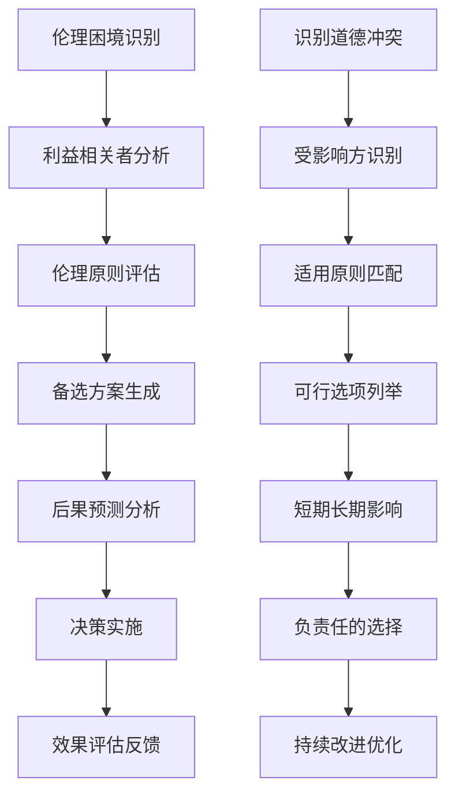
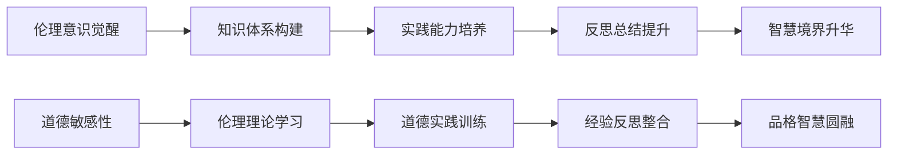

# Dating Ethics & Legal Considerations (约会伦理与法律考量)

> 📘 **文档导航**: 本指南探讨约会过程中的伦理原则、法律边界和道德责任。相关文档：
> - [约会心理学概览](Dating_Psychology_Overview.md) - 理论基础
> - [特殊情况处理](Dating_Special_Cases.md) - 实践应用
> - [文化差异与特殊情况](Dating_Cultural_Diversity.md) - 文化敏感性

## 约会伦理原则框架 (Dating Ethical Principles Framework)

### 核心伦理准则

| 伦理原则 | 核心内涵 | 具体表现 | 违背后果 | 实践建议 |
| :--- | :--- | :--- | :--- | :--- |
| **知情同意** | 所有互动都需要明确、自愿的同意 | 清晰沟通意图、尊重拒绝、不施加压力 | 法律责任、关系破裂、心理创伤 | 建立明确边界、定期确认意愿 |
| **诚实透明** | 真实呈现自我，不故意隐瞒重要信息 | 诚实表达现状、不虚构身份、坦诚过去 | 信任崩塌、法律纠纷、情感伤害 | 逐步自我披露、保持一致性 |
| **相互尊重** | 尊重对方的价值观、边界和选择 | 倾听理解、不强加观点、接纳差异 | 关系冲突、情感疏离、文化误解 | 培养共情能力、学习文化敏感性 |
| **责任担当** | 对自己的行为和影响承担责任 | 承认错误、履行承诺、承担后果 | 信任丧失、关系终结、社会声誉损害 | 建立问责机制、培养责任感 |
| **公平公正** | 平等对待，不利用权力差异 | 不操纵控制、不经济剥削、不分歧对待 | 权力滥用、法律诉讼、道德谴责 | 识别权力动态、促进平等对话 |

### 伦理决策模型

## 法律边界与风险防范 (Legal Boundaries & Risk Prevention)

### 重要法律领域

#### 1. 隐私权保护
| 法律要点 | 具体要求 | 风险情形 | 防范措施 | 法律后果 |
| :--- | :--- | :--- | :--- | :--- |
| **个人信息保护** | 未经同意不得分享对方隐私信息 | 擅自发布照片、泄露联系方式、传播私密对话 | 明确隐私边界、获得书面同意、谨慎社交媒体分享 | 侵犯隐私权、民事赔偿、刑事责任 |
| **数字足迹管理** | 网络行为可能留下法律证据 | 虚假身份、隐瞒重要信息、不当网络行为 | 审慎网络互动、保护账号安全、了解数据留存 | 网络诽谤、身份欺诈、证据效力 |
| **通信隐私** | 私人通信受法律保护 | 未经允许查看手机、偷看聊天记录、监听通话 | 尊重通信隐私、建立信任机制、处理怀疑情况 | 侵犯通信自由、非法取证、关系信任危机 |

#### 2. 性相关法律规范
| 法律领域 | 核心要求 | 关键节点 | 合规要点 | 违法风险 |
| :--- | :--- | :--- | :--- | :--- |
| **性同意法律** | 必须获得明确、清醒、自愿的同意 | 身体接触、亲密行为、性关系发展 | 确认对方清醒状态、明确表达同意、随时可撤回 | 性侵犯指控、刑事起诉、终身记录 |
| **年龄合法性** | 必须确认对方达到法定年龄 | 初次见面、关系发展、亲密接触 | 核实身份信息、了解法律规定、避免年龄猜测 | 与未成年人性关系、法定强奸、严重刑责 |
| **性骚扰防治** | 禁止不受欢迎的性相关行为 | 言语挑逗、身体接触、环境营造 | 尊重对方边界、避免性别歧视、创造安全环境 | 性骚扰诉讼、职场处罚、社会谴责 |

#### 3. 财务法律责任
| 财务领域 | 法律风险 | 预防策略 | 合规建议 | 后果警示 |
| :--- | :--- | :--- | :--- | :--- |
| **赠与法律性质** | 贵重礼品可能构成法律义务 | 大额消费、房产投资、债务承担 | 明确赠与性质、保留转账记录、避免经济依赖 | 财产分割争议、不当得利返还、合同纠纷 |
| **共同债务责任** | 可能承担对方债务连带责任 | 联名账户、担保行为、共同投资 | 谨慎财务决策、明确责任界限、保护个人资产 | 债务连带偿还、信用记录受损、破产风险 |
| **知识产权保护** | 创作内容的权益归属 | 共同创作、商业使用、网络传播 | 明确权益分配、签署协议、保护原创性 | 侵权诉讼、经济损失、合作关系破裂 |

## 特殊情况伦理处理 (Ethical Handling of Special Situations)

### 复杂关系伦理挑战

#### 多角关系管理
| 情况类型 | 伦理考量 | 处理原则 | 沟通策略 | 风险控制 |
| :--- | :--- | :--- | :--- | :--- |
| **开放式关系** | 所有方知情同意、边界清晰 | 透明协商、规则明确、定期检视 | 书面协议、开放对话、情感支持 | 嫉妒管理、边界维护、关系稳定 |
| **前任关系维持** | 避免对现任关系造成伤害 | 诚实告知、合理边界、时间管理 | 坦诚沟通、设定限制、优先现任 | 信任危机、情感混淆、关系冲突 |
| **职场恋情** | 平衡职业发展与个人感情 | 利益冲突回避、透明申报、专业表现 | 遵守公司政策、保持专业、谨慎处理 | 职场歧视、利益冲突、职业风险 |

#### 权力差异关系
| 权力类型 | 伦理风险 | 平衡策略 | 保护措施 | 预防机制 |
| :--- | :--- | :--- | :--- | :--- |
| **师生关系** | 利用权威地位、学术利益交换 | 避免利益冲突、保持专业边界 | 第三方监督、透明程序、申诉渠道 | 学术不端、权力滥用、职业损害 |
| **上下级关系** | 职场权力压迫、晋升利益交换 | 平等对话、公正待遇、回避机制 | HR介入、匿名举报、轮岗制度 | 职场骚扰、报复行为、法律诉讼 |
| **年龄差异关系** | 代际权力不平衡、经验操控 | 相互尊重、平等沟通、独立决策 | 同伴支持、专业咨询、边界设定 | 操控风险、依赖关系、发展受限 |

### 危机伦理决策

#### 紧急情况处理伦理
| 危机类型 | 伦理优先级 | 决策原则 | 行动指南 | 后续处理 |
| :--- | :--- | :--- | :--- | :--- |
| **身体健康危机** | 生命安全第一 | 立即救助、专业介入 | 拨打急救电话、陪同就医、通知家属 | 医疗授权、费用承担、康复支持 |
| **心理健康危机** | 防止自伤自杀 | 专业帮助、安全环境 | 联系心理危机热线、移除危险物品、寻求专业支持 | 持续关注、治疗配合、环境改善 |
| **法律危机** | 合法权益保护 | 法律援助、正当程序 | 联系律师、配合调查、保护证据 | 法律辩护、权益维护、关系修复 |

## 文化差异中的伦理考量 (Ethical Considerations in Cultural Differences)

### 跨文化约会伦理敏感性

#### 文化价值观冲突处理
| 冲突类型 | 文化背景 | 伦理平衡点 | 沟通策略 | 解决方案 |
| :--- | :--- | :--- | :--- | :--- |
| **婚姻观念差异** | 传统包办vs自由恋爱 | 尊重传统同时坚持个人选择 | 开诚布公讨论、寻求家庭理解 | 渐进式介绍、文化融合创新 |
| **性别角色期待** | 传统分工vs性别平等 | 平等协商基础上的个性化安排 | 共同制定家庭规则、灵活调整 | 角色协商、相互支持、共同发展 |
| **宗教信仰差异** | 不同宗教实践要求 | 相互尊重基础上的价值观对话 | 了解对方信仰、寻找共同点 | 宗教包容、实践协调、子女教育协商 |

#### 文化适应中的道德边界
| 适应维度 | 道德底线 | 文化敏感性 | 平衡策略 | 实践建议 |
| :--- | :--- | :--- | :--- | :--- |
| **传统习俗尊重** | 不违背核心价值观前提下的适度适应 | 了解文化背景、避免冒犯 | 选择性参与、表达尊重 | 文化学习、边界沟通、相互理解 |
| **家庭关系处理** | 维护伴侣关系的同时尊重原生家庭 | 平衡两个家庭期望、建立新边界 | 伴侣联盟优先、家庭和谐兼顾 | 家庭沟通、边界设定、支持网络 |
| **社会规范适应** | 遵守当地法律法规和社会道德 | 了解社会期待、避免不当行为 | 合法合规、道德自律 | 法律学习、社会融入、品格坚持 |

## 专业实践伦理指南 (Professional Practice Ethical Guidelines)

### 心理咨询师约会伦理
| 专业边界 | 伦理要求 | 风险防控 | 实践标准 | 监督机制 |
| :--- | :--- | :--- | :--- | :--- |
| **双重关系避免** | 严格禁止与来访者发展恋爱关系 | 建立防火墙、转介机制、透明披露 | 专业关系纯粹性、利益冲突回避 | 伦理委员会、同行监督、定期审查 |
| **保密义务** | 保护来访者隐私信息 | 信息隔离、安全存储、有限分享 | 保密原则坚持、例外情况处理 | 保密协议、信息安全、违规追责 |
| **专业能力边界** | 在专业范围内提供服务 | 能力评估、持续学习、转介推荐 | 胜任力保证、终身学习、团队协作 | 资质认证、继续教育、质量监控 |

### 媒体平台伦理责任
| 平台责任 | 用户权益保护 | 算法伦理 | 内容治理 | 社会责任 |
| :--- | :--- | :--- | :--- | :--- |
| **用户数据保护** | 隐私安全、信息透明、用户控制 | 算法公平、避免偏见、透明度 | 真实信息审核、有害内容过滤 | 促进健康关系、防止歧视 |
| **匹配算法伦理** | 避免算法歧视、保护弱势群体 | 公平性保障、多样性促进 | 算法解释、用户反馈机制 | 数字包容、社会公平 |

## 伦理教育与自我提升 (Ethics Education & Self-improvement)

### 个人伦理素养培养
| 培养维度 | 核心内容 | 学习方法 | 实践应用 | 效果评估 |
| :--- | :--- | :--- | :--- | :--- |
| **道德推理能力** | 伦理原则理解、情境分析、决策能力 | 案例学习、角色扮演、反思练习 | 日常决策、关系处理、危机应对 | 道德判断测试、行为观察、他人反馈 |
| **文化敏感性** | 多元文化理解、差异接纳、包容心态 | 文化学习、跨文化交流、实地体验 | 跨文化关系、国际合作、多元团队 | 文化适应性评估、跨文化能力测试 |
| **责任意识** | 个人责任、社会责任、环境责任 | 价值澄清、社会实践、志愿服务 | 个人发展、社会参与、可持续生活 | 责任感量表、社会贡献评估 |

### 持续伦理发展路径

## 总结与展望 (Conclusion & Outlook)

约会伦理与法律考量是一个动态发展的领域，需要我们在实践中不断学习和完善。核心要点包括：

✅ **基本原则坚持**: 知情同意、诚实透明、相互尊重是不可逾越的道德底线  
✅ **法律风险防范**: 了解相关法律法规，建立风险防控机制  
✅ **文化敏感性培养**: 在多元文化环境中保持开放包容的心态  
✅ **专业边界维护**: 在专业服务中严格遵守职业伦理规范  
✅ **持续自我提升**: 通过学习反思不断提升伦理素养  

只有在坚实的伦理基础上，约会关系才能健康发展，为个人成长和社会和谐贡献力量。

---
*📚 本文档基于心理学伦理学、法律实务和跨文化研究，为现代约会提供全面的伦理指导。*