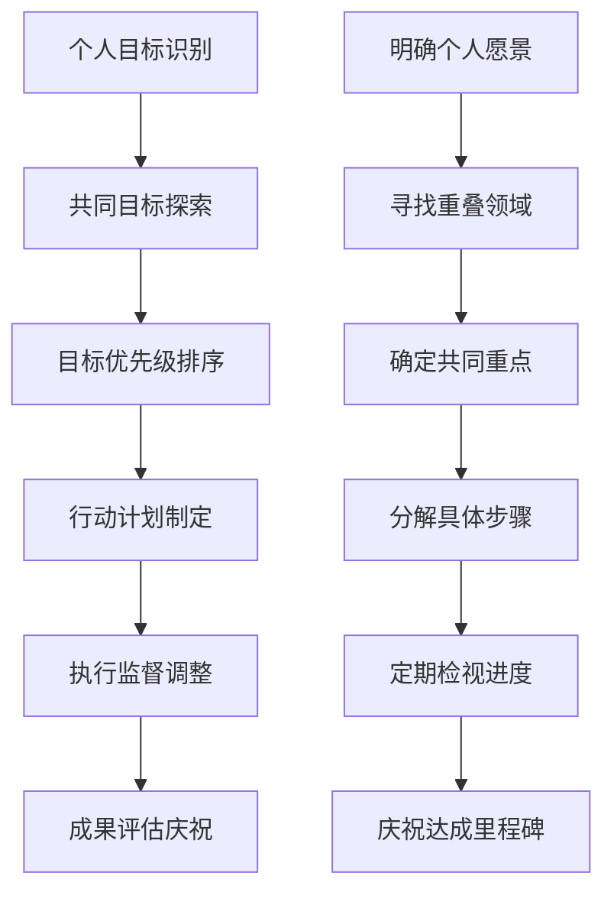
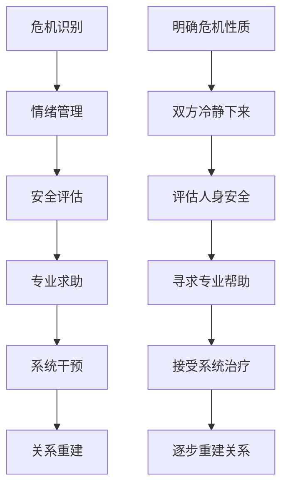

# Long-term Relationship Maintenance & Growth (长期关系维护与成长)

> 📘 **文档导航**: 本指南提供长期稳定关系的维护策略和持续发展方法。相关文档：
> - [约会心理学概览](Dating_Psychology_Overview.md) - 理论基础
> - [关系发展阶段](Dating_Relationship_Stage.md) - 发展进程
> - [冲突管理与边界设定](Dating_Conflict_Boundary.md) - 维护工具

## 长期关系质量评估体系 (Long-term Relationship Quality Assessment System)

### 关系健康度指标矩阵

| 评估维度 | 高质量表现 | 中等质量表现 | 低质量表现 | 改善方向 |
| :--- | :--- | :--- | :--- | :--- |
| **情感连接** | 深度理解、无条件接纳、情感安全 | 基本理解、有条件接纳、偶有不安 | 表面了解、经常误解、缺乏安全感 | 加强深度交流、增进理解、建立安全感 |
| **沟通质量** | 开放坦诚、有效倾听、建设性反馈 | 基本沟通、偶有误解、一般反馈 | 沟通困难、频繁误解、消极反馈 | 提升沟通技巧、建立有效沟通模式 |
| **冲突处理** | 建设性解决、快速修复、相互支持 | 能够处理、需要时间、基本修复 | 回避冲突、积累怨恨、相互指责 | 学习冲突技巧、建立修复机制 |
| **共同成长** | 相互激励、同步发展、支持梦想 | 各自发展、偶尔支持、基本协调 | 发展不同步、相互阻碍、缺乏支持 | 制定共同目标、相互鼓励、协调发展 |
| **激情维持** | 创意不断、新鲜感持续、亲密深化 | 偶有惊喜、基本满足、适度亲密 | 例行公事、缺乏激情、亲密缺失 | 定期创造新体验、保持好奇心、深化亲密 |

### 关系满意度测评工具

#### 综合评估问卷
| 测评领域 | 核心问题 | 评分标准 | 权重分配 | 解释说明 |
| :--- | :--- | :--- | :--- | :--- |
| **整体满意度** | "总体而言，我对这段关系有多满意？" | 1-10分制 | 25% | 关系整体质量的核心指标 |
| **情感满足度** | "我在这段关系中感受到多少爱和关怀？" | 1-10分制 | 20% | 情感需求满足程度 |
| **沟通效果** | "我们之间的沟通有多有效和顺畅？" | 1-10分制 | 15% | 沟通质量评估 |
| **未来信心** | "我对这段关系的未来有多有信心？" | 1-10分制 | 20% | 关系稳定性和发展前景 |
| **个人成长** | "这段关系对我的个人发展有何帮助？" | 1-10分制 | 20% | 关系的成长价值 |

#### 评估结果解释
| 总分范围 | 关系状态 | 建议行动 | 资源需求 |
| :--- | :--- | :--- | :--- |
| **80-100分** | 健康稳定 | 继续现有模式、适度创新 | 维持现有投入 |
| **60-79分** | 良好但有改进空间 | 识别薄弱环节、针对性改善 | 适度资源投入 |
| **40-59分** | 需要关注和调整 | 系统性评估、制定改善计划 | 较多资源投入 |
| **20-39分** | 存在明显问题 | 专业帮助、深入干预 | 专业支持必要 |
| **0-19分** | 严重危机 | 紧急干预、考虑关系走向 | 立即专业介入 |

## 亲密关系深化策略 (Intimate Relationship Deepening Strategies)

### 情感连接强化系统

#### 深度沟通实践
| 沟通类型 | 实施频率 | 具体方法 | 注意要点 | 效果预期 |
| :--- | :--- | :--- | :--- | :--- |
| **每日连接** | 每天至少一次 | 分享当日感受、关心对方近况 | 真诚表达、积极倾听 | 维持日常情感纽带 |
| **深度对话** | 每周2-3次 | 探讨内心世界、分享深层想法 | 创造安全环境、避免评判 | 增进深层理解 |
| **情感表达** | 每日多次 | 表达爱意、感激、支持 | 具体真诚、适时适度 | 增强情感安全感 |
| **未来规划** | 每月定期 | 讨论共同目标、制定计划 | 开放讨论、协调一致 | 增强关系确定性 |

#### 亲密行为增进
| 亲密维度 | 具体行为 | 实施要点 | 注意事项 | 效果监测 |
| :--- | :--- | :--- | :--- | :--- |
| **身体亲密** | 拥抱、亲吻、抚摸等身体接触 | 自然而然、尊重边界 | 观察对方反应、适时调整 | 亲密感和满足度 |
| **情感亲密** | 分享恐惧、梦想、脆弱 | 循序渐进、建立信任 | 避免过度暴露、保持安全 | 情感连接深度 |
| **精神亲密** | 共同冥想、深度对话、价值观探讨 | 专注当下、真诚开放 | 避免争论、保持尊重 | 精神契合度 |
| **创造性亲密** | 共同创作、探索新体验 | 保持好奇心、勇于尝试 | 尊重彼此兴趣、寻找平衡 | 关系新鲜感 |

### 共同成长支持系统

#### 个人发展协调
| 发展领域 | 协调策略 | 实施方法 | 风险管控 | 成功指标 |
| :--- | :--- | :--- | :--- | :--- |
| **职业发展** | 相互支持、资源共享 | 了解对方目标、提供实际帮助 | 避免过度依赖、保持独立性 | 职业满意度和关系支持度 |
| **学习成长** | 共同学习、知识分享 | 一起上课、讨论心得 | 尊重不同兴趣、避免强制 | 知识增长和关系丰富度 |
| **兴趣爱好** | 支持发展、共同参与 | 鼓励尝试、陪伴参与 | 保持个人空间、避免压力 | 个人满足感和共同体验 |
| **身心健康** | 相互督促、共同维护 | 一起运动、健康饮食 | 尊重个人节奏、避免控制 | 身心健康水平和相互关怀 |

#### 目标协同管理

## 激情维持与创新 (Passion Maintenance & Innovation)

### 激情衰退预防机制

#### 衰退预警信号
| 信号类型 | 具体表现 | 衰退程度 | 应对措施 | 预防策略 |
| :--- | :--- | :--- | :--- | :--- |
| **新鲜感缺失** | 例行公事、缺乏惊喜 | 轻度 | 创造新体验、改变常规 | 定期创新、保持好奇心 |
| **身体亲密减少** | 身体接触频率下降 | 中度 | 主动亲近、表达需求 | 维持亲密习惯、关注对方需求 |
| **情感投入降低** | 关心程度减弱、优先级下降 | 中度 | 重新表达爱意、增加关注 | 持续情感投资、保持重要性 |
| **共同话题枯竭** | 无话可说、兴趣分化 | 重度 | 探索新共同兴趣、深度交流 | 持续共同体验、培养新兴趣 |

#### 预防性维护策略
| 维护维度 | 具体措施 | 实施频率 | 资源投入 | 效果评估 |
| :--- | :--- | :--- | :--- | :--- |
| **体验创新** | 尝试新活动、探索未知领域 | 每月至少一次 | 时间精力投入 | 新鲜感和兴奋度 |
| **浪漫营造** | 创造惊喜、重温美好回忆 | 每周小惊喜、每月大惊喜 | 创意和资源投入 | 浪漫感受和满意度 |
| **深度连接** | 情感裸露、心灵对话 | 每周深度交流 | 情感投入 | 亲密感和理解度 |
| **独立空间** | 个人发展、朋友交往 | 每周保证时间 | 尊重和信任 | 个人满足感和关系健康度 |

### 创意关系活动库

#### 体验类活动
| 活动类型 | 具体建议 | 实施要点 | 效果预期 | 成本考虑 |
| :--- | :--- | :--- | :--- | :--- |
| **冒险探索** | 登山徒步、极限运动、陌生城市探索 | 安全第一、循序渐进 | 增强刺激感、创造共同回忆 | 中等成本、高回报 |
| **文化体验** | 音乐会、艺术展、文化节庆 | 选择双方感兴趣的内容 | 丰富精神世界、增进理解 | 低成本、高价值 |
| **技能学习** | 烹饪课程、舞蹈班、手工艺制作 | 从基础开始、保持耐心 | 增加共同话题、成就感 | 中等成本、持续价值 |
| **志愿服务** | 慈善活动、社区服务、环保行动 | 选择有意义的项目 | 增强使命感、深化连接 | 低成本、高意义 |

#### 创意表达方式
| 表达类型 | 具体方法 | 实施要点 | 注意事项 | 效果评估 |
| :--- | :--- | :--- | :--- | :--- |
| **文字表达** | 情书、日记分享、创意留言 | 真诚具体、个性化定制 | 避免套路化、保持新鲜感 | 情感触动程度 |
| **视觉呈现** | 相册制作、视频记录、艺术创作 | 用心制作、体现用心 | 尊重对方喜好、避免过度 | 视觉冲击力和感动程度 |
| **行为惊喜** | 特别安排、贴心举动、纪念重现 | 贴合对方需求、出其不意 | 考虑实际情况、避免压力 | 惊喜程度和满意度 |
| **仪式创造** | 独特传统、特别日子、个人仪式 | 共同创造、持续坚持 | 意义深远、易于执行 | 仪式感和归属感 |

## 关系危机预防与干预 (Relationship Crisis Prevention & Intervention)

### 危机预警系统

#### 早期预警指标
| 预警维度 | 轻度信号 | 中度信号 | 重度信号 | 干预时机 |
| :--- | :--- | :--- | :--- | :--- |
| **沟通模式** | 话题减少、误解增加 | 避免深入交流、表面应付 | 完全停止沟通、敌对状态 | 轻度信号出现时 |
| **情感投入** | 关心程度轻微下降 | 情感表达明显减少 | 情感麻木、考虑分离 | 中度信号出现时 |
| **行为表现** | 生活习惯小变化 | 社交模式明显改变 | 异常行为、秘密增多 | 信号持续一周以上 |
| **身体语言** | 轻微回避接触 | 明显身体距离 | 完全避免接触、姿态封闭 | 观察到变化立即 |

#### 风险评估矩阵
| 风险等级 | 特征表现 | 影响程度 | 应对策略 | 资源需求 |
| :--- | :--- | :--- | :--- | :--- |
| **低风险** | 轻微摩擦、小分歧 | 局部影响、易解决 | 自我调节、简单沟通 | 基本沟通技巧 |
| **中风险** | 价值观分歧、信任动摇 | 明显影响、需要时间 | 深度沟通、行为改变 | 专业指导、时间投入 |
| **高风险** | 核心冲突、严重失信 | 严重影响、修复困难 | 专业干预、系统治疗 | 心理专家、双方配合 |
| **危机状态** | 情感破裂、考虑分离 | 关系濒危、可能终结 | 紧急干预、理性处理 | 立即专业介入 |

### 危机应对工具箱

#### 紧急处理流程

#### 修复技术要点
| 修复要素 | 核心内容 | 实施要点 | 成功标准 | 持续跟进 |
| :--- | :--- | :--- | :--- | :--- |
| **诚实面对** | 承认问题、承担责任 | 不逃避、不辩解 | 对方感受到真诚 | 定期自我反思 |
| **深度道歉** | 真诚悔意、具体说明 | 表达真实感受、承认伤害 | 对方接受道歉 | 持续改进表现 |
| **行为改变** | 具体行动、持续坚持 | 制定改变计划、严格执行 | 行为明显改善 | 长期习惯养成 |
| **信任重建** | 透明沟通、一致行为 | 言行一致、主动分享 | 信任逐步恢复 | 持续证明可靠性 |

## 关系生命周期管理 (Relationship Lifecycle Management)

### 不同阶段的重点任务

#### 稳定期维护 (3-7年)
| 维护重点 | 具体任务 | 实施策略 | 风险防控 | 成功指标 |
| :--- | :--- | :--- | :--- | :--- |
| **习惯优化** | 改善不良互动模式 | 识别问题、制定改进计划 | 避免习以为常、保持觉察 | 互动质量持续提升 |
| **激情保鲜** | 维持新鲜感和兴奋度 | 定期创新、共同体验 | 避免例行公事、保持好奇心 | 激情水平稳定 |
| **深度连接** | 加强心灵层面的理解 | 深度对话、情感裸露 | 避免表面化、保持真诚 | 精神契合度高 |
| **未来规划** | 明确长远发展方向 | 制定人生规划、协调目标 | 避免方向迷失、保持同步 | 对未来有共同愿景 |

#### 成熟期发展 (7-15年)
| 发展重点 | 核心任务 | 实施方法 | 挑战应对 | 成功要素 |
| :--- | :--- | :--- | :--- | :--- |
| **智慧沉淀** | 积累关系智慧、传承经验 | 总结反思、指导他人 | 避免固化思维、保持学习 | 关系智慧丰富 |
| **价值共创** | 共同创造更大价值 | 社会贡献、影响他人 | 避免自我中心、保持谦逊 | 社会影响力扩大 |
| **传承准备** | 为下一代树立榜样 | 言传身教、品格示范 | 避免完美主义、保持真实 | 正向影响力传承 |
| **持续创新** | 保持关系活力、适应变化 | 拥抱变化、勇于尝试 | 避免安于现状、保持开放 | 关系持续进化 |

#### 智慧期升华 (15年以上)
| 升华方向 | 重点内容 | 实践路径 | 意义建构 | 境界提升 |
| :--- | :--- | :--- | :--- | :--- |
| **精神融合** | 心灵高度契合、默契无间 | 深度修行、精神探索 | 超越个体、达到合一 | 灵性境界提升 |
| **智慧分享** | 传播关系智慧、帮助他人 | 写作分享、指导咨询 | 无私奉献、利他精神 | 社会价值实现 |
| **生命整合** | 整合人生体验、完成使命 | 回顾总结、圆满人生 | 意义建构、价值实现 | 生命完整性达成 |
| **永恒连接** | 超越时空的精神纽带 | 灵魂伴侣、永恒之爱 | 超越生死、精神永存 | 爱的永恒性体验 |

## 专业发展支持系统 (Professional Development Support System)

### 持续学习路径

#### 能力提升阶段
| 发展阶段 | 时间周期 | 核心能力 | 学习重点 | 实践应用 |
| :--- | :--- | :--- | :--- | :--- |
| **巩固期** | 1-3年 | 基础技能强化 | 深化已有技能、填补知识空白 | 日常关系维护 |
| **提升期** | 3-7年 | 高级技能发展 | 学习复杂技巧、处理困难情况 | 复杂问题解决 |
| **精进期** | 7-15年 | 专家级能力 | 系统性思维、创新引领 | 关系智慧传播 |
| **传承期** | 15年以上 | 大师级境界 | 智慧整合、指导他人 | 经验传承分享 |

#### 学习资源整合
| 资源类型 | 推荐内容 | 获取方式 | 应用场景 | 效果评估 |
| :--- | :--- | :--- | :--- | :--- |
| **专业书籍** | 关系心理学、沟通技巧、依恋理论 | 图书馆、书店、电子书 | 理论学习、自我反思 | 知识掌握程度 |
| **培训课程** | 夫妻咨询、沟通工作坊、情商训练 | 专业机构、在线平台 | 技能提升、实践练习 | 技能熟练度 |
| **专业咨询** | 心理治疗、关系咨询、个人成长 | 认证咨询师、医疗机构 | 深层问题处理、专业指导 | 问题解决效果 |
| **同伴学习** | 经验分享、互助小组、案例讨论 | 社群组织、朋友网络 | 经验交流、相互支持 | 实践智慧积累 |

### 关系支持网络建设

#### 支持系统构成
| 支持类型 | 核心功能 | 参与方式 | 质量保障 | 可持续性 |
| :--- | :--- | :--- | :--- | :--- |
| **专业支持** | 专家指导、危机干预 | 定期咨询、紧急求助 | 资质认证、效果评估 | 付费服务保障 |
| **同伴支持** | 经验分享、情感支持 | 定期聚会、在线交流 | 互惠原则、质量把控 | 自愿参与维持 |
| **家庭支持** | 理解包容、实际帮助 | 家庭聚会、日常关怀 | 关系维护、边界清晰 | 血缘纽带支撑 |
| **社群支持** | 资源共享、活动组织 | 参与活动、志愿服务 | 组织管理、资源整合 | 共同体意识维系 |

---
*📚 本文档整合关系科学、积极心理学和系统理论，为长期关系的健康发展提供全面指导和支持。*
