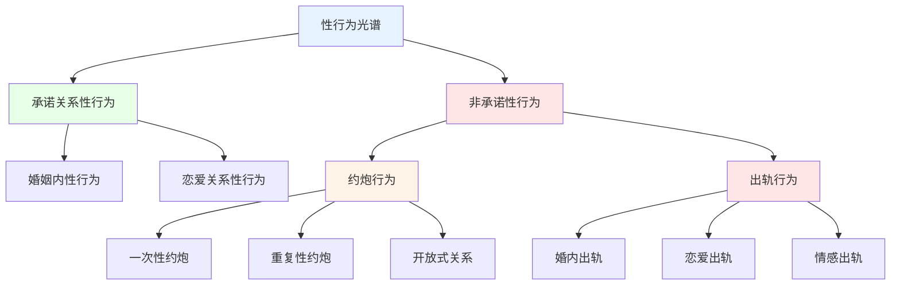

# 约炮与出轨对关系影响的综合分析 (Comprehensive Analysis of Casual Sex and Infidelity Impact on Relationships)

## 关系影响的比较分析框架

### 核心概念的区别与联系

#### 定义域的精确界定

**概念关系图谱：**

#### 关键区别维度

| 比较维度 | 约炮行为 | 出轨行为 | 核心差异 |
|---------|---------|---------|---------|
| **前提条件** | 无承诺关系预期 | 存在承诺关系 | 是否违背约定 |
| **知情同意** | 双方明确同意 | 一方隐瞒欺骗 | 透明度差异 |
| **关系状态** | 独立的性关系 | 附属的背叛行为 | 关系性质不同 |
| **道德评价** | 相对中性 | 负面评价为主 | 社会规范差异 |
| **法律后果** | 一般无法律影响 | 可能涉及法律问题 | 法律地位不同 |

### 心理机制的相似性与差异

#### 共同的心理驱动因素

**重叠动机系统：**
1. **生物性驱动**
   - 性欲满足的基本需求
   - 多巴胺奖励系统的激活
   - 进化心理学的繁殖策略

2. **心理性需求**
   - 亲密连接的渴望
   - 自我验证的需求
   - 新奇体验的追求

3. **社会性因素**
   - 同伴群体的影响
   - 文化价值观的作用
   - 技术便利性的推动

#### 关键机制差异

| 机制维度 | 约炮行为特征 | 出轨行为特征 | 心理复杂度 |
|---------|-------------|-------------|-----------|
| **动机纯洁性** | 相对单纯(主要是性) | 复杂混合(多种需求) | 出轨更高 |
| **道德冲突** | 相对较少内在冲突 | 显著的价值观冲突 | 出轨更高 |
| **关系影响** | 独立关系，影响有限 | 破坏原有关系基础 | 出轨更严重 |
| **情感卷入** | 通常保持理性距离 | 容易产生深度情感 | 出轨更复杂 |

## 对不同类型关系的影响模式

### 对单身人群的影响

#### 约炮行为的积极作用

**健康发展功能：**
1. **性健康教育实践**
   - 安全性行为的实际学习
   - 性沟通技能的发展
   - 边界设定能力的锻炼

2. **自我认知深化**
   - 性偏好的明确了解
   - 吸引力的认知校准
   - 关系期望的现实化

3. **社交技能提升**
   - 约会技巧的实际应用
   - 拒绝和协商能力
   - 情感管理经验积累

#### 潜在风险与预防

**主要风险因子：**
- 情感混淆和依恋混乱
- 安全意识的麻痹
- 社会评价压力
- 自我价值感的波动

### 对恋爱关系的影响

#### 约炮行为在恋爱中的复杂性

**情境依赖性影响：**
1. **开放关系框架下**
   - 可能增进关系满意度
   - 需要高度的沟通技巧
   - 考验关系边界管理

2. **传统恋爱关系中**
   - 通常构成关系威胁
   - 可能导致信任危机
   - 影响关系发展方向

#### 出轨行为的破坏性影响

**关系损伤机制：**
1. **信任基础瓦解**
   - 安全感的瞬间丧失
   - 预测性的根本动摇
   - 关系稳定性的摧毁

2. **情感创伤传导**
   - 被背叛者的深度痛苦
   - 关系双方的二次创伤
   - 情感连接的断裂

3. **系统功能紊乱**
   - 沟通模式的瘫痪
   - 亲密行为的停滞
   - 共同目标的迷失

### 对婚姻关系的冲击

#### 出轨的独特破坏力

**婚姻特有的脆弱性：**
1. **制度性承诺的违背**
   - 法律和社会契约的违反
   - 长期投资的突然贬值
   - 社会角色的混乱

2. **多重利益的冲突**
   - 经济利益的重新分配
   - 子女抚养权的争夺
   - 社会声誉的损害

3. **深层心理创伤**
   - 核心信念体系的崩塌
   - 人生叙事的重新编写
   - 身份认同的根本质疑

#### 约炮行为在婚姻中的禁忌性

**绝对禁止的原因：**
- 违背婚姻独占性原则
- 构成法律意义上的背叛
- 造成不可逆的信任损害

## 影响的中介和调节因素

### 个体差异的调节作用

#### 人格特质的影响

**缓冲与加剧因子：**
| 人格维度 | 缓冲作用 | 加剧作用 | 机制解释 |
|---------|---------|---------|---------|
| **情绪稳定性** | 更好地处理挫折 | 更强烈的负面反应 | 情绪调节能力差异 |
| **开放性** | 更灵活的适应 | 更容易合理化 | 认知灵活性影响 |
| **责任心** | 更负责任的行为 | 更深的自责感 | 道德标准的作用 |
| **宜人性** | 更多的宽恕倾向 | 更深的受伤感 | 同理心水平影响 |

#### 依恋风格的调节效应

**不同依恋类型的表现：**
1. **安全型依恋**
   - 约炮：相对健康的探索
   - 出轨：较少发生，影响可控

2. **焦虑型依恋**
   - 约炮：容易产生情感混淆
   - 出轨：创伤反应更加严重

3. **回避型依恋**
   - 约炮：符合行为模式预期
   - 出轨：可能缺乏悔恨意识

### 关系质量的中介作用

#### 关系基础的调节效应

**关系强度的影响：**
| 关系特征 | 对约炮的影响 | 对出轨的影响 | 作用机制 |
|---------|-------------|-------------|---------|
| **满意度水平** | 满意度高减少约炮动机 | 满意度低增加出轨风险 | 需求满足程度 |
| **沟通质量** | 良好沟通减少误解 | 沟通不良掩盖问题 | 信息传递效率 |
| **承诺强度** | 承诺强减少约炮行为 | 承诺弱增加出轨可能 | 违背成本考量 |
| **亲密程度** | 适度亲密减少外部寻求 | 亲密缺失增加背叛风险 | 情感满足度 |

#### 时间因素的动态影响

**关系发展阶段的作用：**
1. **初期阶段(0-2年)**
   - 约炮：探索性质较强
   - 出轨：破坏性相对较小

2. **中期阶段(2-10年)**
   - 约炮：可能威胁关系稳定
   - 出轨：造成中等程度伤害

3. **长期阶段(10年以上)**
   - 约炮：几乎不可能发生
   - 出轨：造成最严重创伤

### 社会文化背景的调节

#### 文化价值观的影响

**不同文化下的反应差异：**
1. **个人主义文化**
   - 对约炮相对宽容
   - 对出轨谴责相对温和
   - 强调个人选择权利

2. **集体主义文化**
   - 对约炮较为严厉
   - 对出轨谴责极其严厉
   - 重视关系和谐稳定

#### 社会支持系统的调节

**支持网络的作用：**
- 强大的社会支持减轻负面影响
- 缺乏支持加剧创伤反应
- 同伴群体态度的重要影响

## 长期发展轨迹分析

### 个人成长路径

#### 积极转化的可能性

**创伤后成长机制：**
1. **自我认知深化**
   - 对自身需求的更好理解
   - 价值观的重新审视
   - 边界意识的增强

2. **关系智慧发展**
   - 沟通技能的实质性提升
   - 冲突处理能力的增强
   - 亲密关系质量的改善

3. **心理韧性的建立**
   - 应对挫折能力的提高
   - 情绪调节技能的发展
   - 未来关系的谨慎选择

#### 持续困扰的风险

**慢性影响表现：**
- 长期的信任障碍
- 亲密关系的回避倾向
- 反复的关系模式重现
- 持续的自我价值怀疑

### 关系演进模式

#### 修复成功的条件

**关系重生的关键因素：**
1. **双方的努力程度**
   - 出轨方的真诚悔改
   - 被出轨方的宽恕意愿
   - 持续的共同努力

2. **专业支持的获得**
   - 及时的专业治疗介入
   - 系统的家庭治疗
   - 长期的跟踪支持

3. **时间因素的充分性**
   - 足够的修复时间
   - 渐进式的信任重建
   - 稳定的进展节奏

#### 关系终结的趋势

**分手的预测因子：**
- 出轨行为的重复性
- 核心价值观的根本冲突
- 修复努力的彻底失败
- 外部压力的不可承受

### 系统性影响的扩散

#### 对社交网络的影响

**关系圈层的连锁反应：**
1. **直接社交圈**
   - 朋友圈的重新组合
   - 社交活动的调整
   - 群体动态的变化

2. **工作环境影响**
   - 职场关系的复杂化
   - 职业发展的潜在影响
   - 工作表现的短期波动

3. **社区关系变化**
   - 社区地位的重新定位
   - 社会支持网络的重建
   - 文化认同的调整

#### 对子女发展的长远影响

**代际传递效应：**
1. **短期影响(0-2年)**
   - 情绪安全感的暂时缺失
   - 日常生活节奏的改变
   - 照顾质量的可能下降

2. **中期影响(2-10年)**
   - 关系模式的学习偏差
   - 依恋风格的潜在改变
   - 价值观念的混乱期

3. **长期影响(10年以上)**
   - 成年关系模式的形成
   - 婚姻观念的根本影响
   - 亲子关系的质量走向

## 预防与干预策略

### 风险评估工具

#### 早期预警系统

**个人风险评估指标：**
- 情感需求的外部寻求倾向
- 对现有关系的持续不满
- 道德边界的模糊化思考
- 冲动控制能力的下降迹象

#### 关系健康度监测

**关系质量评估维度：**
- 沟通开放性和有效性
- 情感连接的深度和稳定性
- 冲突处理的建设性程度
- 共同目标的一致性水平

### 干预时机选择

#### 最佳干预窗口

**关键时间节点：**
1. **预防性干预**
   - 关系建立初期
   - 重大转变期前后
   - 风险因素出现时

2. **早期干预**
   - 问题刚显现时
   - 第一次危机出现
   - 沟通障碍初现

3. **危机干预**
   - 出轨行为发生后
   - 严重冲突爆发时
   - 安全受到威胁时

### 综合干预方案

#### 多层次干预策略

**系统性干预框架：**
1. **个体层面**
   - 自我觉察能力提升
   - 情绪管理技能培训
   - 价值观澄清工作

2. **关系层面**
   - 沟通模式改善
   - 亲密技能重建
   - 冲突解决训练

3. **系统层面**
   - 家庭功能优化
   - 社会支持强化
   - 文化环境改善

#### 个性化适配原则

**因人因关系而异：**
- 考虑发展阶段特点
- 尊重文化背景差异
- 适应个性特征需求
- 匹配关系类型特色

---

*本分析基于系统家庭治疗理论、依恋理论和创伤学的综合视角，为理解约炮和出轨行为对各类关系的影响提供了全面的理论框架和实践指导。*