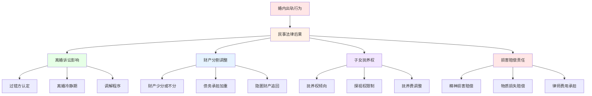

# 约炮与出轨的法律与伦理考量 (Legal and Ethical Considerations for Casual Sex and Infidelity)

## 法律框架分析

### 婚姻法相关法律规定

#### 婚内出轨的法律后果

**民事法律后果：**


**刑事法律风险：**
| 行为类型 | 可能罪名 | 构成要件 | 法律后果 | 防范要点 |
|---------|---------|---------|---------|---------|
| **重婚行为** | 重婚罪 | 有配偶而与他人结婚 | 2年以下有期徒刑 | 明确婚姻状态 |
| **破坏军婚** | 破坏军婚罪 | 明知对方为现役军人配偶 | 3年以下有期徒刑 | 核实对方身份 |
| **传播性病** | 传播性病罪 | 明知患有严重性病仍进行性行为 | 各地标准不一 | 定期健康检查 |
| **性骚扰** | 强制猥亵罪 | 违背他人意愿的性接触 | 5年以下有期徒刑 | 明确同意原则 |

#### 约炮行为的法律边界

**合法与违法的界限：**
| 行为特征 | 法律状态 | 风险等级 | 注意事项 |
|---------|---------|---------|---------|
| **成年人自愿** | 完全合法 | 低 | 确认年龄和意愿 |
| **未成年人参与** | 严重违法 | 极高 | 绝对禁止参与 |
| **有偿性交易** | 卖淫嫖娼 | 高 | 各地执法标准不同 |
| **公共场所** | 扰乱秩序 | 中 | 选择合适场所 |
| **欺诈胁迫** | 强奸罪等 | 极高 | 确保真实同意 |

### 合同与协议法律效力

#### 婚前协议的约束力

**协议有效性要素：**
```
有效婚前协议必须满足：
□ 双方完全自愿签署
□ 内容不违反法律法规
□ 条款公平合理
□ 形式符合法律要求
□ 不存在欺诈胁迫情形
```

**出轨条款的法律地位：**
- **惩罚性条款**：通常不被法院支持
- **财产分割约定**：在合理范围内有效
- **子女抚养安排**：需符合儿童最大利益原则
- **精神损害赔偿**：可在离婚诉讼中另行主张

#### 开放关系协议的法律风险

**协议内容建议：**
```
开放关系协议应当包括：
1. 明确的定义和边界
2. 安全措施的具体要求
3. 健康检查的频率标准
4. 情感支持的承诺内容
5. 退出机制的设计
6. 争议解决的方式
```

**法律风险提示：**
- 协议难以对抗第三人权益
- 不能免除法定的忠实义务
- 可能影响离婚财产分割
- 对子女抚养权判定有限

### 隐私权与信息披露

#### 个人信息保护

**数字时代的隐私风险：**
| 信息类型 | 泄露风险 | 法律保护 | 防范措施 |
|---------|---------|---------|---------|
| **通讯记录** | 高 | 侵犯隐私权 | 使用加密通讯 |
| **位置信息** | 中高 | 侵犯隐私权 | 关闭位置共享 |
| **照片视频** | 极高 | 肖像权保护 | 谨慎拍摄分享 |
| **健康信息** | 高 | 医疗隐私保护 | 选择正规机构 |

**证据收集的合法性：**
- 私自录音录像的证据效力有限
- 通过非法手段获取的证据可能无效
- 建议通过合法途径收集证据
- 专业律师指导下进行证据保全

## 伦理道德框架

### 专业伦理准则

#### 心理咨询师伦理规范

**多重关系避免：**
```
心理咨询师应当：
□ 避免与来访者发展恋爱关系
□ 不参与来访者的约炮或出轨行为
□ 保持专业边界和客观立场
□ 及时转介存在利益冲突的案例
□ 定期接受督导和伦理培训
```

**保密原则的平衡：**
- 一般情况下严格保密
- 涉及自杀或伤害他人时必须打破保密
- 未成年保护的特殊情况
- 法律强制披露的情形

#### 医疗从业者伦理要求

**医患关系伦理：**
- 避免与患者发展超越治疗关系的关系
- 保护患者隐私和尊严
- 提供客观中立的专业建议
- 不将自己的价值观强加给患者

### 社会伦理考量

#### 个人责任与社会责任

**道德责任层次：**
1. **对自己负责**
   - 诚实面对内心需求
   - 承担行为后果
   - 维护身心健康
   - 尊重他人权益

2. **对伴侣负责**
   - 履行承诺和约定
   - 诚实沟通需求
   - 尊重对方感受
   - 共同维护关系

3. **对家庭负责**
   - 考虑对子女的影响
   - 维护家庭和谐稳定
   - 承担相应的经济责任
   - 保护家庭成员权益

4. **对社会负责**
   - 遵守公序良俗
   - 不传播不良风气
   - 维护社会稳定
   - 促进健康发展

#### 文化价值观冲突

**传统与现代的平衡：**
- 尊重传统文化价值
- 理解现代社会变迁
- 寻找个人价值观与社会期待的平衡点
- 在坚持原则的基础上保持开放包容

## 职业伦理应用

### 教育工作者伦理

#### 学术诚信要求

**师生关系边界：**
- 避免发展超越师生关系的关系
- 保持专业和客观的教学态度
- 公平对待所有学生
- 避免利益冲突

**学术研究伦理：**
- 研究对象的知情同意
- 个人隐私的严格保护
- 研究结果的客观报告
- 避免研究中的偏见和歧视

### 企业管理伦理

#### 职场关系规范

**上下级关系准则：**
```
职场关系应当遵循：
□ 避免发展不适当的亲密关系
□ 保持专业的工作态度
□ 公平公正的管理原则
□ 避免利益输送和裙带关系
□ 建立透明的举报机制
```

**同事关系边界：**
- 尊重个人隐私和选择
- 避免办公室恋情的负面影响
- 建立健康的工作氛围
- 处理好工作与私人感情的平衡

### 媒体传播伦理

#### 新闻报道原则

**事实准确性：**
- 确保信息来源可靠
- 避免传播未经证实的消息
- 尊重当事人隐私权
- 避免煽动性报道

**价值导向责任：**
- 传播正确的价值观念
- 避免美化不当行为
- 承担社会教育责任
- 促进健康文化发展

## 特殊情况伦理处理

### 未成年人保护

#### 法律特殊保护

**未成年人权益保障：**
- 严格的年龄核实义务
- 特殊的保护措施要求
- 更重的法律责任承担
- 社会监督机制加强

**教育引导责任：**
- 性教育的科学普及
- 价值观的正确引导
- 自我保护意识培养
- 健康关系模式示范

### 特殊群体关怀

#### 残障人士权益

**平等尊重原则：**
- 不因其残障而歧视
- 提供必要的支持和帮助
- 尊重其自主选择权利
- 创造包容的社会环境

#### 老年人群体

**尊严保障要求：**
- 尊重其生活选择
- 提供适当的关爱
- 防范各种形式的欺骗
- 维护其合法权益

## 争议解决机制

### 调解与仲裁

#### 专业调解服务

**调解程序优势：**
- 保护隐私，避免公开审理
- 程序灵活，效率较高
- 成本相对较低
- 有利于关系修复

**调解适用情形：**
- 双方都有和解意愿
- 争议金额相对较小
- 希望维持关系和谐
- 需要专业指导帮助

#### 仲裁机制选择

**仲裁特点：**
- 程序相对简化
- 专家裁决更具专业性
- 一裁终局，效率高
- 但仍具有法律约束力

### 司法诉讼程序

#### 民事诉讼流程

**起诉准备阶段：**
```
起诉前准备工作：
□ 收集和固定相关证据
□ 确定合适的诉讼请求
□ 选择有管辖权的法院
□ 准备起诉状和证据材料
□ 考虑是否需要律师代理
```

**庭审要点注意：**
- 陈述事实要客观真实
- 举证要有充分的证据支撑
- 答辩要针对对方主张
- 遵守法庭纪律和程序

#### 刑事诉讼程序

**报案与立案：**
- 及时向公安机关报案
- 提供详细的案件经过
- 配合公安机关调查取证
- 必要时申请法律援助

**刑事辩护要点：**
- 如实供述案件事实
- 积极配合司法机关
- 委托专业刑事律师
- 争取从轻处罚情节

## 预防性法律建议

### 合同文书准备

#### 婚前财产协议

**协议主要内容：**
```
婚前协议应当包括：
1. 双方基本信息确认
2. 婚前财产清单明细
3. 婚后财产归属约定
4. 债务承担方式明确
5. 出轨行为的后果约定
6. 协议变更和解除条件
7. 争议解决机制设计
```

**签署注意事项：**
- 选择合适的时机签署
- 确保双方充分理解内容
- 避免显失公平的条款
- 建议公证增加法律效力

#### 分居协议书

**分居期间约定：**
- 财产管理和使用安排
- 子女抚养和探视安排
- 债务承担和清偿责任
- 通信和见面的频率规定
- 分居期限和解除条件

### 风险防范措施

#### 日常行为规范

**降低法律风险的行为准则：**
```
日常行为建议：
□ 保持清醒的理性判断
□ 避免酒后冲动行为
□ 建立明确的边界意识
□ 定期进行健康检查
□ 保留必要的证据材料
□ 及时寻求专业帮助
```

#### 危机处理预案

**突发情况应对：**
- 立即停止不当行为
- 保护现场和证据
- 及时咨询专业律师
- 配合相关部门调查
- 积极承担责任

---

*本文件旨在提供约炮与出轨相关的法律与伦理指导，具体案件建议咨询专业律师获得针对性的法律建议。*