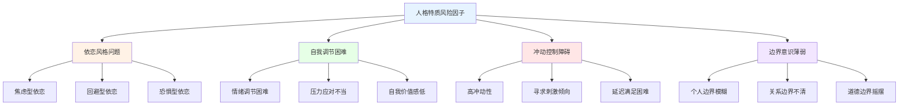
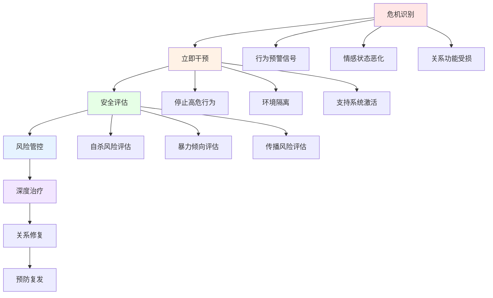
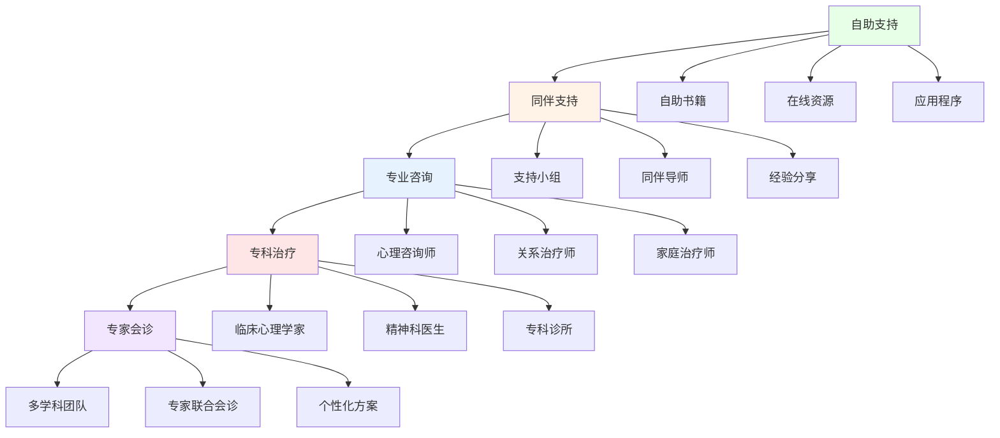

# 约炮与出轨预防干预指南 (Prevention and Early Intervention Guide for Casual Sex and Infidelity)

## 预防框架概述

### 风险因素识别与评估体系

#### 个体层面风险因子

**人格特质相关风险：**


**风险评估量表：**

| 风险维度 | 评估指标 | 高风险阈值 | 中风险阈值 | 低风险阈值 | 干预优先级 |
|---------|---------|-----------|-----------|-----------|-----------|
| **依恋不安全** | ECR-R焦虑/回避得分 | >3.5 | 2.5-3.5 | <2.5 | 高 |
| **冲动控制** | BIS冲动量表 | >2.8 | 2.0-2.8 | <2.0 | 高 |
| **边界模糊** | 关系边界问卷 | >3.2 | 2.4-3.2 | <2.4 | 中 |
| **道德弹性** | 道德推理测试 | <2.0 | 2.0-3.0 | >3.0 | 中 |
| **关系满意度** | RELISH量表 | <2.5 | 2.5-3.5 | >3.5 | 高 |

#### 关系层面预警信号

**关系质量风险指标：**
| 预警信号 | 表现特征 | 风险等级 | 干预策略 |
|---------|---------|---------|---------|
| **沟通障碍** | 回避冲突、缺乏深度交流 | 高 | 沟通技能培训 |
| **亲密疏离** | 身体接触减少、情感距离增大 | 高 | 亲密技能重建 |
| **价值观分歧** | 核心价值观念严重冲突 | 高 | 价值观协调工作 |
| **承诺模糊** | 关系边界和未来规划不明确 | 中 | 承诺意识培养 |
| **外部诱惑** | 社交圈复杂、接触机会增多 | 中 | 环境管理策略 |

### 预防干预层级模型

#### 一级预防：普遍性预防

**目标人群：** 所有处于恋爱或婚姻关系中的个体

**核心策略：**
1. **关系健康教育**
   - 健康关系特征的标准建立
   - 沟通技巧的基础培训
   - 边界意识的早期培养
   - 冲突处理的基本原则

2. **自我认知发展**
   - 依恋风格的自我评估
   - 个人价值观澄清
   - 情绪调节技能训练
   - 压力管理能力提升

3. **风险意识培养**
   - 诱惑识别能力训练
   - 道德决策框架建立
   - 后果预见性思维
   - 自我保护意识强化

#### 二级预防：选择性预防

**目标人群：** 具有中高等风险因子的个体或关系

**识别标准：**
- 关系满意度低于平均水平
- 存在明显的沟通障碍
- 依恋风格存在不安全特征
- 面临重大生活转变期

**干预措施：**
1. **关系强化训练**
   ```
   核心技能模块：
   □ 深度倾听技巧 (4周)
   □ 情感表达训练 (4周)
   □ 建设性冲突解决 (6周)
   □ 亲密行为增进 (8周)
   ```

2. **风险情境管理**
   - 工作环境诱惑识别
   - 社交场合边界维护
   - 数字媒体使用规范
   - 外出活动安全策略

3. **支持系统建设**
   - 信任朋友网络建立
   - 家庭支持资源整合
   - 专业咨询渠道开通
   - 同伴互助小组参与

#### 三级预防：针对性干预

**目标人群：** 已出现高风险行为或轻微违规的个体

**危机识别信号：**
- 频繁的外部关系试探
- 对现有关系的持续不满
- 道德边界的明显松动
- 侥幸心理的显著增强

**紧急干预流程：**


## 具体预防策略

### 个人层面预防技术

#### 自我觉察增强训练

**每日反思练习：**
```
晚间自我检查清单：
□ 今天的决定是否符合我的核心价值观？
□ 我是否面临了任何诱惑或考验？
□ 我的边界是否得到了有效维护？
□ 我与伴侣的关系质量有何变化？
□ 我的情绪状态是否稳定健康？
```

**风险情境预演：**
- 设想可能的诱惑场景
- 制定具体的应对策略
- 练习拒绝和撤离技巧
- 建立紧急联系人网络

#### 情绪调节技能发展

**核心技能训练包：**
1. **正念情绪觉察**
   - 身体感觉扫描练习
   - 情绪标签命名训练
   - 触发因素识别技术

2. **认知重构技巧**
   - 自动思维识别
   - 替代性解释生成
   - 现实检验验证

3. **行为调节策略**
   - 暂停反应技术
   - 延迟满足练习
   - 替代行为培养

### 关系层面强化策略

#### 沟通质量提升计划

**周度沟通仪式：**
```
星期日深度对话时间 (60分钟)：
1. 本周关系满意度评分 (1-10分)
2. 最满意和最不满意的事情分享
3. 需要改进的方面讨论
4. 下周关系目标设定
5. 具体行动计划制定
```

**沟通技能训练模块：**
- 积极倾听技巧强化
- "我信息"表达法练习
- 非暴力沟通原则应用
- 情感验证技能发展

#### 亲密关系维护系统

**月度亲密检查：**
| 维度 | 评估项目 | 理想状态 | 改进策略 |
|------|----------|----------|----------|
| **情感亲密** | 深度分享频率 | 每周3次以上 | 安排专门分享时间 |
| **身体亲密** | 身体接触质量 | 温暖舒适的接触 | 增加拥抱亲吻频率 |
| **精神亲密** | 价值观一致性 | 高度契合 | 定期价值观讨论 |
| **体验亲密** | 共同活动数量 | 每周2次以上 | 计划共同兴趣活动 |

### 环境层面管理措施

#### 诱惑管理策略

**环境风险评估：**
```
工作场所风险等级评定：
□ 低风险：独立办公室、明确边界
□ 中风险：开放办公、频繁社交
□ 高风险：频繁出差、客户接触多
□ 极高风险：酒吧娱乐、深夜加班

应对策略匹配：
低风险：维持现状，定期检查
中风险：建立边界规则，增加透明度
高风险：环境调整，寻求岗位变动
极高风险：立即行动，寻求专业帮助
```

**数字环境管理：**
- 社交媒体使用边界设定
- 约炮应用的识别和屏蔽
- 网络聊天的风险评估
- 数字足迹的定期清理

#### 支持网络建设

**多层次支持系统：**
1. **核心支持圈**
   - 信任的亲密朋友(2-3人)
   - 家庭核心成员(父母/兄弟姐妹)
   - 专业咨询师(定期联系)

2. **扩展支持网**
   - 同伴支持小组
   - 社区活动参与
   - 兴趣爱好社群
   - 志愿服务网络

3. **专业支持资源**
   - 心理咨询服务
   - 关系治疗师
   - 精神科医生
   - 法律咨询顾问

## 早期干预技术

### 危机识别与响应

#### 预警信号监测系统

**个人行为预警：**
- 情绪状态的显著变化
- 对伴侣态度的突然转变
- 社交行为模式的异常
- 价值观表述的矛盾

**关系动态预警：**
- 沟通频率和质量下降
- 亲密行为的明显减少
- 冲突模式的根本改变
- 共同活动的急剧减少

#### 快速响应协议

**24小时内行动清单：**
1. **立即安全措施**
   - 停止所有高风险接触
   - 删除可疑联系方式
   - 增加与伴侣的正面互动

2. **支持系统激活**
   - 联系信任的朋友或家人
   - 预约专业咨询师
   - 参加支持小组活动

3. **自我反思启动**
   - 记录触发事件和感受
   - 分析风险因素和个人需求
   - 制定短期安全计划

### 修复性干预措施

#### 认知重构工作坊

**核心信念矫正：**
```
常见错误信念及其修正：

错误信念1："这只是为了满足生理需求"
修正认知：生理需求可以通过健康方式满足，无需背叛

错误信念2："我的伴侣不够理解我"
修正认知：沟通不足可以改善，背叛只会制造更大问题

错误信念3："没有人会发现的"
修正认知：隐瞒行为本身就在破坏关系基础

错误信念4："我可以控制不会深入发展"
修正认知：情感发展不受理性控制，容易失控
```

#### 行为改变计划

**30天行为重塑方案：**
```
第1周：基础稳定期
□ 每日冥想练习(10分钟)
□ 与伴侣深度对话(30分钟)
□ 记录情绪日记
□ 避免单独与异性的长时间接触

第2周：技能发展期
□ 学习新的沟通技巧
□ 练习情感表达
□ 参与夫妻活动
□ 建立健康的压力释放方式

第3周：关系强化期
□ 增加身体亲密接触
□ 共同制定未来规划
□ 解决积压的小矛盾
□ 培养共同兴趣爱好

第4周：巩固提升期
□ 评估改善效果
□ 制定长期维护计划
□ 建立预防复发机制
□ 寻求专业反馈意见
```

## 长期维护机制

### 持续监测系统

#### 定期评估工具

**季度关系健康检查：**
| 评估维度 | 测量工具 | 评估频率 | 干预阈值 |
|---------|---------|---------|---------|
| **整体满意度** | 关系满意度量表 | 每季度 | <3.0分 |
| **沟通质量** | 沟通模式问卷 | 每季度 | <2.5分 |
| **亲密程度** | 亲密关系量表 | 每季度 | <3.5分 |
| **冲突处理** | 冲突解决问卷 | 每季度 | <2.0分 |
| **依恋安全** | 依恋风格量表 | 每半年 | 焦虑/回避>3.0 |

#### 预防复发计划

**年度预防策略更新：**
1. **风险因素重新评估**
   - 个人发展变化
   - 关系状态演变
   - 环境条件改变
   - 社会支持更新

2. **预防策略调整**
   - 基于新风险的针对性措施
   - 技能训练重点转移
   - 支持系统优化
   - 应急预案完善

3. **成长目标设定**
   - 关系深化方向
   - 个人发展重点
   - 共同目标协调
   - 长期愿景规划

### 专业支持网络

#### 多层次服务体系

**基础支持层：**
- 自助资源和工具
- 同伴支持小组
- 在线教育课程
- 社区活动参与

**专业服务层：**
- 个体心理咨询
- 夫妻关系治疗
- 家庭系统治疗
- 团体治疗项目

**专家支持层：**
- 临床心理专家
- 关系治疗大师
- 精神科医生
- 法律顾问专家

#### 转介机制建设

**服务转介流程：**


---

*本预防指南基于循证实践和临床经验，旨在为个人和关系提供系统性的预防和早期干预框架。建议根据具体情况灵活调整和个性化应用。*