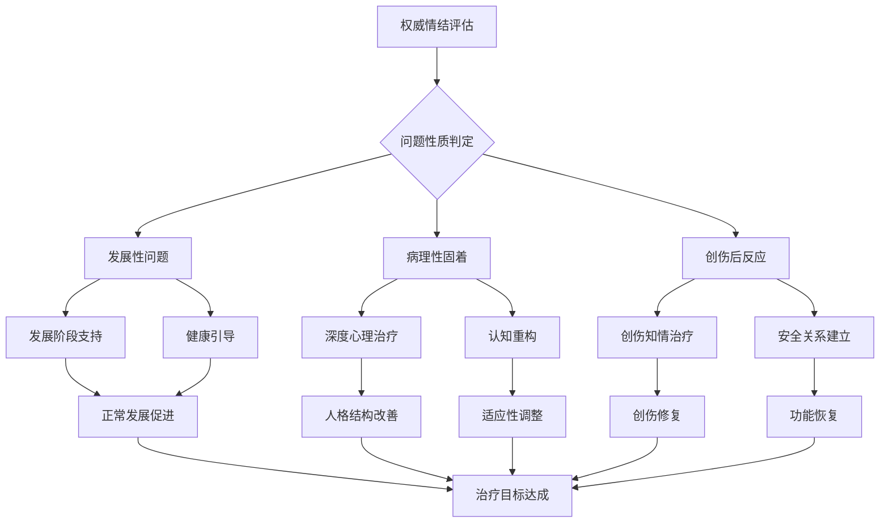

# Authority Complex & Age-Related Attraction Disorders (权威情结与年龄相关吸引障碍)

> 📘 **文档导航**: 本概览文档提供权威情结与年龄相关吸引障碍的核心概念和整体框架。如需深入了解特定领域，请参考相应专题文档：
> - [恋父恋母情结](Father_Mother_Complex.md) - 俄狄浦斯情结的现代理解与发展
> - [恋师恋教练情结](Teacher_Coach_Complex.md) - 教育与体育环境中的权威吸引
> - [年龄差异吸引](Age_Attraction_Complex.md) - 年长/年幼异性吸引的心理机制
> - [权威恐惧情结](Authority_Fear_Complex.md) - 对权威人物的恐惧与回避
> - [临床评估与治疗](Clinical_Assessment_Treatment.md) - 专业诊断标准与干预方法
> - [发展心理学基础](Developmental_Foundations.md) - 理论框架与神经生物学机制

## 核心术语表 (Core Terminology)

| 术语 (中文) | 英文名 (English Term) | 原始语言/术语 (Original Language) | 精确定义 (Technical Definition) | 区分与备注 (Differentiation & Notes) | 专业视角 (Professional Perspective) |
| :--- | :--- | :--- | :--- | :--- | :--- |
| **权威情结** | Authority Complex | 拉丁: *Auctoritas* (权威) + 希腊: *Plexus* (情结) | 个体对权威人物（父母、教师、领导者）产生强烈的依恋、崇拜或恐惧等复杂情感反应的心理模式。 | 包含积极的恋慕和消极的恐惧两种极性，可能表现为适应性或病理性。 | 需要在发展背景中理解，区分正常发展阶段与病理固着。 |
| **俄狄浦斯情结** | Oedipus Complex | 希腊: *Oidípous* (俄狄浦斯) | 弗洛伊德提出的儿童性心理发展阶段理论，描述3-6岁儿童对异性父母的性吸引和对同性父母的竞争心理。 | 现代观点认为这是正常发展过程的一部分，过度固着才成为问题。 | 重要的发展里程碑，涉及性别认同和道德内化。 |
| **权威移情** | Authority Transference | 德: *Übertragung* (移情) | 在治疗或教育关系中，来访者将对早期权威人物（父母、老师）的情感和态度转移到当前权威人物身上。 | 不同于一般移情，专门指向权威角色的复杂情感转移。 | 治疗中的重要现象，需要专业处理以促进成长。 |
| **年龄吸引障碍** | Age-Related Attraction Disorder | 英: Age Preference Disorder | 对特定年龄段人群产生持续性、强烈的性或情感吸引，超出正常年龄偏好的范围并可能造成功能损害。 | 区分正常的年龄偏好与达到病理程度的固定模式。 | 需要考虑文化背景和社会规范的差异性。 |
| **权威恐惧症** | Authority Phobia | 希腊: *Phóbos* (恐惧) + 拉丁: *Auctoritas* (权威) | 对权威人物或权威情境产生过度、非理性的恐惧反应，严重影响社会功能和个人发展。 | 与一般的紧张或敬畏不同，达到临床显著的恐惧水平。 | 常与早期创伤经历或依恋创伤相关联。 |

## 分类体系框架 (Classification Framework)

### 按吸引对象分类
| 类型 | 核心特征 | 典型表现 | 发展阶段关联 | 临床意义 |
| :--- | :--- | :--- | :--- | :--- |
| **恋父情结** | 对父亲形象的理想化依恋 | 寻找类似父亲的伴侣、对年长男性有特殊好感 | 俄狄浦斯期(3-6岁) | 正常发展vs病理固着的鉴别关键 |
| **恋母情结** | 对母亲形象的深度情感依赖 | 过度寻求母性关怀、难以建立平等关系 | 俄狄浦斯期(3-6岁) | 影响成年期亲密关系质量 |
| **恋师情结** | 对教育权威的崇拜与依恋 | 理想化老师、过度寻求认可、师生边界模糊 | 学龄期(6-12岁) | 涉及教育伦理和专业边界 |
| **恋教练情结** | 对体育指导者的特殊情感 | 运动依赖、英雄化教练、训练关系超越专业范畴 | 青春期(12-18岁) | 可能影响竞技表现和身心发展 |

### 按情感极性分类
| 极性类型 | 情感特征 | 行为表现 | 心理机制 | 治疗重点 |
| :--- | :--- | :--- | :--- | :--- |
| **积极极性** | 崇拜、依恋、理想化 | 主动接近、寻求关注、情感投入 | 正向移情、补偿机制 | 引导健康发展、建立现实认知 |
| **消极极性** | 恐惧、回避、敌对 | 逃避接触、抗拒权威、叛逆行为 | 创伤反应、防御机制 | 处理恐惧根源、重建安全感 |
| **矛盾极性** | 爱恨交织、推拉模式 | 既渴望又恐惧、反复试探边界 | 未解决冲突、内在分裂 | 整合对立情感、促进心理统一 |

## 发展心理学理论矩阵 (Developmental Theory Matrix)

| 理论流派 | 核心假设 | 关键发展阶段 | 形成机制 | 临床应用 |
| :--- | :--- | :--- | :--- | :--- |
| **弗洛伊德精神分析** | 早期性心理发展阶段决定成人人格 | 口欲期→肛欲期→性器期→潜伏期→生殖期 | 俄狄浦斯情结的解决与否影响人格发展 | 移情分析、自由联想治疗 |
| **客体关系理论** | 早期与照顾者的关系模式内化为内在工作模型 | 依恋关系建立期(0-3岁) | 内部客体关系的质量决定对外界关系的期待 | 客体关系治疗、矫正性情感体验 |
| **依恋理论** | 早期依恋模式影响终生关系模式 | 安全型/焦虑型/回避型/紊乱型依恋 | 依恋风格的代际传递和稳定性 | 依恋聚焦治疗、关系修复 |
| **社会学习理论** | 通过观察和模仿学习社会行为 | 关键期学习(各年龄段) | 权威人物作为榜样和强化源的作用 | 行为矫正、榜样示范 |
| **认知发展理论** | 认知结构的发展决定社会认知能力 | 感知运动期→前运算期→具体运算期→形式运算期 | 抽象思维能力影响对权威的理解 | 认知重构、思维训练 |

## 神经生物学机制框架 (Neurobiological Mechanisms Framework)

| 系统层面 | 核心机制 | 相关脑区 | 神经递质 | 研究证据 | 临床意义 |
| :--- | :--- | :--- | :--- | :--- | :--- |
| **依恋系统** | 安全基地寻求和分离焦虑调节 | 前额叶皮层、杏仁核、海马 | 催产素、血管加压素 | fMRI显示母婴互动激活奖励回路 | 理解依恋障碍的生物学基础 |
| **奖励系统** | 权威人物相关的正强化机制 | 腹侧纹状体、VTA、前扣带回 | 多巴胺、血清素 | 权威认可激活多巴胺释放 | 解释权威崇拜的心理强化机制 |
| **恐惧系统** | 对权威威胁的警觉和回避反应 | 杏仁核、下丘脑、脑干 | GABA、去甲肾上腺素 | 创伤经历改变HPA轴反应性 | 理解权威恐惧的神经基础 |
| **镜像神经元系统** | 模仿和共情权威人物行为 | 前运动皮层、顶下小叶 | 谷氨酸、GABA | 观察学习的神经机制 | 解释权威移情的学习基础 |
| **执行控制系统** | 冲动控制和边界维持能力 | 背外侧前额叶、前扣带回 | 多巴胺、去甲肾上腺素 | 执行功能受损影响关系边界 | 指导治疗中的自我调节训练 |

## 流行病学数据概览 (Epidemiological Overview)

| 研究维度 | 数据来源 | 样本特征 | 关键发现 | 方法学考虑 | 临床启示 |
| :--- | :--- | :--- | :--- | :--- | :--- |
| **恋父情结** | 发展心理学纵向研究(n=1,200) | 3-18岁儿童青少年 | 75%的儿童经历正常俄狄浦斯阶段，5-8%出现病理固着 | 回忆报告可能存在偏差 | 早期识别和干预的重要性 |
| **恋师情结** | 教育心理学调查(n=850) | 中学生群体 | 30%报告对某位老师有特殊情感，3-5%影响学业表现 | 自报数据的社会期望效应 | 师生关系的专业边界维护 |
| **权威恐惧** | 临床流行病学研究(n=420) | 成人焦虑障碍患者 | 60%报告童年权威创伤史，45%符合权威恐惧症诊断 | 临床样本的选择偏倚 | 创伤知情治疗方法的需求 |
| **年龄偏好** | 性学研究调查(n=2,100) | 成人一般人群 | 70%有明确年龄偏好，8-12%偏好超出社会接受范围 | 网络调查的代表性问题 | 正常变异与病理状态的界定 |

## 诊断标准与评估工具 (Diagnostic Criteria & Assessment Tools)

### DSM-5相关诊断类别
| 诊断类别 | 诊断标准要点 | 评估重点 | 鉴别诊断 |
| :--- | :--- | :--- | :--- |
| **其他特定的性偏好障碍** | 持续的性吸引模式造成痛苦或损害 | 功能损害程度、社会接受度 | 正常年龄偏好vs病理固着 |
| **依恋障碍** | 早期依恋关系异常影响社会功能 | 依恋历史、关系模式 | 发展性延迟vs获得性损伤 |
| **特定恐惧症** | 对特定对象的非理性恐惧 | 恐惧强度、回避行为 | 正常敬畏vs病理恐惧 |
| **回避型人格障碍** | 广泛的社会回避和抑制 | 人际回避模式、自卑感 | 社交焦虑障碍vs人格障碍 |

### 专业评估工具矩阵
| 工具名称 | 评估维度 | 信效度指标 | 适用人群 | 专业评价 |
| :--- | :--- | :--- | :--- | :--- |
| **权威关系问卷** | 权威吸引强度、恐惧程度、功能影响 | α=0.88，良好重测信度 | 成人一般人群 | 新开发工具，临床实用性待验证 |
| **依恋风格量表** | 安全型、焦虑型、回避型依恋 | 良好因子结构，效标效度支持 | 各年龄段 | 研究和临床广泛应用 |
| **移情评估访谈** | 权威移情的内容、强度、影响 | 专家评分一致性ICC=0.82 | 心理治疗来访者 | 定性评估，需要专业训练 |
| **年龄偏好筛查量表** | 年龄偏好的范围、强度、社会适应性 | 敏感性78%，特异性85% | 成人性少数群体 | 需要文化敏感性调整 |

## 治疗干预框架 (Treatment Intervention Framework)

### 循证治疗方法矩阵
| 方法类别 | 理论基础 | 核心技术 | 适应症 | 效果指标 | 专业推荐 |
| :--- | :--- | :--- | :--- | :--- | :--- |
| **精神分析治疗** | 无意识冲突的意识化 | 自由联想、梦的解析、移情分析 | 权威情结深度固着 | 人格结构改善，长期效果 | 适合有心理动力学取向的来访者 |
| **认知行为治疗** | 认知扭曲的识别和修正 | 认知重构、行为实验、暴露练习 | 权威恐惧、适应不良认知 | 症状减轻，功能改善 | 一线推荐，短期效果显著 |
| **依恋聚焦治疗** | 修复早期依恋创伤 | 安全基地体验、情感调节训练 | 依恋相关权威问题 | 依恋安全感提升 | 基于实证研究的支持 |
| **系统家庭治疗** | 家庭系统动力的调整 | 家庭雕塑、边界设定、沟通改善 | 家庭内权威关系问题 | 家庭功能改善 | 适合家庭系统问题 |
| **正念为基础治疗** | 当下觉察和接纳 | 正念冥想、身体扫描、慈悲练习 | 情绪调节困难 | 情绪稳定性提升 | 新兴方法，前景看好 |

### 整合治疗模型

## 伦理法律考量 (Ethical and Legal Considerations)

### 专业实践边界
| 考量维度 | 核心原则 | 实践指导 | 边界界定 | 专业责任 |
| :--- | :--- | :--- | :--- | :--- |
| **专业边界** | 维护治疗/教育关系的专业性 | 明确角色定位，避免双重关系 | 情感卷入程度的监控 | 定期督导和自我反思 |
| **权力差异** | 意识和管理权力不平衡 | 透明化权力结构，促进平等对话 | 利用权力vs滥用权力的识别 | 权力使用的伦理培训 |
| **知情同意** | 确保当事人充分理解 | 清晰解释治疗过程和潜在风险 | 自主决定能力的评估 | 持续的同意确认过程 |
| **保密原则** | 保护个人隐私和尊严 | 安全的信息管理和分享 | 法律要求披露的情况 | 保密vs保护的平衡决策 |

### 社会文化敏感性
| 文化维度 | 考虑要点 | 实践建议 | 潜在风险 | 专业策略 |
| :--- | :--- | :--- | :--- | :--- |
| **集体主义文化** | 权威尊重的传统价值 | 理解文化背景，避免文化强加 | 文化冲突、价值观碰撞 | 文化谦逊和适应性方法 |
| **代际关系模式** | 不同文化的孝道观念 | 尊重传统同时促进个体发展 | 代际冲突、身份认同困惑 | 整合传统智慧与现代理念 |
| **性别角色期待** | 社会对不同性别的权威期待 | 性别敏感的评估和干预 | 性别刻板印象强化 | 性别平等视角的融入 |
| **年龄阶层观念** | 社会对不同年龄群体的态度 | 发展适宜性的考量 | 年龄歧视、发展机会限制 | 全生命周期发展观 |

## 伦理法律考量 (Ethical and Legal Considerations)

### 专业实践边界
| 考量维度 | 核心原则 | 实践指导 | 边界界定 | 专业责任 |
| :--- | :--- | :--- | :--- | :--- |
| **专业边界** | 维护治疗/教育关系的专业性 | 明确角色定位，避免双重关系 | 情感卷入程度的监控 | 定期督导和自我反思 |
| **权力差异** | 意识和管理权力不平衡 | 透明化权力结构，促进平等对话 | 利用权力vs滥用权力的识别 | 权力使用的伦理培训 |
| **知情同意** | 确保当事人充分理解 | 清晰解释治疗过程和潜在风险 | 自主决定能力的评估 | 持续的同意确认过程 |
| **保密原则** | 保护个人隐私和尊严 | 安全的信息管理和分享 | 法律要求披露的情况 | 保密vs保护的平衡决策 |

### 社会文化敏感性
| 文化维度 | 考虑要点 | 实践建议 | 潜在风险 | 专业策略 |
| :--- | :--- | :--- | :--- | :--- |
| **集体主义文化** | 权威尊重的传统价值 | 理解文化背景，避免文化强加 | 文化冲突、价值观碰撞 | 文化谦逊和适应性方法 |
| **代际关系模式** | 不同文化的孝道观念 | 尊重传统同时促进个体发展 | 代际冲突、身份认同困惑 | 整合传统智慧与现代理念 |
| **性别角色期待** | 社会对不同性别的权威期待 | 性别敏感的评估和干预 | 性别刻板印象强化 | 性别平等视角的融入 |
| **年龄阶层观念** | 社会对不同年龄群体的态度 | 发展适宜性的考量 | 年龄歧视、发展机会限制 | 全生命周期发展观 |

---
*本文档基于当前权威情结与年龄吸引研究的最佳实践编制，将持续更新以反映学科最新发展。*

**相关文档链接:**
- [恋父恋母情结](Father_Mother_Complex.md)
- [恋师恋教练情结](Teacher_Coach_Complex.md)
- [年龄差异吸引](Age_Attraction_Complex.md)
- [权威恐惧情结](Authority_Fear_Complex.md)
- [临床整合指南](Clinical_Assessment_Treatment.md)
- [参考文献与资源](Authority_Complex_References.md)