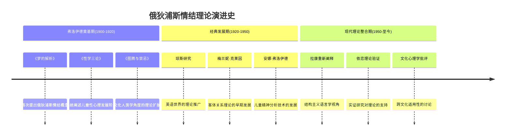
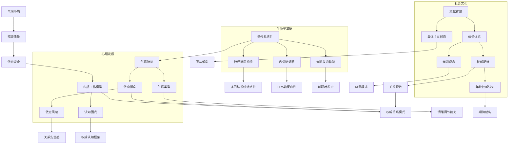
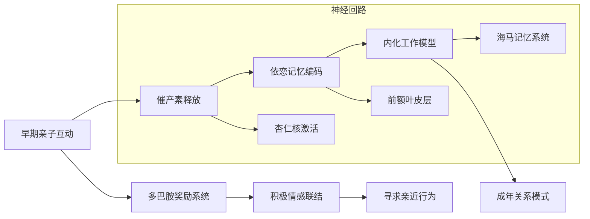
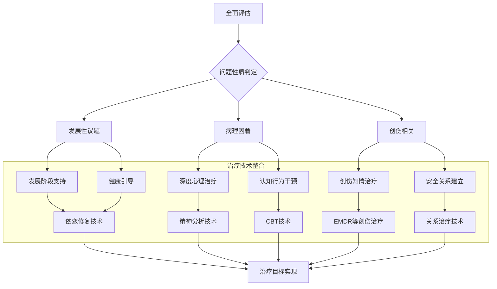

# 父母情结与俄狄浦斯发展 (Parental Complex & Oedipal Development)

> 📘 **文档导航**: 本专题深入探讨恋父恋母情结的心理机制、发展过程和临床意义。相关主题请参考：
> - [权威情结概览](Authority_Complex_Overview.md) - 整体框架和分类体系
> - [恋师恋教练情结](Teacher_Coach_Complex.md) - 教育环境中的权威吸引
> - [年龄差异吸引](Age_Attraction_Complex.md) - 年龄偏好心理机制
> - [权威恐惧情结](Authority_Fear_Complex.md) - 权威相关的恐惧反应

## 核心概念精确定义 (Core Concept Definitions)

### 恋父情结 (Father Complex)
**心理学定义**: 个体对父亲形象或具有父亲特质的年长男性产生理想化依恋、崇拜或特殊情感吸引的心理模式，这种情结可能源于俄狄浦斯发展阶段的正常体验或病理固着。

**发展心理学视角**: 
- 正常发展: 3-6岁期间对父亲的性别认同和竞争心理是人格发展的自然组成部分
- 病理固着: 成年后仍保持对父亲形象的过度依赖或理想化，影响独立性和亲密关系建立

### 恋母情结 (Mother Complex)
**心理学定义**: 个体对母亲形象或具有母性特质的年长女性产生深度情感依赖、寻求保护或特殊关爱的心理模式，同样源自俄狄浦斯期的正常发展或异常延续。

**临床区分要点**:
- 适应性依恋: 健康的亲情纽带和情感支持需求
- 病理性固着: 过度依赖、无法建立平等的成人关系、情感幼稚化

## 理论发展脉络 (Theoretical Development Timeline)

### 古典精神分析理论


### 核心形成机制深度分析 (Core Formation Mechanism Deep Analysis)

#### 生物-心理-社会整合机制 (Biopsychosocial Integration Mechanism)


#### 关键发展节点机制 (Critical Developmental Node Mechanisms)
**俄狄浦斯期核心机制**:
```
3-6岁关键发展任务:
性别认同巩固 ↔ 俄狄浦斯冲突解决 ↔ 超我结构形成

机制分析:
1. 神经发育基础
   • 大脑性别分化完成
   • 性激素影响行为模式
   • 镜像神经元支持模仿学习

2. 心理发展过程
   • 认同机制激活: 通过认同同性父母解决竞争
   • 升华机制运作: 将性冲动转化为社会可接受形式
   • 道德内化过程: 超我结构的逐步建立

3. 社会文化影响
   • 家庭权力结构的内化
   • 性别角色期待的学习
   • 社会规范的接受和整合
```

#### 病理固着形成机制 (Pathological Fixation Formation Mechanisms)
**发展受阻的多维度分析**:

| 形成机制 | 生物学基础 | 心理过程 | 社会因素 | 临床表现 |
| :--- | :--- | :--- | :--- | :--- |
| **依恋创伤机制** | 早期应激影响HPA轴发育 | 不安全依恋模式内化 | 照顾者情感忽视或虐待 | 成年期权威关系困难 |
| **认知固化机制** | 前额叶发育延迟 | 僵化的认知图式 | 缺乏多元化的权威体验 | 刻板的权威认知模式 |
| **情感调节障碍** | 神经递质系统紊乱 | 情绪调节策略缺陷 | 情感表达环境受限 | 情绪爆发或情感麻木 |
| **社会学习偏差** | 镜像神经元系统异常 | 观察学习模式扭曲 | 单一权威榜样影响 | 狭窄的权威关系模板 |

#### 代际传递机制 (Intergenerational Transmission Mechanisms)
**权威模式的跨代延续**:
```
传递路径分析:
祖辈权威模式 → 父母内化调整 → 教养行为表现 → 子代模式学习 → 成年期关系再现

具体机制:
1. 行为模式传递: 通过观察学习获得权威互动方式
2. 情感模式传递: 依恋风格和情感调节策略的代际延续
3. 认知模式传递: 权威认知框架和价值体系的内化
4. 神经生物学传递: 应激反应模式和神经发育轨迹的影响

调节因素:
• 代际间隔期的个人成长和调整
• 社会文化环境的变化影响
• 治疗和干预的阻断作用
• 个体差异和保护性因素
```

## 发展阶段详细分析 (Developmental Stage Analysis)

### 正常俄狄浦斯发展阶段 (Normal Oedipal Development Stages)

#### 第一阶段：认同与竞争 (3-4岁)
**核心特征**: 
- 性别认同的巩固
- 对同性父母的认同加强
- 对异性父母的特殊关注

**典型行为表现**:
```
• 宣称要"娶妈妈/嫁给爸爸"
• 模仿同性父母的行为举止
• 对异性父母表现出特别的亲近
• 出现嫉妒同性父母的情绪
```

**神经生物学基础**:
- 大脑性别分化完成
- 性激素水平开始影响行为
- 镜像神经元系统支持模仿学习

#### 第二阶段：冲突与调节 (4-5岁)
**核心任务**:
- 处理竞争与爱的矛盾情感
- 学习社会规则和道德约束
- 发展超我结构

**心理机制**:
| 机制类型 | 具体表现 | 调节方式 | 发展意义 |
| :--- | :--- | :--- | :--- |
| **阉割焦虑** | 对父亲权威的恐惧 | 通过认同化解冲突 | 促进性别角色内化 |
| **超我形成** | 内化父母的价值观 | 道德标准的建立 | 人格结构的重要组成 |
| **升华机制** | 将性冲动转化为社会可接受的形式 | 创造性活动、学习兴趣 | 心理能量的建设性利用 |

#### 第三阶段：整合与超越 (5-6岁)
**发展目标**:
- 解决俄狄浦斯冲突
- 建立稳定的性别认同
- 形成健康的超我结构

**成功整合标志**:
- 能够与同性同伴建立友谊
- 对异性父母保持适当的尊敬距离
- 发展出独立的道德判断能力

### 病理固着的表现形式 (Pathological Fixation Manifestations)

#### 恋父情结的临床表现
| 表现维度 | 适应性特征 | 病理性特征 | 功能影响 |
| :--- | :--- | :--- | :--- |
| **择偶偏好** | 偏好成熟稳重的伴侣 | 专门寻找"父亲型"伴侣 | 可能错过合适的发展伴侣 |
| **依赖模式** | 适度的情感支持需求 | 过度依赖伴侣的情感供给 | 影响关系的平等性和稳定性 |
| **权威态度** | 尊重合理的权威指导 | 盲目崇拜权威人物 | 可能导致判断力受损 |
| **自我发展** | 在安全基础上探索独立 | 难以建立真正的自主性 | 个人成长受到限制 |

#### 恋母情结的临床表现
| 表现维度 | 适应性特征 | 病理性特征 | 功能影响 |
| :--- | :--- | :--- | :--- |
| **情感需求** | 正常的亲情依恋 | 过度寻求母性关怀 | 可能妨碍成人独立性发展 |
| **关系模式** | 健康的情感表达 | 情感幼稚化和依赖 | 影响成熟关系的建立 |
| **应对方式** | 适度的情绪调节 | 情绪调节能力不足 | 压力应对困难 |
| **自我概念** | 积极的自我认同 | 自我价值感不稳定 | 自尊心容易受外界影响 |

## 临床评估框架 (Clinical Assessment Framework)

### 诊断性访谈指南 (Diagnostic Interview Guide)

#### 核心评估维度
1. **发展史采集**
   - 早期亲子关系质量
   - 关键发展节点的经历
   - 重要分离和丧失事件

2. **当前症状评估**
   - 情感依恋模式
   - 人际关系困扰
   - 功能损害程度

3. **心理动力学评估**
   - 无意识冲突内容
   - 防御机制使用
   - 移情反应模式

#### 标准化评估工具

##### 父母情结评估量表 (Parental Complex Assessment Scale)
| 评估维度 | 项目示例 | 评分标准 | 临床意义 |
| :--- | :--- | :--- | :--- |
| **依恋强度** | "我对年长异性有特殊的亲近感" | 1-5级评分 | 评估情结的活跃程度 |
| **功能影响** | "这种感受影响了我的日常生活" | 1-5级评分 | 判断是否达到临床显著性 |
| **认知模式** | "我认为年长异性更能理解我" | 是/否回答 | 识别适应不良的认知图式 |
| **行为表现** | "我会主动寻求年长异性的关注" | 频率评定 | 量化行为表现的强度 |

##### 依恋风格评估 (Attachment Style Assessment)
```python
# 依恋风格分类算法
def classify_attachment_style(anxiety_score, avoidance_score):
    """
    基于焦虑和回避维度的依恋风格分类
    焦虑维度: 对被抛弃的担忧程度
    回避维度: 对亲密关系的回避倾向
    """
    if anxiety_low and avoidance_low:
        return "安全型依恋"
    elif anxiety_high and avoidance_low:
        return "焦虑型依恋"  
    elif anxiety_low and avoidance_high:
        return "回避型依恋"
    else:
        return "紊乱型依恋"
```

### 鉴别诊断要点 (Differential Diagnosis Points)

#### 与正常发展区别的关键指标
| 区分维度 | 正常发展特征 | 病理固着特征 | 评估方法 |
| :--- | :--- | :--- | :--- |
| **时间持续性** | 阶段性，随发展自然消退 | 持续到成年期，难以改变 | 发展史回顾 |
| **功能适应性** | 促进人格健康发展 | 造成社会功能损害 | 功能评估量表 |
| **现实检验能力** | 能区分幻想与现实 | 现实检验受损 | 临床观察和访谈 |
| **痛苦程度** | 适度的发展性困扰 | 显著的主观痛苦 | 痛苦量表评估 |

#### 与其他心理障碍的区别
| 需要鉴别的障碍 | 区别要点 | 评估重点 |
| :--- | :--- | :--- |
| **边缘性人格障碍** | 情绪不稳定vs特定的权威依恋 | 人格结构评估 |
| **依赖型人格障碍** | 广泛依赖vs特定对象依赖 | 依赖模式分析 |
| **回避型人格障碍** | 社交回避vs权威恐惧 | 恐惧对象特异性 |
| **创伤后应激障碍** | 创伤经历vs发展性体验 | 创伤史详细采集 |

## 神经生物学机制 (Neurobiological Mechanisms)

### 依恋系统的神经基础


### 关键神经递质系统
| 系统 | 功能作用 | 与父母情结的关系 | 调节机制 |
| :--- | :--- | :--- | :--- |
| **催产素系统** | 促进社会联结和信任 | 影响对权威人物的信任建立 | 通过积极互动增强分泌 |
| **多巴胺系统** | 奖励和动机驱动 | 权威认可的正强化机制 | 成就感和社会认可激活 |
| **血清素系统** | 情绪调节和冲动控制 | 影响情绪稳定性 | 压力和创伤可能造成紊乱 |
| **GABA系统** | 焦虑调节和放松 | 权威恐惧的神经基础 | 焦虑状态下活性降低 |

## 治疗干预策略 (Treatment Intervention Strategies)

### 心理动力学治疗方法 (Psychodynamic Approaches)

#### 精神分析治疗技术
**核心原则**: 通过分析无意识冲突促进人格整合

**关键技术**:
1. **自由联想分析**
   ```
   治疗师: "请告诉我任何想到的事情"
   来访者: "我想到了我的老板，他让我想起父亲..."
   分析要点: 识别权威移情模式
   ```

2. **梦的解析技术**
   - 分析权威人物在梦中的象征意义
   - 探索无意识冲突的表达方式
   - 理解内心愿望和恐惧的转换

3. **移情分析**
   ```mermaid
   flowchart TD
       A[权威移情识别] --> B[移情内容分析]
       B --> C[早期关系模式]
       C --> D[无意识冲突]
       D --> E[现实检验]
       E --> F[整合与成长]
   ```

#### 客体关系治疗策略
**治疗目标**: 修复早期客体关系创伤，建立健康的人际模式

**核心技术**:
- **矫正性情感体验**: 在治疗关系中提供安全的依恋体验
- **内化健康客体**: 帮助来访者内化治疗师的积极品质
- **关系模式重构**: 识别和改变适应不良的关系模式

### 认知行为治疗方法 (Cognitive-Behavioral Approaches)

#### 认知重构技术
**常见适应不良认知**:
```
• "只有年长的异性才能真正理解我"
• "我需要权威人物的认可才能感到有价值"
• "年轻异性不可靠，无法给我安全感"
```

**重构策略**:
1. **证据检验法**: 检验这些信念的真实性和普遍性
2. **替代思维训练**: 发展更加平衡和现实的认知
3. **行为实验设计**: 通过实际行动验证新的认知假设

#### 行为干预技术
| 技术类型 | 具体方法 | 实施要点 | 预期效果 |
| :--- | :--- | :--- | :--- |
| **系统脱敏** | 逐步接触不同年龄段的异性 | 从低焦虑情境开始 | 减少年龄偏好的固化 |
| **社交技能训练** | 学习与同龄人交往的技巧 | 角色扮演和反馈 | 提高人际交往能力 |
| **暴露练习** | 在安全环境中面对权威人物 | 设定合适的挑战等级 | 降低权威恐惧反应 |

### 依恋聚焦治疗方法 (Attachment-Focused Approaches)

#### 情感聚焦治疗 (EFT)
**治疗原理**: 通过修复依恋创伤促进情感调节能力发展

**核心阶段**:
1. **评估阶段**: 识别依恋创伤和不安全模式
2. **去活化阶段**: 处理创伤记忆和负面情感
3. **重塑阶段**: 建立安全的依恋体验
4. **整合阶段**: 巩固新的关系模式

#### 内在家庭系统治疗 (IFS)
**理论基础**: 每个人内心都有多个子人格，需要和谐整合

**治疗过程**:
```
1. 识别内在的"父母部分"和"子女部分"
2. 理解各部分的积极意图和保护功能
3. 促进内在系统的和谐对话
4. 整合不同部分的经验和智慧
```

### 整合治疗模型 (Integrative Treatment Model)



## 预防与促进策略 (Prevention and Promotion Strategies)

### 儿童期预防措施
#### 家庭环境优化
- **父母角色平衡**: 避免过度依赖单一父母
- **适度分离体验**: 逐步增加与父母的分离时间
- **同龄人交往**: 鼓励与同龄伙伴的互动
- **性别角色示范**: 提供多元化的性别角色模型

#### 教育机构支持
- **教师角色定位**: 明确教育者与父母角色的区别
- **同伴关系培养**: 重视同龄人间的友谊发展
- **情感教育**: 教授健康的情感表达和调节技能

### 成人期自我发展
#### 自我觉察训练
- **情感模式识别**: 观察自己的权威关系模式
- **认知偏见检视**: 识别和质疑适应不良的信念
- **行为模式反思**: 分析重复出现的关系困境

#### 关系技能提升
- **边界设定能力**: 学会在关系中维护适当边界
- **沟通技巧发展**: 提高表达需求和倾听他人的能力
- **冲突处理技能**: 学习建设性地处理关系冲突

## 文化与性别考量 (Cultural and Gender Considerations)

### 文化差异因素
| 文化维度 | 影响机制 | 临床意义 | 适应策略 |
| :--- | :--- | :--- | :--- |
| **集体主义vs个人主义** | 权威尊重程度不同 | 影响症状表达和求助行为 | 文化敏感的评估和干预 |
| **权力距离** | 社会对等级差异的接受度 | 影响权威关系的体验 | 考虑文化背景的正常变异 |
| **性别角色期待** | 不同文化对性别角色的规定 | 影响情结的表现形式 | 性别敏感的治疗方法 |

### 性别差异分析
#### 男性恋母情结特点
- 更多表现为对母性关怀的渴求
- 可能影响职业发展中的独立性
- 在亲密关系中可能出现过度依赖

#### 女性恋父情结特点
- 更倾向于寻找保护性和指导性的伴侣
- 可能影响对权威人物的职业选择
- 在育儿方面可能重现早期依恋模式

## 研究前沿与发展趋势 (Research Frontiers and Trends)

### 新兴研究方向
1. **神经科学验证**: 使用fMRI等技术验证理论假设
2. **跨文化比较**: 探索不同文化背景下情结的表达差异
3. **发展轨迹追踪**: 纵向研究从儿童到成人的发展过程
4. **干预效果研究**: 比较不同治疗方法的有效性

### 临床实践创新
- **数字化治疗工具**: 开发在线评估和干预平台
- **虚拟现实应用**: 创造安全的暴露治疗环境
- **人工智能辅助**: 利用AI进行个性化治疗方案设计

## 研究前沿与发展趋势 (Research Frontiers and Trends)

### 新兴研究方向
1. **神经科学验证**: 使用fMRI等技术验证理论假设
2. **跨文化比较**: 探索不同文化背景下情结的表达差异
3. **发展轨迹追踪**: 纵向研究从儿童到成人的发展过程
4. **干预效果研究**: 比较不同治疗方法的有效性

### 临床实践创新
- **数字化治疗工具**: 开发在线评估和干预平台
- **虚拟现实应用**: 创造安全的暴露治疗环境
- **人工智能辅助**: 利用AI进行个性化治疗方案设计

---
*本专题文档将持续更新最新的研究成果和临床实践经验*

**相关文档链接:**
- [权威情结概览](Authority_Complex_Overview.md)
- [恋师恋教练情结](Teacher_Coach_Complex.md)
- [年龄差异吸引](Age_Attraction_Complex.md)
- [权威恐惧情结](Authority_Fear_Complex.md)
- [临床整合指南](Clinical_Assessment_Treatment.md)
- [参考文献与资源](Authority_Complex_References.md)