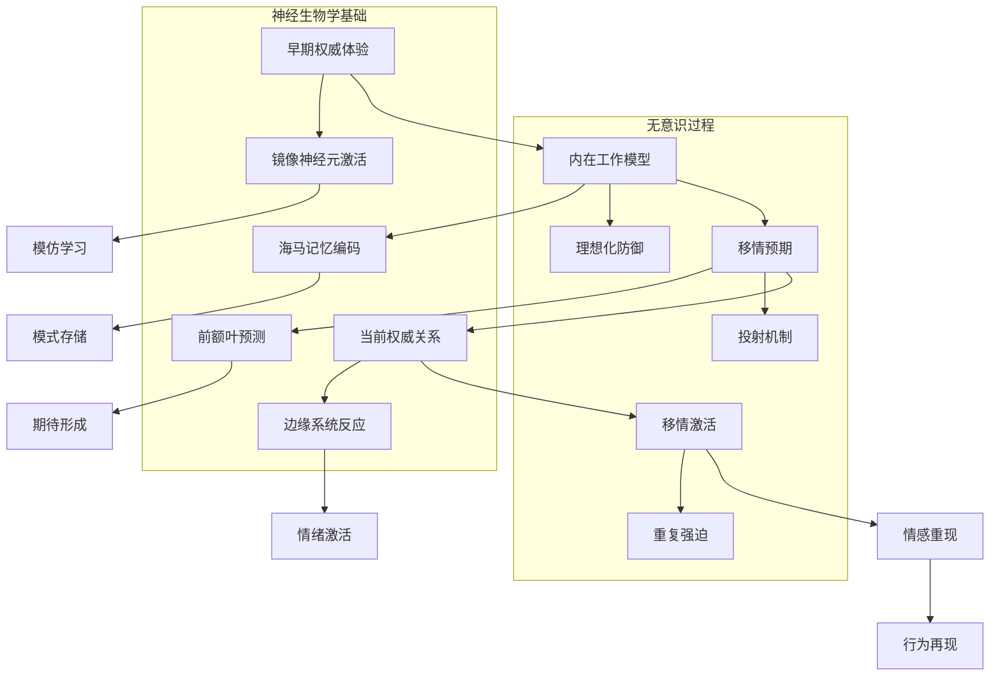
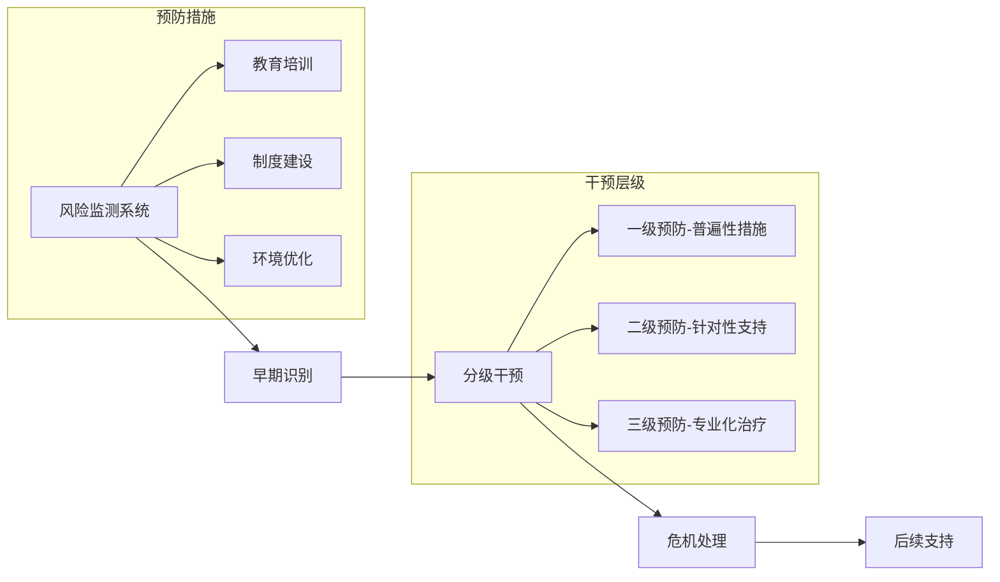

# 师生与教练权威情结 (Teacher-Coache Authority Complex)

> 📘 **文档导航**: 本专题深入探讨教育和体育环境中权威吸引的心理机制、伦理边界和专业处理。相关主题请参考：
> - [权威情结概览](Authority_Complex_Overview.md) - 整体理论框架
> - [恋父恋母情结](Father_Mother_Complex.md) - 家庭权威情结发展
> - [年龄差异吸引](Age_Attraction_Complex.md) - 年龄偏好的心理机制
> - [权威恐惧情结](Authority_Fear_Complex.md) - 权威相关的恐惧反应

## 核心概念与定义 (Core Concepts and Definitions)

### 恋师情结 (Teacher Complex)
**专业定义**: 学生对教师产生超出正常师生关系范围的强烈情感依恋、崇拜或特殊关注，这种情结可能表现为理想化、过度寻求认可或边界模糊的互动模式。

**临床特征维度**:
- **情感强度**: 对特定教师的强烈情感投入
- **认知理想化**: 将教师视为完美或超凡的存在
- **行为表现**: 过度寻求关注、模仿教师行为、维护教师权威
- **功能影响**: 可能影响学业表现、同伴关系或未来发展选择

### 恋教练情结 (Coach Complex)
**专业定义**: 运动员对教练产生超越专业指导关系的特殊情感连接，包括崇拜、依赖或浪漫化倾向，可能影响训练效果、竞技表现和身心发展。

**表现形式分类**:
| 类型 | 核心特征 | 典型表现 | 发展影响 |
| :--- | :--- | :--- | :--- |
| **成就导向型** | 通过教练认可获得自我价值感 | 过度训练、成绩焦虑、完美主义 | 可能导致运动倦怠或身心耗竭 |
| **情感依赖型** | 寻求教练的情感支持和关注 | 频繁汇报、情绪化反应、分离焦虑 | 影响独立性和自我调节能力 |
| **英雄崇拜型** | 将教练理想化为人生导师 | 盲目服从、拒绝质疑、身份认同融合 | 可能阻碍批判性思维发展 |

## 发展心理学基础 (Developmental Psychology Foundation)

### 关键发展阶段分析

#### 学龄期权威认同 (6-12岁 School Age Authority Identification)

**心理发展特点**:
- **认知发展**: 具体运算阶段，开始理解抽象权威概念
- **社会认知**: 发展对社会角色和等级的理解
- **道德发展**: 从他律道德向自律道德过渡
- **身份探索**: 开始形成学业和社交身份认同

**权威关系发展任务**:
```
6-8岁: 基础权威认同
• 接受教师作为知识权威
• 学习课堂规则和社会规范
• 发展基本的学习动机

9-10岁: 选择性认同
• 开始评估不同教师的特点
• 形成偏好的学科和教学风格
• 发展批判性思维萌芽

11-12岁: 独立性发展
• 质疑权威的合理性
• 寻求更多自主权
• 建立同伴群体认同
```

#### 青春期权威重构 (12-18岁 Adolescent Authority Reconstruction)

**心理转变过程**:
- **身份整合**: 整合师生关系经验形成稳定的学习身份
- **价值观澄清**: 通过与权威互动澄清个人价值体系
- **边界建立**: 学习在尊重权威的同时维护个人边界
- **独立发展**: 逐步减少对外部权威的依赖

**关键转折点**:
| 年龄阶段 | 发展任务 | 挑战风险 | 保护因素 |
| :--- | :--- | :--- | :--- |
| 12-14岁 | 权威质疑期 | 叛逆行为、学业下滑 | 支持性师生关系 |
| 15-16岁 | 价值探索期 | 身份困惑、同伴压力 | 积极的榜样引导 |
| 17-18岁 | 独立准备期 | 分离焦虑、未来不确定 | 渐进的责任转移 |

## 理论框架与机制分析 (Theoretical Framework and Mechanisms)

### 心理动力学机制深度分析 (Psychodynamic Mechanisms Deep Analysis)

#### 权威移情的多层次形成机制


#### 防御机制的系统性分析
**核心防御机制及其功能**:
```
适应性防御机制:
1. 认同机制
   • 功能: 通过与权威认同获得力量感和安全感
   • 发展: 学龄期正常发展任务
   • 病理化: 过度认同导致自我边界模糊

2. 理想化机制
   • 功能: 通过理想化权威缓解内在不安全感
   • 发展: 青春期身份探索的正常表现
   • 病理化: 极端理想化导致现实检验受损

3. 投射机制
   • 功能: 将内在冲突外化到权威人物
   • 发展: 认知发展过程中的正常现象
   • 病理化: 过度投射导致关系扭曲

病理性防御机制:
1. 退行机制
   • 表现: 回到早期发展阶段的应对模式
   • 影响: 阻碍成熟关系能力的发展
   • 治疗: 逐步建立成熟的应对策略

2. 压抑机制
   • 表现: 将对权威的负面情感压入无意识
   • 影响: 导致情感表达困难和身体症状
   • 治疗: 安全环境下逐步意识化处理
```

### 社会学习理论机制深化 (Social Learning Theory Mechanism Enhancement)

#### 观察学习的神经基础机制
**多系统整合的学习过程**:
```python
# 师生权威关系观察学习模型
class ObservationalLearningModel:
    def __init__(self):
        self.neural_systems = {
            '镜像系统': {
                '脑区': ['前运动皮层', '顶下小叶', '颞上沟'],
                '功能': '动作理解和模仿',
                '权威关系应用': '学习权威的行为模式和互动方式'
            },
            '奖励系统': {
                '脑区': ['腹侧纹状体', 'VTA', '前扣带回'],
                '功能': '强化学习和动机驱动',
                '权威关系应用': '权威认可的正强化机制'
            },
            '记忆系统': {
                '脑区': ['海马', '前额叶皮层', '杏仁核'],
                '功能': '情景记忆和情感记忆编码',
                '权威关系应用': '权威互动经验的长期存储'
            }
        }
    
    def integrate_learning_processes(self, observation_data):
        """整合多系统的观察学习过程"""
        integrated_response = {}
        for system, details in self.neural_systems.items():
            integrated_response[system] = self.process_system_activation(
                observation_data, details
            )
        return self.coordinate_system_responses(integrated_response)
```

#### 强化机制的复杂性分析
| 强化类型 | 机制特点 | 权威关系中的表现 | 发展影响 |
| :--- | :--- | :--- | :--- |
| **正强化** | 通过奖励增加行为频率 | 表扬、关注、特殊待遇 | 增强依恋行为，可能形成依赖 |
| **负强化** | 通过移除不愉快增加行为 | 避免批评、获得安全感 | 减少分离焦虑，可能阻碍独立 |
| **社会强化** | 通过社会认可增加行为 | 同伴羡慕、群体接纳 | 促进社会化，可能产生从众压力 |
| **内在强化** | 通过内在满足增加行为 | 成就感、自我效能感 | 健康的动机来源，促进自主发展 |

### 依恋理论机制扩展 (Attachment Theory Mechanism Expansion)

#### 教育环境中的依恋需求机制
**多层次依恋功能分析**:
```
安全基地功能的扩展理解:
1. 情感安全功能
   • 提供稳定的情感支持系统
   • 缓解学习和社交焦虑
   • 促进积极探索行为

2. 认知发展功能
   • 通过安全依恋促进注意力集中
   • 支持复杂认知任务的完成
   • 增强学习动机和坚持性

3. 社会技能功能
   • 提供人际互动的安全模板
   • 促进同伴关系的健康发展
   • 培养合作和沟通能力

4. 身份认同功能
   • 通过权威认可建立积极自我概念
   • 支持学业身份和职业身份发展
   • 促进价值观和信念系统的形成
```

#### 依恋风格对师生关系的深层影响机制
| 依恋风格 | 神经生物学基础 | 心理过程 | 行为表现 | 干预策略 |
| :--- | :--- | :--- | :--- | :--- |
| **安全型** | 正常的HPA轴调节 | 健康的情绪调节 | 主动寻求帮助，适度依赖 | 维持现有支持系统 |
| **焦虑型** | HPA轴过度激活 | 情绪调节困难 | 过度寻求关注，担心被忽视 | 提供稳定的情感支持 |
| **回避型** | HPA轴反应迟钝 | 情感抑制策略 | 拒绝帮助，表现独立 | 逐步建立信任关系 |
| **紊乱型** | HPA轴功能紊乱 | 冲突的应对策略 | 行为矛盾，情绪不稳定 | 创伤知情治疗方法 |

### 社会学习理论视角 (Social Learning Theory Perspective)

#### 观察学习机制
**关键学习要素**:
1. **注意过程**: 选择性关注具有吸引力的教师特质
2. **保持过程**: 将观察到的行为模式内化为认知结构
3. **产出过程**: 在适当情境下再现学习到的行为
4. **动机过程**: 通过强化维持学习行为

**强化机制分析**:
| 强化类型 | 具体形式 | 心理效应 | 长期影响 |
| :--- | :--- | :--- | :--- |
| **正强化** | 表扬、关注、特殊待遇 | 增强依恋行为 | 可能形成依赖模式 |
| **负强化** | 避免批评、获得安全感 | 减少分离焦虑 | 可能阻碍独立发展 |
| **社会强化** | 同伴认可、群体接纳 | 增强群体归属感 | 促进社会化但可能产生从众压力 |

### 依恋理论应用 (Attachment Theory Application)

#### 教育环境中的依恋需求
**安全基地功能**:
- 提供情感支持和安全感
- 促进探索学习和尝试新事物
- 帮助调节情绪和应对挫折
- 支持身份认同发展

**依恋风格对师生关系的影响**:
| 依恋风格 | 师生互动模式 | 学业表现 | 社会适应 |
| :--- | :--- | :--- | :--- |
| **安全型** | 主动寻求帮助，适度依赖 | 学习动机强，成绩稳定 | 同伴关系良好 |
| **焦虑型** | 过度寻求关注，担心被忽视 | 成绩波动大，完美主义 | 人际关系紧张 |
| **回避型** | 拒绝帮助，表现独立 | 学习动机不足，回避挑战 | 社交退缩明显 |
| **紊乱型** | 行为矛盾，情绪不稳定 | 学习困难，注意力问题 | 适应性行为问题 |

## 临床表现与评估 (Clinical Manifestations and Assessment)

### 症状表现谱系 (Symptom Spectrum)

#### 适应性依恋表现 (Adaptive Attachment Manifestations)
```
• 对优秀教师的自然敬佩和学习动机
• 适度寻求指导和支持
• 能够区分专业关系和个人情感
• 在获得帮助后能够独立思考和行动
• 保持健康的同伴关系和社会功能
```

#### 病理性固着表现 (Pathological Fixation Manifestations)
| 表现维度 | 轻度症状 | 中度症状 | 重度症状 |
| :--- | :--- | :--- | :--- |
| **情感强度** | 偶尔的特殊关注 | 持续的情感投入 | 强烈的依恋和占有欲 |
| **认知模式** | 适度的理想化 | 过度的完美化 | 病理性的崇拜和迷信 |
| **行为表现** | 主动接近和请教 | 频繁联系和汇报 | 侵入性关注和边界侵犯 |
| **功能影响** | 轻微的学业干扰 | 明显的学习效率下降 | 严重的社会功能损害 |

### 专业评估工具 (Professional Assessment Tools)

#### 师生关系评估问卷 (Teacher-Student Relationship Assessment Questionnaire)
| 评估维度 | 测评项目 | 评分标准 | 临床解释 |
| :--- | :--- | :--- | :--- |
| **情感依恋强度** | "我对某位老师有特殊的亲近感" | 1-7级李克特量表 | 评估情结活跃程度 |
| **认知理想化程度** | "我认为这位老师是完美的" | 是/否 + 程度评定 | 识别适应不良认知 |
| **行为边界清晰度** | "我能清楚区分师生关系和个人情感" | 清晰/模糊/混乱 | 判断边界意识水平 |
| **功能损害程度** | "这种感受影响了我的学习和生活" | 无/轻微/中度/严重 | 确定临床显著性 |

#### 教练-运动员关系评估量表 (Coach-Athlete Relationship Assessment Scale)
```python
# 关系质量评估算法
class CoachAthleteRelationshipAssessment:
    def __init__(self):
        self.dimensions = {
            '亲密性': ['情感连接', '信任程度', '沟通质量'],
            '任务导向': ['指导质量', '目标设定', '反馈效果'],
            '边界清晰度': ['角色认知', '权力平衡', '独立性维护']
        }
    
    def calculate_relationship_health(self, scores):
        """
        计算关系健康指数
        参数: scores - 各维度得分字典
        返回: 健康指数(0-100)和各维度分析
        """
        # 权重分配
        weights = {'亲密性': 0.4, '任务导向': 0.4, '边界清晰度': 0.2}
        
        # 计算加权总分
        health_index = sum(scores[dim] * weights[dim] for dim in weights)
        
        # 生成分析报告
        analysis = self.generate_analysis_report(scores, health_index)
        return health_index, analysis
```

### 诊断性访谈指南 (Diagnostic Interview Guide)

#### 核心访谈主题
1. **关系发展历程**
   ```
   • "你能描述一下与这位老师/教练的关系是如何开始的吗？"
   • "在这个过程中有哪些特别有意义的时刻？"
   • "你认为这段关系对你意味着什么？"
   ```

2. **情感体验探索**
   ```
   • "当你想到这位老师/教练时，你有什么感受？"
   • "这些感受是否影响了你的日常学习/训练？"
   • "你希望从这种关系中得到什么？"
   ```

3. **认知模式评估**
   ```
   • "你如何看待这位老师/教练的能力和品格？"
   • "如果其他人对你的老师/教练有不同看法，你会怎么想？"
   • "你觉得这种关系是健康的吗？为什么？"
   ```

4. **行为模式分析**
   ```
   • "你在什么情况下会主动联系老师/教练？"
   • "当得不到及时回应时，你的反应是什么？"
   • "这种关系如何影响你与其他人的交往？"
   ```

## 伦理边界与风险管理 (Ethical Boundaries and Risk Management)

### 专业伦理原则 (Professional Ethical Principles)

#### 权力差异管理 (Power Differential Management)
**核心原则**: 意识、承认和负责任地管理师生/教练关系中的权力不平衡

**实践指南**:
```
1. 透明化权力结构
   • 明确角色定位和职责边界
   • 公开沟通决策过程和标准
   • 建立申诉和监督机制

2. 促进平等对话
   • 鼓励学生/运动员表达观点和需求
   • 尊重个体差异和选择权利
   • 避免利用权威地位施加不当影响

3. 维护专业边界
   • 保持适当的身体和情感距离
   • 避免双重关系和个人利益冲突
   • 定期进行边界意识自我评估
```

#### 知情同意原则 (Informed Consent Principle)
**关键要素**:
- **信息充分性**: 提供关系性质、可能风险和替代选择的完整信息
- **理解能力评估**: 确认当事人具备做出明智决定的认知能力
- **自愿性保障**: 确保决定不受不当压力或操纵影响
- **持续性确认**: 定期重新评估和确认同意状态

### 风险识别与预防 (Risk Identification and Prevention)

#### 高风险信号识别
| 风险类型 | 早期预警信号 | 中期危险信号 | 紧急干预信号 |
| :--- | :--- | :--- | :--- |
| **情感依赖** | 频繁寻求关注、情绪化反应 | 分离焦虑、功能受损 | 自伤想法、自杀倾向 |
| **边界侵犯** | 过度亲密行为、私人话题 | 身体接触、单独相处 | 性暗示、实际侵犯 |
| **操控行为** | 威胁惩罚、条件性关爱 | 孤立排斥、恶意比较 | 身心控制、人格贬损 |

#### 预防性干预策略


### 危机处理程序 (Crisis Management Protocol)

#### 紧急响应流程
1. **立即安全保护**
   ```
   • 确保当事人人身安全
   • 隔离危险环境
   • 联系专业支持人员
   ```

2. **初步评估与稳定**
   ```
   • 评估即时风险水平
   • 提供情绪稳定支持
   • 收集必要信息
   ```

3. **专业转介与跟进**
   ```
   • 联系心理健康专业人员
   • 启动学校/机构危机干预程序
   • 建立持续支持网络
   ```

## 治疗干预方法 (Treatment Intervention Methods)

### 个体治疗策略 (Individual Treatment Strategies)

#### 认知重建技术 (Cognitive Restructuring Techniques)
**核心目标**: 帮助来访者发展更加现实和平衡的认知模式

**技术实施步骤**:
1. **认知识别阶段**
   ```
   治疗师: "当你想到你的老师时，脑海中会出现什么样的画面？"
   来访者: "我觉得他是世界上最好的老师，没有人能比得上他。"
   治疗师: "让我们一起来检验这个想法的真实性。"
   ```

2. **证据收集阶段**
   - 收集支持和反驳该信念的具体证据
   - 探讨这种认知模式的形成原因
   - 分析过度理想化的功能和代价

3. **替代思维发展**
   ```
   原始信念: "我的老师是完美的，永远不会犯错"
   替代思维: "我的老师是一位优秀的教育者，但他也是普通人，会有优点也有不足"
   平衡观点: "我可以欣赏老师的优点，同时也保持独立思考的能力"
   ```

#### 边界训练技术 (Boundary Training Techniques)
**训练目标**: 帮助来访者建立和维护健康的人际边界

**核心技能培养**:
1. **边界意识培养**
   ```
   • 识别不同类型边界(物理、情感、时间、信息)
   • 理解边界的重要性和功能
   • 学会观察和尊重他人的边界
   ```

2. **边界表达训练**
   ```
   • 学习清晰、直接的沟通方式
   • 练习说"不"的技巧
   • 发展协商和妥协能力
   ```

3. **边界维护策略**
   ```
   • 建立支持性的人际网络
   • 制定边界侵犯的应对预案
   • 定期进行边界意识自我评估
   ```

### 团体治疗方法 (Group Therapy Approaches)

#### 同伴支持小组 (Peer Support Groups)
**小组目标**: 通过同伴间的经验分享和支持，促进健康权威关系模式的发展

**活动设计框架**:
```
第1-2周: 建立安全环境和基本规则
• 破冰活动和自我介绍
• 小组规范制定
• 信任建立练习

第3-4周: 经验分享和认知重构
• 权威关系经历分享
• 适应不良认知识别
• 现实检验练习

第5-6周: 技能训练和角色扮演
• 边界设定技能训练
• 沟通技巧演练
• 情境模拟练习

第7-8周: 整合应用和未来规划
• 个人成长总结
• 应对策略制定
• 后续支持计划
```

#### 家庭系统干预 (Family Systems Intervention)
**干预重点**: 改善家庭内的权威关系模式，为健康师生关系奠定基础

**核心技术应用**:
- **家庭雕塑技术**: 通过身体位置展现家庭权力结构
- **沟通模式分析**: 识别和改善家庭沟通障碍
- **边界重新设定**: 建立适当的家庭成员边界
- **角色功能调整**: 优化父母权威的行使方式

### 系统性干预策略 (Systemic Intervention Strategies)

#### 学校/机构层面干预
**制度建设**:
```
1. 师德师风建设
   • 制定明确的职业行为规范
   • 建立师德考核评价体系
   • 开展定期的伦理培训

2. 学生保护机制
   • 建立多层次的支持网络
   • 完善投诉举报渠道
   • 提供心理健康服务

3. 环境优化措施
   • 创建开放包容的校园文化
   • 促进师生间的良性互动
   • 加强同伴支持系统建设
```

#### 社会支持网络构建
**多元支持体系**:
- **专业支持**: 心理咨询师、社工、医生等专业人士
- **同伴支持**: 同龄人互助小组、朋辈辅导员
- **家庭支持**: 家长教育、家庭治疗服务
- **社区资源**: 青少年活动中心、志愿服务组织

## 预防教育与发展促进 (Prevention Education and Development Promotion)

### 教育工作者培训 (Educator Training Programs)

#### 专业素养提升
**核心培训内容**:
```
1. 发展心理学知识
   • 不同年龄阶段的心理特点
   • 权威关系发展的规律性
   • 个体差异的识别和应对

2. 伦理意识培养
   • 职业边界的重要性和维护
   • 权力差异的敏感性训练
   • 危机识别和处理能力

3. 沟通技能发展
   • 积极倾听和共情技巧
   • 建设性反馈的方法
   • 冲突调解的策略
```

#### 自我保护策略
**教师自我关怀**:
- **情绪管理**: 学会识别和调节工作压力
- **边界维护**: 建立清晰的工作和个人生活边界
- **专业支持**: 定期接受督导和同行支持
- **持续发展**: 保持专业学习和成长动力

### 学生发展指导 (Student Development Guidance)

#### 情感教育课程
**课程目标体系**:
```
低年级(6-9岁): 基础情感认知
• 识别和表达基本情绪
• 理解他人情感需求
• 学习简单的人际交往规则

中年级(10-12岁): 关系技能发展
• 发展同龄人友谊
• 学习处理同伴冲突
• 培养适度的权威尊重

高年级(13-15岁): 复杂关系处理
• 理解权力差异和边界
• 发展批判性思维能力
• 建立独立的价值判断
```

#### 自我保护教育
**安全意识培养**:
- **风险识别能力**: 学会识别不适当的关系行为
- **求助技能训练**: 掌握寻求帮助的途径和方法
- **自我主张训练**: 发展说"不"和维护权益的能力
- **支持网络建设**: 了解可用的支持资源和服务

## 研究前沿与发展趋势 (Research Frontiers and Development Trends)

### 当前研究热点 (Current Research Hotspots)

#### 神经科学视角
- **依恋神经机制**: 探索师生依恋的神经生物学基础
- **奖励系统激活**: 研究权威认可对大脑奖励回路的影响
- **压力反应模式**: 分析不同师生关系对HPA轴的影响

#### 数字化干预方法
- **在线治疗平台**: 开发针对师生关系问题的数字化解决方案
- **虚拟现实应用**: 创造安全的边界训练和社交技能练习环境
- **人工智能辅助**: 利用AI技术进行个性化风险评估和干预推荐

### 未来发展方向 (Future Development Directions)

#### 跨学科整合趋势
```
心理学 + 教育学: 发展更加科学有效的师生关系理论
神经科学 + 社会学: 探索权威关系的生物学和社会文化基础
技术科学 + 人文关怀: 平衡技术创新与人性化服务需求
```

#### 文化适应性发展
- **本土化理论建构**: 结合中国文化背景发展适合的理论框架
- **多元文化敏感性**: 提高对不同文化群体需求的理解和响应
- **全球化视野**: 在国际比较中提炼普遍规律和特殊模式

## 研究前沿与发展趋势 (Research Frontiers and Development Trends)

### 当前研究热点 (Current Research Hotspots)

#### 神经科学视角
- **依恋神经机制**: 探索师生依恋的神经生物学基础
- **奖励系统激活**: 研究权威认可对大脑奖励回路的影响
- **压力反应模式**: 分析不同师生关系对HPA轴的影响

#### 数字化干预方法
- **在线治疗平台**: 开发针对师生关系问题的数字化解决方案
- **虚拟现实应用**: 创造安全的边界训练和社交技能练习环境
- **人工智能辅助**: 利用AI技术进行个性化风险评估和干预推荐

### 未来发展方向 (Future Development Directions)

#### 跨学科整合趋势
```
心理学 + 教育学: 发展更加科学有效的师生关系理论
神经科学 + 社会学: 探索权威关系的生物学和社会文化基础
技术科学 + 人文关怀: 平衡技术创新与人性化服务需求
```

#### 文化适应性发展
- **本土化理论建构**: 结合中国文化背景发展适合的理论框架
- **多元文化敏感性**: 提高对不同文化群体需求的理解和响应
- **全球化视野**: 在国际比较中提炼普遍规律和特殊模式

---
*本专题将持续跟踪最新研究成果，不断完善理论体系和实践指导*

**相关文档链接:**
- [权威情结概览](Authority_Complex_Overview.md)
- [恋父恋母情结](Father_Mother_Complex.md)
- [年龄差异吸引](Age_Attraction_Complex.md)
- [权威恐惧情结](Authority_Fear_Complex.md)
- [临床整合指南](Clinical_Assessment_Treatment.md)
- [参考文献与资源](Authority_Complex_References.md)