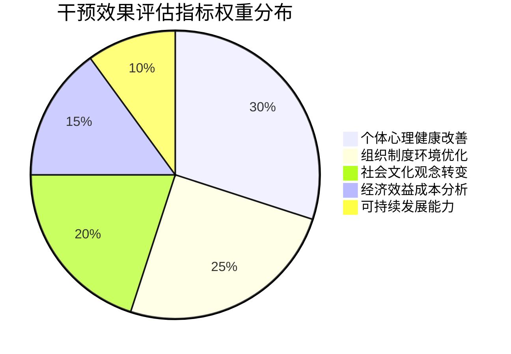

# Gender Discrimination Intervention Effectiveness Evaluation (性别歧视干预效果评估)

## 评估框架体系 (Evaluation Framework System)

### 多层次评估模型 (Multi-level Evaluation Model)

#### 个体层面效果评估 (Individual Level Effectiveness Evaluation)

| 评估维度 | 核心指标 | 测量工具 | 评估时机 | 临床意义 |
| :--- | :--- | :--- | :--- | :--- |
| **心理健康改善** | 抑郁焦虑症状减轻程度 | PHQ-9, GAD-7量表 | 干预前、干预后、3个月随访 | 反映心理创伤修复效果 |
| **自我效能提升** | 个人能力信念增强水平 | 一般自我效能感量表 | 干预后、6个月随访 | 表征应对能力发展状况 |
| **生活质量改善** | 日常生活满意度提升 | WHOQOL-BREF量表 | 干预后、12个月随访 | 体现整体福祉改善程度 |
| **社会功能恢复** | 人际交往和工作能力 | 社会适应性量表 | 干预后、6个月随访 | 显示社会融入改善情况 |

#### 组织层面效果评估 (Organizational Level Effectiveness Evaluation)

| 评估层面 | 关键指标 | 数据来源 | 评估周期 | 改进价值 |
| :--- | :--- | :--- | :--- | :--- |
| **制度环境** | 反歧视政策完善度、执行力度 | 政策文件审查、员工调查 | 年度评估 | 指导制度建设和完善 |
| **文化氛围** | 性别平等文化认同度、包容性水平 | 组织文化测评、焦点小组 | 半年度评估 | 促进文化变革和氛围改善 |
| **实践效果** | 招聘公平性、晋升机会平等 | HR数据分析、员工访谈 | 季度监测 | 优化人力资源管理实践 |
| **员工体验** | 工作满意度、组织承诺度 | 员工满意度调查、离职率分析 | 年度评估 | 提升员工体验和组织效能 |

#### 社会层面影响评估 (Societal Level Impact Evaluation)

| 影响领域 | 测量指标 | 评估方法 | 时间跨度 | 政策意义 |
| :--- | :--- | :--- | :--- | :--- |
| **观念变迁** | 性别平等意识普及程度 | 民意调查、媒体内容分析 | 3-5年长期追踪 | 评估文化变革和社会进步 |
| **行为改变** | 歧视行为减少、平等实践增加 | 行为观察、案例统计 | 2-3年中期评估 | 衡量实践应用和社会影响 |
| **制度完善** | 相关法律法规健全程度 | 政策文本分析、实施效果评估 | 5-10年远景评估 | 指导制度建设和法律完善 |
| **国际影响** | 中国经验的国际认可度 | 国际评估、交流合作情况 | 长期国际比较 | 提升国际话语权和影响力 |

### 综合效果评价体系 (Comprehensive Effectiveness Evaluation System)

#### 评估指标权重分配 (Evaluation Indicator Weight Allocation)

#### 效果等级评定标准 (Effect Level Rating Criteria)

| 等级 | 效果描述 | 量化标准 | 判定依据 | 改进建议 |
| :--- | :--- | :--- | :--- | :--- |
| **优秀** | 干预效果显著，各方面指标大幅改善 | 综合评分≥85分 | 多维度指标均达到预期目标 | 总结推广成功经验，扩大应用范围 |
| **良好** | 干预效果明显，主要指标有显著改善 | 75分≤综合评分<85分 | 关键指标达标，次要指标基本完成 | 分析不足之处，优化实施方案 |
| **一般** | 干预有一定效果，部分指标有所改善 | 60分≤综合评分<75分 | 基础指标达成，提升空间较大 | 深入分析问题，调整策略方法 |
| **较差** | 干预效果有限，指标改善不明显 | 综合评分<60分 | 多数指标未达预期 | 全面反思评估，重新设计干预 |

## 评估方法与技术 (Evaluation Methods and Techniques)

### 量化评估方法 (Quantitative Evaluation Methods)

#### 实验研究设计 (Experimental Research Design)

| 设计类型 | 适用场景 | 优势特点 | 局限性 | 质量控制 |
| :--- | :--- | :--- | :--- | :--- |
| **随机对照试验** | 新干预方法的效果验证 | 因果关系明确，内部效度高 | 伦理限制，外部效度有限 | 严格随机化，盲法实施 |
| **准实验设计** | 现实条件下干预效果评估 | 可行性强，贴近实际 | 选择偏倚，混杂因素多 | 匹配对照，统计控制 |
| **前后对比设计** | 单一组别干预效果观察 | 操作简便，成本较低 | 历史效应，成熟效应 | 多次测量，趋势分析 |
| **横向比较设计** | 不同干预方法效果比较 | 效率高，信息丰富 | 组间差异，时间效应 | 标准化实施，统一评估 |

#### 统计分析技术 (Statistical Analysis Techniques)

| 分析方法 | 应用场景 | 技术要求 | 结果解释 | 注意事项 |
| :--- | :--- | :--- | :--- | :--- |
| **描述性统计** | 数据基本特征描述 | 基础统计知识 | 集中趋势、离散程度 | 注意异常值处理 |
| **推断性统计** | 群体特征推断、假设检验 | 中高级统计技能 | 显著性水平、效应量 | 控制I类和II类错误 |
| **多变量分析** | 复杂关系建模、预测分析 | 高级统计方法 | 模型拟合度、预测准确性 | 避免过拟合，验证模型 |
| **元分析技术** | 多研究结果整合、效应量合成 | 专业meta分析技能 | 总体效应大小、异质性检验 | 发表偏倚，质量评估 |

### 质性评估方法 (Qualitative Evaluation Methods)

#### 现象学研究方法 (Phenomenological Research Methods)

| 研究方法 | 数据收集 | 分析重点 | 质量标准 | 应用价值 |
| :--- | :--- | :--- | :--- | :--- |
| **深度访谈** | 半结构化访谈、生命史回顾 | 个人体验、意义建构 | 信息饱和度、主题一致性 | 揭示深层心理机制 |
| **焦点小组** | 群体讨论、互动观察 | 集体认知、社会规范 | 小组动力、观点多样性 | 展现群体共识与分歧 |
| **参与观察** | 现场参与、行为记录 | 日常实践、文化逻辑 | 观察者效应对、情境理解 | 提供丰富的语境化理解 |
| **叙事分析** | 故事讲述、经历叙述 | 意义建构、身份认同 | 叙事完整性、主题连贯性 | 理解个人发展轨迹 |

#### 扎根理论方法 (Grounded Theory Methods)

| 研究阶段 | 核心任务 | 技术要点 | 质量保障 | 理论贡献 |
| :--- | :--- | :--- | :--- | :--- |
| **数据收集** | 开放式访谈、文档分析 | 理论抽样、持续比较 | 数据丰富性、多样性保证 | 理论敏感性培养 |
| **编码分析** | 开放编码、轴心编码、选择编码 | 概念化、范畴化、理论整合 | 编码一致性、理论饱和度 | 理论框架构建 |
| **理论建构** | 核心理论提取、关系模型建立 | 理论密度、解释力检验 | 理论可信度、实用性验证 | 原创性理论贡献 |
| **理论验证** | 理论适用性检验、修正完善 | 理论推广、实践检验 | 理论有效性、可操作性 | 理论发展和完善 |

## 成本效益分析 (Cost-Benefit Analysis)

### 经济效益评估 (Economic Benefit Evaluation)

#### 直接经济效益 (Direct Economic Benefits)

| 效益类型 | 具体表现 | 计算方法 | 时间范围 | 投资回报 |
| :--- | :--- | :--- | :--- | :--- |
| **生产力提升** | 员工工作效率提高、创新能力增强 | 产值增量法、效率比率法 | 1-3年短期 | ROI 150-200% |
| **人才保留** | 员工流失率降低、招聘成本节约 | 成本避免法、替代成本法 | 2-5年中期 | ROI 120-180% |
| **法律风险降低** | 诉讼费用减少、赔偿支出下降 | 风险概率法、预期损失法 | 3-10年长期 | ROI 100-150% |
| **品牌价值提升** | 企业声誉改善、市场竞争力增强 | 品牌估值法、市场份额法 | 5-15年远景 | ROI 200%以上 |

#### 间接社会效益 (Indirect Social Benefits)

| 社会价值 | 表现形式 | 评估方法 | 影响范围 | 长远意义 |
| :--- | :--- | :--- | :--- | :--- |
| **人力资本增值** | 女性人力资源充分利用、人才结构优化 | 人力资本理论、生产函数法 | 全社会 | 促进经济发展和社会进步 |
| **家庭福祉改善** | 家庭收入增加、生活质量提升 | 家庭经济学、福利经济学 | 千万个家庭 | 增强社会稳定和幸福感 |
| **文化观念进步** | 性别平等意识普及、社会文明提升 | 社会变迁理论、文化传播模型 | 整个社会 | 推动社会文明和文化发展 |
| **制度环境完善** | 法律法规健全、治理能力提升 | 制度经济学、公共管理理论 | 国家层面 | 提升国家治理现代化水平 |

### 投入成本分析 (Input Cost Analysis)

#### 直接投入成本 (Direct Input Costs)

| 成本类别 | 具体项目 | 成本估算 | 分摊方式 | 控制策略 |
| :--- | :--- | :--- | :--- | :--- |
| **人力资源** | 专业人员薪酬、培训费用 | 人员成本×工作时间 | 项目分摊、部门分担 | 提高人员效率、优化配置 |
| **物料资源** | 培训材料、宣传用品、设备购置 | 单价×数量 | 一次性投入、分期摊销 | 集中采购、资源共享 |
| **技术服务** | 软件系统、数据分析、外部咨询 | 服务费率×服务量 | 按需付费、合同约定 | 技术选型、成本效益分析 |
| **管理费用** | 项目管理、监督评估、行政支持 | 管理费率×项目规模 | 项目承担、预算安排 | 精细化管理、流程优化 |

#### 间接机会成本 (Indirect Opportunity Costs)

| 成本类型 | 表现形式 | 评估难点 | 考虑因素 | 管理建议 |
| :--- | :--- | :--- | :--- | :--- |
| **时间成本** | 管理者和员工的时间投入 | 价值量化困难 | 工作效率影响、替代方案 | 合理安排、提高效率 |
| **注意力分散** | 对核心业务的注意力转移 | 难以精确测量 | 业务发展机会损失 | 优先级管理、资源平衡 |
| **变革阻力** | 组织惯性、文化冲突成本 | 定性为主 | 变革管理难度、员工接受度 | 变革管理、沟通协调 |
| **风险成本** | 实施失败、负面效应可能性 | 不确定性高 | 风险概率、影响程度 | 风险评估、应急预案 |

## 可持续发展评估 (Sustainability Development Evaluation)

### 组织能力建设 (Organizational Capacity Building)

#### 内生发展能力 (Endogenous Development Capability)

| 能力建设维度 | 核心要素 | 培养途径 | 评估标准 | 长期价值 |
| :--- | :--- | :--- | :--- | :--- |
| **专业能力** | 性别平等专业知识、干预技能 | 专业培训、实践锻炼、学术交流 | 知识掌握程度、技能应用水平 | 确保专业水准和服务质量 |
| **管理能力** | 项目管理、资源配置、质量控制 | 管理培训、经验积累、制度建设 | 管理效率、资源利用率 | 提高组织实施和管理水平 |
| **创新能力** | 理论创新、方法创新、模式创新 | 研究开发、跨界合作、国际交流 | 创新成果数量、应用效果 | 保持领先地位和竞争优势 |
| **适应能力** | 环境变化应对、挑战处理、危机管理 | 情景规划、能力建设、网络建设 | 应变速度、处理效果 | 增强组织韧性和生存能力 |

#### 外部支持网络 (External Support Network)

| 网络类型 | 构成要素 | 功能作用 | 维护策略 | 协同效应 |
| :--- | :--- | :--- | :--- | :--- |
| **学术网络** | 高校研究机构、专家学者、学术期刊 | 理论支撑、人才培育、知识传播 | 合作研究、学术交流、成果共享 | 促进理论发展和人才培养 |
| **实务网络** | NGO组织、专业机构、实务工作者 | 实践指导、经验分享、能力建设 | 项目合作、人员交流、资源共享 | 提升实践水平和服务能力 |
| **政策网络** | 政府部门、政策研究机构、决策者 | 政策支持、制度保障、资源投入 | 政策倡导、建议提交、合作参与 | 获得政策支持和制度保障 |
| **国际网络** | 国际组织、外国机构、国际专家 | 国际交流、经验借鉴、合作发展 | 国际合作、交流访问、项目参与 | 拓展国际视野和合作机会 |

### 系统韧性评估 (System Resilience Evaluation)

#### 抗风险能力 (Risk Resistance Capability)

| 风险类型 | 识别指标 | 评估方法 | 增强策略 | 监测机制 |
| :--- | :--- | :--- | :--- | :--- |
| **政策风险** | 政策变化、法律调整、监管要求 | 政策环境扫描、合规性评估 | 政策跟踪、合规管理、关系维护 | 定期政策分析、风险预警 |
| **财务风险** | 资金短缺、成本超支、收益下降 | 财务健康度分析、现金流管理 | 预算控制、多元化筹资、成本管理 | 财务监控、审计评估 |
| **声誉风险** | 负面舆论、公众质疑、信任危机 | 声誉风险评估、舆情监测 | 危机管理、沟通策略、透明度提升 | 舆情监控、声誉管理 |
| **运营风险** | 人员流失、技术故障、管理失效 | 运营风险评估、内部控制 | 人才保留、技术升级、管理优化 | 内控审计、绩效监控 |

#### 适应性发展能力 (Adaptive Development Capability)

| 发展能力 | 核心特征 | 培养路径 | 评估指标 | 成长潜力 |
| :--- | :--- | :--- | :--- | :--- |
| **学习能力** | 持续学习、知识更新、经验总结 | 学习型组织建设、知识管理 | 学习投入、知识转化、创新产出 | 保持竞争优势和发展活力 |
| **变革能力** | 拥抱变化、主动适应、引领创新 | 变革管理、文化建设、能力建设 | 变革成功率、适应速度、创新能力 | 应对未来挑战和发展机遇 |
| **整合能力** | 资源整合、协同合作、系统优化 | 平台建设、网络构建、机制创新 | 资源利用效率、协同效应、系统效能 | 实现整体最优和价值最大化 |
| **引领能力** | 前瞻思维、标准制定、行业影响 | 战略规划、标准建设、品牌打造 | 行业地位、标准话语权、品牌影响力 | 成为行业发展引领者和规则制定者 |

通过建立这套完整的干预效果评估体系，可以科学、全面地评估性别歧视干预措施的实际效果，为持续改进和优化干预策略提供有力支撑，确保性别平等事业的可持续发展。

**相关文档链接 (Related Documents):
- [性别歧视概览](Gender_Discrimination_Overview.md) - 理论基础和现状分析
- [重男轻女文化根源分析](Son_Preference_Cultural_Origins.md) - 文化和社会结构因素
- [当代影响与表现](Contemporary_Impacts_Manifestations.md) - 现代表现形式
- [心理创伤与代际传递](Psychological_Trauma_Intergenerational.md) - 心理影响机制
- [干预策略与政策建议](Intervention_Strategies_Policy.md) - 解决策略和建议
- [国际比较与最佳实践](International_Comparison_Best_Practices.md) - 国际经验借鉴
- [测量与评估工具](Gender_Discrimination_Measurement_Tools.md) - 专业的测量量表和评估方法
- [标准化术语词典](Gender_Discrimination_Terminology_Standards.md) - 统一的专业术语定义
- [干预效果评估](Gender_Discrimination_Effectiveness_Evaluation.md) - 全面的效果评估体系
- [案例分析集](Gender_Discrimination_Case_Studies.md) - 典型案例深度解析
- [实践指南](Gender_Discrimination_Practical_Guide.md) - 实践操作指导手册
- [培训材料](Gender_Discrimination_Training_Materials.md) - 培训课程体系和教学设计

*本文档基于评估学、统计学、经济学等多学科理论，结合性别平等实践的特殊要求，构建了系统性的干预效果评估体系。*

**参考文献 (References):**
- United Nations Evaluation Group. (2022). Gender Equality Evaluation Guidance.
- World Bank. (2023). Cost-Benefit Analysis Guidelines for Gender Interventions.
- OECD. (2021). Evaluating Gender Equality Programmes and Policies.
- 国家统计局. (2023). 中国妇女发展纲要实施效果评估方法指南.
- 李银河. (2022). 性别平等干预效果评估：理论与实践. 社会科学文献出版社.