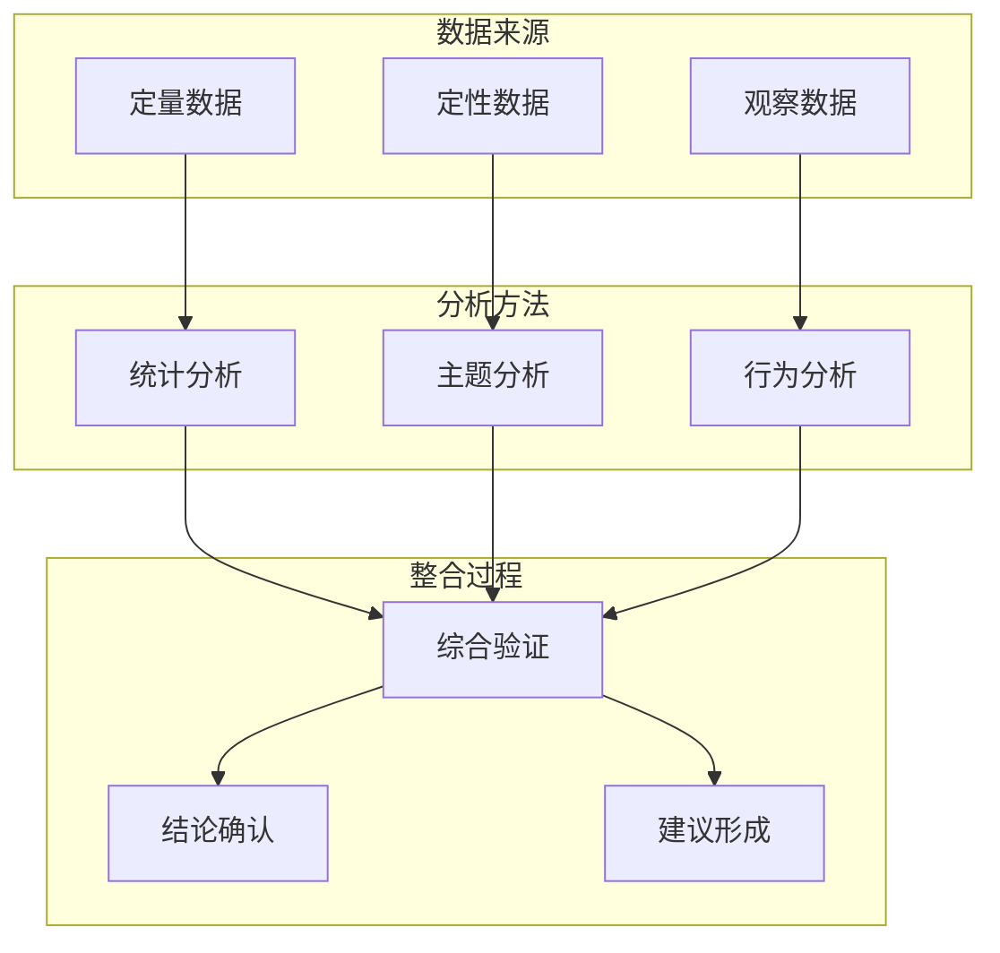
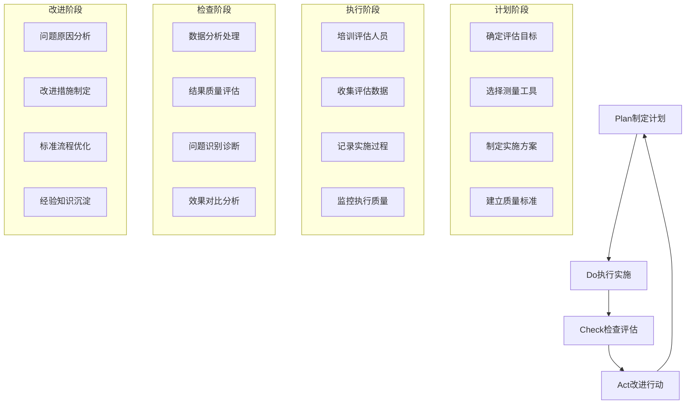

# Gender Discrimination Measurement and Assessment Tools (性别歧视测量与评估工具)

## 核心测量工具体系 (Core Measurement Tool System)

### 定量测量量表 (Quantitative Measurement Scales)

#### 性别歧视感知量表 (Gender Discrimination Perception Scale, GDPS)

| 量表维度 | 项目示例 | 评分方式 | 信效度指标 | 适用人群 |
| :--- | :--- | :--- | :--- | :--- |
| **职场歧视** | "在过去一年中，我因性别在工作中受到不公平对待" | 5点李克特量表(1=从不，5=总是) | α=0.91，重测信度r=0.84 | 职场女性、男性员工 |
| **教育歧视** | "在学校或培训机构中，我感受到基于性别的区别对待" | 5点李克特量表 | α=0.88，因子载荷>0.7 | 在校学生、教育工作者 |
| **家庭歧视** | "在我的家庭中，性别影响了资源分配和决策权" | 5点李克特量表 | α=0.85，结构效度良好 | 家庭成员 |
| **社会歧视** | "在公共场所或社交场合，我因性别受到不同对待" | 5点李克特量表 | α=0.89，区分效度显著 | 社会公众 |

#### 性别刻板印象量表 (Gender Stereotype Inventory, GSI)

| 刻板印象类型 | 测量内容 | 理论基础 | 项目数量 | 评分标准 |
| :--- | :--- | :--- | :--- | :--- |
| **能力刻板印象** | 数理能力、领导能力、技术技能等性别化认知 | 社会认知理论 | 20项 | 7点语义差异量表 |
| **性格刻板印象** | 温柔vs坚强、理性vs感性等性格特质归因 | 符号互动论 | 15项 | 5点李克特量表 |
| **角色刻板印象** | 职业角色、家庭角色、社会角色的性别期待 | 角色理论 | 25项 | 多选题+排序题 |
| **行为刻板印象** | 行为方式、表达方式、交往模式的性别规范 | 社会学习理论 | 18项 | 情境判断题 |

#### 性别平等态度量表 (Gender Equality Attitude Scale, GEAS)

| 态度维度 | 核心理念 | 测量方式 | 理论依据 | 文化适应性 |
| :--- | :--- | :--- | :--- | :--- |
| **机会平等** | 男女应享有同等的发展机会 | 情境判断题 | 机会平等理论 | 需要结合中国国情调整 |
| **结果平等** | 应通过政策实现实质性的性别平等 | 政策支持度测量 | 分配正义理论 | 考虑传统文化背景 |
| **角色平等** | 男女可以在各个领域自由选择角色 | 角色灵活性测量 | 性别角色理论 | 体现文化包容性 |
| **权力平等** | 男女应在决策和权力分配上平等 | 权力结构认知测量 | 权力关系理论 | 反映社会现实状况 |

### 定性评估方法 (Qualitative Assessment Methods)

#### 深度访谈指南 (In-depth Interview Guide)

##### 核心访谈主题框架

| 访谈维度 | 关键问题 | 探索要点 | 记录方式 | 分析方法 |
| :--- | :--- | :--- | :--- | :--- |
| **个人经历** | "请描述一次您感受到性别歧视的具体经历" | 事件背景、歧视表现、个人感受 | 录音+文字记录 | 主题分析法 |
| **认知态度** | "您如何看待当前社会中的性别不平等现象？" | 价值判断、归因方式、解决期待 | 开放式记录 | 内容分析法 |
| **应对策略** | "面对性别歧视，您通常采取什么应对方式？" | 策略选择、效果评估、资源利用 | 行为描述记录 | 扎根理论 |
| **社会支持** | "在处理性别歧视问题时，您获得了哪些支持？" | 支持来源、支持形式、支持效果 | 关系网络图 | 社会网络分析 |

##### 焦点小组讨论框架

| 讨论主题 | 引导问题 | 参与人员构成 | 讨论时长 | 数据收集 |
| :--- | :--- | :--- | :--- | :--- |
| **职场环境** | "您所在的工作环境中存在哪些性别相关的现象？" | 不同行业、职位、性别的员工 | 90-120分钟 | 录音+观察记录 |
| **教育经历** | "您的求学过程中有哪些性别相关的体验？" | 不同年龄段、教育背景的参与者 | 90分钟 | 小组互动记录 |
| **家庭关系** | "在您的家庭中，性别是如何影响关系和决策的？" | 不同家庭结构、代际的成员 | 120分钟 | 家庭系统图 |
| **社会参与** | "您在社会活动中观察到哪些性别现象？" | 社区工作者、志愿者、普通市民 | 90分钟 | 社会地图绘制 |

### 混合方法评估体系 (Mixed Methods Assessment System)

#### 三角验证框架 (Triangulation Validation Framework)

#### 多维度评估矩阵 (Multi-dimensional Assessment Matrix)

| 评估维度 | 测量工具 | 数据类型 | 分析重点 | 应用价值 |
| :--- | :--- | :--- | :--- | :--- |
| **认知层面** | 态度量表、知识测试 | 量化数据 | 性别平等意识水平 | 政策制定参考 |
| **行为层面** | 行为观察、情境测试 | 质性数据 | 歧视行为表现形式 | 干预策略设计 |
| **情感层面** | 心理量表、访谈记录 | 混合数据 | 心理创伤和情绪反应 | 心理支持方案 |
| **社会层面** | 网络分析、社区调查 | 网络数据 | 社会支持和影响力 | 系统性改革建议 |

## 专业评估指标体系 (Professional Evaluation Indicator System)

### 个体层面评估 (Individual Level Assessment)

#### 心理健康影响指标

| 指标类别 | 具体测量项 | 评估工具 | 临床意义 | 干预指向 |
| :--- | :--- | :--- | :--- | :--- |
| **抑郁症状** | 情绪低落、兴趣减退、自我价值感低 | CES-D量表 | 评估歧视对情绪的影响 | 心理治疗、支持干预 |
| **焦虑水平** | 担忧、紧张、恐惧情绪 | GAD-7量表 | 测量歧视引发的焦虑反应 | 认知行为干预 |
| **自尊水平** | 自我评价、自信程度、价值感 | Rosenberg自尊量表 | 反映歧视对自我认知的影响 | 自我肯定训练 |
| **应对方式** | 面对、回避、屈服等应对策略 | 简易应对方式问卷 | 了解个体应对模式 | 应对技能培训 |

#### 社会功能影响指标

| 功能维度 | 测量内容 | 评估方法 | 影响程度 | 支持需求 |
| :--- | :--- | :--- | :--- | :--- |
| **职业功能** | 工作表现、职业发展、收入水平 | 职业功能评估量表 | 中到严重影响 | 职业指导、权益维护 |
| **人际关系** | 社交能力、亲密关系、同伴支持 | 社会功能评定量表 | 轻到中度影响 | 社交技能训练 |
| **家庭功能** | 家庭关系、角色适应、沟通质量 | 家庭功能评定量表 | 中度影响 | 家庭治疗、关系调解 |
| **学习功能** | 学习动机、学业成绩、教育参与 | 学业功能评估工具 | 轻度到中度影响 | 教育支持、学习辅导 |

### 组织层面评估 (Organizational Level Assessment)

#### 工作场所性别平等指数

| 评估维度 | 核心指标 | 数据来源 | 评估标准 | 改进方向 |
| :--- | :--- | :--- | :--- | :--- |
| **招聘公平性** | 性别比例、歧视投诉率 | HR数据、员工调查 | 国际标准对比 | 完善招聘流程 |
| **薪酬平等性** | 性别薪酬差距、同工同酬实现度 | 薪酬数据库 | 行业基准对照 | 薪酬体系改革 |
| **晋升机会** | 晋升性别比例、职业发展支持 | 绩效考核记录 | 最佳实践对标 | 建立公平机制 |
| **工作环境** | 安全感、尊重度、包容性氛围 | 员工满意度调查 | 基准水平评估 | 文化建设推进 |

#### 教育机构性别友好度评估

| 评估要素 | 测量指标 | 评估方法 | 质量标准 | 优化建议 |
| :--- | :--- | :--- | :--- | :--- |
| **课程设置** | 性别平等内容覆盖率、教材性别敏感性 | 课程审查、内容分析 | 国家标准要求 | 课程内容改进 |
| **教学实践** | 教师性别意识、课堂互动公平性 | 课堂观察、学生反馈 | 专业发展标准 | 教师培训加强 |
| **校园文化** | 反歧视政策、支持服务体系 | 政策审查、服务评估 | 国际先进水平 | 制度完善推进 |
| **学生发展** | 性别发展机会、成就表现 | 学生成就数据 | 平等发展要求 | 资源配置优化 |

### 社会层面监测 (Societal Level Monitoring)

#### 宏观性别平等监测指标

| 监测领域 | 关键指标 | 数据来源 | 国际比较 | 趋势分析 |
| :--- | :--- | :--- | :--- | :--- |
| **政治参与** | 女性人大代表比例、女性领导干部比例 | 官方统计数据 | 全球性别差距报告 | 历史趋势追踪 |
| **经济赋权** | 女性劳动参与率、性别薪酬差距 | 劳动统计年鉴 | 国际劳工组织数据 | 发展阶段分析 |
| **教育平等** | 性别入学率、学科专业性别分布 | 教育统计年鉴 | UNESCO统计数据 | 结构变化观察 |
| **健康福祉** | 孕产妇死亡率、女性预期寿命 | 卫生统计年鉴 | 世界卫生组织数据 | 健康公平评估 |
| **安全保障** | 家庭暴力发生率、性犯罪报案率 | 公安统计数据 | 联合国妇女署报告 | 安全环境监测 |

#### 媒体再现分析框架

| 分析维度 | 测量内容 | 分析方法 | 评估标准 | 政策含义 |
| :--- | :--- | :--- | :--- | :--- |
| **数量表征** | 男女出现频率、发言机会 | 内容分析法 | 性别比例平衡标准 | 媒体配额制度 |
| **角色刻画** | 职业角色、性格特征、行为模式 | 文本分析法 | 多元角色呈现要求 | 内容创作指导 |
| **话语建构** | 性别议题报道角度、价值判断 | 批判话语分析 | 平等话语建构标准 | 媒体素养教育 |
| **影响效果** | 受众态度变化、行为模仿 | 实验研究法 | 积极影响最大化 | 传播策略优化 |

## 评估质量控制体系 (Assessment Quality Control System)

### 信效度保障机制 (Reliability and Validity Assurance Mechanisms)

#### 测量工具标准化流程

| 标准化环节 | 具体要求 | 质量控制点 | 验证方法 | 持续改进 |
| :--- | :--- | :--- | :--- | :--- |
| **工具开发** | 理论基础扎实、文化适应性强 | 专家评审、预测试 | 项目分析、因子分析 | 定期修订更新 |
| **施测过程** | 程序标准化、环境控制严格 | 培训认证、过程监督 | 现场观察、录音核查 | 质量监控体系 |
| **数据处理** | 方法科学、分析规范 | 统计软件验证、结果复核 | 描述统计、推断统计 | 技术标准更新 |
| **结果解释** | 理论依据充分、实践指导明确 | 专家审议、用户反馈 | 效标关联、交叉验证 | 应用效果追踪 |

#### 多元验证策略 (Multiple Validation Strategies)

| 验证类型 | 验证内容 | 验证方法 | 验证标准 | 质量保证 |
| :--- | :--- | :--- | :--- | :--- |
| **内容效度** | 工具是否全面覆盖测量构念 | 专家评议、文献对照 | 专家一致性>0.8 | 专业委员会审核 |
| **构念效度** | 理论构念与实际测量的一致性 | 因子分析、结构方程模型 | 拟合指数>0.9 | 统计学验证 |
| **效标效度** | 与外部标准的相关程度 | 相关分析、回归分析 | 相关系数>0.5 | 多重效标检验 |
| **跨文化效度** | 在不同文化背景下的适用性 | 多群体验证、功能差异检验 | 测量不变性检验 | 文化适应性测试 |

### 伦理审查与数据保护 (Ethical Review and Data Protection)

#### 研究伦理规范

| 伦理原则 | 具体要求 | 实施措施 | 监督机制 | 违规处理 |
| :--- | :--- | :--- | :--- | :--- |
| **知情同意** | 参与者充分了解研究目的和风险 | 书面知情同意书、口头解释 | 伦理委员会审批 | 撤销研究资格 |
| **隐私保护** | 个人信息和敏感数据严格保密 | 数据匿名化、访问权限控制 | 定期内部审计 | 法律责任追究 |
| **风险最小化** | 避免对参与者造成心理伤害 | 心理支持资源、退出机制 | 持续风险评估 | 立即终止研究 |
| **公平受益** | 研究结果惠及所有相关群体 | 结果公开分享、政策建议 | 社会影响评估 | 利益相关者参与 |

#### 数据安全管理

| 安全层级 | 保护措施 | 技术手段 | 管理制度 | 应急预案 |
| :--- | :--- | :--- | :--- | :--- |
| **物理安全** | 存储设备安全、访问控制 | 加密存储、生物识别 | 安全管理制度 | 数据备份恢复 |
| **网络安全** | 传输加密、防火墙保护 | SSL加密、入侵检测 | 网络安全策略 | 安全事件响应 |
| **应用安全** | 软件漏洞修复、权限管理 | 代码审计、访问日志 | 软件开发生命周期管理 | 安全漏洞修补 |
| **数据安全** | 数据脱敏、最小化原则 | 数据掩码、差分隐私 | 数据治理框架 | 数据泄露处置 |

## 实施应用指南 (Implementation and Application Guide)

### 评估工具选择原则 (Tool Selection Principles)

#### 适配性评估矩阵

| 选择维度 | 考虑因素 | 评估标准 | 决策权重 | 实施建议 |
| :--- | :--- | :--- | :--- | :--- |
| **研究目的** | 描述性vs解释性vs评估性研究 | 目标明确度、问题匹配度 | 高(30%) | 明确研究问题导向 |
| **目标群体** | 年龄、教育、文化背景特征 | 群体代表性、文化敏感性 | 高(25%) | 考虑群体特殊需求 |
| **资源条件** | 时间、人力、技术、资金限制 | 可行性评估、成本效益分析 | 中(20%) | 平衡质量与效率 |
| **应用场景** | 学术研究vs政策评估vs组织诊断 | 应用导向、结果用途 | 中(15%) | 区分不同应用需求 |
| **技术要求** | 数据收集、处理、分析能力 | 技术可行性、专业支持 | 低(10%) | 寻求专业技术支持 |

#### 工具组合策略

| 组合类型 | 适用场景 | 优势特点 | 实施要点 | 质量控制 |
| :--- | :--- | :--- | :--- | :--- |
| **单一工具** | 快速筛查、特定问题聚焦 | 简便高效、成本较低 | 明确测量目标、严格质量控制 | 标准化施测流程 |
| **双重工具** | 验证性研究、关键问题深入 | 相互验证、提高可靠性 | 工具互补性分析、数据一致性检验 | 交叉验证机制 |
| **多重工具** | 综合评估、复杂问题研究 | 全面深入、多维视角 | 系统性设计、协调性管理 | 整合分析框架 |
| **混合方法** | 探索性研究、机制分析 | 深度理解、理论建构 | 定量定性结合、阶段性整合 | 三角验证策略 |

### 质量改进循环 (Quality Improvement Cycle)

#### PDCA循环模型应用

通过建立这套完整的测量评估体系，可以为性别歧视研究和干预提供科学、可靠的评估工具和方法，确保研究质量和实践效果。

**相关文档链接 (Related Documents):
- [性别歧视概览](Gender_Discrimination_Overview.md) - 理论基础和现状分析
- [重男轻女文化根源分析](Son_Preference_Cultural_Origins.md) - 文化和社会结构因素
- [当代影响与表现](Contemporary_Impacts_Manifestations.md) - 现代表现形式
- [心理创伤与代际传递](Psychological_Trauma_Intergenerational.md) - 心理影响机制
- [干预策略与政策建议](Intervention_Strategies_Policy.md) - 解决策略和建议
- [国际比较与最佳实践](International_Comparison_Best_Practices.md) - 国际经验借鉴
- [测量与评估工具](Gender_Discrimination_Measurement_Tools.md) - 专业的测量量表和评估方法
- [标准化术语词典](Gender_Discrimination_Terminology_Standards.md) - 统一的专业术语定义
- [干预效果评估](Gender_Discrimination_Effectiveness_Evaluation.md) - 全面的效果评估体系
- [案例分析集](Gender_Discrimination_Case_Studies.md) - 典型案例深度解析
- [实践指南](Gender_Discrimination_Practical_Guide.md) - 实践操作指导手册
- [培训材料](Gender_Discrimination_Training_Materials.md) - 培训课程体系和教学设计

*本文档基于心理测量学、社会学研究方法、统计学等专业理论，结合性别平等研究的特殊要求，构建了系统性的测量评估工具体系。*

**参考文献 (References):**
- American Psychological Association. (2020). Standards for Educational and Psychological Testing.
- United Nations. (2023). Gender Equality Indicators Framework.
- World Health Organization. (2022). Gender and Health Equity Measurement Toolkit.
- 国家统计局. (2023). 中国妇女社会地位调查测量指标体系.
- 李银河. (2022). 性别社会学研究方法与测量工具. 社会科学文献出版社.