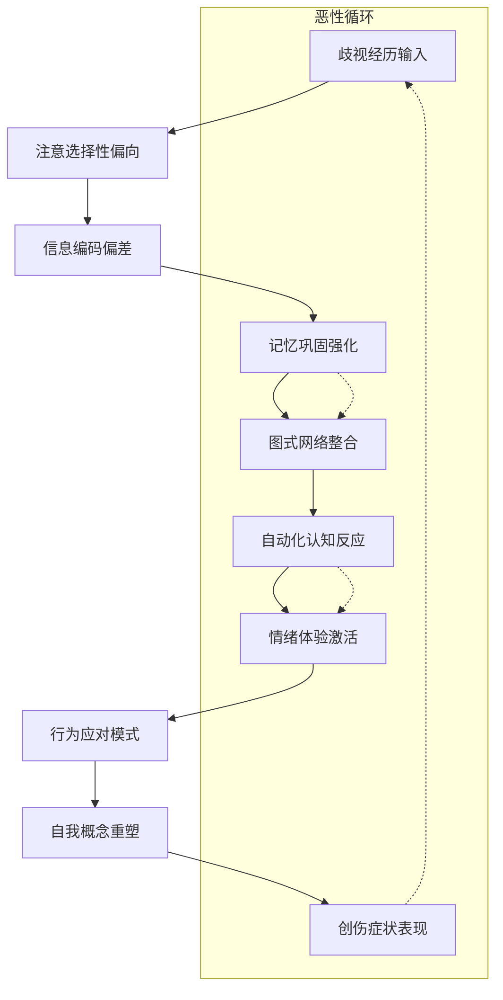

# Psychological Trauma and Intergenerational Transmission of Gender Discrimination (性别歧视的心理创伤与代际传递)

## 个体心理创伤机制分析 (Individual Psychological Trauma Mechanism Analysis)

### 创伤形成的认知加工过程 (Cognitive Processing Process of Trauma Formation)

#### 性别歧视认知图式的建构 (Construction of Gender Discrimination Cognitive Schema)

#### 自我概念的扭曲与损伤 (Distortion and Damage of Self-concept)

| 自我概念维度 | 正常发展轨迹 | 歧视影响下的偏离 | 心理机制 | 修复路径 |
| :--- | :--- | :--- | :--- | :--- |
| **能力自我** | 基于实际表现形成稳定的自信 | 能力被系统性低估，产生习得性无助 | 负面反馈循环，自我效能感下降 | 积极体验积累，成功经验重建 |
| **价值自我** | 认识到自身独特价值和贡献 | 内化性别等级观念，自我价值感低下 | 社会比较理论，相对剥夺感 | 价值多元化认知，内在价值肯定 |
| **关系自我** | 建立平等互惠的人际关系 | 在关系中处于从属地位，缺乏平等感 | 依恋理论，权力不平衡体验 | 关系边界设定，平等交往技能 |
| **未来自我** | 对未来发展抱有积极期待 | 职业发展受限，人生选择空间狭窄 | 期望价值理论，机会成本过高 | 目标重新设定，可能性探索 |

### 情绪调节障碍的表现 (Manifestations of Emotional Regulation Disorders)

#### 创伤相关的情绪反应模式 (Trauma-related Emotional Response Patterns)

| 情绪类型 | 典型表现 | 生理反应 | 认知评价 | 行为后果 |
| :--- | :--- | :--- | :--- | :--- |
| **愤怒情绪** | 对不公正待遇的强烈不满和反抗冲动 | 血压升高，肌肉紧张，肾上腺素分泌增加 | "为什么是我？"、"这不公平！" | 攻击行为，关系破裂，身心耗竭 |
| **羞耻感** | 因性别身份而产生的深层自卑和自我厌恶 | 面部潮红，心跳加速，回避眼神接触 | "我不够好"、"我应该更像男性" | 社交退缩，自我封闭，抑郁倾向 |
| **焦虑情绪** | 对未来不确定性的过度担忧和恐惧 | 皮质醇水平持续升高，睡眠质量下降 | "我会不会又被歧视？"、"我能应对吗？" | 回避行为，完美主义倾向，身心疲惫 |
| **抑郁情绪** | 持续的悲伤、绝望和无价值感 | 神经递质失衡，免疫功能下降 | "努力没有意义"、"改变是不可能的" | 活动减少，兴趣丧失，自杀风险 |

#### 情绪压抑与表达困难 (Emotional Suppression and Expression Difficulties)

| 压抑形式 | 具体表现 | 心理代价 | 身体症状 | 突破策略 |
| :--- | :--- | :--- | :--- | :--- |
| **情感隔离** | 理智化处理歧视经历，避免情绪卷入 | 情感麻木，人际疏离，创造力下降 | 慢性疲劳，消化系统紊乱，免疫力降低 | 情绪觉察训练，安全环境营造 |
| **愤怒内化** | 将对外部不公的愤怒转向自身 | 自我攻击，完美主义，身心俱疲 | 头痛失眠，肌肉紧张，心血管问题 | 愤怒管理技巧，自我同情练习 |
| **悲伤否认** | 拒绝承认和处理因歧视造成的损失 | 延迟哀伤，复杂性哀伤，创伤后应激 | 胸闷气短，食欲改变，睡眠障碍 | 哀伤辅导，叙事治疗，意义重构 |
| **恐惧回避** | 为了避免再次受伤而回避相关情境 | 机会丧失，发展受限，安全感缺失 | 焦虑症状，惊恐发作，广场恐惧 | 渐进式暴露，安全基地建设，资源链接 |

### 行为模式的适应性改变 (Adaptive Behavioral Pattern Changes)

#### 应对策略的类型学分析 (Typology Analysis of Coping Strategies)

| 应对类型 | 具体策略 | 短期效果 | 长期后果 | 适用情境 |
| :--- | :--- | :--- | :--- | :--- |
| **问题聚焦应对** | 积极寻求解决方案，提升自身能力 | 增强控制感，提高问题解决效率 | 建立积极循环，促进个人成长 | 可控的歧视情境，有改善空间的环境 |
| **情绪聚焦应对** | 寻求情感支持，进行情绪宣泄和调节 | 缓解当下痛苦，获得心理慰藉 | 维持心理健康，增强韧性 | 情绪冲击强烈的情境，需要情感处理的情况 |
| **回避应对** | 逃避或忽视歧视问题，转移注意力 | 减少即时痛苦，避免冲突 | 问题积累恶化，适应不良 | 威胁过大无法承受，暂时性自我保护 |
| **重新评价应对** | 重新诠释歧视经历的意义和价值 | 获得新的理解角度，减少负面影响 | 促进心理成长，增强意义感 | 有一定反思能力，寻求成长机会的个体 |

#### 习得性无助的行为表现 (Behavioral Manifestations of Learned Helplessness)

| 行为特征 | 典型表现 | 心理机制 | 维持因素 | 干预方向 |
| :--- | :--- | :--- | :--- | :--- |
| **主动性降低** | 面对机会时犹豫不决，缺乏行动力 | 控制感缺失，预期失败 | 过往负面经验的泛化 | 小步骤成功体验，控制感重建 |
| **依赖性增强** | 过度依赖他人决策，缺乏独立判断 | 自我效能感不足，风险规避 | 安全感需求，避免再次受伤 | 自主性培养，决策能力训练 |
| **完美主义倾向** | 设置过高标准，害怕犯错和失败 | 补偿心理，证明自身价值 | 内化的高标准期待 | 现实标准设定，自我接纳练习 |
| **社交回避** | 减少社会交往，避免潜在的歧视情境 | 保护性策略，减少伤害风险 | 负面预期，安全感缺失 | 安全社交环境，渐进式接触 |

## 家庭系统动力分析 (Family System Dynamics Analysis)

### 家庭角色结构的性别化 (Genderization of Family Role Structure)

#### 代际角色期待的传递机制 (Intergenerational Role Expectation Transmission Mechanism)

| 传递路径 | 具体机制 | 影响方式 | 心理后果 | 干预策略 |
| :--- | :--- | :--- | :--- | :--- |
| **显性教导** | 父母直接传授性别角色规范和行为准则 | 言语指导，行为示范，奖惩机制 | 内化传统性别观念，限制个性发展 | 开放式沟通，平等对话，多元榜样 |
| **隐性学习** | 通过观察家庭成员互动模式获得性别认知 | 日常观察，情境体验，文化浸润 | 无意识习得性别刻板印象，行为模式固化 | 意识觉醒教育，反思性实践，环境改造 |
| **情感联结** | 亲子关系中的性别差异化情感表达和回应 | 情感温暖，关注程度，互动质量 | 形成不同的安全感和自我价值感 | 情感教育普及，亲子关系改善，心理支持 |
| **资源分配** | 家庭资源（教育、经济、时间）的性别差异化投入 | 投资决策，机会提供，支持力度 | 造成发展机会的不平等，能力差异固化 | 公平资源分配，机会均等化，政策支持 |

#### 家庭权力结构的性别特征 (Gender Characteristics of Family Power Structure)

| 权力维度 | 男性主导表现 | 女性从属地位 | 维持机制 | 变革阻力 |
| :--- | :--- | :--- | :--- | :--- |
| **经济决策权** | 掌握家庭主要经济资源，重大支出决定权 | 在大额消费决策中话语权有限 | 经济依赖关系，传统角色分工 | 经济独立性不足，社会地位差异 |
| **子女教育权** | 对子女学业和职业选择具有重要影响力 | 在教育理念和方法上更多承担执行角色 | 教育资源控制，社会期望压力 | 教育参与度差异，话语权不平衡 |
| **家庭事务权** | 外部事务处理，重大事项决策 | 内部事务管理，日常运作协调 | 领域分工，能力认知差异 | 能力刻板印象，参与机会不等 |
| **情感表达权** | 情感表达相对克制，理性决策主导 | 承担更多情感劳动，情绪调节责任 | 情感角色分工，表达方式差异 | 情感表达规范，社会期待约束 |

### 亲子关系中的创伤传递 (Trauma Transmission in Parent-Child Relationships)

#### 情感忽视的代际延续 (Intergenerational Continuation of Emotional Neglect)

| 忽视类型 | 表现形式 | 心理影响 | 传递机制 | 干预重点 |
| :--- | :--- | :--- | :--- | :--- |
| **情感支持缺失** | 缺乏温暖关怀，情感需求得不到及时回应 | 安全感缺失，依恋关系不安全 | 照顾者自身情感忽视经历的重现 | 情感教育普及，亲子沟通技能 |
| **成就压力过度** | 过分关注学业成绩，忽视全面发展 | 自我价值感建立在外在评价基础上 | 父母焦虑情绪和期望的传递 | 全人发展理念，多元成功标准 |
| **自主性压制** | 过度控制，不允许独立思考和选择 | 自主性发展受阻，决策能力不足 | 控制欲和安全感需求的代际传递 | 边界设定训练，独立性培养 |
| **冲突处理不当** | 家庭冲突频繁且处理方式粗暴 | 情绪调节能力差，人际交往困难 | 冲突解决模式的无意识复制 | 冲突调解技巧，情绪管理训练 |

#### 创伤性沟通模式 (Traumatic Communication Patterns)

| 沟通类型 | 典型表现 | 心理机制 | 代际影响 | 改善方向 |
| :--- | :--- | :--- | :--- | :--- |
| **批评指责型** | 频繁使用否定性语言，过分挑剔 | 完美主义倾向，控制欲表达 | 自我价值感低下，防御性沟通 | 积极倾听训练，建设性反馈 |
| **情感冷漠型** | 缺乏情感表达，沟通表面化 | 情感隔离，自我保护机制 | 情感表达困难，亲密关系障碍 | 情感表达练习，共情能力培养 |
| **威胁控制型** | 使用威胁手段达到控制目的 | 权力不平等，恐惧驱动 | 焦虑恐惧情绪，顺从行为模式 | 安全沟通环境，平等对话机制 |
| **回避逃避型** | 遇到冲突时选择逃避，不愿面对 | 冲突焦虑，问题解决能力不足 | 冲突处理技能缺乏，关系疏远 | 冲突面对训练，问题解决技巧 |

## 代际传递的心理机制 (Psychological Mechanisms of Intergenerational Transmission)

### 无意识传递过程 (Unconscious Transmission Process)

#### 投射与认同机制 (Projection and Identification Mechanisms)

| 机制类型 | 运作方式 | 心理功能 | 传递效果 | 干预策略 |
| :--- | :--- | :--- | :--- | :--- |
| **负面投射** | 父母将自身的挫败感和不满投射到孩子身上 | 心理防御，情绪宣泄 | 孩子内化负面评价，自我概念受损 | 自我觉察训练，情绪管理技能 |
| **理想化投射** | 父母将未实现的愿望和期待投射给孩子 | 补偿心理，成就感获得 | 孩子承受过度压力，真实自我被压抑 | 现实期望设定，个性化发展支持 |
| **认同形成** | 孩子通过认同父母的行为模式来获得安全感 | 学习适应，身份建构 | 性别角色刻板印象的内化和延续 | 多元榜样提供，批判性思维培养 |
| **反向认同** | 孩子刻意反对父母的性别观念以彰显独立性 | 反叛心理，自主性表达 | 可能走向另一个极端，同样存在偏见 | 平衡发展引导，理性讨论促进 |

#### 情感调节模式的传承 (Inheritance of Emotional Regulation Patterns)

| 调节模式 | 父母表现 | 孩子学习 | 影响后果 | 改变路径 |
| :--- | :--- | :--- | :--- | :--- |
| **压抑型调节** | 情绪表达克制，倾向于内部消化 | 学会隐藏真实情感，避免冲突 | 情感麻木，身心症状，关系疏离 | 情绪表达安全环境，健康调节技巧 |
| **爆发型调节** | 情绪表达激烈，容易失控发脾气 | 模仿激烈的情绪表达方式 | 情绪不稳定，人际关系紧张 | 情绪识别训练，冷静技巧学习 |
| **回避型调节** | 遇到情绪问题选择逃避或转移注意力 | 学会回避而非面对情绪困扰 | 情绪处理能力不足，问题积累 | 情绪面对勇气培养，解决技能训练 |
| **求助型调节** | 善于寻求外部支持来处理情绪问题 | 学会主动寻求帮助和支持 | 社会支持网络良好，适应能力较强 | 支持系统建设，求助技能培训 |

### 文化脚本的内化过程 (Internalization Process of Cultural Scripts)

#### 性别角色脚本的学习 (Learning of Gender Role Scripts)

| 学习阶段 | 主要内容 | 内化方式 | 心理影响 | 干预时机 |
| :--- | :--- | :--- | :--- | :--- |
| **早期启蒙** (0-6岁) | 基本性别区分，简单角色模仿 | 游戏扮演，故事讲述，日常观察 | 性别意识初步形成，行为倾向出现 | 早期教育介入，环境优化 |
| **学龄期发展** (7-12岁) | 角色规范强化，能力期待分化 | 学校教育，同伴影响，媒体接触 | 性别刻板印象固化，兴趣爱好定向 | 教育改革推进，多元引导 |
| **青春期探索** (13-18岁) | 身份认同深化，社会期待内化 | 同伴群体，恋爱关系，社会参与 | 性别角色认同巩固，行为模式定型 | 青春期指导，价值澄清 |
| **成年期实践** (18岁以后) | 角色脚本实际应用，社会适应检验 | 职场体验，婚恋实践，社会互动 | 性别角色模式成熟，代际传递开始 | 成人教育深化，终身学习 |

#### 家庭叙事的建构与传承 (Construction and Inheritance of Family Narratives)

| 叙事类型 | 内容特征 | 传递方式 | 心理功能 | 更新策略 |
| :--- | :--- | :--- | :--- | :--- |
| **成功叙事** | 强调通过符合性别期待的行为获得成功 | 家族故事，个人经历分享，榜样树立 | 增强认同感，提供行为指导 | 多元成功标准，个性化路径 |
| **苦难叙事** | 描述违背性别规范带来的困难和挫折 | 警示故事，经验教训，情感渲染 | 产生恐惧感，强化规范遵守 | 平衡视角呈现，成长型思维 |
| **拯救叙事** | 展现男性拯救女性或家庭的经典情节 | 神话传说，历史故事，影视作品 | 确立权力结构，维护传统秩序 | 平等伙伴关系，互助合作理念 |
| **传承叙事** | 强调家族传统和价值观的代际延续 | 家谱记录，仪式活动，文化实践 | 增强归属感，维护文化连续性 | 开放包容态度，创新发展思维 |

## 创伤后成长的可能性 (Possibility of Post-traumatic Growth)

### 创伤转化的积极机制 (Positive Mechanisms of Trauma Transformation)

#### 意义建构过程 (Meaning-making Process)

| 建构阶段 | 核心任务 | 心理过程 | 支持条件 | 成长表现 |
| :--- | :--- | :--- | :--- | :--- |
| **混乱期** | 面对创伤事实，处理初始冲击 | 认知失调，情绪震荡，现实检验 | 安全环境，情感支持，专业帮助 | 情绪稳定，现实接受 |
| **反思期** | 重新审视创伤经历和个人信念 | 认知重构，价值澄清，假设检验 | 心理咨询，同伴支持，自我探索 | 新的理解框架，信念调整 |
| **整合期** | 将创伤经历纳入人生叙事 | 意义整合，身份重建，未来规划 | 创造性表达，社会参与，目标设定 | 生命意义增强，自我效能提升 |
| **超越期** | 从创伤经历中获得超越性洞察 | 智慧增长，慈悲心发展，使命感形成 | 精神实践，利他行为，社会贡献 | 心理韧性强，积极影响力扩大 |

#### 韧性发展的促进因素 (Facilitating Factors of Resilience Development)

| 因素类型 | 具体内容 | 作用机制 | 培养方法 | 效果评估 |
| :--- | :--- | :--- | :--- | :--- |
| **个人因素** | 乐观性格，问题解决能力，自我效能感 | 内在资源调动，应对策略优化 | 心理技能培训，成功经验积累 | 适应能力提升，心理健康改善 |
| **关系因素** | 支持性人际关系，安全依恋，社会网络 | 外部资源获取，情感慰藉，信息支持 | 关系建设指导，沟通技能培训 | 社会支持增强，孤独感减少 |
| **文化因素** | 积极的价值观，意义系统，精神信仰 | 认知框架支撑，生活方向指引 | 文化教育深化，精神实践推广 | 人生意义感增强，内心平静提升 |
| **环境因素** | 公平的机会，包容的氛围，支持性政策 | 外部条件改善，障碍减少，资源增加 | 环境优化推进，政策倡导参与 | 发展机会增多，参与度提高 |

### 代际治愈的实现路径 (Realization Path of Intergenerational Healing)

#### 家庭系统修复策略 (Family System Repair Strategies)

| 修复层面 | 具体措施 | 实施要点 | 预期效果 | 注意事项 |
| :--- | :--- | :--- | :--- | :--- |
| **沟通改善** | 建立开放、诚实的家庭沟通机制 | 倾听技巧训练，表达方式改进，定期家庭会议 | 理解增进，冲突减少，关系改善 | 循序渐进，耐心坚持 |
| **角色重构** | 重新定义家庭成员的角色和责任分工 | 能力评估，兴趣匹配，协商决定 | 责任共担，压力减轻，满意度提升 | 尊重个体差异，灵活调整 |
| **边界设定** | 明确家庭成员间的适当边界和相互尊重 | 边界类型识别，表达方式训练，违规处理机制 | 自主权增强，关系健康，冲突减少 | 温和坚定，一致性维护 |
| **仪式创新** | 创造新的家庭仪式来强化积极价值观 | 仪式设计原则，全员参与，定期评估调整 | 归属感增强，价值观传递，凝聚力提升 | 文化敏感性，个性化定制 |

#### 社会支持网络建设 (Social Support Network Construction)

| 网络类型 | 构建方式 | 功能特点 | 维护策略 | 扩展潜力 |
| :--- | :--- | :--- | :--- | :--- |
| **专业支持网络** | 心理咨询师、社工、法律顾问等专业人士组成 | 专业性强，针对性好，保密性高 | 定期督导，质量监控，持续培训 | 专业化程度提升，服务范围扩大 |
| **同伴支持网络** | 经历相似的个体自发形成的互助群体 | 共鸣性强，理解深刻，支持及时 | 活动组织，经验分享，情感交流 | 规模扩大，影响力增强 |
| **社区支持网络** | 基于地理位置的邻里互助和社区资源整合 | 便利性强，持续性好，覆盖面广 | 社区建设，资源整合，活动开展 | 社区凝聚力增强，服务质量提升 |
| **在线支持网络** | 利用互联网平台建立的虚拟支持社群 | 可及性高，匿名性强，信息丰富 | 平台维护，内容管理，互动促进 | 技术升级，用户增长，功能完善 |

## 预防与早期干预体系 (Prevention and Early Intervention System)

### 风险识别与评估工具 (Risk Identification and Assessment Tools)

#### 个体层面的风险筛查 (Individual-level Risk Screening)

| 筛查维度 | 评估指标 | 测量工具 | 预警阈值 | 干预建议 |
| :--- | :--- | :--- | :--- | :--- |
| **心理症状** | 抑郁、焦虑、创伤后应激症状 | PHQ-9, GAD-7, PCL-5量表 | 临床显著水平 | 心理咨询转介，危机干预启动 |
| **功能损害** | 社会功能、职业功能、人际关系受损程度 | WHO-DAS 2.0 | 中重度功能损害 | 多学科团队介入，综合治疗方案 |
| **应对方式** | 消极应对策略使用频率和强度 | 简易应对方式问卷 | 回避、自责等消极策略高频使用 | 应对技能培训，积极策略培养 |
| **社会支持** | 可获得的社会支持质量和数量 | 社会支持评定量表 | 支持水平低下 | 支持网络建设，资源链接促进 |

#### 家庭层面的风险评估 (Family-level Risk Assessment)

| 评估领域 | 关键指标 | 评估方法 | 风险等级 | 干预重点 |
| :--- | :--- | :--- | :--- | :--- |
| **家庭功能** | 沟通、角色、情感表达、问题解决等方面 | 家庭功能评定量表(FAD) | 功能不良 | 家庭治疗介入，功能改善训练 |
| **亲子关系** | 依恋质量、沟通模式、情感连接程度 | 亲子关系量表 | 关系紧张或疏离 | 亲子互动改善，关系修复工作 |
| **家庭暴力** | 身体、情感、性暴力的发生频率和严重程度 | 冲突战术量表(CTS) | 轻微到严重不等 | 危机干预，安全保护，法律援助 |
| **经济压力** | 家庭经济状况对成员心理的影响 | 家庭经济压力量表 | 压力过大 | 经济援助，财务管理指导 |

### 早期干预的多层次策略 (Multi-level Strategies for Early Intervention)

#### 一级预防：全民教育与意识提升 (Primary Prevention: Public Education and Awareness Enhancement)

| 干预层次 | 目标人群 | 干预内容 | 实施方式 | 效果评估 |
| :--- | :--- | :--- | :--- | :--- |
| **学校教育** | 全体学生、教师、家长 | 性别平等教育，反歧视意识 | 课程融入，主题活动，师资培训 | 态度改变，知识增加，行为改善 |
| **社区宣传** | 社区居民、社区工作者 | 性别平等理念普及，反歧视文化建设 | 宣传栏、讲座、文艺活动 | 认知提升，氛围改善，参与度增加 |
| **媒体传播** | 广大受众、媒体从业者 | 正面典型宣传，歧视现象曝光 | 新闻报道、公益广告、专题节目 | 舆论引导，社会关注，价值观塑造 |
| **政策倡导** | 决策者、相关机构 | 性别平等政策推动，法律完善 | 政策建议、立法参与、监督评估 | 制度环境改善，权益保障加强 |

#### 二级预防：高危人群识别与支持 (Secondary Prevention: High-risk Population Identification and Support)

| 干预对象 | 识别标准 | 支持措施 | 实施主体 | 跟踪评估 |
| :--- | :--- | :--- | :--- | :--- |
| **职场女性** | 面临就业歧视、晋升障碍的女性 | 职业指导、法律援助、心理支持 | 妇联组织、工会、专业机构 | 就业状况改善，权益维护效果 |
| **在校学生** | 遭遇教育歧视、校园霸凌的学生 | 心理辅导、同伴支持、家校合作 | 学校心理咨询中心、班主任 | 学习适应改善，心理健康提升 |
| **家庭主妇** | 缺乏经济独立性、社会参与度低的女性 | 技能培训、创业支持、社会融入 | 社区服务中心、妇联组织 | 经济能力增强，社会参与度提高 |
| **流动人口** | 户籍限制、社会保障缺失的女性群体 | 权益维护、生活支持、城市融入 | 社会服务机构、志愿组织 | 基本需求满足，融入程度提升 |

#### 三级预防：创伤治疗与康复 (Tertiary Prevention: Trauma Treatment and Rehabilitation)

| 治疗层面 | 干预目标 | 核心方法 | 专业要求 | 康复指标 |
| :--- | :--- | :--- | :--- | :--- |
| **急性期干预** | 稳定情绪，确保安全，防止恶化 | 危机干预，安全评估，紧急处理 | 危机干预资质，急救技能 | 情绪稳定，安全风险解除 |
| **中期治疗** | 处理创伤，重建认知，恢复功能 | 创伤聚焦治疗，认知行为疗法 | 创伤治疗专长，心理咨询师资格 | 创伤症状缓解，功能恢复 |
| **长期康复** | 促进成长，预防复发，全面提升 | 整合性治疗，生活技能训练 | 综合治疗能力，康复专业背景 | 心理健康维持，生活质量提升 |
| **社会融入** | 重建社会关系，恢复社会功能 | 社会技能训练，就业支持 | 社会工作资质，职业指导经验 | 社会功能恢复，独立生活能力 |

通过对性别歧视造成的心理创伤及其代际传递机制的深入分析，我们可以看到这一问题的复杂性和深远影响。有效的干预需要从个体、家庭、社会多个层面入手，既要治疗已经形成的创伤，更要预防新的创伤产生，最终实现代际治愈和社会进步。

**相关文档链接 (Related Documents):
- [性别歧视概览](Gender_Discrimination_Overview.md) - 理论基础和现状分析
- [重男轻女文化根源分析](Son_Preference_Cultural_Origins.md) - 文化和社会结构因素
- [当代影响与表现](Contemporary_Impacts_Manifestations.md) - 现代表现形式
- [心理创伤与代际传递](Psychological_Trauma_Intergenerational.md) - 心理影响机制
- [干预策略与政策建议](Intervention_Strategies_Policy.md) - 解决策略和建议
- [国际比较与最佳实践](International_Comparison_Best_Practices.md) - 国际经验借鉴
- [测量与评估工具](Gender_Discrimination_Measurement_Tools.md) - 专业的测量量表和评估方法
- [标准化术语词典](Gender_Discrimination_Terminology_Standards.md) - 统一的专业术语定义
- [干预效果评估](Gender_Discrimination_Effectiveness_Evaluation.md) - 全面的效果评估体系
- [案例分析集](Gender_Discrimination_Case_Studies.md) - 典型案例深度解析
- [实践指南](Gender_Discrimination_Practical_Guide.md) - 实践操作指导手册
- [培训材料](Gender_Discrimination_Training_Materials.md) - 培训课程体系和教学设计

*本文档基于创伤心理学、家庭系统理论、发展心理学等专业理论，结合临床实践和研究成果，系统分析性别歧视的心理创伤机制和代际传递规律，为相关干预工作提供科学指导。*

**参考文献 (References):**
- American Psychological Association. (2020). Trauma and Stressor-Related Disorders.
- Herman, J. L. (2015). Trauma and Recovery: The Sequel to Narcissism. Basic Books.
- Bowlby, J. (2018). Attachment and Loss: Vol. 1. Attachment. Basic Books.
- National Child Traumatic Stress Network. (2022). Complex Trauma Fact Sheet.
- 中国心理学会. (2023). 创伤心理学专业委员会工作年报.