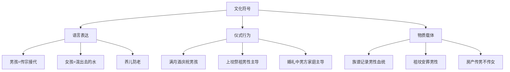

# Root Causes of Son Preference in China (中国重男轻女文化根源分析)

## 传统文化根基分析 (Traditional Cultural Foundation Analysis)

### 儒家思想体系的影响 (Impact of Confucian Ideological System)

#### 核心价值观念 (Core Value Concepts)

| 观念维度 | 具体内涵 | 经典依据 | 现代表现 | 心理机制 |
| :--- | :--- | :--- | :--- | :--- |
| **宗法继承** | 男性承担家族血脉延续责任 | 《礼记·丧服小记》："男子生生之谓礼" | 户籍登记、财产继承以男性为主 | 生存焦虑驱动的繁衍本能 |
| **孝道义务** | 儿子承担养老送终责任 | 《孝经》："身体发肤，受之父母" | 养老保险依赖儿子，女儿"嫁出去" | 风险规避的心理补偿机制 |
| **社会地位** | 男性代表家族社会声望 | 《孟子》："不孝有三，无后为大" | 职位晋升、社会参与机会不平等 | 群体认同与自尊维护需要 |
| **权力结构** | 男主外女主内的角色分工 | 《易经》："天行健，君子以自强不息" | 职场天花板效应，家庭责任单一化 | 控制欲与安全感获得途径 |

#### 文化符号系统的建构 (Construction of Cultural Symbol System)

### 宗族制度的历史延续 (Historical Continuity of Clan System)

#### 传统宗族结构特征 (Characteristics of Traditional Clan Structure)

| 结构要素 | 具体表现 | 功能作用 | 现代转化 |
| :--- | :--- | :--- | :--- |
| **血缘纽带** | 父系血统认定，女性出嫁后脱离原生家族 | 维系家族连续性和纯洁性 | 户籍制度中的性别差异体现 |
| **等级秩序** | 族长-房长-家长的垂直管理体系 | 确保权威性和执行力 | 企业组织中的等级化管理模式 |
| **共同财产** | 族田、祠堂等共有资产的男性管理权 | 强化男性经济主导地位 | 房产继承中的性别偏向 |
| **祭祀特权** | 祖先祭祀活动的男性专属参与权 | 确立男性精神权威地位 | 宗教活动中的话语权分配 |

#### 祠堂文化的象征意义 (Symbolic Meaning of Ancestral Hall Culture)

| 文化层面 | 象征内容 | 心理功能 | 社会效应 |
| :--- | :--- | :--- | :--- |
| **空间象征** | 祠堂建筑的方位布局体现男尊女卑 | 空间秩序反映社会秩序 | 强化性别等级观念的空间体验 |
| **时间象征** | 祖先牌位的世代延续强调血脉传承 | 时间连续性增强身份认同 | 加剧对后代性别的焦虑关注 |
| **权力象征** | 祠堂议事决策权掌握在男性手中 | 权威合法性的确立机制 | 巩固男性在家族决策中的主导地位 |

### 农业社会的经济逻辑 (Economic Logic of Agricultural Society)

#### 劳动分工的性别化 (Genderization of Labor Division)

| 劳动类型 | 男性优势领域 | 女性承担领域 | 经济价值差异 | 现代遗留影响 |
| :--- | :--- | :--- | :--- | :--- |
| **体力劳动** | 重农具操作、重物搬运、田间耕作 | 纺织刺绣、家务料理、 childcare | 男性劳动被认为创造直接经济价值 | 重工轻理的专业选择倾向 |
| **技能劳动** | 木工、铁匠、建筑等技术工种 | 食品加工、缝纫等手工技艺 | 技术性工作获得更高社会评价 | STEM领域的性别差距 |
| **商业贸易** | 外出经商、长途贩运 | 本地集市的小额交易 | 外向型经济活动社会地位更高 | 创业投资中的性别偏见 |

#### 生产资料的所有权结构 (Ownership Structure of Means of Production)

| 资料类型 | 男性控制程度 | 女性获得途径 | 制约机制 | 现代转化形式 |
| :--- | :--- | :--- | :--- | :--- |
| **土地资源** | 绝对控制，女性无继承权 | 通过婚姻间接获得使用权 | 户籍制度、继承法规定 | 房地产投资中的性别差异 |
| **生产工具** | 犁、耙等大型农具专属 | 纺车、针线等小型工具 | 体力差异、技术垄断 | 高端设备操作的性别门槛 |
| **牲畜资源** | 牛、马等大型牲畜管理权 | 鸡、鸭等小型家禽照料 | 管理复杂度、风险承担能力 | 重大项目决策的性别偏向 |

## 社会结构因素分析 (Social Structural Factors Analysis)

### 户籍制度的制度性影响 (Institutional Impact of Hukou System)

#### 城乡二元结构下的性别分化 (Gender Differentiation under Urban-Rural Dual Structure)

| 区域特征 | 重男轻女表现 | 制度根源 | 心理机制 | 现代演变 |
| :--- | :--- | :--- | :--- | :--- |
| **农村地区** | 生育男孩意愿强烈，超生现象普遍 | 土地承包权与户籍挂钩，男性继承传统 | 生存保障焦虑，养老恐惧 | 农村土地流转政策影响减弱 |
| **城镇地区** | 教育投入男孩优先，职业发展支持男性 | 国企就业、干部选拔的性别偏好 | 社会流动焦虑，阶层维持需求 | 市场经济冲击传统优势 |
| **城郊结合部** | 拆迁补偿中的性别歧视明显 | 房屋产权认定的男性偏向 | 财富获取焦虑，投机心理 | 征地补偿政策逐步规范化 |

#### 社会保障体系的缺陷 (Deficiencies in Social Security System)

| 保障类型 | 男性优势 | 女性劣势 | 制度设计问题 | 改革方向 |
| :--- | :--- | :--- | :--- | :--- |
| **养老保险** | 男性缴费年限长，退休金高 | 女性中断缴费多，保障水平低 | 缴费记录与性别角色挂钩 | 灵活就业人员保障完善 |
| **医疗保险** | 男性享受更好的医疗服务 | 女性生殖健康服务不足 | 医疗资源配置的性别盲区 | 妇幼保健服务加强 |
| **失业保险** | 男性再就业机会多 | 女性年龄歧视严重 | 劳动力市场的性别分割 | 反就业歧视法律完善 |

### 教育制度的历史惯性 (Historical Inertia of Educational System)

#### 教育资源配置的性别偏向 (Gender Bias in Educational Resource Allocation)

| 教育阶段 | 男生优势 | 女生劣势 | 资源分配机制 | 改善措施 |
| :--- | :--- | :--- | :--- | :--- |
| **基础教育** | 理科教育资源倾斜 | 文科发展空间受限 | 教师期望效应，教材内容偏向 | 性别敏感的教育政策制定 |
| **高等教育** | 工程、计算机等专业招生优势 | 人文、师范等专业集中 | 专业设置的传统性别刻板印象 | 跨学科人才培养鼓励 |
| **职业教育** | 技工院校男生占绝对多数 | 女性集中在服务业培训 | 就业市场预期的性别分化 | 产业升级带动教育结构调整 |

#### 学校文化中的性别规训 (Gender Discipline in School Culture)

| 文化层面 | 男生规训内容 | 女生规训内容 | 隐含价值判断 | 现代反思 |
| :--- | :--- | :--- | :--- | :--- |
| **行为规范** | 鼓励竞争、勇敢、独立 | 强调顺从、温柔、合作 | 男性气质优于女性气质 | 性别气质的多元化理解 |
| **学业期望** | 理科学习能力强，适合理工科 | 文科学习能力强，适合文科 | 能力的性别化归因 | 打破学科选择的性别藩篱 |
| **同伴关系** | 竞争性友谊，等级分明 | 合作性友谊，情感支持 | 男性关系模式更被推崇 | 建立平等的同伴交往模式 |

## 经济发展因素探讨 (Economic Development Factors Discussion)

### 市场经济转型的冲击 (Impact of Market Economy Transformation)

#### 劳动力市场的性别分割 (Gender Segmentation in Labor Market)

| 行业类型 | 男性主导领域 | 女性集中领域 | 分割机制 | 发展趋势 |
| :--- | :--- | :--- | :--- | :--- |
| **制造业** | 重工业、机械制造、建筑业 | 轻工业、纺织服装、电子产品组装 | 体力要求、工作环境、社会认知 | 自动化减少体力差异影响 |
| **服务业** | 金融、IT、管理咨询 | 教育、医疗、餐饮零售 | 专业门槛、客户偏好、职业声望 | 新兴服务业性别差距缩小 |
| **新兴产业** | 人工智能、新能源、生物科技 | 文化创意、社会工作、环保产业 | 创新能力、风险承受、社会价值 | 知识经济淡化传统性别优势 |

#### 职业发展的天花板效应 (Ceiling Effect in Career Development)

| 层级阶段 | 男性优势表现 | 女性面临障碍 | 形成机制 | 突破路径 |
| :--- | :--- | :--- | :--- | :--- |
| **基层岗位** | 入职机会相对平等 | 招聘中的隐性歧视 | 成本效益考量，传统观念影响 | 反歧视法律严格执行 |
| **中层管理** | 晋升速度快，机会多 | "母职惩罚"效应明显 | 工作投入度假设，领导力刻板印象 | 灵活工作制度推广 |
| **高层决策** | 董事会席位占比高 | "玻璃悬崖"风险增加 | 网络资源优势，风险偏好差异 | 多元化治理结构建设 |

### 消费文化的性别建构 (Gender Construction in Consumer Culture)

#### 商业营销中的性别刻板印象 (Gender Stereotypes in Commercial Marketing)

| 产品类别 | 男性定位策略 | 女性定位策略 | 心理操控机制 | 社会影响 |
| :--- | :--- | :--- | :--- | :--- |
| **汽车产品** | 动力性能、越野能力、商务形象 | 外观设计、舒适配置、家用功能 | 满足不同性别身份认同需求 | 强化传统性别角色期待 |
| **美容护肤** | 功能性、科技感、简约包装 | 装饰性、情感化、精美包装 | 利用性别审美偏好差异 | 限制个性化的消费选择 |
| **教育培训** | 理科辅导、职业技能、领导力培养 | 文科补习、艺术修养、情商提升 | 符合传统能力性别分工 | 影响个人发展路径选择 |

#### 婚恋市场的经济化趋势 (Economic Trend in Marriage Market)

| 市场要素 | 男性竞争优势 | 女性竞争劣势 | 经济逻辑 | 文化批判 |
| :--- | :--- | :--- | :--- | :--- |
| **经济基础** | 房产、收入、职业发展前景 | 外貌、年龄、家务能力 | 男性作为家庭经济支柱的传统预期 | 物化人性，忽视情感价值 |
| **社会资本** | 人脉资源、社会地位、家庭背景 | 教育程度、个人修养、家庭教养 | 门当户对的传统婚配观念 | 限制爱情自由，加剧阶层固化 |
| **生育成本** | 相对较低的直接投入 | 高昂的时间成本和职业代价 | 生育责任的性别化分配 | 加剧女性生育焦虑和职业冲突 |

## 现代化进程中的文化冲突 (Cultural Conflict in Modernization Process)

### 传统价值观与现代理念的张力 (Tension between Traditional Values and Modern Concepts)

#### 价值体系的代际差异 (Intergenerational Differences in Value System)

| 价值维度 | 老年群体坚持 | 青年群体接受 | 冲突焦点 | 调和可能 |
| :--- | :--- | :--- | :--- | :--- |
| **家庭责任** | 男性承担主要经济责任 | 男女共同承担责任 | 养老模式的根本分歧 | 代际对话机制建立 |
| **成功标准** | 事业成就、社会地位 | 个人幸福、生活质量 | 人生价值取向差异 | 多元成功观的包容 |
| **性别角色** | 男主外女主内的明确分工 | 性别角色的灵活多样化 | 日常生活的具体摩擦 | 性别平等教育推进 |

#### 城乡文化差异的固化 (Solidification of Urban-Rural Cultural Differences)

| 文化特征 | 城市文化特点 | 农村文化特点 | 差异根源 | 融合挑战 |
| :--- | :--- | :--- | :--- | :--- |
| **性别观念** | 相对开放，接受度高 | 传统保守，坚持程度强 | 教育水平、信息接触、生活方式 | 观念转变需要时间周期 |
| **行为模式** | 更加平等，协商决策 | 等级分明，权威主导 | 社会结构、经济条件、历史传统 | 需要渐进式的文化传播 |
| **价值追求** | 个人发展，自我实现 | 家族荣誉，社会稳定 | 现代化进程的不同阶段 | 平衡传统与现代的关系 |

### 全球化背景下的本土适应 (Local Adaptation in Globalization Context)

#### 国际标准与本土实践的碰撞 (Collision between International Standards and Local Practices)

| 领域 | 国际先进经验 | 中国本土挑战 | 适应策略 | 发展前景 |
| :--- | :--- | :--- | :--- | :--- |
| **法律制度** | 完善的反歧视法律体系 | 执法力度不足，社会认知滞后 | 结合国情制定实施细则 | 法律意识逐步提高 |
| **企业文化** | 性别友好的工作环境 | 传统管理文化的路径依赖 | 试点先行，逐步推广 | 现代企业管理理念普及 |
| **教育理念** | 性别平等的教育内容 | 传统教材的性别偏见 | 教材改革，师资培训 | 新一代教育工作者成长 |

#### 文化自信与开放包容的平衡 (Balance between Cultural Confidence and Open Inclusiveness)

| 发展方向 | 积极意义 | 潜在风险 | 实施要点 | 评价标准 |
| :--- | :--- | :--- | :--- | :--- |
| **文化传承** | 保持民族文化特色 | 固守传统阻碍进步 | 批判继承，创新发展 | 是否有利于人的全面发展 |
| **国际接轨** | 学习先进经验做法 | 盲目照搬水土不服 | 本土化改造，有机结合 | 是否符合中国实际情况 |
| **价值融合** | 丰富文化内涵底蕴 | 价值观念混乱冲突 | 求同存异，和谐共生 | 是否促进社会和谐稳定 |

## 心理机制深度剖析 (Deep Psychological Mechanism Analysis)

### 集体无意识层面的文化积淀 (Cultural Sedimentation at Collective Unconscious Level)

#### 原型意象的性别编码 (Gender Coding of Archetypal Images)

| 原型类型 | 男性原型特征 | 女性原型特征 | 心理功能 | 现代表达 |
| :--- | :--- | :--- | :--- | :--- |
| **英雄原型** | 保护者、征服者、领导者 | 被拯救者、支持者、牺牲者 | 满足安全感和控制欲需求 | 超级英雄电影中的性别刻板印象 |
| **智者原型** | 策划者、决策者、权威者 | 执行者、辅助者、服从者 | 体现理性思维和权威崇拜 | 科技领域的话语权争夺 |
| **母亲原型** | 提供者、养育者、牺牲者 | 被保护者、依赖者、情感对象 | 反映依恋需求和情感寄托 | 家庭角色的固化期待 |

#### 情结系统的性别化运作 (Genderized Operation of Complex System)

| 情结类型 | 男性情结表现 | 女性情结表现 | 形成机制 | 解决途径 |
| :--- | :--- | :--- | :--- | :--- |
| **自卑情结** | 通过征服和控制补偿 | 通过依附和讨好获得安全感 | 社会地位差异造成的心理落差 | 建立平等的人际关系模式 |
| **优越情结** | 享有特权地位的既得利益 | 接受从属地位的习得性无助 | 制度性不平等的内化结果 | 意识觉醒和主体性重建 |
| **恐惧情结** | 对失去权威地位的焦虑 | 对独立生存能力的担忧 | 性别角色固化带来的心理束缚 | 培养多元能力和自信心 |

### 认知偏差与决策失误 (Cognitive Bias and Decision-Making Errors)

#### 性别刻板印象的认知加工 (Cognitive Processing of Gender Stereotypes)

| 加工阶段 | 信息筛选偏差 | 记忆编码偏差 | 推理判断偏差 | 行为表现偏差 |
| :--- | :--- | :--- | :--- | :--- |
| **注意阶段** | 更关注符合刻板印象的信息 | 优先编码典型性别特征 | 基于性别进行因果推断 | 按照性别预期行事 |
| **解释阶段** | 将模糊信息性别化解读 | 强化已有性别认知图式 | 采用性别化的归因方式 | 表现出性别化的行为模式 |
| **应用阶段** | 在新情境中套用性别模板 | 激活性别相关的记忆节点 | 依据性别进行预测判断 | 延续传统的性别行为 |

#### 风险评估中的性别偏见 (Gender Bias in Risk Assessment)

| 评估维度 | 男性风险偏好 | 女性风险规避 | 偏见机制 | 现实后果 |
| :--- | :--- | :--- | :--- | :--- |
| **职业选择** | 倾向高风险高回报行业 | 偏好稳定安全的工作 | 对能力的性别化估计 | 限制了个人发展潜力 |
| **投资决策** | 更愿意承担财务风险 | 更注重资金安全性 | 对风险承受力的刻板认知 | 影响财富积累和传承 |
| **生育决策** | 相对较少考虑生育成本 | 承担主要生育风险和代价 | 对责任分担的不平等预期 | 加剧了生育率下降趋势 |

## 文化变迁的动力机制 (Dynamic Mechanism of Cultural Change)

### 社会运动的推动作用 (Promoting Role of Social Movements)

#### 女性主义运动的发展轨迹 (Development Trajectory of Feminist Movement)

| 发展阶段 | 主要特征 | 代表人物/组织 | 影响范围 | 历史意义 |
| :--- | :--- | :--- | :--- | :--- |
| **启蒙阶段** | 思想启蒙，理论引进 | 李小江、刘伯红等学者 | 学术界、知识分子群体 | 为性别平等奠定理论基础 |
| **觉醒阶段** | 意识觉醒，组织建立 | 各类女性NGO、维权组织 | 社会中层、城市白领 | 推动相关政策法规出台 |
| **行动阶段** | 实践探索，权益维护 | #MeToo运动参与者 | 年轻一代、网络社群 | 改变社会舆论环境氛围 |

#### 新媒体时代的传播效应 (Communication Effect in New Media Era)

| 传播渠道 | 内容特点 | 受众特征 | 影响机制 | 发展趋势 |
| :--- | :--- | :--- | :--- | :--- |
| **社交媒体** | 碎片化、互动性强 | 年轻用户为主 | 病毒式传播，情感共鸣 | 算法推荐强化回音室效应 |
| **短视频平台** | 直观生动、易于理解 | 大众化受众 | 视觉冲击，快速传播 | 专业化内容创作者涌现 |
| **网络论坛** | 深度讨论、观点交锋 | 理性用户聚集 | 思想碰撞，价值澄清 | 优质内容获得更大影响力 |

### 教育普及的催化作用 (Catalytic Role of Education Popularization)

#### 高等教育的性别逆转现象 (Gender Reversal Phenomenon in Higher Education)

| 教育层次 | 女性优势表现 | 男性相对劣势 | 原因分析 | 社会影响 |
| :--- | :--- | :--- | :--- | :--- |
| **入学率** | 高考录取率超过男性 | 部分科目成绩下滑 | 学习态度、家庭教育投入差异 | 改变传统性别优势格局 |
| **专业分布** | 人文社科类专业集中 | 理工科专业优势减弱 | 兴趣导向、社会期待影响 | 影响未来就业结构变化 |
| **学业表现** | 整体成绩优异，奖学金获得多 | 纪律问题、辍学率相对高 | 学习习惯、自我管理能力差异 | 挑战传统能力性别刻板印象 |

#### 终身学习理念的推广 (Promotion of Lifelong Learning Concept)

| 学习形式 | 女性参与特点 | 男性参与特点 | 促进因素 | 发展潜力 |
| :--- | :--- | :--- | :--- | :--- |
| **在线教育** | 学习积极性高，完成率高 | 时间投入相对较少 | 灵活便利，适合平衡多重角色 | 数字鸿沟逐渐缩小 |
| **职业培训** | 主动提升技能，适应性强 | 依赖组织安排较多 | 职业发展需求驱动 | 促进职场竞争力提升 |
| **兴趣学习** | 涉及领域广泛，持续性强 | 相对集中于技术领域 | 个人兴趣与社会期待结合 | 丰富精神文化生活内容 |

## 未来发展方向展望 (Future Development Direction Outlook)

### 文化重构的战略路径 (Strategic Path of Cultural Reconstruction)

#### 价值观念的现代化转型 (Modernization Transformation of Value Concepts)

| 转型方向 | 具体内容 | 实施策略 | 预期效果 | 挑战与对策 |
| :--- | :--- | :--- | :--- | :--- |
| **平等理念深化** | 从形式平等走向实质平等 | 法律保障、政策支持、教育引导 | 建立真正平等的社会环境 | 克服传统观念惯性阻力 |
| **多元价值包容** | 尊重不同性别表达方式 | 媒体宣传、文化创作、社会倡导 | 营造宽松包容的文化氛围 | 平衡传统与现代的关系 |
| **共同发展追求** | 男女携手共创美好生活 | 合作机制、资源共享、互利共赢 | 实现全社会协调发展进步 | 处理好竞争与合作的关系 |

#### 制度环境的优化完善 (Optimization and Improvement of Institutional Environment)

| 制度层面 | 改革重点 | 配套措施 | 实施步骤 | 评估标准 |
| :--- | :--- | :--- | :--- | :--- |
| **法律制度** | 完善反歧视法律体系 | 执法监督、司法救济、社会参与 | 立法修订、普法宣传、严格执法 | 法律实施效果和社会满意度 |
| **政策体系** | 建立性别友好的政策框架 | 财政支持、税收优惠、公共服务 | 政策制定、执行监控、效果评估 | 政策覆盖面和受益群体比例 |
| **组织机制** | 构建多元参与的治理结构 | 政府主导、社会协同、公众参与 | 体制机制创新、能力建设、监督问责 | 治理效能和公众参与度 |

### 社会治理的创新实践 (Innovative Practice of Social Governance)

#### 社区层面的干预措施 (Intervention Measures at Community Level)

| 干预类型 | 具体做法 | 目标群体 | 实施主体 | 效果评估 |
| :--- | :--- | :--- | :--- | :--- |
| **宣传教育** | 开展性别平等主题活动 | 社区居民、青少年群体 | 社区组织、志愿者团队 | 知晓率、态度转变程度 |
| **技能培训** | 提供职业技能培训课程 | 失业女性、农村妇女 | 职业培训机构、妇联组织 | 就业率、收入水平提升 |
| **心理支持** | 建立心理咨询服务中心 | 遭遇性别歧视的个体 | 专业心理咨询师、社工 | 心理健康状况改善程度 |

#### 数字技术的赋能应用 (Empowerment Application of Digital Technology)

| 技术类型 | 应用场景 | 功能特点 | 用户体验 | 发展前景 |
| :--- | :--- | :--- | :--- | :--- |
| **大数据分析** | 性别平等监测预警系统 | 实时监测、趋势分析、风险预警 | 数据可视化、智能提醒 | 提升治理精准度和时效性 |
| **人工智能** | 智能客服、虚拟助手 | 24小时服务、个性化推荐 | 便捷高效、互动友好 | 扩大服务覆盖面和可及性 |
| **区块链技术** | 女性权益保护平台 | 信息透明、不可篡改、全程追溯 | 安全可信、维权便利 | 增强权益保护的有效性和权威性 |

通过以上多维度、多层次的深入分析，我们可以看到重男轻女文化现象有着深厚的历史文化根源和复杂的现代社会因素。只有从文化传承、制度建设、经济发展、心理认知等多个方面综合施策，才能真正实现性别平等的目标。

**相关文档链接 (Related Documents):**
- [性别歧视概览](Gender_Discrimination_Overview.md) - 理论基础和现状分析
- [当代影响与表现](Contemporary_Impacts_Manifestations.md) - 现代社会的具体表现
- [心理创伤与代际传递](Psychological_Trauma_Intergenerational.md) - 心理影响机制
- [干预策略与政策建议](Intervention_Strategies_Policy.md) - 解决策略和建议
- [国际比较与最佳实践](International_Comparison_Best_Practices.md) - 国际经验借鉴
- [测量与评估工具](Gender_Discrimination_Measurement_Tools.md) - 专业的测量量表和评估方法
- [标准化术语词典](Gender_Discrimination_Terminology_Standards.md) - 统一的专业术语定义
- [干预效果评估](Gender_Discrimination_Effectiveness_Evaluation.md) - 全面的效果评估体系
- [案例分析集](Gender_Discrimination_Case_Studies.md) - 典型案例深度解析
- [实践指南](Gender_Discrimination_Practical_Guide.md) - 实践操作指导手册
- [培训材料](Gender_Discrimination_Training_Materials.md) - 培训课程体系和教学设计

---

*本文档运用社会学、心理学、经济学、文化学等多学科理论，深入剖析重男轻女文化现象的复杂成因，为相关政策制定和社会治理提供理论支撑。*

**参考文献 (References):**
- 李银河. (2020). 中国女性地位变迁研究. 社会科学文献出版社.
- 刘继同. (2019). 性别社会学：理论与实践. 北京大学出版社.
- 费孝通. (2018). 乡土中国. 人民出版社.
- United Nations Women. (2022). Progress on the Sustainable Development Goals: The Gender Snapshot.
- World Bank. (2023). Gender Data Portal: China Country Profile.