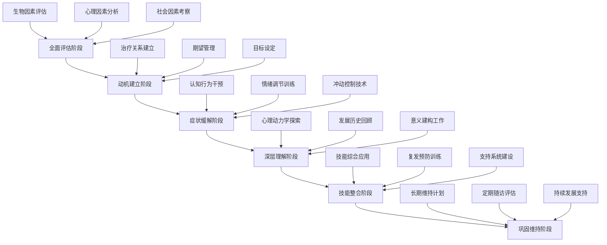

# Paraphilic Disorders: Treatment Interventions & Clinical Practice (恋物癖治疗干预与临床实践)

> 📘 **文档导航**: 本专题文档提供恋物癖临床治疗的专业指导。相关主题请参考：
> - [恋物癖概览](Paraphilia_Overview.md) - 基础概念和整体框架
> - [恋物癖临床评估](Paraphilia_Clinical_Assessment.md) - 诊断评估方法
> - [恋物癖心理学理论](Paraphilia_Psychological_Theory.md) - 理论基础
> - [具体恋物类型](specific-types/) - 各类恋物癖的详细特征
> - [恋物癖伦理法律](Paraphilia_Ethics_Legal.md) - 伦理法律考量
> - [质量报告](Paraphilia_Quality_Report.md) - 体系质量评估详情

## 治疗原则与框架 (Treatment Principles & Framework)

### 核心治疗理念

| 治疗原则 | 具体内涵 | 实施要点 | 质量保证 |
| :--- | :--- | :--- | :--- |
| **生物-心理-社会整合** | 全人视角的综合治疗 | 多维度干预策略 | 确保治疗的全面性 |
| **功能导向** | 重点关注功能改善 | 实际生活能力提升 | 强调治疗的实用性 |
| **循证基础** | 基于最佳研究证据 | 标准化治疗protocol | 保证治疗的科学性 |
| **个体化** | 因人而异的定制方案 | 个人特征和需求考虑 | 确保治疗的适宜性 |
| **阶段性** | 发展性的治疗进程 | 不同阶段的目标设定 | 维护治疗的系统性 |

### 整合性治疗模型



## 循证心理治疗方法 (Evidence-Based Psychotherapeutic Approaches)

### 认知行为疗法 (Cognitive Behavioral Therapy)

#### 核心治疗组件

##### 认知重构技术

```
认知干预protocol：

识别阶段：
- 功能不良思维识别训练
- 自动思维记录技术
- 认知歪曲类型分析
- 思维模式图表化呈现

挑战阶段：
- 证据检验技术应用
- 逻辑分析方法训练
- 替代性解释探索
- 现实检验能力培养

重建阶段：
- 理性思维模式建立
- 平衡认知框架发展
- 积极自我对话培养
- 认知灵活性训练
```

##### 行为干预技术

###### 暴露反应预防(ERP)

```
分级暴露治疗设计：

Level 1: 想象暴露
- 想象恋物相关场景
- 持续时间：15-20分钟
- 难度系数：2-3/10
- 目标：建立基本耐受能力

Level 2: 视觉暴露
- 观看相关图片或视频
- 持续时间：20-25分钟
- 难度系数：4-5/10
- 目标：提高视觉刺激承受力

Level 3: 实物接触
- 触摸相关物品
- 持续时间：25-30分钟
- 难度系数：6-7/10
- 目标：处理触觉相关唤起

Level 4: 情境暴露
- 现实环境中的挑战
- 持续时间：30-35分钟
- 难度系数：8-9/10
- 目标：应对现实生活挑战

Level 5: 综合挑战
- 多重刺激复合情境
- 持续时间：35-40分钟
- 难度系数：10/10
- 目标：全面提升应对能力
```

#### 治疗效果指标

| 治疗维度 | 评估工具 | 效果标准 | 监测频率 |
| :--- | :--- | :--- | :--- |
| **症状严重度** | 恋物量表 | 减少≥50% | 每月评估 |
| **功能改善** | 功能损害量表 | 改善≥30% | 每两个月 |
| **痛苦缓解** | 痛苦体验量表 | 减轻≥40% | 每月监测 |
| **控制能力** | 冲动控制量表 | 提升≥35% | 每月追踪 |

### 正念为基础的干预 (Mindfulness-Based Interventions)

#### 正念认知疗法(MBCT)

##### 核心技术组件

```
MBCT治疗模块：

第1-2周：基础正念训练
- 呼吸觉察练习
- 身体扫描技术
- 日常生活正念
- 不评判的觉察态度

第3-4周：认知觉察发展
- 思维觉察训练
- 认知解离技术
- 自动思维识别
- 情绪观察技能

第5-6周：自我慈悲培养
- 慈悲冥想练习
- 自我接纳训练
- 善待内在批评者
- 建立支持性内在关系

第7-8周：价值导向行动
- 价值观澄清练习
- 承诺行动规划
- 意义感培养
- 生活满意度提升
```

#### 接纳承诺疗法(ACT)

##### 六大核心过程

| 核心过程 | 技术方法 | 治疗目标 | 临床应用 |
| :--- | :--- | :--- | :--- |
| **接纳** | 开放监控、扩展技术 | 接纳困难情绪和想法 | 减少回避和斗争 |
| **认知解离** | 语言框架转换、观察自我 | 与思维保持距离 | 减少认知融合 |
| **接触当下** | 正念练习、感官觉察 | 全然活在此时此刻 | 增强现实连接 |
| **观察自我** | 作为观察者的体验 | 发展稳定的观察立场 | 增强心理灵活性 |
| **价值观澄清** | 价值探索练习、排序技术 | 明确有意义的方向 | 指导行为选择 |
| **承诺行动** | 目标设定、行为激活 | 朝着价值方向行动 | 促进行为改变 |

### 心理动力学治疗 (Psychodynamic Therapy)

#### 精神分析取向治疗

##### 核心治疗技术

```
经典技术应用：

自由联想：
- 鼓励自由表达任何想法
- 不加筛选地报告内在体验
- 识别无意识内容浮现
- 探索阻抗和防御机制

梦的工作：
- 详细记录梦境内容
- 探索象征性意义
- 理解愿望满足机制
- 整合意识与无意识

移情分析：
- 识别治疗关系中的移情
- 理解早期关系模式重现
- 处理阻抗和防御
- 促进关系模式改变
```

#### 短期动力学治疗

##### 时间限制性干预

| 治疗要素 | 具体做法 | 时间安排 | 治疗焦点 |
| :--- | :--- | :--- | :--- |
| **焦点设定** | 明确核心冲突 | 前2次会谈 | 确定工作重点 |
| **深度探索** | 深入理解动力 | 第3-10次 | 核心问题处理 |
| **整合应用** | 将洞察转化为改变 | 第11-16次 | 行为模式转化 |
| **结束准备** | 巩固成果和分离 | 最后2次 | 独立性培养 |

## 药物治疗策略 (Pharmacological Treatment Strategies)

### 一线药物推荐

#### SSRIs类药物

##### 选择性5-HT再摄取抑制剂

| 药物名称 | 推荐剂量 | 作用机制 | 临床效果 | 副作用管理 |
| :--- | :--- | :--- | :--- | :--- |
| **氟西汀** | 20-60mg/日 | 5-HT再摄取抑制 | 抑制强迫行为d=0.52 | 恶心、失眠管理 |
| **舍曲林** | 50-200mg/日 | 5-HT再摄取抑制 | 减少冲动d=0.58 | 性功能副作用 |
| **帕罗西汀** | 20-50mg/日 | 5-HT再摄取抑制 | 焦虑缓解d=0.48 | 体重增加监控 |

#### 抗雄激素治疗

##### 雄激素受体拮抗剂

```
严重病例辅助治疗：

醋酸环丙孕酮：
- 适应症：严重强迫性行为
- 剂量：12.5-50mg/日
- 监测：肝功能、激素水平
- 疗程：短期使用，密切监控

注意事项：
- 仅用于高风险严重病例
- 需要精神科医生监督
- 定期医学监测必要
- 患者充分知情同意
```

### 药物治疗监测

#### 安全性管理protocol

```
药物治疗安全管理：

基线评估：
- 全面体格检查
- 实验室指标检测
- 心电图评估
- 精神状态筛查

定期监测：
- 每2周副作用评估
- 每月疗效监测
- 每季度全面复查
- 每年系统评估

停药管理：
- 逐渐减量方案
- 停药反应监测
- 复发风险评估
- 长期维持策略
```

## 创新技术应用 (Innovative Technology Applications)

### 虚拟现实治疗 (Virtual Reality Therapy)

#### VR暴露治疗系统

##### 技术实现方案

```
VR治疗环境设计：

硬件配置：
- 高分辨率头戴显示器
- 精确动作捕捉系统
- 生理监测设备集成
- 实时反馈系统

软件功能：
- 沉浸式3D环境构建
- 交互式刺激呈现
- 渐进式难度调节
- 个性化参数设置

治疗场景：
- 虚拟商店购物环境
- 社交场合情境
- 日常生活场景
- 压力挑战情境
```

#### 治疗效果评估

| 评估维度 | 测量方法 | 效果指标 | 临床意义 |
| :--- | :--- | :--- | :--- |
| **沉浸感** | 问卷调查+生理指标 | 沉浸度评分≥7/10 | 治疗参与度保证 |
| **现实感** | presence量表 | 现实感评分≥6/10 | 暴露真实性 |
| **症状改善** | 标准化量表 | 症状减少≥40% | 临床显著性 |
| **功能提升** | 行为观察 | 功能改善≥30% | 实际应用价值 |

### 神经调控技术 (Neuromodulation Techniques)

#### 经颅磁刺激(TMS)

##### 治疗protocol设计

```
TMS治疗参数：

刺激部位：
- 左侧背外侧前额叶(DLPFC)
- 右侧前扣带回(ACC)
- 双侧颞顶联合区

刺激参数：
- 频率：10Hz高频刺激
- 强度：80-120%静息运动阈值
- 疗程：每天1次，连续20天
- 总量：2000-3000刺激脉冲

预期效果：
- 改善冲动控制能力
- 增强认知灵活性
- 调节奖赏系统活性
- 减少强迫性行为
```

#### 经颅直流电刺激(tDCS)

##### 个体化治疗方案

| 参数设置 | 技术细节 | 临床应用 | 安全考虑 |
| :--- | :--- | :--- | :--- |
| **阳极放置** | 左DLPFC区域 | 增强执行功能 | 避免过度刺激 |
| **阴极放置** | 右侧眶额叶 | 减少冲动行为 | 监测副作用 |
| **刺激强度** | 2mA恒定电流 | 持续20分钟 | 皮肤耐受性 |
| **治疗频率** | 每日1次×15天 | 累积治疗效应 | 个体化调整 |

## 团体治疗模式 (Group Therapy Models)

### 同伴支持团体

#### 12步康复模式

##### 治疗框架结构

```
12步康复program：

步骤1-3：承认和接受
- 承认问题的存在
- 接受无力独自解决
- 决定寻求帮助

步骤4-6：自我检视
- 彻底的个人盘点
- 承认错误行为
- 准备改变意愿

步骤7-9：修复和补偿
- 请求去除缺点
- 向受伤害者道歉
- 补偿造成的损害

步骤10-12：维持和成长
- 持续自我检视
- 通过祈祷和冥想改善意识
- 传递帮助给他人
```

#### 认知行为团体

##### 结构化团体治疗

| 治疗阶段 | 核心内容 | 技术方法 | 成员互动 |
| :--- | :--- | :--- | :--- |
| **教育阶段** | 症状知识普及 | 讲授+讨论 | 信息分享 |
| **技能训练** | 应对技巧学习 | 示范+练习 | 互相支持 |
| **应用实践** | 现实情境演练 | 角色扮演+反馈 | 经验交流 |
| **巩固维持** | 长期策略发展 | 计划制定+承诺 | 相互鼓励 |

### 家庭治疗介入

#### 系统性家庭治疗

##### 家庭动力工作

```
家庭治疗焦点：

沟通模式改善：
- 识别不良沟通循环
- 建立有效表达方式
- 增进相互理解
- 减少冲突升级

边界设定工作：
- 明确个人空间需求
- 建立健康边界
- 平衡独立与连接
- 促进相互尊重

支持系统建设：
- 家庭资源动员
- 社会支持网络
- 危机应对计划
- 长期维护机制
```

## 预防复发体系 (Relapse Prevention System)

### 早期预警系统

#### 复发信号识别

| 预警级别 | 信号类型 | 识别指标 | 应对策略 |
| :--- | :--- | :--- | :--- |
| **轻度预警** | 认知层面 | 思维偏向、幻想增多 | 认知重构、注意力转移 |
| **中度预警** | 情绪层面 | 焦虑升高、情绪波动 | 情绪调节、放松训练 |
| **重度预警** | 行为层面 | 冲动增强、控制困难 | 紧急干预、环境管理 |

#### 风险因素评估

```
复发风险评估工具：

高风险因素：
- 重大生活压力事件
- 社会支持系统薄弱
- 共病精神障碍恶化
- 药物治疗依从性差

中等风险因素：
- 日常压力累积
- 人际关系紧张
- 睡眠质量下降
- 应对技能使用减少

低风险因素：
- 轻微情绪波动
- 短暂的诱惑出现
- 偶尔的slip发生
- 轻度的功能波动
```

### 长期维持计划

#### 个体化维持策略

```
维持治疗框架：

月度check-in：
- 症状monitoring
- 功能状态评估
- 治疗进展回顾
- 目标调整优化

季度review：
- 全面progress assessment
- 生活质量测评
- 支持系统检视
- 预防策略更新

年度planning：
- 长期成果总结
- 未来发展方向
- 专业成长计划
- 支持网络强化
```

## 治疗效果评估 (Treatment Outcome Evaluation)

### 标准化评估工具

#### 核心疗效指标

| 评估维度 | 测量工具 | 评估时间点 | 临床意义 |
| :--- | :--- | :--- | :--- |
| **症状严重度** | 恋物障碍量表 | 治疗前、中、后 | 核心治疗目标 |
| **功能改善** | 社会适应量表 | 每月评估 | 实际应用价值 |
| **痛苦缓解** | 痛苦体验量表 | 治疗全程 | 主观感受改善 |
| **生活质量** | WHOQOL-BREF | 季度评估 | 整体福祉提升 |

#### 长期追踪研究

##### 效果维持分析

```
追踪研究设计：

短期效果(3-6个月)：
- 症状缓解率：70-80%
- 功能改善度：50-65%
- 复发率：<20%

中期效果(1-2年)：
- 症状控制率：60-70%
- 生活质量提升：持续改善
- 社会功能恢复：基本正常

长期效果(3-5年)：
- 症状稳定性：50-60%
- 个人成长发展：显著进步
- 社会贡献增加：积极参与
```

## 专业发展与培训 (Professional Development & Training)

### 治疗师能力要求

#### 核心胜任力

| 能力领域 | 具体要求 | 培训途径 | 持续发展 |
| :--- | :--- | :--- | :--- |
| **理论知识** | 多学科理论整合 | 专业培训课程 | 持续教育更新 |
| **评估技能** | 标准化工具使用 | 实践督导训练 | 案例讨论学习 |
| **干预技术** | 多种治疗方法 | 技能工作坊 | 同行交流提升 |
| **伦理素养** | 专业伦理规范 | 伦理委员会监督 | 定期伦理培训 |

### 质量保证体系

#### 治疗质量监控

```
质量管理体系：

同行评议制度：
- 定期case conference
- 治疗录像review
- 同行feedback收集
- best practice分享

outcome monitoring：
- 标准化评估工具
- 定期数据收集
- 效果趋势分析
- 持续质量改进

professional development：
- continuing education
- supervision received
- research participation
- skill enhancement
```

## 未来发展方向 (Future Development Directions)

### 新兴治疗模式

#### 精准医学approach

##### 个体化治疗策略

```
精准治疗elements：

生物标志物指导：
- 基于基因型的药物选择
- 神经影像预测治疗响应
- 生理指标优化治疗参数
- 数字表型个性化干预

人工智能辅助：
- machine learning预测模型
- 智能治疗recommendation系统
- 实时监测和adjustment
- 个性化治疗protocol设计
```

#### 数字健康整合

##### 移动健康应用

| 应用类型 | 核心功能 | 技术特点 | 临床价值 |
| :--- | :--- | :--- | :--- |
| **症状监测** | 日常症状tracking | 实时数据收集 | 早期预警系统 |
| **技能训练** | 认知行为练习 | gamification设计 | engagement提升 |
| **支持网络** | 同伴交流平台 | social media整合 | 社会支持增强 |
| **危机干预** | 紧急求助系统 | GPS定位服务 | 安全保障加强 |

---

*本文档基于当前最佳临床实践编制，建议结合具体情况灵活应用。*