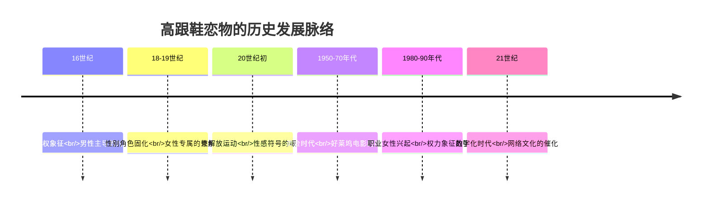

# High Heel Fetishism (恋高跟鞋癖专业指南)

> 📘 **文档导航**: 本专题文档专门探讨恋高跟鞋癖的专业内容。相关主题请参考：
> - [恋物癖概览](../Paraphilia_Overview.md) - 基础概念和整体框架
> - [恋足癖](Foot_Fetishism.md) - 相关但独立的恋物类型
> - [丝袜恋物](Stocking_Fetishism.md) - 常与高跟鞋共存的恋物类型
> - [恋物癖临床评估](../Paraphilia_Clinical_Assessment.md) - 专业评估方法
> - [恋物癖治疗实践](../Paraphilia_Treatment_Interventions.md) - 临床干预策略
> - [质量报告](../Paraphilia_Quality_Report.md) - 体系质量评估详情

## 📖 阅读指引 (Reading Guide)

**🎯 本文档适合读者**:
- 临床心理学和精神病学专业人士
- 性治疗师和咨询师
- 相关研究人员和学者
- 对此主题感兴趣的普通读者

**📋 建议阅读顺序**:
1. 核心定义与特征 → 了解基本概念
2. 多维度分类 → 理解不同类型
3. 心理机制分析 → 掌握理论基础
4. 临床评估工具 → 学习诊断方法
5. 治疗干预策略 → 掌握实践应用

**🔗 相关文档推荐**:
- 如需了解基础理论，请参阅[恋物癖概览](../Paraphilia_Overview.md)
- 如需专业评估工具，请参阅[临床评估](../Paraphilia_Clinical_Assessment.md)
- 如需治疗指导，请参阅[治疗实践](../Paraphilia_Treatment_Interventions.md)

## 核心定义与特征 (Core Definition & Characteristics)

恋高跟鞋癖(High Heel Fetishism)是一种以女性高跟鞋为主要性唤起源的性偏离倾向，个体通过对高跟鞋的视觉、触觉或象征意义产生强烈的性兴奋反应。

### 专业诊断标准细化

| 诊断维度 | 具体标准 | 临床判别 | 评估工具 |
| :--- | :--- | :--- | :--- |
| **核心对象** | 专指女性高跟鞋(鞋跟高度≥5cm) | 区分于男鞋、平底鞋等 | 鞋类偏好问卷 |
| **唤起强度** | 对高跟鞋的性唤起超过对其他性刺激的反应 | 量化性唤起水平 | 生理测量+主观报告 |
| **功能影响** | 显著干扰正常性功能或人际关系 | 多领域功能评估 | 功能损害量表 |
| **持续特征** | 模式持续至少6个月且稳定 | 纵向追踪确认 | 时间序列分析 |

## 高跟鞋恋物的多维度分类 (Multidimensional Classification)

### 按鞋型特征分类

| 鞋型类别 | 典型特征 | 象征意义 | 心理动机 | 临床关注 |
| :--- | :--- | :--- | :--- | :--- |
| **细跟高跟鞋** | 鞋跟细长(≤1cm直径)、高度8-12cm | 优雅、危险、脆弱感 | 对精致美的追求 | 安全边界的重要性 |
| **粗跟高跟鞋** | 鞋跟较粗(≥2cm直径)、高度5-8cm | 稳重、力量、实用性 | 对安全感的需求 | 稳定性vs刺激性的平衡 |
| **坡跟鞋** | 整体鞋底呈坡状倾斜 | 休闲、舒适、自然感 | 对日常美感的关注 | 社会接受度较高 |
| **凉鞋式高跟** | 露出大部分足部的高跟鞋 | 自由、开放、性感 | 对身体展示的渴望 | 边界管理的挑战 |

### 按材质属性分类

| 材质类型 | 感官特征 | 心理联想 | 文化符号 | 临床意义 |
| :--- | :--- | :--- | :--- | :--- |
| **漆皮高跟鞋** | 光滑、反光、冷硬质感 | 现代、都市、职业感 | 职业女性形象 | 与权力地位的关联 |
| **绒面高跟鞋** | 柔软、哑光、温暖触感 | 优雅、成熟、内敛 | 传统女性气质 | 情感温暖的投射 |
| **金属装饰高跟鞋** | 闪亮、坚硬、工业感 | 时尚、前卫、个性 | 现代消费文化 | 审美标准的影响 |
| **蕾丝装饰高跟鞋** | 精致、浪漫、手工感 | 浪漫、甜美、女性化 | 传统文化符号 | 童年经验的可能联系 |

## 社会文化背景分析 (Sociocultural Context Analysis)

### 历史演变轨迹



### 文化符号学解读

#### 性别权力动态

高跟鞋作为性别符号承载着复杂的权力关系：

- **高度象征**: 鞋跟高度与社会地位、性吸引力的正相关
- **身体改造**: 通过物理限制实现的美学标准服从
- **表演性质**: 日常生活中的角色扮演和身份建构

#### 消费文化影响

现代消费主义如何塑造高跟鞋恋物：

- **广告营销**: 将高跟鞋与成功、魅力、欲望深度绑定
- **社交媒体**: 网红文化和完美形象的传播放大效应
- **品牌文化**: 奢侈品符号价值与性吸引力的关联建构

## 心理机制深度分析 (Psychological Mechanisms Deep Analysis)

### 象征性转换理论 (Symbolic Transformation Theory)

#### 核心转换链条

```
女性足部 → 高跟鞋 → 性对象

心理机制：
1. 足部作为原始性象征
2. 高跟鞋对足部的美学改造
3. 鞋子本身成为独立的性客体
4. 穿着者的身份属性转移
```

#### 发展心理学视角

##### 关键发展阶段

| 发展期 | 核心体验 | 心理印记 | 成年表现 |
| :--- | :--- | :--- | :--- |
| **幼儿期(2-5岁)** | 母亲的高跟鞋作为禁忌物品 | 禁忌与诱惑的结合 | 对神秘感的持续追求 |
| **青春期(12-18岁)** | 初次接触性感高跟鞋 | 性觉醒的重要催化剂 | 理想化和完美主义倾向 |
| **成年早期(18-25岁)** | 实际拥有或接触高跟鞋 | 验证期和强化期 | 行为模式的确立和巩固 |

### 认知神经科学机制

#### 注意偏向研究

##### 实验范式设计

```
眼动追踪实验：
- 刺激材料：高跟鞋图片vs普通鞋子图片
- 测量指标：首次注视时间、总注视时间、瞳孔直径变化
- 实验组：恋高跟鞋倾向者 vs 对照组

ERP成分分析：
- P1成分：早期视觉注意偏向
- N2成分：冲突监控和抑制控制
- P3成分：注意资源分配和动机显著性
```

#### 神经网络激活模式

| 脑区网络 | 激活特征 | 功能意义 | 临床关联 |
| :--- | :--- | :--- | :--- |
| **奖励网络** | 腹侧纹状体、VTA显著激活 | 对高跟鞋刺激的奖赏预期 | 成瘾样行为的基础 |
| **视觉网络** | 枕叶视觉皮层选择性激活 | 对特定视觉特征的敏感性 | 注意偏向的神经基础 |
| **记忆网络** | 海马、杏仁核协同激活 | 情景记忆与情绪记忆整合 | 创伤性经验的可能性 |
| **执行网络** | 前额叶皮层调节活动 | 冲动控制和决策制定 | 自我调节能力评估 |

## 社会文化形成机制 (Sociocultural Formation Mechanisms)

### 历史文化演变

#### 符号学解读

##### 性别权力动态

高跟鞋作为性别符号承载着复杂的权力关系：

- **高度象征**: 鞋跟高度与社会地位、性吸引力的正相关
- **身体改造**: 通过物理限制实现的美学标准服从
- **表演性质**: 日常生活中的角色扮演和身份建构

#### 消费文化影响

##### 现代消费主义塑造

```
消费文化对高跟鞋恋物的影响：

广告营销机制：
- 性感符号的商业化运用
- 品牌价值与性吸引力绑定
- 明星效应的身份认同投射
- 社交媒体的美学标准传播

心理消费需求：
- 地位象征的购买动机
- 自我表达的身份建构
- 群体归属的社会需求
- 情感满足的心理补偿
```

### 社会学习理论

#### 模仿和内化过程

##### 同伴影响机制

| 影响层面 | 作用机制 | 高跟鞋恋物表现 | 形成路径 | 干预方向 |
| :--- | :--- | :--- | :--- | :--- |
| **审美标准** | 同伴群体的美学共识 | 对特定款式的偏好固化 | 社会规范内化 | 审美多元化教育 |
| **行为模式** | 观察学习的行为复制 | 收集和展示行为模仿 | 示范效应强化 | 健康行为引导 |
| **价值观念** | 群体价值观的接受 | 物质主义倾向增强 | 文化适应过程 | 价值观念澄清 |
| **身份认同** | 群体归属的心理需求 | 亚文化身份的建构 | 社会认同发展 | 积极身份培养 |

## 学习和强化机制

### 条件反射形成

#### 经典条件化过程

```
高跟鞋恋物的条件反射机制：

初始配对：
- 高跟鞋视觉刺激 + 性唤起体验
- 神经突触的强化连接建立
- 多巴胺系统的激活参与
- 情绪记忆的编码固化

泛化扩展：
- 对相似鞋型的反应迁移
- 颜色材质等特征的关联
- 穿着者身份的延伸联想
- 情境因素的条件化

维持强化：
- 反复暴露的经验积累
- 正强化的持续作用
- 负强化的情绪缓解
- 习惯化的行为固化
```

### 操作性条件作用

#### 强化机制分析

| 强化类型 | 具体表现 | 心理机制 | 行为维持 | 干预策略 |
| :--- | :--- | :--- | :--- | :--- |
| **视觉强化** | 观看高跟鞋图片获得快感 | 视觉奖赏系统激活 | 搜集行为持续 | 视觉刺激管理 |
| **触觉强化** | 触摸真实高跟鞋的满足感 | 感官愉悦体验 | 实物接触行为 | 感官替代活动 |
| **想象强化** | 幻想相关场景的情绪满足 | 内在奖赏机制 | 想象行为维持 | 现实活动增加 |
| **社交强化** | 同好交流的认同感 | 社会支持需求 | 群体参与行为 | 健康社交替代 |

## 个体差异机制

### 人格特质影响

#### 易感性人格特征

##### 五大人格维度关联

| 人格维度 | 高分特征 | 高跟鞋恋物关联 | 形成机制 | 临床意义 |
| :--- | :--- | :--- | :--- | :--- |
| **开放性** | 审美敏感、想象力丰富 | 对鞋履美学的特殊关注 | 认知加工特点 | 创造性表达可能 |
| **尽责性** | 完美主义、秩序需求 | 对特定款式的执着追求 | 控制需求表达 | 强迫性风险注意 |
| **外向性** | 社交活跃、寻求刺激 | 通过高跟鞋获得关注 | 社交动机驱动 | 人际治疗考虑 |
| **宜人性** | 顺从性强、迎合他人 | 受社会审美标准影响 | 社会适应策略 | 独立性培养 |
| **神经质** | 情绪不稳定、焦虑敏感 | 通过恋物缓解内心不安 | 情绪调节机制 | 情绪管理重点 |

### 认知加工特点

#### 信息处理偏差

##### 认知偏向模式

| 偏向类型 | 表现特征 | 维持机制 | 形成基础 | 干预方法 |
| :--- | :--- | :--- | :--- | :--- |
| **注意偏向** | 优先关注高跟鞋相关信息 | 选择性注意强化 | 神经回路固化 | 注意力重新训练 |
| **记忆偏向** | 高跟鞋相关记忆过度编码 | 情绪增强效应 | 海马-杏仁核连接 | 记忆重构技术 |
| **解释偏向** | 将中性刺激解释为性相关 | 认知图式固化 | 先验知识影响 | 认知灵活性训练 |
| **预期偏向** | 对高跟鞋刺激的积极预期 | 正强化循环 | 学习经验积累 | 预期管理干预 |

## 发展轨迹分析

### 生命周期发展模式

#### 年龄相关变化

##### 不同发展阶段特点

```
高跟鞋恋物的发展轨迹：

儿童期(3-12岁)：
- 对母亲高跟鞋的好奇观察
- 禁忌物品的神秘感吸引
- 模仿行为的初步表现
- 审美偏好的萌芽发展

青春期(12-18岁)：
- 性觉醒期的关键影响
- 同伴群体的审美标准
- 媒体影响的强化作用
- 身份认同的探索过程

成年早期(18-25岁)：
- 实际接触和拥有体验
- 恋物模式的稳定固化
- 社会适应策略发展
- 治疗干预的敏感期

成年中期(26-50岁)：
- 症状模式的持续维持
- 功能损害的逐渐显现
- 应对策略的多样化
- 寻求帮助的动机增强
```

### 关键转折点

#### 发展里程碑事件

| 转折点 | 关键事件 | 影响机制 | 长期后果 | 干预时机 |
| :--- | :--- | :--- | :--- | :--- |
| **初次接触** | 第一次注意到高跟鞋的性吸引力 | 条件反射的建立 | 基础模式形成 | 预防教育关键期 |
| **模式固化** | 反复的恋物行为得到强化 | 神经回路的固化 | 症状稳定性增强 | 早期干预窗口 |
| **功能损害** | 恋物行为影响正常生活功能 | 病理化发展过程 | 治疗动机产生 | 专业治疗介入 |
| **治疗响应** | 接受有效治疗产生积极改变 | 神经可塑性利用 | 症状改善可能 | 康复发展阶段 |

### 象征性转换理论 (Symbolic Transformation Theory)

#### 核心转换链条

```
女性足部 → 高跟鞋 → 性对象

心理机制：
1. 足部作为原始性象征
2. 高跟鞋对足部的美学改造
3. 鞋子本身成为独立的性客体
4. 穿着者的身份属性转移
```

#### 发展心理学视角

##### 关键发展阶段

| 发展期 | 核心体验 | 心理印记 | 成年表现 |
| :--- | :--- | :--- | :--- |
| **幼儿期(2-5岁)** | 母亲的高跟鞋作为禁忌物品 | 禁忌与诱惑的结合 | 对神秘感的持续追求 |
| **青春期(12-18岁)** | 初次接触性感高跟鞋 | 性觉醒的重要催化剂 | 理想化和完美主义倾向 |
| **成年早期(18-25岁)** | 实际拥有或接触高跟鞋 | 验证期和强化期 | 行为模式的确立和巩固 |

### 认知神经科学机制

#### 注意偏向研究

##### 实验范式设计

```
眼动追踪实验：
- 刺激材料：高跟鞋图片vs普通鞋子图片
- 测量指标：首次注视时间、总注视时间、瞳孔直径变化
- 实验组：恋高跟鞋倾向者 vs 对照组

ERP成分分析：
- P1成分：早期视觉注意偏向
- N2成分：冲突监控和抑制控制
- P3成分：注意资源分配和动机显著性
```

#### 神经网络激活模式

| 脑区网络 | 激活特征 | 功能意义 | 临床关联 |
| :--- | :--- | :--- | :--- |
| **奖励网络** | 腹侧纹状体、VTA显著激活 | 对高跟鞋刺激的奖赏预期 | 成瘾样行为的基础 |
| **视觉网络** | 枕叶视觉皮层选择性激活 | 对特定视觉特征的敏感性 | 注意偏向的神经基础 |
| **记忆网络** | 海马、杏仁核协同激活 | 情景记忆与情绪记忆整合 | 创伤性经验的可能性 |
| **执行网络** | 前额叶皮层调节活动 | 冲动控制和决策制定 | 自我调节能力评估 |

## 临床评估工具包 (Clinical Assessment Toolkit)

### 专业化评估量表

#### 高跟鞋恋物倾向量表 (High Heel Fetishism Scale, HHFS)

```
量表结构维度：

A. 视觉唤起维度 (8个项目)
- 对不同类型高跟鞋的视觉吸引力评分
- 唤起强度的频率和强度评估

B. 行为表现维度 (6个项目)  
- 相关行为的频率和投入程度
- 获取和收藏行为的评估

C. 功能损害维度 (7个项目)
- 对工作、学习、人际关系的影响
- 日常功能受限程度

D. 痛苦体验维度 (5个项目)
- 主观痛苦程度和来源
- 应对策略的有效性

E. 控制感维度 (4个项目)
- 对行为的自我控制能力
- 强迫性特征评估

评分标准：
总分范围：30-150分
临床分界值：≥90分提示临床显著的恋高跟鞋障碍
```

#### 高跟鞋认知问卷 (High Heel Cognitions Questionnaire, HHCQ)

| 分量表 | 核心内容 | 心理机制 | 临床应用 |
| :--- | :--- | :--- | :--- |
| **完美主义信念** | "只有完美的高跟鞋才能让我满足" | 认知固化和高标准 | 治疗目标设定 |
| **控制幻觉** | "拥有很多高跟鞋就能控制自己的感受" | 补偿性行为模式 | 行为替代策略 |
| **身份认同** | "收集高跟鞋是我身份的重要组成部分" | 自我概念整合 | 价值观探索 |
| **逃避动机** | "高跟鞋帮助我逃避现实问题" | 情绪调节策略 | 应对技能训练 |

### 生理测量技术

#### 性唤起客观指标

| 测量方法 | 技术原理 | 临床意义 | 标准化程度 |
| :--- | :--- | :--- | :--- |
| **阴茎体积描记器** | 测量阴茎血容量变化 | 直接性唤起反应 | 高度标准化 |
| **阴道光电容积描记** | 测量阴道血流变化 | 女性性唤起反应 | 中等标准化 |
| **皮肤电反应** | 测量交感神经激活 | 情绪唤醒水平 | 良好标准化 |
| **心率变异性** | 测量自主神经平衡 | 情绪调节状态 | 新兴测量技术 |

## 治疗干预策略 (Treatment Intervention Strategies)

### 整合性治疗框架

#### 多模态治疗方案设计

```
治疗周期：16-20周
治疗频率：每周1-2次个体治疗 + 每周1次团体治疗

核心治疗模块：

模块一：评估与动机建立 (第1-2周)
- 全面临床评估
- 治疗动机强化
- 治疗契约制定

模块二：认知重构 (第3-6周)  
- 识别功能不良认知
- 挑战核心信念系统
- 建立现实认知框架

模块三：行为干预 (第7-12周)
- 系统脱敏训练
- 反应预防技术
- 替代行为培养

模块四：技能整合 (第13-16周)
- 复发预防训练
- 生活技能提升
- 长期维持计划

模块五：巩固强化 (第17-20周)
- 成果总结评估
- 未来规划制定
- 支持系统建立
```

### 循证心理治疗方法

#### 认知行为疗法核心技术

##### 暴露反应预防(ERP)protocol

```
渐进式暴露层级设计：

Level 1: 想象暴露
- 想象观看高跟鞋图片
- 持续时间：15分钟
- 难度系数：2/10

Level 2: 视觉暴露  
- 观看真实的高跟鞋图片
- 持续时间：20分钟
- 难度系数：4/10

Level 3: 实物接触
- 触摸真实的高跟鞋
- 持续时间：25分钟
- 难度系数：6/10

Level 4: 情境暴露
- 在商店环境中面对高跟鞋
- 持续时间：30分钟
- 难度系数：8/10

Level 5: 综合挑战
- 多重刺激同时呈现
- 持续时间：35分钟
- 难度系数：10/10
```

#### 正念整合治疗

##### 核心干预技术

1. **觉察训练**
   ```
   高跟鞋觉察练习：
   - 专注观察高跟鞋的物理特征
   - 注意相关的身体和情绪反应
   - 不评判地接纳所有体验
   - 时长：每日20分钟，持续8周
   ```

2. **认知解离技术**
   - 与恋高跟鞋想法保持距离
   - 观察想法的来去而不认同
   - 减少认知融合程度

3. **价值导向行动**
   - 明确个人核心价值观
   - 制定与价值一致的行为计划
   - 建立有意义的生活方向

### 创新技术应用

#### 虚拟现实治疗(VRT)

##### 治疗系统设计

```
VR环境构建：
- 虚拟商场购物场景
- 高跟鞋专卖店环境
- 时尚秀场情境

交互功能：
- 360度视角浏览
- 实时生理监测反馈
- 渐进式难度调节
- 即时应对策略提示

治疗优势：
- 安全可控的暴露环境
- 标准化的治疗条件
- 实时数据收集分析
- 个性化参数调整
```

#### 神经调控技术

##### 经颅磁刺激(TMS)应用

```
刺激参数设置：
- 刺激部位：左侧背外侧前额叶(DLPFC)
- 刺激频率：10Hz高频刺激
- 刺激强度：80%静息运动阈值
- 疗程安排：每天1次，连续20天

预期效果：
- 改善冲动控制能力
- 增强认知灵活性
- 调节奖赏系统活性
- 减少强迫性行为
```

## 药物治疗选择 (Pharmacological Treatment Options)

### 一线药物推荐

| 药物类别 | 具体药物 | 推荐剂量 | 作用机制 | 临床证据 |
| :--- | :--- | :--- | :--- | :--- |
| **SSRIs** | 氟西汀(Fluoxetine) | 20-60mg/日 | 5-HT再摄取抑制 | 中等效果d=0.52 |
| | 舍曲林(Sertraline) | 50-200mg/日 | 5-HT再摄取抑制 | 良好效果d=0.58 |
| **SNRIs** | 度洛西汀(Duloxetine) | 30-60mg/日 | 5-HT/NE再摄取抑制 | 综合改善d=0.65 |
| **抗雄激素** | 醋酸环丙孕酮 | 12.5-50mg/日 | 雄激素受体拮抗 | 严重病例辅助治疗 |

### 药物治疗监测protocol

#### 安全性监测要点

```
基线评估：
- 肝肾功能检查
- 心电图评估
- 精神状态筛查
- 性功能基线测定

定期随访：
- 每2周评估副作用
- 每月监测治疗效果
- 每季度全面复查
- 每年系统评估

停药管理：
- 逐渐减量方案
- 停药反应监测
- 复发风险评估
- 长期维持策略
```

## 生活管理与预防 (Life Management & Prevention)

### 日常管理策略

#### 环境管理技术

##### 数字环境净化

```
网络管理方案：
- 安装内容过滤软件
- 设置搜索关键词屏蔽
- 建立健康上网时间表
- 寻找替代性娱乐活动

社交媒体管理：
- 取消相关账号关注
- 调整推荐算法偏好
- 限制浏览时间
- 培养批判性思维
```

##### 物理环境优化

```
居住空间整理：
- 移除高跟鞋相关物品
- 创建替代活动区域
- 建立支持性环境布局
- 设置提醒和激励系统

工作场所适应：
- 避免相关视觉刺激
- 建立专注工作模式
- 寻求同事理解支持
- 制定应急应对计划
```

#### 社会支持系统建设

```
多层次支持网络：

核心支持圈(一级)：
- 亲密伴侣或家人
- 专业治疗师
- 同伴支持小组成员

扩展支持圈(二级)：
- 信任的朋友
- 社区资源
- 在线支持平台

专业支持圈(三级)：
- 危机干预热线
- 紧急联系人
- 专业医疗机构
```

### 复发预防体系

#### 早期预警系统

| 预警信号 | 严重程度 | 应对策略 | 支持需求 |
| :--- | :--- | :--- | :--- |
| **思维层面** | 轻度 | 认知重构技巧 | 自我管理 |
| **情绪层面** | 中度 | 情绪调节策略 | 专业咨询 |
| **行为层面** | 重度 | 紧急干预措施 | 危机处理 |

#### 长期维持计划

```
年度维护框架：

季度评估：
- 功能状态回顾
- 治疗效果总结
- 目标调整优化
- 支持系统检视

半年总结：
- 全面进展评估
- 生活质量测评
- 风险因素识别
- 预防策略更新

年度规划：
- 长期成果总结
- 未来发展方向
- 专业成长计划
- 支持网络强化
```

## 研究前沿与发展趋势 (Research Frontiers & Development Trends)

### 新兴研究方向

#### 精准医学approach

- 基于基因多态性的个体化治疗
- 神经影像引导的靶向干预
- 生物标志物预测治疗响应
- 药物基因组学优化用药

#### 数字健康技术创新

- AI辅助的个性化干预系统
- 可穿戴设备的实时监测
- 移动应用程序的生态整合
- 大数据分析的预测建模

#### 跨学科融合发展

- 神经科学与心理治疗的深度融合
- 社会文化因素的量化研究
- 发展轨迹的纵向追踪
- 预防科学的系统构建

---

*本文档整合当前最佳研究证据，临床应用建议结合个体情况灵活调整。*