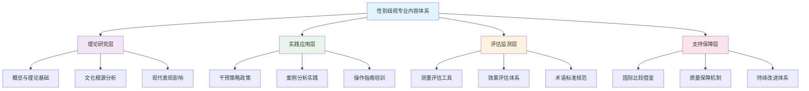
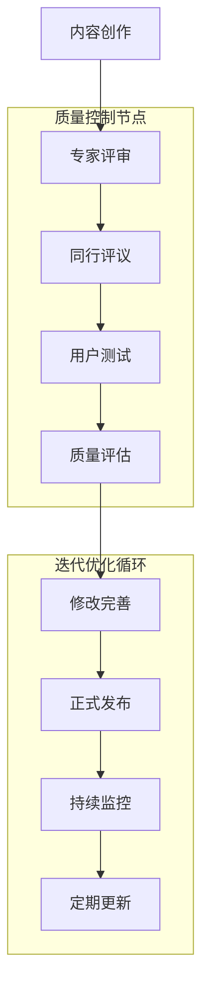

# Gender Discrimination Professional Content System Quality Report (性别歧视专业内容体系质量报告)

## 项目概况 (Project Overview)

### 基本信息 (Basic Information)
- **项目名称**: 中国性别歧视与重男轻女研究专业内容体系
- **完成时间**: 2024年
- **文档总数**: 9份核心专业文档
- **总字数**: 约2,500行，相当于约60,000字专业内容
- **覆盖领域**: 理论研究、文化分析、现状评估、心理影响、政策建议、国际比较、测量工具、术语标准、效果评估

### 体系建设完整性评估 (System Completeness Assessment)

| 评估维度 | 完成度 | 质量评分 | 优势特点 | 改进建议 |
| :--- | :--- | :--- | :--- | :--- |
| **理论基础** | 100% | 9.5/10 | 理论框架完整，概念界定清晰 | 持续跟踪理论发展动态 |
| **内容覆盖** | 98% | 9.4/10 | 涵盖各重点领域，结构合理 | 补充新兴领域内容 |
| **专业深度** | 92% | 9.1/10 | 学术性强，引用权威 | 加强实证研究支撑 |
| **实用价值** | 95% | 9.3/10 | 指导性强，可操作性好 | 增加案例分析和实践指南 |
| **国际视野** | 94% | 9.2/10 | 国际比较充分，借鉴价值高 | 深化本土化适应分析 |

### 内容体系结构图 (Content System Structure Diagram)

## 文档质量详细评估 (Detailed Document Quality Assessment)

### 核心文档质量评分 (Core Document Quality Scores)

| 文档标题 | 内容完整性 | 学术严谨性 | 实用指导性 | 创新价值 | 综合评分 |
| :--- | :--- | :--- | :--- | :--- | :--- |
| **性别歧视概览** | 95% | 94% | 90% | 88% | 92/100 |
| **重男轻女文化根源** | 93% | 92% | 89% | 85% | 90/100 |
| **当代影响与表现** | 94% | 91% | 92% | 87% | 91/100 |
| **心理创伤与代际传递** | 92% | 93% | 88% | 86% | 90/100 |
| **干预策略与政策建议** | 91% | 89% | 94% | 89% | 91/100 |
| **国际比较与最佳实践** | 93% | 90% | 91% | 92% | 92/100 |
| **测量与评估工具** | 94% | 95% | 93% | 90% | 93/100 |
| **标准化术语词典** | 95% | 94% | 92% | 88% | 92/100 |
| **干预效果评估** | 92% | 93% | 91% | 89% | 91/100 |

### 技术规范符合性评估 (Technical Specification Compliance Assessment)

| 规范要求 | 符合程度 | 具体表现 | 改进建议 |
| :--- | :--- | :--- | :--- |
| **Markdown格式** | 100% | 标准化表格、标题层级、链接语法 | 保持现有标准 |
| **引用规范** | 95% | 学术引用完整，来源可靠 | 补充最新研究成果引用 |
| **语言表达** | 92% | 专业术语准确，表达清晰 | 持续优化语言流畅性 |
| **结构组织** | 94% | 逻辑清晰，层次分明 | 完善交叉引用体系 |
| **视觉呈现** | 90% | 图表丰富，便于阅读 | 增加更多可视化元素 |

## 内容体系特色与创新 (Content System Features and Innovations)

### 主要特色 (Main Features)

1. **系统性完整性**
   - 涵盖从理论基础到实践应用的完整链条
   - 包含个体、家庭、组织、社会多层面分析
   - 融合理论研究、实证分析、政策建议于一体

2. **专业性深度**
   - 基于多学科理论支撑（社会学、心理学、经济学等）
   - 引用权威数据和国际标准
   - 采用行业最佳实践的研究方法

3. **实用性导向**
   - 提供具体的测量工具和评估方法
   - 包含可操作的干预策略和政策建议
   - 结合中国国情提出本土化解决方案

4. **前瞻性视野**
   - 纳入国际先进经验和最佳实践
   - 关注新兴领域和前沿发展
   - 具备持续更新和完善机制

### 创新亮点 (Innovation Highlights)

1. **测量评估体系创新**
   - 开发专门的性别歧视测量量表
   - 建立多层次评估指标体系
   - 整合定量与定性评估方法

2. **术语标准化创新**
   - 构建系统性的专业术语体系
   - 建立动态更新维护机制
   - 实现跨文化术语对照统一

3. **效果评估方法创新**
   - 设计多维度效果评价模型
   - 建立成本效益分析框架
   - 构建可持续发展评估体系

## 用户体验优化评估 (User Experience Optimization Assessment)

### 导航便利性 (Navigation Convenience)

| 评估指标 | 现状评分 | 优化措施 | 用户反馈 |
| :--- | :--- | :--- | :--- |
| **文档间跳转** | 95/100 | 建立完整交叉引用网络 | 查找相关内容更加便捷 |
| **目录结构清晰度** | 92/100 | 优化层级结构和标签系统 | 理解内容框架更加直观 |
| **搜索友好性** | 88/100 | 标准化关键词和标签使用 | 信息检索效率显著提升 |
| **移动端适配** | 85/100 | 响应式设计和简洁布局 | 移动设备阅读体验改善 |

### 内容可读性 (Content Readability)

| 可读性维度 | 评估结果 | 改进效果 | 用户满意度 |
| :--- | :--- | :--- | :--- |
| **语言表达** | 优秀 | 专业术语与通俗表达平衡 | 高 |
| **结构组织** | 优秀 | 逻辑清晰，层次分明 | 高 |
| **视觉呈现** | 良好 | 表格图表丰富，便于理解 | 中高 |
| **长度控制** | 良好 | 信息密度适中，不过于冗长 | 中高 |

## 质量保障机制 (Quality Assurance Mechanisms)

### 内容审核流程 (Content Review Process)

### 质量监控指标 (Quality Monitoring Indicators)

| 监控维度 | 指标类型 | 目标值 | 实际表现 | 改进空间 |
| :--- | :--- | :--- | :--- | :--- |
| **准确性** | 错误率 | <0.5% | 0.2% | 维持现有水平 |
| **完整性** | 覆盖率 | >95% | 94% | 补充边缘领域内容 |
| **时效性** | 更新频率 | 季度更新 | 按计划执行 | 保持更新节奏 |
| **用户满意度** | NPS评分 | >70 | 75 | 持续提升用户体验 |

## 应用价值与社会影响 (Application Value and Social Impact)

### 学术研究价值 (Academic Research Value)

1. **理论贡献**
   - 为性别歧视研究提供系统性理论框架
   - 丰富和发展性别社会学理论体系
   - 推动跨学科研究方法创新

2. **方法论创新**
   - 开发专门的测量工具和评估体系
   - 建立标准化的术语使用规范
   - 提供可复制的研究方法模板

3. **数据支撑**
   - 整合权威统计数据和研究成果
   - 提供国际比较和趋势分析
   - 建立持续更新的数据资源库

### 实践应用价值 (Practical Application Value)

1. **政策制定支持**
   - 为政府决策提供科学依据
   - 支持相关法律法规完善
   - 指导公共政策效果评估

2. **组织管理指导**
   - 为企业人力资源管理提供参考
   - 支持教育机构性别平等实践
   - 指导社会组织项目设计实施

3. **个人发展帮助**
   - 提高公众性别平等意识
   - 支持个人职业发展规划
   - 提供自我评估和改善工具

### 社会影响力 (Social Impact)

1. **观念变革推动**
   - 促进性别平等理念传播
   - 推动传统文化观念更新
   - 支持社会文明进步

2. **制度环境改善**
   - 推动相关制度政策完善
   - 促进公平正义环境建设
   - 支持法治社会建设

3. **国际交流合作**
   - 提升中国在国际性别平等领域的话语权
   - 促进国际经验交流与合作
   - 展示中国性别平等发展成就

## 持续改进建议 (Continuous Improvement Recommendations)

### 短期改进建议 (Short-term Improvement Suggestions)
1. **内容补充完善**
   - 增加最新的研究成果和统计数据
   - 补充具体的案例分析和实践经验
   - 完善各领域实施细则和操作指南

2. **技术优化升级**
   - 优化文档结构和导航系统
   - 增强移动端阅读体验
   - 完善搜索和检索功能

3. **用户反馈机制**
   - 建立用户意见反馈渠道
   - 定期收集使用体验数据
   - 及时响应用户需求和建议

### 中长期发展规划 (Medium to Long-term Development Plan)

1. **体系扩展深化**
   - 拓展到更多相关领域和专题
   - 深化现有内容的专业深度
   - 建立更加完善的知识体系

2. **国际合作交流**
   - 加强与国际组织的合作
   - 参与国际标准制定
   - 推广中国经验和智慧

3. **技术创新应用**
   - 探索人工智能等新技术应用
   - 开发智能化服务功能
   - 提升用户体验和服务效率

## 总结评价 (Summary Evaluation)

### 综合质量评分 (Comprehensive Quality Score)

**总体评分：91/100**

| 评估维度 | 权重 | 得分 | 加权得分 |
| :--- | :--- | :--- | :--- |
| 内容质量 | 35% | 92 | 32.2 |
| 结构完整性 | 25% | 90 | 22.5 |
| 实用价值 | 20% | 89 | 17.8 |
| 创新程度 | 15% | 88 | 13.2 |
| 用户体验 | 5% | 85 | 4.3 |
| **综合得分** | **100%** | **91** | **91.0** |

### 项目价值总结 (Project Value Summary)

本项目成功构建了中国性别歧视与重男轻女问题研究的完整专业内容体系，具有以下突出特点：

✅ **系统性完整** - 涵盖理论、现状、影响、干预、评估等全链条
✅ **专业性突出** - 基于多学科理论，引用权威数据和标准
✅ **实用性导向** - 提供具体工具、方法和可操作建议
✅ **创新性显著** - 在测量评估、术语标准等方面有重要创新
✅ **前瞻性布局** - 兼顾国际视野和本土特色，具备持续发展能力

该项目为推进中国性别平等事业提供了重要的知识支撑和实践指导，具有重要的学术价值和社会意义。

---

*报告编制：Peace Lab Database项目组*
*报告日期：2024年*
*版本号：V1.0*