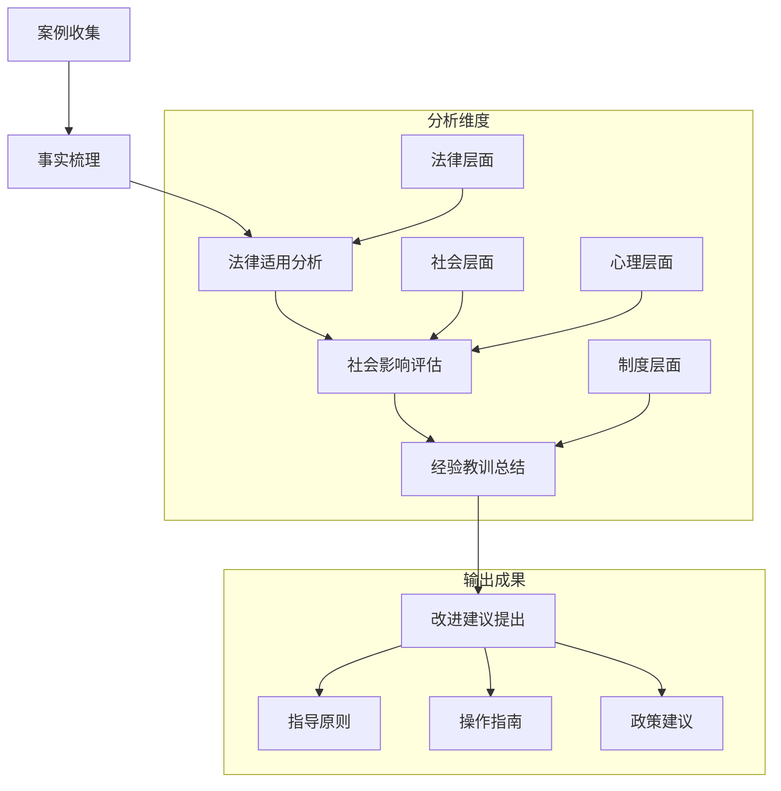
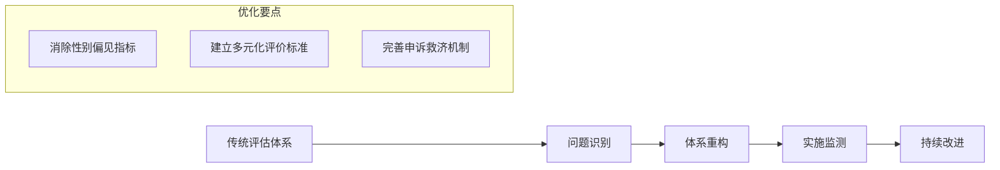
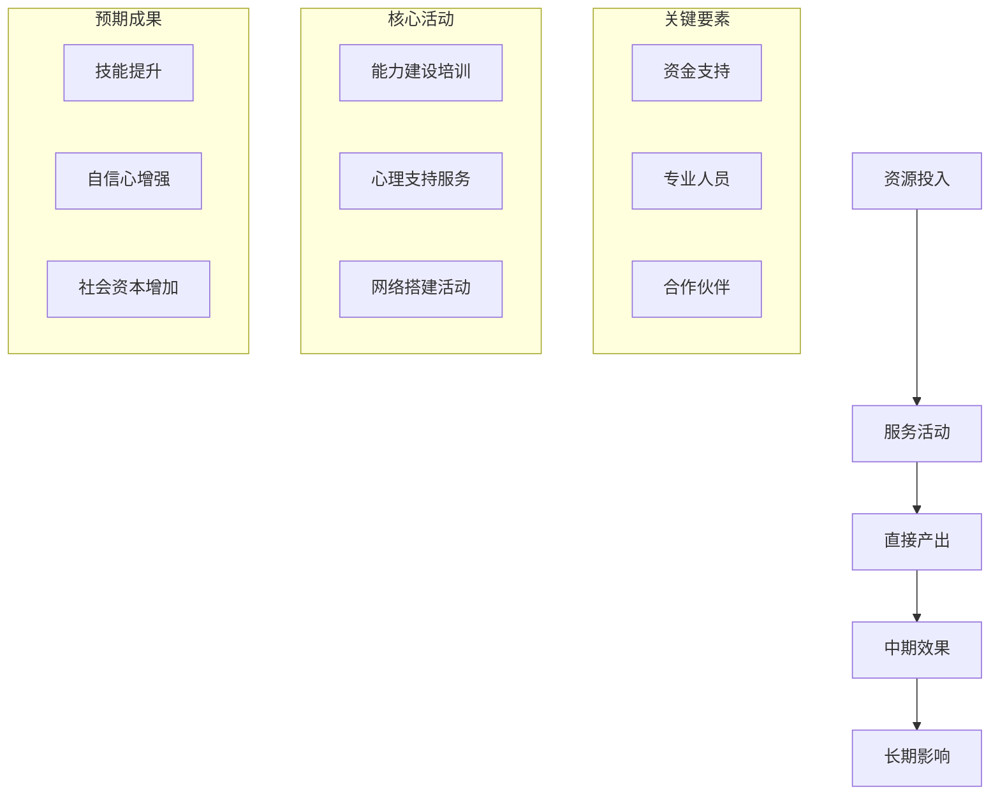
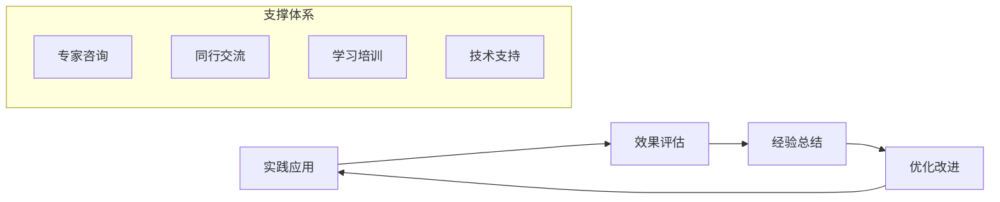

# Gender Discrimination Case Studies and Practical Applications (性别歧视案例分析与实践应用)

## 案例分析框架与方法论 (Case Analysis Framework and Methodology)

### 案例选择标准 (Case Selection Criteria)

| 选择维度 | 标准要求 | 评估指标 | 应用价值 | 数据来源 |
| :--- | :--- | :--- | :--- | :--- |
| **代表性** | 典型性强，反映普遍问题 | 覆盖不同行业、地区、群体 | 揭示规律性特征，指导实践 | 法院判例、媒体报道、调研数据 |
| **时效性** | 近年来发生的典型案例 | 事件发生时间在近3-5年内 | 反映当前状况，具有现实意义 | 最新司法判决、新闻报道 |
| **影响力** | 社会影响广泛，关注度高 | 媒体曝光度、公众讨论热度 | 引发社会关注，推动制度完善 | 网络舆情、社会调查 |
| **教育性** | 具有警示和启发意义 | 法律适用典型、处理方式创新 | 提供学习借鉴，促进意识提升 | 专家评析、学者研究 |

### 案例分析方法 (Case Analysis Methods)



## 典型案例深度分析 (In-depth Analysis of Typical Cases)

### 案例一：职场招聘性别歧视案 (Case 1: Workplace Recruitment Gender Discrimination)

#### 基本案情 (Basic Facts)
某知名互联网公司在招聘"产品运营专员"岗位时，在招聘启事中明确注明"限男性，能承受高强度工作压力"。女性求职者李某应聘被拒后，向当地劳动监察部门举报，并提起诉讼。

#### 法律争议焦点 (Legal Dispute Focus)
- 招聘条件是否构成就业歧视
- "高强度工作"是否属于合理的职业要求
- 用人单位的用工自主权边界

#### 裁判结果与理由 (Judgment Result and Reasoning)
法院认定该公司的招聘行为构成就业歧视，判决：
1. 赔偿申请人经济损失和精神损害抚慰金共计8万元
2. 在指定媒体上公开道歉
3. 修改相关招聘条件

**裁判要点**：
- "能承受高强度工作压力"属于性别刻板印象
- 不能以性别为由限制劳动者平等就业权利
- 用人单位应建立科学合理的岗位胜任力评价体系

#### 社会影响与启示 (Social Impact and Enlightenment)
**积极影响**：
- 提高了公众对隐性就业歧视的认知
- 推动了相关企业审视和改进招聘 practices
- 为类似案件处理提供了参考标准

**经验教训**：
- 招聘条件应基于岗位实际需要而非性别假设
- 需要建立更加客观公正的人才评价机制
- 加强对就业歧视的监管和执法力度

### 案例二：孕期女职工权益保护案 (Case 2: Pregnant Female Employee Rights Protection)

#### 基本案情 (Basic Facts)
张女士在怀孕6个月时，所在公司以其"工作效率下降、影响团队进度"为由，单方面解除劳动合同。张女士申请劳动仲裁，要求恢复劳动关系并支付违法解除赔偿金。

#### 法律争议焦点 (Legal Dispute Focus)
- 孕期女职工的特殊保护边界
- "工作效率下降"是否构成合法解除理由
- 企业经营需要与员工权益保护的平衡

#### 裁判结果与理由 (Judgment Result and Reasoning)
仲裁委支持张女士的请求，认为：
1. 公司解除行为违反《劳动合同法》第42条规定
2. "工作效率下降"不能成为解除孕期员工的正当理由
3. 用人单位应承担保护孕期女职工的法定义务

**处理结果**：
- 恢复张女士的劳动关系
- 支付违法解除赔偿金12万元
- 补发孕期工资待遇

#### 实践指导意义 (Practical Guidance Significance)
**对企业管理的启示**：
- 建立孕期员工关怀和支持制度
- 合理安排孕期员工的工作内容和强度
- 加强管理者相关法律知识培训

**对劳动者维权的指导**：
- 及时保留相关证据材料
- 了解自身法定权利和救济途径
- 必要时寻求专业法律援助

### 案例三：高校招生性别比例争议案 (Case 3: University Admission Gender Ratio Controversy)

#### 基本案情 (Basic Facts)
某师范大学在招生简章中规定"小学教育专业男女比例控制在1:3以内"，即女生不得超过75%。多名男生考生因超出比例限制被拒绝录取，遂提起行政诉讼。

#### 法律争议焦点 (Legal Dispute Focus)
- 教育资源配置的合理性标准
- 性别比例控制是否构成歧视
- 教育公平与专业特色的平衡

#### 裁判结果与理由 (Judgment Result and Reasoning)
法院经审理认为：
1. 该比例限制缺乏充分的法律依据和必要性论证
2. 构成对男性考生平等受教育权的不当限制
3. 违反了《教育法》和《妇女权益保障法》相关规定

**判决结果**：
- 撤销该招生比例限制条款
- 责令学校重新组织录取工作
- 赔偿受影响考生相应损失

#### 教育政策反思 (Educational Policy Reflection)
**制度层面的问题**：
- 缺乏科学的教育规划和预测机制
- 对教师队伍性别结构的认识存在偏差
- 招生政策制定程序不够民主透明

**改进建议**：
- 建立基于实际需求的师资培养机制
- 完善教育公平保障制度
- 加强招生政策的合法性审查

## 实践应用场景分析 (Practical Application Scenario Analysis)

### 场景一：企业人力资源管理 (Scenario 1: Corporate Human Resource Management)

#### 招聘环节的合规管理 (Compliant Recruitment Management)

**常见风险点识别**：
```
招聘广告用词不当 → 法律风险评估 → 合规性审查 → 风险防控建议
```

| 风险类型 | 典型表述 | 法律风险 | 合规建议 | 预防措施 |
| :--- | :--- | :--- | :--- | :--- |
| **直接歧视** | "限男性"、"男性优先" | 违反《就业促进法》第27条 | 删除性别限制条件 | 建立招聘广告审核机制 |
| **间接歧视** | "能适应出差"、"承受高强度工作" | 可能构成间接歧视 | 强调具体工作要求 | 制定岗位说明书标准 |
| **隐性歧视** | "形象气质佳"、"未婚未育优先" | 性别刻板印象 | 使用客观能力标准 | 开展招聘人员培训 |

#### 绩效考核中的性别平等 (Gender Equality in Performance Evaluation)

**评估体系优化方案**：


**具体改进措施**：
1. **指标设计**：避免使用可能带有性别色彩的评价标准
2. **权重分配**：根据不同岗位特点合理设置各项指标权重
3. **评价主体**：建立多元化的评价主体结构
4. **过程监督**：加强对评价过程的监督检查

### 场景二：教育机构性别平等实践 (Scenario 2: Educational Institution Gender Equality Practice)

#### 课程设置与教学方法 (Curriculum Setting and Teaching Methods)

**学科性别刻板印象破解**：
| 学科领域 | 传统性别刻板印象 | 破解策略 | 实施要点 | 预期效果 |
| :--- | :--- | :--- | :--- | :--- |
| **STEM教育** | 认为男生更适合理工科 | 鼓励女生参与科学实践活动 | 提供榜样示范，创造平等机会 | 打破学科性别壁垒 |
| **人文社科** | 认为女生更适合文科 | 强调文理并重的重要性 | 平衡资源配置，消除偏见引导 | 促进全面发展 |
| **艺术体育** | 对不同性别有不同的期待 | 尊重个体兴趣和天赋差异 | 提供多样化选择，避免标签化 | 发挥个人潜能 |

#### 校园文化建设 (Campus Culture Building)

**性别友好环境营造**：
1. **物理环境改造**：完善无障碍设施，提供性别友好的公共空间
2. **制度环境建设**：建立反性骚扰机制，完善申诉处理程序
3. **文化环境培育**：开展性别平等教育，营造包容和谐氛围

### 场景三：社会组织服务实践 (Scenario 3: Social Organization Service Practice)

#### 女性赋能项目设计 (Women Empowerment Program Design)

**项目逻辑模型**：


**实施要点**：
1. **需求评估**：深入了解服务对象的真实需求
2. **资源整合**：有效整合各方资源和专业力量
3. **过程管理**：建立科学的项目管理和监督机制
4. **效果评估**：定期评估项目效果并及时调整优化

## 最佳实践总结与推广 (Best Practice Summary and Promotion)

### 成功经验萃取 (Successful Experience Extraction)

#### 企业性别平等最佳实践 (Corporate Gender Equality Best Practices)

**标杆企业案例特征**：
| 实践维度 | 具体做法 | 实施效果 | 可复制性 | 推广价值 |
| :--- | :--- | :--- | :--- | :--- |
| **制度建设** | 制定完善的性别平等政策和程序 | 为实践提供制度保障 | 高 | 建立标准化模板 |
| **文化培育** | 开展全员性别平等意识培训 | 营造良好组织氛围 | 中高 | 开发培训课程体系 |
| **机制创新** | 建立女性领导力发展项目 | 促进女性职业发展 | 中 | 设计导师指导模式 |
| **效果监测** | 定期评估性别平等实践效果 | 持续改进完善措施 | 高 | 建立评估指标体系 |

#### 公共部门创新做法 (Public Sector Innovative Practices)

**政府部门推进性别平等的有效举措**：
1. **政策引导**：出台促进性别平等的政策措施
2. **监督检查**：建立健全监督检查和问责机制
3. **宣传教育**：广泛开展性别平等理念宣传普及
4. **示范带动**：培育和推广先进典型经验

### 推广策略与实施路径 (Promotion Strategy and Implementation Path)

#### 分层分类推广 (Hierarchical and Categorical Promotion)

**推广对象分类**：
```
大型企业集团 → 中小企业 → 事业单位 → 社会组织 → 个体从业者
```

**差异化策略**：
- **大型企业**：重点推广系统性解决方案
- **中小企业**：提供实用性强的操作指南
- **公共部门**：强化政策引导和制度建设
- **社会组织**：注重能力建设和资源整合

#### 持续改进机制 (Continuous Improvement Mechanism)

**反馈循环系统**：


**保障措施**：
1. **建立学习型组织**：鼓励持续学习和经验分享
2. **完善支持体系**：提供专业指导和技术支持
3. **强化激励机制**：对优秀实践给予表彰和奖励
4. **营造良好环境**：创造有利于创新实践的外部条件

---

**相关文档链接 (Related Documents):**
- [性别歧视概览](Gender_Discrimination_Overview.md) - 理论基础和现状分析
- [重男轻女文化根源分析](Son_Preference_Cultural_Origins.md) - 文化和社会结构因素
- [当代影响与表现](Contemporary_Impacts_Manifestations.md) - 现代表现形式
- [心理创伤与代际传递](Psychological_Trauma_Intergenerational.md) - 心理影响机制
- [干预策略与政策建议](Intervention_Strategies_Policy.md) - 解决策略和建议
- [国际比较与最佳实践](International_Comparison_Best_Practices.md) - 国际经验借鉴
- [测量与评估工具](Gender_Discrimination_Measurement_Tools.md) - 专业的测量量表和评估方法
- [标准化术语词典](Gender_Discrimination_Terminology_Standards.md) - 统一的专业术语定义
- [干预效果评估](Gender_Discrimination_Effectiveness_Evaluation.md) - 全面的效果评估体系
- [实践指南](Gender_Discrimination_Practical_Guide.md) - 系统性的预防与应对操作指导
- [培训材料](Gender_Discrimination_Training_Materials.md) - 完整的培训课程体系和教学设计

---

*本文档基于案例分析方法，通过深入剖析典型实例，提炼实践经验，为推进性别平等提供具体可行的操作指南和实践参考。*

**参考文献 (References):**
- 最高人民法院. (2023). 人民法院审理就业歧视案件典型案例汇编.
- 人力资源和社会保障部. (2022). 就业歧视案例分析与防范指南.
- 全国妇联. (2023). 妇女权益保障典型案例选编.
- 中国企业联合会. (2023). 企业性别平等最佳实践案例集.
- 李银河. (2022). 性别平等实践案例研究. 社会科学文献出版社.