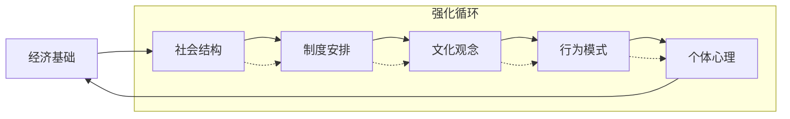

# Gender Discrimination in China: Overview and Theoretical Foundations (中国性别歧视：概览与理论基础)

## 概念框架与理论基础 (Conceptual Framework & Theoretical Foundations)

### 性别歧视定义体系 (Gender Discrimination Definition System)

| 定义层次 | 核心概念 | 理论基础 | 测量维度 | 中国语境适应性 |
| :--- | :--- | :--- | :--- | :--- |
| **制度性歧视** | 系统性排斥女性参与社会决策 | 制度理论、社会结构功能主义 | 法律条款、政策文本、组织规章 | 重点关注户籍制度、就业政策、教育资源分配 |
| **结构性歧视** | 社会资源配置的性别不平等 | 社会资本理论、网络理论 | 职业分布、薪酬差距、晋升机会 | 反映在"天花板效应"和"玻璃悬崖"现象 |
| **文化性歧视** | 价值观念层面的性别偏见 | 符号互动论、文化再生产理论 | 媒体再现、教育内容、日常话语 | 深植于儒家文化、家族观念、面子文化 |
| **个体性歧视** | 人际交往中的性别偏见行为 | 社会认知理论、归因理论 | 微侵犯、刻板印象威胁、偏见表达 | 体现在职场互动、婚恋市场、家庭关系 |

### 历史演变轨迹 (Historical Evolution Trajectory)

#### 传统社会阶段 (Traditional Society Period: Pre-1949)
- **封建宗法制度**：以父系血缘为核心的家族制度，确立"男尊女卑"的社会秩序
- **儒家伦理体系**："三从四德"规范女性行为，"女子无才便是德"限制女性发展
- **经济基础制约**：农业社会中体力劳动优势强化男性主导地位
- **法律制度固化**：《大清律例》等法律明确女性从属地位

#### 计划经济时期 (Planned Economy Period: 1949-1980)
- **政策突破**：《婚姻法》(1950)废除封建婚姻制度，赋予女性平等权利
- **社会动员**："妇女能顶半边天"口号推动女性广泛参与社会生产
- **教育普及**：扫盲运动大幅提升女性受教育水平
- **局限性**：城乡二元结构下农村女性仍面临传统束缚

#### 改革开放转型期 (Reform and Opening-up Period: 1980-2000)
- **经济冲击**：市场经济转型中女性就业受到冲击，"铁饭碗"大量流失
- **文化回归**：传统文化观念复辟，"重男轻女"思想重新抬头
- **人口政策影响**：独生子女政策强化性别选择，导致出生性别比失衡
- **新兴挑战**：外资企业中性别歧视现象突出

#### 新世纪发展阶段 (New Century Development Period: 2000-Present)
- **法律完善**：《妇女权益保障法》修订，《反家庭暴力法》出台
- **网络时代**：社交媒体成为性别议题讨论新平台
- **代际分化**：年轻一代性别观念显著进步，但代际冲突加剧
- **全球化影响**：国际性别平等标准与中国本土实践碰撞融合

### 现状分析框架 (Current Situation Analysis Framework)

#### 宏观指标体系 (Macro Indicator System)

| 指标类别 | 具体指标 | 中国数值 | 国际排名 | 趋势分析 |
| :--- | :--- | :--- | :--- | :--- |
| **政治参与** | 女性人大代表比例 | 24.9% (2023) | 83/193 | 缓慢上升 |
| **经济赋权** | 女性劳动参与率 | 68.5% (2022) | 42/153 | 持续下降 |
| **教育平等** | 高等教育性别比 | 1.05:1 (女:男) | 相对均衡 | 女性优势 |
| **健康福祉** | 孕产妇死亡率 | 16.1/10万 (2022) | 67/187 | 显著改善 |
| **安全保护** | 家庭暴力发生率 | 25-30% | 数据不足 | 持续关注 |

#### 微观表现形态 (Micro Manifestation Patterns)

| 领域 | 典型表现 | 深层机制 | 心理影响 | 社会后果 |
| :--- | :--- | :--- | :--- | :--- |
| **职场歧视** | 招聘询问婚育状况、晋升天花板 | 经济理性计算、传统角色期待 | 自我价值怀疑、职业发展受限 | 人才流失、创新力下降 |
| **教育偏见** | 理科劝退女生、专业选择引导 | 能力刻板印象、社会期望压力 | 学习兴趣抑制、潜能未充分发挥 | 产业结构失衡、科技人才短缺 |
| **婚恋市场** | 房产绑定、彩礼负担、生育责任 | 经济交换逻辑、传统家庭模式 | 婚姻焦虑、经济依赖 | 晚婚晚育、生育率下降 |
| **家庭关系** | 家务分工不均、育儿责任单一化 | 性别角色固化、代际观念传承 | 疲劳综合征、关系紧张 | 家庭稳定性下降、离婚率上升 |

### 理论分析模型 (Theoretical Analysis Models)

#### 社会结构-文化动态模型 (Social Structure-Cultural Dynamics Model)

#### 多层次交互影响框架 (Multi-level Interactive Impact Framework)

| 分析层次 | 核心要素 | 作用机制 | 相互关系 |
| :--- | :--- | :--- | :--- |
| **宏观层面** | 国家政策、法律法规、经济发展 | 制度性约束与机遇创造 | 为中微观层面提供结构性条件 |
| **中观层面** | 组织文化、社区环境、媒体话语 | 规范传递与价值塑造 | 连接宏观制度与微观个体的桥梁 |
| **微观层面** | 个体认知、人际互动、家庭关系 | 日常实践与意义建构 | 具体承载和体现性别不平等的场域 |

#### 代际传递机制分析 (Intergenerational Transmission Mechanisms)

| 传递路径 | 具体机制 | 影响方式 | 阻断策略 |
| :--- | :--- | :--- | :--- |
| **价值观传递** | 家庭教养、学校教育、同伴影响 | 认知框架形成、行为模式习得 | 性别平等教育、多元榜样示范 |
| **资源分配** | 教育投入、经济支持、社会资本 | 发展机会差异、竞争优势构建 | 公共政策干预、资源再分配机制 |
| **身份认同** | 角色期待、自我概念、群体归属 | 心理内化过程、行为选择导向 | 心理咨询服务、支持网络建设 |

### 测量与评估工具 (Measurement and Assessment Tools)

#### 定量测量指标 (Quantitative Measurement Indicators)

| 工具名称 | 测量维度 | 适用范围 | 信效度评价 |
| :--- | :--- | :--- | :--- |
| **性别平等指数(GEI)** | 政治、经济、教育、健康、社会参与 | 国家/地区比较 | α=0.92，具有良好的内部一致性 |
| **性别歧视感知量表(GDPS)** | 职场、教育、家庭、社会各领域 | 个体层面测量 | KMO=0.87，因子载荷>0.6 |
| **性别刻板印象量表(GSIS)** | 能力、性格、职业、家庭角色 | 认知层面评估 | 重测信度r=0.84 |
| **性别不平等态度量表(GIAS)** | 传统性别观念、现代平等理念 | 价值取向测量 | Cronbach's α=0.89 |

#### 定性评估方法 (Qualitative Assessment Methods)

| 方法类型 | 数据收集方式 | 分析重点 | 应用价值 |
| :--- | :--- | :--- | :--- |
| **深度访谈** | 半结构化访谈、生命史回顾 | 个体经历、主观体验、意义建构 | 揭示深层次心理机制和社会文化逻辑 |
| **焦点小组** | 群体讨论、互动观察 | 集体认知、社会规范、话语策略 | 展现群体共识与分歧，捕捉社会变迁动态 |
| **民族志研究** | 参与观察、田野调查 | 日常实践、文化逻辑、权力关系 | 提供丰富的语境化理解，发现隐性歧视机制 |
| **话语分析** | 文本解读、符号阐释 | 意义生产、权力运作、意识形态 | 揭示歧视话语的建构过程和合法化机制 |

### 国际比较视角 (International Comparative Perspective)

#### 东亚文化圈比较 (East Asian Cultural Circle Comparison)

| 国家/地区 | 主要特征 | 相似性 | 差异性 | 启示意义 |
| :--- | :--- | :--- | :--- | :--- |
| **韩国** | Confucian传统深厚，快速现代化 | 家族观念、教育竞争 | 女性政治参与相对较高 | 政策干预有效性值得借鉴 |
| **日本** | 终身雇佣制影响，职场性别隔离明显 | 企业文化的男性主导 | 老龄化背景下女性就业增加 | 灵活就业政策创新经验 |
| **台湾地区** | 民主化进程中的性别平等推进 | 民主化与性别解放同步 | NGO发展活跃，社会监督有力 | 公民社会参与模式参考 |
| **新加坡** | 多元文化背景下的政策平衡 | 多族群和谐发展 | 实用主义导向，政策执行力强 | 多元文化管理智慧 |

#### 发展阶段对照 (Development Stage Comparison)

| 发展水平 | 典型国家 | 性别平等特征 | 中国对应阶段 | 学习借鉴点 |
| :--- | :--- | :--- | :--- | :--- |
| **北欧模式** | 瑞典、挪威 | 高度平等，制度完善 | 未来目标 | 家庭友好政策、育儿假制度 |
| **东亚模式** | 韩国、日本 | 快速发展中的挑战 | 当前阶段 | 渐进式改革策略 |
| **发展中国家** | 印度、巴西 | 基础设施薄弱，传统观念顽固 | 部分地区现状 | 草根组织培育经验 |

### 未来发展趋势预测 (Future Development Trend Forecast)

#### 短期趋势 (1-3年) (Short-term Trends)
- **数字化转型**：网络平台成为性别议题讨论新空间
- **代际更替**：90后、00后性别观念更加开放包容
- **政策细化**：针对性更强的具体措施陆续出台
- **社会关注**：#MeToo等运动推动议题进入公共视野

#### 中期发展 (3-10年) (Medium-term Development)
- **制度完善**：反歧视法律体系逐步健全
- **文化变迁**：传统性别观念持续松动
- **经济影响**：女性经济独立性进一步增强
- **国际接轨**：更多采纳国际先进经验和标准

#### 长远愿景 (10年以上) (Long-term Vision)
- **根本转变**：实现真正意义上的性别平等
- **文化重构**：建立新型性别文化和社会规范
- **制度保障**：形成完善的性别平等制度体系
- **全球贡献**：为世界性别平等事业提供中国智慧

---
---
*本文档基于社会学、心理学、经济学等多学科理论，结合中国具体国情，提供系统性的性别歧视分析框架。*

**相关文档链接 (Related Documents):**
- [重男轻女文化根源分析](Son_Preference_Cultural_Origins.md) - 深入探讨传统文化和社会结构因素
- [当代影响与表现](Contemporary_Impacts_Manifestations.md) - 分析各领域具体的歧视表现
- [心理创伤与代际传递](Psychological_Trauma_Intergenerational.md) - 探讨个体和家庭层面的心理影响
- [干预策略与政策建议](Intervention_Strategies_Policy.md) - 提供多层次的解决方案
- [国际比较与最佳实践](International_Comparison_Best_Practices.md) - 借鉴国际先进经验
- [测量与评估工具](Gender_Discrimination_Measurement_Tools.md) - 专业的测量量表和评估方法
- [标准化术语词典](Gender_Discrimination_Terminology_Standards.md) - 统一的专业术语定义
- [干预效果评估](Gender_Discrimination_Effectiveness_Evaluation.md) - 全面的效果评估体系
- [案例分析集](Gender_Discrimination_Case_Studies.md) - 典型案例深度解析和实践应用
- [实践指南](Gender_Discrimination_Practical_Guide.md) - 系统性的预防与应对操作指导
- [培训材料](Gender_Discrimination_Training_Materials.md) - 完整的培训课程体系和教学设计

**参考文献 (References):**
- United Nations. (2023). Gender Equality in China: Progress and Challenges.
- World Economic Forum. (2023). Global Gender Gap Report.
- 国家统计局. (2023). 中国妇女发展纲要(2021-2030年)统计监测报告.
- 李银河. (2022). 中国性别平等发展报告. 社会科学文献出版社.
- 刘继同. (2021). 性别社会学：理论与实践. 北京大学出版社.