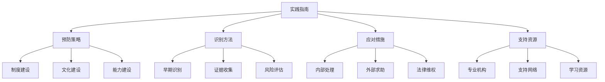
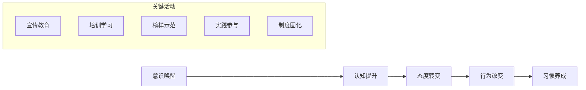
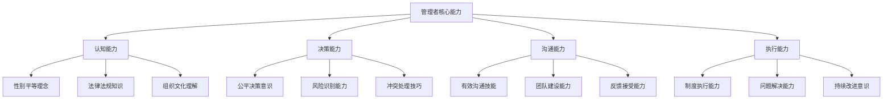
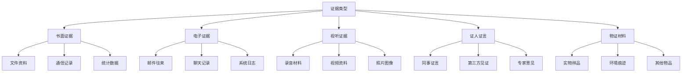
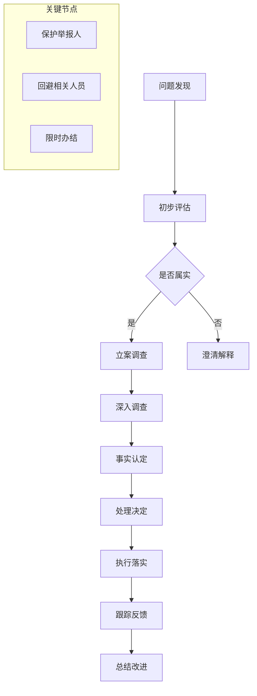

# Gender Discrimination Prevention and Response Practical Guide (性别歧视预防与应对实践指南)

## 实践指南概述 (Practice Guide Overview)

### 指南定位与适用范围 (Guide Positioning and Scope)

#### 目标受众分析 (Target Audience Analysis)

| 受众群体 | 核心需求 | 主要挑战 | 服务重点 | 支持方式 |
| :--- | :--- | :--- | :--- | :--- |
| **企业管理者** | 合规经营、风险防控、文化建设 | 法律理解、制度建设、执行落实 | 政策解读、制度设计、实施指导 | 培训讲座、咨询服务、案例分享 |
| **HR从业人员** | 招聘管理、绩效考核、员工关系 | 操作规范、技能提升、争议处理 | 流程优化、工具应用、纠纷调解 | 实操培训、工具包提供、经验交流 |
| **普通员工** | 权益保护、平等参与、职业发展 | 认知提升、技能发展、维权途径 | 意识培养、能力提升、支持服务 | 教育培训、互助网络、法律援助 |
| **教育工作者** | 教学实践、学生指导、校园管理 | 观念转变、方法创新、环境营造 | 课程设计、活动组织、制度完善 | 专业培训、资源支持、平台搭建 |
| **社会组织** | 项目设计、服务提供、倡导推动 | 资源整合、专业能力、影响力扩大 | 能力建设、网络构建、效果评估 | 能力建设、合作平台、经验推广 |

### 指南结构框架 (Guide Structure Framework)



## 第一部分：预防策略体系 (Part 1: Prevention Strategy System)

### 组织制度建设 (Organizational System Construction)

#### 反歧视制度框架设计 (Anti-discrimination System Framework Design)

**制度体系架构**：
```
基础制度层 → 执行制度层 → 监督制度层 → 改进制度层
```

| 制度层级 | 核心内容 | 实施要点 | 保障机制 | 效果评估 |
| :--- | :--- | :--- | :--- | :--- |
| **基础制度** | 反歧视基本原则和适用范围 | 明确禁止各类歧视行为 | 高层承诺、全员知晓 | 制度认知度调查 |
| **执行制度** | 具体操作规程和标准 | 规范各项工作流程 | 培训指导、监督检查 | 执行合规性评估 |
| **监督制度** | 监督机制和问责程序 | 建立内外部监督体系 | 独立机构、透明程序 | 监督有效性评价 |
| **改进制度** | 持续改进和优化机制 | 定期评估和更新制度 | 反馈机制、学习改进 | 制度适应性分析 |

#### 具体制度模板 (Specific System Templates)

**反歧视政策声明模板**：
```markdown
## [组织名称] 反歧视政策声明

我们承诺：
1. 严格遵守国家有关反歧视的法律法规
2. 在招聘、晋升、薪酬等各个环节坚持公平公正原则
3. 禁止任何形式的歧视行为，包括但不限于性别、年龄、种族等
4. 为所有员工提供平等的发展机会和职业成长空间
5. 建立有效的申诉和救济机制，保护员工合法权益

如有违反本政策的行为，将依法依规严肃处理。

[组织名称]
[发布日期]
```

**申诉处理程序模板**：
```markdown
## 员工申诉处理程序

### 申诉渠道
- 直接向直属上级反映
- 联系人力资源部门
- 通过员工热线或邮箱
- 向工会组织求助

### 处理流程
1. **受理登记**（1个工作日内）
2. **初步调查**（5个工作日内）
3. **正式调查**（15个工作日内）
4. **处理决定**（5个工作日内）
5. **结果反馈**（2个工作日内）

### 保障措施
- 严格保密申诉人信息
- 禁止任何形式的报复行为
- 提供必要的法律援助
- 建立申诉复查机制
```

### 组织文化建设 (Organizational Culture Building)

#### 性别平等文化培育 (Gender Equality Culture Cultivation)

**文化建设路径图**：


**具体实施策略**：

1. **领导层示范引领**
   - 高层管理者公开承诺支持性别平等
   - 在重要场合强调反歧视立场
   - 以身作则践行平等理念

2. **全员教育培训**
   - 定期开展性别平等意识培训
   - 将反歧视内容纳入新员工入职培训
   - 组织专题研讨和经验分享活动

3. **环境氛围营造**
   - 在办公场所张贴宣传标语和海报
   - 设置性别友好的物理环境和设施
   - 开展丰富多彩的主题活动

#### 沟通机制优化 (Communication Mechanism Optimization)

**多元化沟通渠道建设**：
| 沟通方式 | 适用场景 | 优势特点 | 注意事项 | 实施建议 |
| :--- | :--- | :--- | :--- | :--- |
| **正式会议** | 政策传达、重要决策 | 权威性强、覆盖面广 | 准备充分、互动充分 | 定期召开，鼓励参与 |
| **工作坊培训** | 技能提升、意识培养 | 互动性强、体验深刻 | 精心设计、专业引导 | 小班教学，注重实效 |
| **在线平台** | 知识分享、经验交流 | 便捷高效、资源丰富 | 内容优质、管理规范 | 建设专门网站或社群 |
| **一对一辅导** | 个性化指导、问题解决 | 针对性强、效果直接 | 专业匹配、信任建立 | 建立导师制度 |

### 能力建设体系 (Capacity Building System)

#### 管理者能力提升 (Manager Capability Enhancement)

**核心能力框架**：


**培训课程设计**：
| 课程模块 | 核心内容 | 培训方式 | 时间安排 | 考核方式 |
| :--- | :--- | :--- | :--- | :--- |
| **基础理论** | 性别平等基本概念、相关法律法规 | 课堂讲授+案例分析 | 8课时 | 理论测试+案例分析 |
| **实务操作** | 招聘、考核、晋升等环节的平等实践 | 模拟演练+角色扮演 | 12课时 | 实操考核+同伴评价 |
| **沟通技巧** | 跨性别沟通、冲突调解、团队管理 | 互动研讨+情景模拟 | 8课时 | 情景表现+反思报告 |
| **领导力发展** | 包容性领导、多元化团队建设 | 经验分享+行动计划 | 6课时 | 行动计划+后续跟踪 |

#### 员工自助能力培养 (Employee Self-help Capability Development)

**个人能力发展路径**：
```
自我认知 → 意识觉醒 → 技能学习 → 实践应用 → 经验分享
```

**能力建设工具包**：
1. **自我评估工具**
   - 性别平等意识自测量表
   - 职场歧视经历记录表
   - 个人发展需求分析问卷

2. **学习资源推荐**
   - 推荐书单和文章
   - 在线课程和讲座
   - 实践案例和经验分享

3. **技能训练方法**
   - 沟通表达练习
   - 维权技巧培训
   - 心理调适方法

## 第二部分：识别与评估方法 (Part 2: Identification and Assessment Methods)

### 早期识别机制 (Early Identification Mechanism)

#### 歧视行为识别指南 (Discrimination Behavior Identification Guide)

**识别信号分类**：
| 信号类型 | 具体表现 | 识别要点 | 应对建议 | 记录要点 |
| :--- | :--- | :--- | :--- | :--- |
| **语言信号** | 贬低性词汇、刻板印象表达 | 注意措辞和语气变化 | 及时制止，明确表态 | 记录时间、地点、当事人 |
| **行为信号** | 区别对待、排斥孤立行为 | 观察行为模式和频率 | 私下沟通，了解情况 | 描述具体行为和影响 |
| **制度信号** | 政策条款的性别偏向 | 审查制度文本和执行 | 提出修改建议 | 标注问题条款和理由 |
| **环境信号** | 物理环境的性别不友好 | 检查设施配置和标识 | 提出改善建议 | 拍照记录，说明问题 |

#### 风险评估工具 (Risk Assessment Tools)

**风险评估矩阵**：
| 风险维度 | 评估指标 | 权重 | 评分标准 | 风险等级 |
| :--- | :--- | :--- | :--- | :--- |
| **发生概率** | 历史数据、现状分析、趋势判断 | 40% | 1-5分制 | 低(1-2)、中(3)、高(4-5) |
| **影响程度** | 对个人、组织、社会的影响 | 35% | 1-5分制 | 低(1-2)、中(3)、高(4-5) |
| **可控程度** | 预防和应对能力评估 | 25% | 1-5分制 | 低(1-2)、中(3)、高(4-5) |

**风险等级判定**：
- **高风险**(80-100分)：立即采取紧急措施
- **中风险**(60-79分)：制定专门应对方案
- **低风险**(0-59分)：加强日常监控预防

### 证据收集与保存 (Evidence Collection and Preservation)

#### 证据类型与收集方法 (Evidence Types and Collection Methods)

**证据分类体系**：


**收集注意事项**：
1. **及时性**：第一时间收集固定证据
2. **完整性**：确保证据链完整无缺失
3. **合法性**：通过合法途径获取证据
4. **保密性**：妥善保管涉及隐私的信息

#### 证据保存规范 (Evidence Preservation Standards)

**保存要求**：
| 证据类型 | 保存期限 | 存储方式 | 安全措施 | 备份要求 |
| :--- | :--- | :--- | :--- | :--- |
| **书面材料** | 5年以上 | 专用文件柜 | 防火防盗防潮 | 电子扫描备份 |
| **电子数据** | 永久保存 | 加密存储设备 | 访问权限控制 | 异地多重备份 |
| **视听资料** | 10年以上 | 专业存储介质 | 格式标准化 | 定期迁移更新 |
| **证人证言** | 3年以上 | 录音录像 | 证人信息保密 | 多种载体记录 |

## 第三部分：应对与处理措施 (Part 3: Response and Handling Measures)

### 内部处理机制 (Internal Handling Mechanism)

#### 问题处理流程 (Problem Handling Process)

**标准处理流程图**：


#### 调解协商技巧 (Mediation and Negotiation Skills)

**调解原则**：
1. **自愿原则**：尊重当事人意愿
2. **公正原则**：保持中立客观立场
3. **保密原则**：保护当事人隐私
4. **及时原则**：快速有效处理

**协商策略**：
| 策略类型 | 适用情况 | 实施要点 | 注意事项 | 预期效果 |
| :--- | :--- | :--- | :--- | :--- |
| **直接沟通** | 双方愿意面对面解决 | 创造平等对话环境 | 避免情绪激化 | 快速化解矛盾 |
| **第三方介入** | 双方难以直接沟通 | 选择合适的调解人 | 保持中立公正 | 促进理性对话 |
| **利益平衡** | 涉及多方利益冲突 | 寻找共同利益点 | 兼顾各方合理诉求 | 达成双赢结果 |
| **制度完善** | 暴露制度缺陷问题 | 分析根本原因 | 建立长效机制 | 防止问题复发 |

### 外部求助渠道 (External Help Channels)

#### 专业机构资源 (Professional Institutional Resources)

**主要求助机构**：
| 机构类型 | 主要职能 | 联系方式 | 服务特点 | 适用情况 |
| :--- | :--- | :--- | :--- | :--- |
| **劳动监察部门** | 监督检查、违法行为查处 | 12333热线 | 权威性强、执行力高 | 劳动权益受损 |
| **妇联组织** | 权益维护、法律援助 | 12338热线 | 专业性强、服务贴心 | 女性权益保护 |
| **工会组织** | 职工权益代表、集体协商 | 企业工会 | 贴近基层、了解实情 | 职工集体利益 |
| **法律援助中心** | 免费法律咨询、代理诉讼 | 12348热线 | 专业法律服务 | 需要法律维权 |
| **心理咨询机构** | 心理创伤治疗、情绪疏导 | 专业心理热线 | 专业心理支持 | 心理健康问题 |

#### 社会支持网络 (Social Support Network)

**支持网络构建**：


### 法律维权路径 (Legal Rights Protection Path)

#### 维权程序指引 (Rights Protection Procedure Guide)

**维权步骤流程**：
```
1. 收集固定证据 → 2. 明确维权诉求 → 3. 选择维权途径 → 4. 准备相关材料 → 5. 提起维权申请 → 6. 参与维权过程 → 7. 执行维权结果
```

**维权途径对比**：
| 维权途径 | 适用情况 | 优势特点 | 注意事项 | 时间周期 |
| :--- | :--- | :--- | :--- | :--- |
| **协商调解** | 双方愿意和解解决 | 成本低、效率高、关系缓和 | 需要双方配合 | 1-3个月 |
| **劳动仲裁** | 劳动争议案件 | 专业性强、程序简便 | 有时效限制 | 2-4个月 |
| **民事诉讼** | 权益受损严重案件 | 强制执行力强 | 程序复杂、成本较高 | 6-12个月 |
| **行政投诉** | 违法行为举报 | 执法力度大 | 需要充分证据 | 3-6个月 |

#### 法律文书模板 (Legal Document Templates)

**投诉申请书模板**：
```markdown
## 性别歧视投诉申请书

申请人：[姓名]，性别：[性别]，联系方式：[电话/邮箱]
被投诉人：[单位名称]，地址：[详细地址]，联系方式：[电话]

投诉事项：
[详细描述遭受的性别歧视行为，包括时间、地点、具体情形等]

事实和理由：
[客观陈述相关事实，列举具体证据]

投诉请求：
1. [具体请求事项1]
2. [具体请求事项2]
3. [具体请求事项3]

证据材料清单：
1. [证据1名称及说明]
2. [证据2名称及说明]
...

此致
[相关主管部门名称]

申请人：[签名]
日期：[年月日]
```

## 第四部分：支持资源与工具 (Part 4: Support Resources and Tools)

### 专业服务机构名录 (Professional Service Institutions Directory)

#### 法律服务机构 (Legal Service Institutions)

**全国性机构**：
- 中华全国律师协会公益法律服务中心
- 中国法律援助基金会
- 全国妇联法律帮助中心

**地方性机构**：
- 各地法律援助中心
- 妇联维权部门
- 工会法律服务站

#### 心理支持机构 (Psychological Support Institutions)

**专业心理咨询机构**：
- 北京大学心理学系心理咨询中心
- 华东师范大学心理健康教育中心
- 各地精神卫生中心心理咨询科

**公益心理热线**：
- 全国心理援助热线：400-161-9995
- 妇女维权心理热线：12338-3
- 青年心理援助热线：12355

### 在线资源平台 (Online Resource Platforms)

#### 学习教育平台 (Learning and Education Platforms)

**官方网站**：
- 全国妇联官网：www.women.org.cn
- 人力资源社会保障部官网：www.mohrss.gov.cn
- 最高人民法院官网：www.court.gov.cn

**专业数据库**：
- 中国知网性别研究专题库
- 万方数据性别平等文献库
- 维普资讯女性权益保护专题

#### 互动交流平台 (Interactive Communication Platforms)

**社交媒体群组**：
- 微信公众号：女性权益保护、职场平等之声
- 微博话题：#性别平等#、#反歧视行动#
- 知乎专栏：性别平等实践、职场反歧视指南

**专业论坛社区**：
- 豆瓣小组：性别平等讨论组
- 百度贴吧：女性权益保护吧
- 专业BBS论坛相关版块

### 实用工具包 (Practical Toolkits)

#### 自助评估工具 (Self-assessment Tools)

**个人情况评估表**：
```markdown
## 性别平等意识自测量表

说明：请根据您的实际情况，在相应的选项上打√

1. 我了解什么是性别歧视吗？
   □ 非常了解  □ 比较了解  □ 一般了解  □ 不太了解  □ 完全不了解

2. 我能够识别日常生活中的性别歧视行为吗？
   □ 总是能够  □ 经常能够  □ 有时能够  □ 很少能够  □ 完全不能

3. 面对性别歧视，我知道如何应对吗？
   □ 非常清楚  □ 比较清楚  □ 一般清楚  □ 不太清楚  □ 完全不清楚

[继续其他评估题目...]

评估结果分析：
- 20-25分：意识较强，继续保持
- 15-19分：有一定基础，需要加强
- 10-14分：基础薄弱，急需提升
- 0-9分：意识不足，建议系统学习
```

#### 行动计划模板 (Action Plan Template)

**个人行动计划**：
```markdown
## 性别平等实践行动计划

目标设定：
[明确想要达到的具体目标]

行动步骤：
1. [第一步具体行动]
   - 时间安排：[具体时间]
   - 所需资源：[需要的支持]
   - 预期成果：[希望达成的效果]

2. [第二步具体行动]
   [同上格式]

3. [第三步具体行动]
   [同上格式]

监督评估：
- 自我监督：[监督方式]
- 他人监督：[监督人选]
- 评估周期：[多久评估一次]

调整完善：
[根据实施情况及时调整计划]
```

---

**相关文档链接 (Related Documents):**
- [性别歧视概览](Gender_Discrimination_Overview.md) - 理论基础和现状分析
- [重男轻女文化根源分析](Son_Preference_Cultural_Origins.md) - 文化和社会结构因素
- [当代影响与表现](Contemporary_Impacts_Manifestations.md) - 现代表现形式
- [心理创伤与代际传递](Psychological_Trauma_Intergenerational.md) - 心理影响机制
- [干预策略与政策建议](Intervention_Strategies_Policy.md) - 解决策略和建议
- [国际比较与最佳实践](International_Comparison_Best_Practices.md) - 国际经验借鉴
- [测量与评估工具](Gender_Discrimination_Measurement_Tools.md) - 专业的测量量表和评估方法
- [标准化术语词典](Gender_Discrimination_Terminology_Standards.md) - 统一的专业术语定义
- [干预效果评估](Gender_Discrimination_Effectiveness_Evaluation.md) - 全面的效果评估体系
- [案例分析集](Gender_Discrimination_Case_Studies.md) - 典型案例深度解析
- [培训材料](Gender_Discrimination_Training_Materials.md) - 完整的培训课程体系和教学设计

---

*本文档旨在为各类组织和个人提供系统性的性别歧视预防与应对指导，通过理论与实践相结合的方式，帮助读者建立科学有效的反歧视工作机制。*

**参考文献 (References):**
- 人力资源和社会保障部. (2023). 用人单位反就业歧视操作指南.
- 全国妇联. (2023). 妇女权益保障实务手册.
- 中国企业联合会. (2022). 企业性别平等最佳实践指南.
- 国际劳工组织. (2023). 工作场所平等机会指南.
- 李银河. (2022). 性别平等实践操作手册. 社会科学文献出版社.