# Gender Discrimination Training Materials and Curriculum Design (性别歧视培训材料与课程设计)

## 培训体系总体设计 (Training System Overall Design)

### 培训目标与定位 (Training Objectives and Positioning)

#### 多层次培训目标体系 (Multi-level Training Objective System)

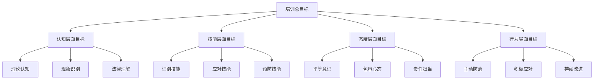

#### 目标群体细分与差异化设计 (Target Group Segmentation and Differentiated Design)

| 群体类别 | 核心需求 | 培训重点 | 教学方法 | 时长建议 |
| :--- | :--- | :--- | :--- | :--- |
| **高层管理者** | 战略决策、文化建设、风险管控 | 政策法规、社会责任、领导力 | 案例研讨、战略对话、经验分享 | 4-6小时 |
| **中层管理者** | 制度执行、团队管理、冲突处理 | 操作规范、沟通技巧、团队建设 | 情景模拟、角色扮演、小组讨论 | 6-8小时 |
| **HR从业人员** | 招聘管理、制度建设、争议处理 | 专业技能、流程规范、工具应用 | 实操演练、工具演示、案例分析 | 8-12小时 |
| **普通员工** | 权益保护、平等参与、自我发展 | 意识提升、技能学习、维权途径 | 互动教学、体验活动、经验交流 | 3-4小时 |
| **教育工作者** | 教学实践、学生指导、环境营造 | 理念更新、方法创新、环境创设 | 工作坊、实践观摩、反思研讨 | 6-8小时 |

### 培训内容框架 (Training Content Framework)

#### 模块化课程结构 (Modular Course Structure)

**基础模块**：
1. 性别平等基本概念与理论基础
2. 中国性别歧视现状与特点分析
3. 相关法律法规解读与应用

**进阶模块**：
4. 歧视行为识别与风险评估
5. 预防机制建设与制度完善
6. 应对策略与处理技巧

**实践模块**：
7. 案例分析与经验分享
8. 情景模拟与技能训练
9. 行动计划制定与实施

## 基础培训模块 (Basic Training Modules)

### 模块一：性别平等理论基础 (Module 1: Gender Equality Theoretical Foundation)

#### 课程1.1：性别概念与平等内涵 (Course 1.1: Gender Concepts and Equality Connotation)

**课程目标**：
- 理解性别概念的基本内涵
- 掌握性别平等的核心要义
- 认识性别差异与性别平等的关系

**核心内容**：

**1. 性别概念解析**
```
生理性别(Biological Sex) → 心理性别(Gender Identity) → 社会性别(Gender Role)
```

| 概念维度 | 核心内容 | 理解要点 | 常见误区 |
| :--- | :--- | :--- | :--- |
| **生理性别** | 基于生物学特征的性别分类 | 客观存在的生物差异 | 不应成为社会评价标准 |
| **心理性别** | 个体对自身性别的内在认同 | 主观的心理认知 | 可能与生理性别不一致 |
| **社会性别** | 社会文化建构的性别角色 | 后天习得的社会规范 | 可以通过教育和实践改变 |

**2. 性别平等内涵**
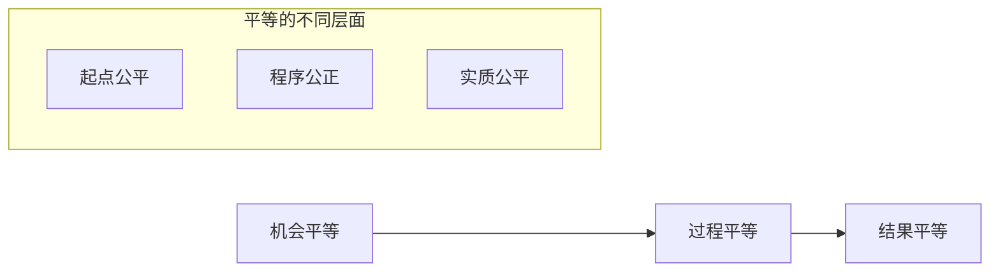

**关键观点**：
- 性别平等不是性别相同，而是权利和机会的平等
- 真正的平等需要考虑不同群体的实际需要
- 平等的实现是一个渐进的历史过程

**教学活动设计**：
1. **概念辨析讨论**：分组讨论日常生活中遇到的性别刻板印象
2. **案例分析**：分析典型的性别不平等现象及其影响
3. **反思练习**：检视自己的性别观念和偏见

#### 课程1.2：中国性别歧视现状分析 (Course 1.2: Analysis of Gender Discrimination Status in China)

**课程目标**：
- 了解中国性别歧视的基本现状
- 认识性别歧视的主要表现形式
- 理解产生性别歧视的深层原因

**核心内容**：

**1. 现状数据展示**
| 领域维度 | 主要指标 | 现状数据 | 国际比较 | 发展趋势 |
| :--- | :--- | :--- | :--- | :--- |
| **教育领域** | 高等教育性别比 | 女生占比51.3% | 略高于OECD平均 | 持续改善 |
| **就业领域** | 女性劳动参与率 | 60.5% | 低于男性12个百分点 | 逐步提升 |
| **政治领域** | 全国人大女代表比例 | 26.5% | 低于全球平均水平 | 稳步增长 |
| **经济领域** | 性别薪酬差距 | 15-25% | 与其他发展中国家相当 | 有所缩小 |

**2. 主要表现形式分析**
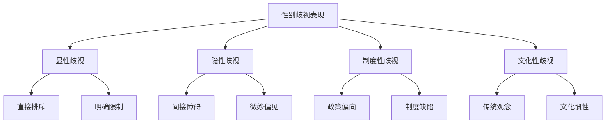

**3. 深层原因探究**
- **历史文化因素**：传统文化中的男权思想
- **经济社会因素**：经济发展不平衡的影响
- **制度环境因素**：相关制度建设有待完善
- **个人认知因素**：性别平等意识有待提升

**教学活动设计**：
1. **数据解读工作坊**：分组分析性别统计数据的含义
2. **现象识别练习**：识别身边的性别歧视现象
3. **原因探讨讨论**：深入分析歧视产生的根本原因

### 模块二：法律法规与政策解读 (Module 2: Laws, Regulations and Policy Interpretation)

#### 课程2.1：核心法律法规解读 (Course 2.1: Core Laws and Regulations Interpretation)

**课程目标**：
- 掌握反性别歧视的主要法律法规
- 理解法律条文的具体含义和适用范围
- 学会在实践中正确运用相关法律

**核心内容**：

**1. 主要法律框架**
```
宪法基础 → 专门法律 → 配套法规 → 地方条例
```

| 法律层级 | 核心法律 | 主要内容 | 适用范围 | 执行机制 |
| :--- | :--- | :--- | :--- | :--- |
| **宪法层面** | 《中华人民共和国宪法》 | 确立男女平等基本原则 | 全国范围内 | 宪法监督 |
| **基本法律** | 《妇女权益保障法》 | 专门保护妇女合法权益 | 女性群体 | 政府实施 |
| **配套法规** | 《就业促进法》 | 禁止就业歧视相关规定 | 就业领域 | 劳动监察 |
| **地方条例** | 各地实施办法 | 结合地方实际的具体规定 | 特定区域 | 地方执行 |

**2. 重点条文解析**

**《妇女权益保障法》关键条文**：
- 第2条：实行男女平等是国家的基本国策
- 第23条：各单位在录用职工时，除国家规定的不适合妇女的工种或者岗位外，不得以性别为由拒绝录用妇女或者提高对妇女的录用标准
- 第27条：任何单位不得因结婚、怀孕、产假、哺乳等情形，降低女职工的工资，辞退女职工，单方解除劳动(聘用)合同或者服务协议

**《就业促进法》相关条文**：
- 第27条：国家保障妇女享有与男子平等的劳动权利
- 第28条：用人单位招用人员，除国家规定的不适合妇女的工种或者岗位外，不得以性别为由拒绝录用妇女或者提高对妇女的录用标准

**3. 法律适用要点**
- **举证责任**：用人单位需要证明其行为的合理性
- **赔偿标准**：包括经济损失和精神损害赔偿
- **救济途径**：协商调解、劳动仲裁、民事诉讼等多种方式

**教学活动设计**：
1. **条文解读练习**：逐条分析重点法律条文的含义
2. **案例分析讨论**：结合真实案例理解法律适用
3. **情景模拟**：模拟法律咨询和维权过程

#### 课程2.2：政策发展趋势与前沿动态 (Course 2.2: Policy Development Trends and Frontier Dynamics)

**课程目标**：
- 了解性别平等政策的最新发展趋势
- 掌握相关政策的前沿动态
- 预判未来政策走向和影响

**核心内容**：

**1. 最新政策动向**
- 《中国妇女发展纲要(2021-2030年)》实施进展
- 《性别平等促进条例》立法进程
- 各部委性别平等相关政策文件

**2. 国际发展趋势**
- 联合国可持续发展目标(SDGs)推进情况
- 世界各国性别平等政策创新实践
- 国际组织最新研究成果和建议

**3. 前沿热点议题**
- 数字时代性别平等问题
- 气候变化与性别平等
- 人工智能发展中的性别考量

**教学活动设计**：
1. **政策解读研讨会**：邀请专家解读最新政策
2. **趋势分析报告**：学员分组分析政策发展趋势
3. **前沿话题辩论**：就热点议题展开深入讨论

## 进阶培训模块 (Advanced Training Modules)

### 模块三：识别与预防技能 (Module 3: Identification and Prevention Skills)

#### 课程3.1：歧视行为识别技能 (Course 3.1: Discrimination Behavior Identification Skills)

**课程目标**：
- 掌握识别性别歧视行为的方法和技巧
- 学会区分不同类型和程度的歧视行为
- 提高对隐性歧视的敏感性和识别能力

**核心内容**：

**1. 识别技能体系**
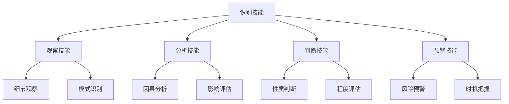

**2. 识别方法与工具**
| 识别方法 | 具体操作 | 适用场景 | 注意要点 |
| :--- | :--- | :--- | :--- |
| **行为观察法** | 系统观察和记录相关行为 | 日常工作环境 | 保持客观中立，避免主观臆断 |
| **语言分析法** | 分析话语中的性别偏见 | 沟通交流场合 | 注意隐含意义，识别微妙表达 |
| **制度审查法** | 审查制度文本的性别偏向 | 政策制定过程 | 关注条文表述，分析潜在影响 |
| **数据分析法** | 通过统计数据发现问题 | 管理决策环节 | 确保数据准确，注意统计方法 |

**3. 常见识别误区与纠正**
- **过度敏感**：将正常的差异化管理误解为歧视
- **识别不足**：对隐性歧视缺乏足够警觉
- **标准模糊**：缺乏明确的判断标准和依据

**教学活动设计**：
1. **识别技能训练**：通过视频案例练习识别技巧
2. **误区辨析讨论**：分析常见的识别错误及其原因
3. **实战演练**：在模拟环境中实践识别技能

#### 课程3.2：预防机制建设 (Course 3.2: Prevention Mechanism Construction)

**课程目标**：
- 理解预防机制的重要性和必要性
- 掌握预防机制建设的基本原理和方法
- 学会设计和实施有效的预防措施

**核心内容**：

**1. 预防机制理论基础**
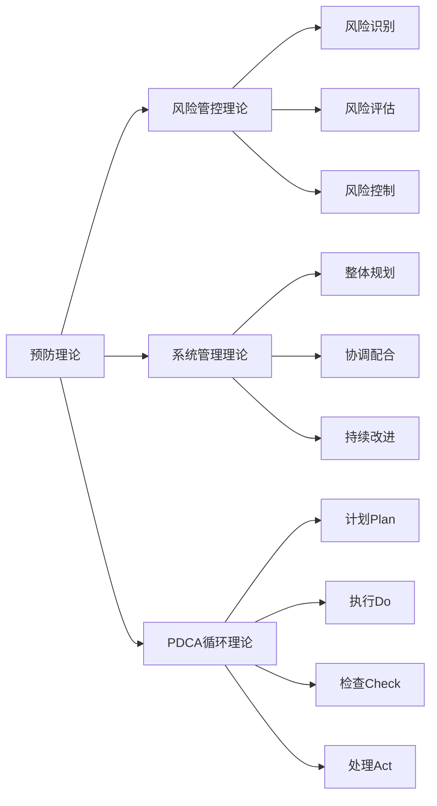

**2. 预防机制构成要素**
| 要素类别 | 具体内容 | 实施要点 | 保障措施 |
| :--- | :--- | :--- | :--- |
| **制度要素** | 反歧视制度、监督机制、问责程序 | 制度健全、执行到位 | 高层支持、资源配置 |
| **文化要素** | 平等理念、包容氛围、价值认同 | 文化培育、持续浸润 | 领导示范、全员参与 |
| **能力要素** | 识别能力、应对技能、维权意识 | 能力培养、技能提升 | 培训教育、实践锻炼 |
| **环境要素** | 物理环境、制度环境、社会环境 | 环境优化、氛围营造 | 硬件改善、软环境建设 |

**3. 预防措施设计原则**
- **系统性原则**：统筹考虑各个层面和环节
- **针对性原则**：针对具体问题和风险点
- **可操作性原则**：措施具体明确，便于执行
- **可持续性原则**：建立长效机制，持续改进

**教学活动设计**：
1. **机制设计工作坊**：分组设计预防机制方案
2. **案例分析研讨**：分析成功预防机制的特点
3. **方案优化练习**：完善和改进预防措施设计

### 模块四：应对与处理技巧 (Module 4: Response and Handling Techniques)

#### 课程4.1：内部处理技巧 (Course 4.1: Internal Handling Techniques)

**课程目标**：
- 掌握内部处理性别歧视问题的基本技巧
- 学会运用适当的沟通和调解方法
- 提高解决问题的效率和效果

**核心内容**：

**1. 沟通技巧体系**
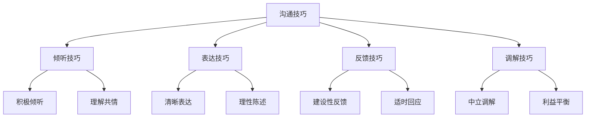

**2. 处理流程与要点**
| 处理阶段 | 核心任务 | 关键技巧 | 注意事项 |
| :--- | :--- | :--- | :--- |
| **问题受理** | 及时响应、认真对待 | 倾听理解、表达关切 | 避免先入为主，保持开放态度 |
| **调查核实** | 全面了解、客观分析 | 提问技巧、证据收集 | 保护隐私，确保程序公正 |
| **沟通协调** | 促进理解、化解矛盾 | 换位思考、求同存异 | 控制情绪，寻求共赢方案 |
| **处理决定** | 公正裁决、合理处置 | 依法依规、考虑周全 | 说理充分，执行坚决 |
| **跟进反馈** | 监督执行、总结改进 | 持续关注、及时调整 | 建立档案，完善机制 |

**3. 常见处理难点与对策**
- **取证困难**：建立日常记录习惯，完善证据保存机制
- **双方对立**：运用调解技巧，寻找利益共同点
- **执行阻力**：加强宣传教育，建立监督问责机制

**教学活动设计**：
1. **角色扮演练习**：模拟处理过程中的各种角色
2. **技巧训练工作坊**：专项训练各项沟通技能
3. **案例复盘分析**：总结处理经验和教训

#### 课程4.2：外部求助与维权 (Course 4.2: External Help-seeking and Rights Protection)

**课程目标**：
- 了解外部求助的渠道和资源
- 掌握维权的基本程序和方法
- 学会选择合适的维权策略

**核心内容**：

**1. 求助资源地图**
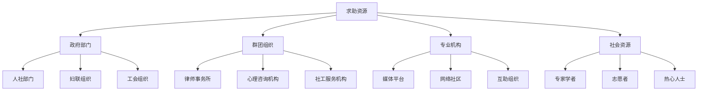

**2. 维权策略选择**
| 策略类型 | 适用情况 | 优势特点 | 注意事项 |
| :--- | :--- | :--- | :--- |
| **协商解决** | 双方愿意和解的情况 | 成本低、效率高、关系缓和 | 需要双方诚意配合 |
| **调解仲裁** | 有第三方介入协调 | 专业性强、程序相对简单 | 需要在法定时效内 |
| **法律诉讼** | 权益受损严重的情况 | 强制执行力强、救济彻底 | 程序复杂、成本较高 |
| **舆论监督** | 涉及公共利益的情况 | 社会影响力大、关注度高 | 需要注意方式方法 |

**3. 维权准备要点**
- **证据收集**：及时、全面、合法地收集相关证据
- **法律咨询**：寻求专业法律意见，了解权利义务
- **心理准备**：做好长期斗争的心理准备
- **资源整合**：有效整合各方面支持资源

**教学活动设计**：
1. **资源对接演练**：练习联系和利用各种求助资源
2. **维权模拟法庭**：模拟完整的维权过程
3. **策略选择讨论**：分析不同情况下最优维权策略

## 实践应用模块 (Practical Application Modules)

### 模块五：案例分析与经验分享 (Module 5: Case Analysis and Experience Sharing)

#### 课程5.1：典型案例深度解析 (Course 5.1: In-depth Analysis of Typical Cases)

**课程目标**：
- 通过典型案例学习识别和处理方法
- 理解不同情境下的应对策略
- 提炼可复制的成功经验

**核心内容**：

**精选案例类型**：
1. **职场招聘歧视案例**
2. **孕期女职工权益保护案例**
3. **薪酬待遇性别差异案例**
4. **晋升发展机会不平等案例**
5. **工作环境性骚扰案例**

**案例分析框架**：
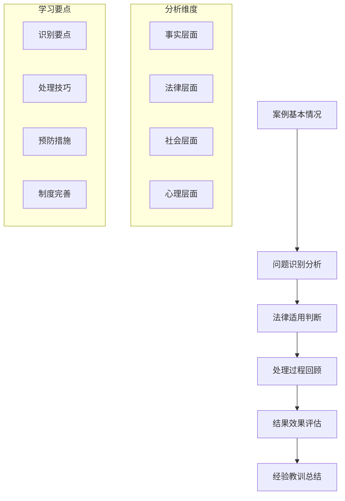

**教学活动设计**：
1. **案例小组分析**：分组深入分析指定案例
2. **角色互换讨论**：从不同角度理解案例各方立场
3. **经验萃取工作坊**：提炼案例中的核心经验

#### 课程5.2：最佳实践分享交流 (Course 5.2: Best Practice Sharing and Exchange)

**课程目标**：
- 学习先进的实践经验和做法
- 交流各自的成功案例和心得体会
- 建立经验分享和互助学习机制

**核心内容**：

**最佳实践展示**：
| 实践类型 | 典型做法 | 实施效果 | 可复制性 | 推广价值 |
| :--- | :--- | :--- | :--- | :--- |
| **制度建设** | 建立完善的反歧视制度体系 | 为实践提供制度保障 | 高 | 建立标准化模板 |
| **文化培育** | 开展全员性别平等意识培训 | 营造良好组织氛围 | 中高 | 开发培训课程体系 |
| **机制创新** | 建立女性领导力发展项目 | 促进女性职业发展 | 中 | 设计导师指导模式 |
| **效果监测** | 定期评估性别平等实践效果 | 持续改进完善措施 | 高 | 建立评估指标体系 |

**交流平台建设**：
- **线上平台**：建立专门的学习交流群组
- **线下活动**：定期举办经验分享会和研讨会
- **案例库建设**：收集整理优秀实践案例
- **导师制度**：建立经验丰富的导师指导机制

**教学活动设计**：
1. **实践案例展示**：邀请优秀实践者分享经验
2. **互动交流讨论**：围绕具体问题展开深入交流
3. **合作学习小组**：建立长期的学习伙伴关系

### 模块六：情景模拟与技能训练 (Module 6: Scenario Simulation and Skills Training)

#### 课程6.1：工作场景模拟训练 (Course 6.1: Work Scenario Simulation Training)

**课程目标**：
- 在模拟真实工作场景中练习相关技能
- 提高在实际工作中应对问题的能力
- 增强处理复杂情况的信心和熟练度

**核心内容**：

**典型工作场景设计**：
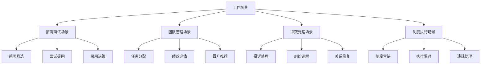

**模拟训练要点**：
1. **场景真实性**：尽可能还原真实工作环境和情况
2. **角色多样性**：让学员扮演不同角色，体验不同立场
3. **反馈及时性**：训练过程中及时给予指导和反馈
4. **总结系统性**：每次训练后进行深入的总结和反思

#### 课程6.2：综合能力提升训练 (Course 6.2: Comprehensive Ability Enhancement Training)

**课程目标**：
- 整合运用所学知识和技能
- 提升综合分析和解决问题的能力
- 培养系统思维和创新思维

**核心内容**：

**能力训练体系**：
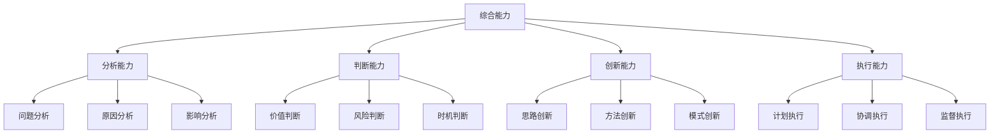

**训练方法设计**：
1. **综合案例分析**：处理复杂的综合性案例
2. **创新方案设计**：针对具体问题设计创新解决方案
3. **团队协作训练**：在团队中协调配合完成任务
4. **压力情境应对**：在时间紧迫、资源有限的情况下做出决策

**教学活动设计**：
1. **综合演练项目**：设计完整的实践项目进行演练
2. **能力测评反馈**：通过测评了解能力水平并给予针对性指导
3. **持续改进计划**：制定个人能力提升的长期计划

## 培训效果评估与持续改进 (Training Effectiveness Evaluation and Continuous Improvement)

### 评估体系设计 (Evaluation System Design)

#### 多维度评估框架 (Multi-dimensional Evaluation Framework)

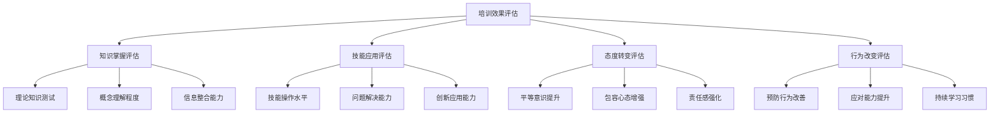

#### 评估工具与方法 (Evaluation Tools and Methods)

| 评估维度 | 评估工具 | 实施时机 | 评估要点 | 结果应用 |
| :--- | :--- | :--- | :--- | :--- |
| **前期评估** | 需求调研问卷、基础能力测试 | 培训前 | 了解起点水平、识别培训需求 | 个性化培训设计 |
| **过程评估** | 课堂表现记录、互动参与度 | 培训中 | 监控学习状态、及时调整教学 | 优化培训过程 |
| **即时评估** | 知识测试、技能演示、满意度调查 | 培训结束时 | 检验学习成果、收集反馈意见 | 改进培训内容 |
| **延后评估** | 行为观察、绩效改善、跟踪访谈 | 培训后3-6个月 | 评估实际应用、衡量长期效果 | 持续改进培训 |

### 持续改进机制 (Continuous Improvement Mechanism)

#### 反馈循环系统 (Feedback Loop System)

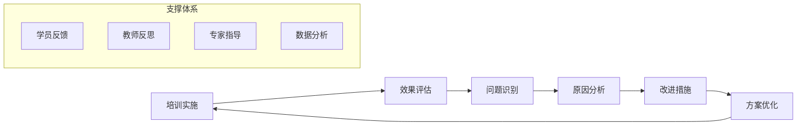

#### 改进策略与措施 (Improvement Strategies and Measures)

**短期改进措施**：
1. **内容优化**：根据评估结果调整培训内容的重点和深度
2. **方法改进**：优化教学方法和活动设计，提高参与度
3. **资源配置**：合理配置师资、时间、场地等培训资源

**中长期发展规划**：
1. **体系完善**：建立更加完善的培训课程体系
2. **能力提升**：持续提升培训师的专业能力和教学水平
3. **技术创新**：探索运用新技术手段提升培训效果
4. **合作拓展**：加强与外部专业机构的合作交流

---

**相关文档链接 (Related Documents):**
- [性别歧视概览](Gender_Discrimination_Overview.md) - 理论基础和现状分析
- [重男轻女文化根源分析](Son_Preference_Cultural_Origins.md) - 文化和社会结构因素
- [当代影响与表现](Contemporary_Impacts_Manifestations.md) - 现代表现形式
- [心理创伤与代际传递](Psychological_Trauma_Intergenerational.md) - 心理影响机制
- [干预策略与政策建议](Intervention_Strategies_Policy.md) - 解决策略和建议
- [国际比较与最佳实践](International_Comparison_Best_Practices.md) - 国际经验借鉴
- [测量与评估工具](Gender_Discrimination_Measurement_Tools.md) - 专业的测量量表和评估方法
- [标准化术语词典](Gender_Discrimination_Terminology_Standards.md) - 统一的专业术语定义
- [干预效果评估](Gender_Discrimination_Effectiveness_Evaluation.md) - 全面的效果评估体系
- [案例分析集](Gender_Discrimination_Case_Studies.md) - 典型案例深度解析
- [实践指南](Gender_Discrimination_Practical_Guide.md) - 实践操作指导手册

---

*本文档为性别歧视培训提供了完整的课程体系和教学设计方案，通过系统化的培训帮助各类人员提升性别平等意识和实践能力。*

**参考文献 (References):**
- 人力资源和社会保障部. (2023). 性别平等培训师手册.
- 全国妇联. (2023). 性别平等教育培训指南.
- 国际劳工组织. (2022). 工作场所性别平等培训最佳实践.
- 联合国妇女署. (2023). 性别平等能力建设培训课程设计.
- 李银河. (2022). 性别平等培训课程开发与实施. 社会科学文献出版社.