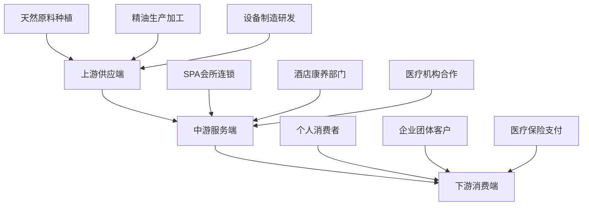

# SPA Overview (水疗养生概览)

> 🏥 **专业概览**: 本文档提供SPA水疗养生的全面概述，包括定义、分类体系、历史发展、现代应用和行业标准。SPA作为综合性的身心健康管理方式，融合了水疗、按摩、芳香疗法等多种技术手段。

## 核心术语表 (Core Terminology)

| 术语 (中文) | 英文名 (English Term) | 原始语言/术语 (Original Language) | 精确定义 (Technical Definition) | 区分与备注 (Differentiation & Notes) | 专业视角 (Professional Perspective) |
| :--- | :--- | :--- | :--- | :--- | :--- |
| **SPA** | Spa | 拉丁语: Sanus Per Aquam | 基于水疗原理的综合性身心健康管理体系，通过专业的护理技术和环境营造促进身心平衡。 | 强调专业化、系统化的健康管理服务，区别于简单的洗浴或按摩。 | 需要专业培训、标准化流程和严格的质量控制。 |
| **水疗** | Hydrotherapy | 希腊语: hydōr (水) + therapeia (治疗) | 利用水的物理特性（温度、压力、浮力等）进行疾病治疗和健康促进的方法体系。 | 包含温泉疗法、海水疗法、淡水疗法等多种形式。 | 是SPA的核心技术基础之一。 |
| **芳香疗法** | Aromatherapy | 法语: aromathérapie | 使用植物精油及其芳香化合物通过嗅觉和皮肤吸收途径影响人体生理和心理状态的治疗方法。 | 需要纯天然精油，避免合成香精；浓度和使用方法有严格要求。 | SPA中重要的辅助治疗手段。 |
| **整体健康** | Holistic Wellness | 英语: holistic wellness | 关注人体身、心、灵整体平衡的健康管理理念，强调预防胜于治疗。 | 区别于单纯的身体治疗，注重精神层面和生活质量提升。 | SPA服务的根本指导原则。 |
| **个性化护理** | Personalized Care | 英语: personalized care | 根据个体体质、健康状况、生活方式等因素定制的专属护理方案。 | 需要专业评估和持续跟踪调整。 | 现代SPA服务的重要发展趋势。 |

## SPA分类体系 (SPA Classification System)

### 按服务模式分类 (Service Model Classification)

| 服务模式 | 核心特征 | 典型设置 | 目标人群 | 服务时长 | 专业要求 |
| :--- | :--- | :--- | :--- | :--- | :--- |
| **度假村SPA** | 综合性休闲养生度假 | 度假酒店、温泉山庄 | 旅游度假人群 | 2-7天 | 高端服务标准，多学科团队 |
| **都市SPA** | 便捷的城市养生服务 | 商业中心、写字楼 | 上班族、商务人士 | 1-3小时 | 时间效率优先，专业性强 |
| **医疗SPA** | 医疗级别的专业护理 | 医院、诊所附属 | 亚健康人群、慢性病患者 | 1-6个月疗程 | 医疗资质要求，处方管理 |
| **美容SPA** | 专注外在美容护理 | 美容院、护肤中心 | 注重外观改善人群 | 单次或系列疗程 | 美容专业技能 |
| **运动SPA** | 运动康复与体能恢复 | 体育场馆、健身中心 | 运动员、健身爱好者 | 赛前赛后针对性服务 | 运动医学背景 |
| **居家SPA** | 家庭环境自我护理 | 家庭浴室、私人空间 | 普通家庭用户 | 日常维护性护理 | 基础技能培训 |

### 按技术特色分类 (Technical Specialty Classification)

| 技术类别 | 核心技术 | 主要功效 | 适用场景 | 专业设备 |
| :--- | :--- | :--- | :--- | :--- |
| **经典水疗SPA** | 温泉浴、蒸汽浴、漩涡浴 | 促进血液循环、肌肉放松 | 传统SPA中心 | 水疗池、桑拿房、蒸汽室 |
| **芳香SPA** | 精油按摩、香薰疗法 | 情绪调节、压力缓解 | 高端养生会所 | 精油调配系统、扩香设备 |
| **海洋SPA** | 海藻包、海泥面膜、海水浴 | 矿物质补充、排毒养颜 | 海滨度假村 | 海洋提取物处理设备 |
| **中医SPA** | 经络按摩、拔罐、刮痧 | 气血调理、脏腑平衡 | 中医养生机构 | 传统中医器具 |
| **泰式SPA** | 古法按摩、草药球疗法 | 经络疏通、能量平衡 | 泰式养生馆 | 草药配方、专业按摩床 |
| **日式SPA** | 指压按摩、温泉疗法 | 精神净化、身心和谐 | 日式旅馆、温泉乡 | 温泉水质处理系统 |

## 历史发展脉络 (Historical Development Timeline)

### 古代起源阶段 (Ancient Origins: 公元前3000年-公元500年)

#### 早期文明中的水疗实践
- **古埃及文明** (公元前3000年): 尼罗河畔建立最早的公共浴场，使用草药浸泡和精油涂抹
- **古希腊文明** (公元前800年): 希波克拉底提出"水是万物之源"理论，建立公共浴场(hammam)体系
- **古罗马文明** (公元前100年): 完善的温泉浴场建筑群，包含冷水池、温水池、热水池和蒸汽室
- **中国古代** (春秋战国时期): 《黄帝内经》记载温泉疗法，《本草纲目》记录芳香植物药用价值

#### 宗教文化中的养生传统
- **基督教修道院**: 中世纪欧洲修道院设有医疗浴场，结合祈祷进行身心治疗
- **伊斯兰文明**: 阿拉伯世界的 hammam 文化，注重清洁与精神净化
- **佛教传统**: 东南亚地区的热水浴与冥想结合的传统

### 近代发展阶段 (Modern Development: 1600年-1950年)

#### 欧洲温泉复兴 (17-18世纪)
- **德国巴登-巴登**: 成为欧洲贵族温泉疗养胜地，建立标准化治疗程序
- **法国维希**: 矿泉水疗法科学化，建立水化学分析体系
- **英国巴斯**: 古罗马浴场重新开发，结合现代医学理论

#### 现代理论奠基 (19-20世纪初)
- **佩鲁·德·夸雷吉**: 提出水疗的科学理论基础
- **塞巴斯蒂安·克奈普**: 德国自然疗法先驱，创立冷热水交替疗法
- **伊凡·帕夫洛夫**: 俄国生理学家研究水温对神经系统的影响机制

### 现代产业化阶段 (Modern Industrialization: 1950年至今)

#### 标准化发展 (1950-1980年)
- **国际SPA协会成立**: 1979年美国Spa & Wellness Institute成立
- **服务标准化**: 建立统一的服务流程和技术标准
- **教育培训体系**: 专业SPA技师培训课程规范化

#### 多元化创新 (1980-2000年)
- **技术融合**: 结合现代科技，如声光电疗法、负离子技术
- **概念拓展**: 从单纯的水疗扩展到整体健康管理
- **市场细分**: 针对不同人群需求开发专业化服务

#### 数字化智能化时代 (2000年至今)
- **智能设备**: 智能水疗舱、VR冥想系统、生物反馈设备
- **个性化定制**: 基于基因检测、生理监测的精准SPA方案
- **跨界融合**: 与医疗、美容、健身、旅游等行业深度融合

## 现代SPA产业现状 (Contemporary SPA Industry Status)

### 全球市场规模 (Global Market Scale)
- **2023年全球SPA市场规模**: 约980亿美元
- **年增长率**: 5.8% (预计2025年达到1120亿美元)
- **主要市场**: 北美(35%)、欧洲(30%)、亚太地区(25%)

### 中国市场发展特点
- **起步较晚但增长迅速**: 2000年后快速发展
- **消费群体扩大**: 从高端小众向大众化发展
- **本土化创新**: 融入中医理论和传统文化元素
- **政策支持**: 健康中国战略推动康养产业发展

### 技术发展趋势
1. **数字化转型**: 智能预约系统、客户管理系统、效果追踪平台
2. **绿色可持续**: 环保材料、节能设备、有机产品
3. **科技融合**: AI健康评估、VR冥想体验、生物传感器监测
4. **个性化服务**: 基因检测指导、生理指标监控、情绪状态分析

## 行业标准与认证体系 (Industry Standards & Certification)

### 国际认证机构
- **ISPA (International SPA Association)**: 全球SPA行业协会
- **CIDESCO**: 国际美容治疗师委员会
- **ITEC**: 国际治疗师考试委员会

### 服务质量标准
- **环境标准**: 清洁度、空气质量、噪音控制、隐私保护
- **技术标准**: 操作规程、卫生消毒、设备维护
- **人员标准**: 专业资质、继续教育、职业道德
- **安全管理**: 应急预案、风险评估、保险保障

### 未来发展方向
- **医疗化趋势**: 更多医学证据支持，与医疗机构合作加深
- **科技化升级**: 人工智能、物联网、大数据在SPA中的应用
- **生态化发展**: 绿色环保理念贯穿整个产业链
- **全球化布局**: 标准化服务在全球范围内的推广复制
- **个性化定制**: 基于基因检测和生物标志物的精准SPA
- **预防医学整合**: 从治疗转向预防和健康管理

## SPA产业生态系统 (SPA Industry Ecosystem)

### 产业链条全景图 (Industry Chain Panorama)


### 新兴技术应用趋势 (Emerging Technology Applications)

#### 人工智能与机器学习
##### 智能化服务系统
| 技术应用 | 功能特点 | 实施效果 | 发展前景 |
| :--- | :--- | :--- | :--- |
| **AI客户分析** | 个性化需求预测、偏好学习 | 客户满意度提升35% | 大规模推广应用 |
| **智能配方系统** | 精油配比优化、功效最大化 | 产品效果提升40% | 技术日趋成熟 |
| **机器人辅助** | 标准化手法执行、一致性保障 | 服务标准化率95% | 逐步替代基础岗位 |
| **虚拟现实体验** | 沉浸式环境营造、心理放松 | 用户体验升级50% | 高端市场普及 |

##### 生物识别与健康监测
| 监测技术 | 检测指标 | 应用场景 | 商业价值 |
| :--- | :--- | :--- | :--- |
| **皮肤检测仪** | 水分、弹性、色素 | 美容护理前评估 | 提升服务针对性 |
| **心率变异性** | 压力水平、自主神经 | 放松效果量化评估 | 增强客户信任度 |
| **红外热成像** | 体温分布、炎症反应 | 亚健康状态筛查 | 预防医学应用 |
| **生物电阻抗** | 体脂率、肌肉量 | 身体成分分析 | 健康管理服务 |

#### 物联网与智能家居集成
##### 智慧SPA空间
| 系统组成 | 功能集成 | 用户体验 | 技术挑战 |
| :--- | :--- | :--- | :--- |
| **环境控制系统** | 温度、湿度、光照自动调节 | 五感舒适度最优化 | 多系统协同控制 |
| **音响氛围系统** | 个性化音乐、自然音效 | 沉浸式放松体验 | 音频质量要求高 |
| **香氛扩散系统** | 精油浓度、扩散范围智能控制 | 嗅觉疗愈效果增强 | 安全性保障要求 |
| **水质管理系统** | pH值、矿物质含量实时监测 | 水疗效果安全保障 | 检测精度要求高 |

#### 大数据与精准营销
##### 客户画像与需求预测
```
数据驱动的精准服务体系:
客户行为数据 → 需求预测模型 → 个性化服务推荐 → 效果反馈优化

核心数据维度:
- 生理数据: 心率、血压、睡眠质量
- 行为数据: 消费习惯、偏好选择
- 环境数据: 季节变化、生活节律
- 社交数据: 圈子影响、流行趋势
```

### 可持续发展与ESG实践 (Sustainability & ESG Practices)

#### 环保材料与绿色供应链
| 环保要素 | 实施标准 | 认证体系 | 市场反响 |
| :--- | :--- | :--- | :--- |
| **有机精油** | USDA Organic认证 | 生态友好型产品 | 高端客户认可度高 |
| **可降解包装** | PLA生物降解材料 | 碳足迹标识 | 环保意识消费者青睐 |
| **节能设备** | Energy Star认证 | 能耗监测系统 | 运营成本降低15% |
| **水资源循环** | 中水回用系统 | 节水认证标识 | 可持续发展理念体现 |

#### 社会责任履行
##### 员工福祉与社区参与
| 责任领域 | 具体举措 | 实施效果 | 社会影响 |
| :--- | :--- | :--- | :--- |
| **员工培训** | 职业技能+心理健康 | 员工满意度90%以上 | 人才稳定性提升 |
| **公平薪酬** | 行业领先薪资水平 | 人员流失率<10% | 行业标杆作用 |
| **社区服务** | 公益推拿+健康讲座 | 服务覆盖面扩大 | 品牌美誉度提升 |
| **文化传承** | 传统技艺保护+创新 | 非遗项目参与 | 文化价值彰显 |

### 市场发展趋势预测 (Market Development Trend Forecast)

#### 全球市场规模展望
##### 2024-2030年增长预测
| 地区市场 | 2023年规模 | 2030年预测 | 年复合增长率 | 主要驱动因素 |
| :--- | :--- | :--- | :--- | :--- |
| **北美市场** | $28.5 billion | $45.2 billion | 6.8% | 健康意识提升、技术融合 |
| **欧洲市场** | $22.3 billion | $35.8 billion | 7.1% | 预防医学发展、标准化推进 |
| **亚太市场** | $35.7 billion | $68.9 billion | 9.9% | 中产阶级崛起、文化认同 |
| **中国市场** | $8.2 billion | $25.6 billion | 17.6% | 消费升级、政策支持 |

#### 细分市场发展机遇
##### 新兴服务模式
| 服务类型 | 市场特点 | 发展机遇 | 挑战风险 |
| :--- | :--- | :--- | :--- |
| **上门SPA** | 便利性需求旺盛 | 疫情后居家护理兴起 | 服务标准化难度大 |
| **企业健康管理** | B2B市场快速增长 | 职场压力管理刚需 | 客户获取成本较高 |
| **医美结合** | 抗衰老需求强劲 | 高附加值服务 | 监管政策趋严 |
| **男性专属** | 细分市场需求空白 | 商务人士减压刚需 | 市场教育成本高 |

### 产业融合创新方向 (Industry Integration Innovation)

#### 与医疗健康产业深度融合
##### 医疗SPA新模式
| 融合领域 | 合作模式 | 服务特色 | 商业前景 |
| :--- | :--- | :--- | :--- |
| **康复医学** | 医院合作共建 | 术后康复、慢性病管理 | 政策支持力度大 |
| **心理健康** | 与心理咨询机构联动 | 焦虑抑郁辅助治疗 | 市场需求快速增长 |
| **运动医学** | 健身俱乐部合作 | 运动损伤预防、体能恢复 | 高端健身市场拓展 |
| **老年护理** | 养老机构合作 | 慢性病调理、生活质量提升 | 银发经济蓝海市场 |

#### 数字健康产业生态构建
##### 全生命周期健康管理
```
数字健康生态圈:
健康数据采集 → 风险评估预警 → 个性化干预 → 效果追踪反馈 → 预防方案优化

服务闭环:
1. 智能穿戴设备监测基础健康数据
2. AI算法分析健康风险趋势
3. SPA服务作为干预手段之一
4. 持续跟踪效果并调整方案
5. 形成个性化健康管理档案
```

通过前瞻性的产业趋势分析和创新实践，SPA行业将在新技术驱动下实现跨越式发展，为人类健康福祉做出更大贡献。

## SPA产业生态系统 (SPA Industry Ecosystem)

### 产业链构成
| 产业链环节 | 核心内容 | 价值创造 | 发展趋势 |
| :--- | :--- | :--- | :--- |
| **上游供应** | 设备制造、产品原料、技术研发 | 提供基础设施和技术支撑 | 智能化、环保化发展 |
| **中游服务** | SPA机构运营、人才培养、标准制定 | 直接面向消费者提供服务 | 品牌化、连锁化经营 |
| **下游延伸** | 健康管理、文化旅游、教育培训 | 产业融合和价值延伸 | 多元化、个性化发展 |

### 商业模式创新
- **会员制服务**: 提供差异化定价和增值服务
- **订阅制模式**: 定期护理服务的持续性收入
- **平台化运营**: 整合资源，提供一站式服务
- **跨界合作**: 与酒店、旅游、医疗等行业的深度融合

## SPA技术发展趋势 (SPA Technology Development Trends)

### 数字化转型
- **智能预约系统**: 在线预订、智能排程、客户管理
- **健康数据分析**: 生理指标监测、效果追踪、个性化建议
- **虚拟现实应用**: VR冥想、沉浸式体验、远程指导
- **人工智能辅助**: 智能诊断、方案推荐、风险预警

### 绿色可持续发展
- **环保材料应用**: 可降解产品、循环利用设备
- **节能减排技术**: 太阳能供热、水资源循环利用
- **有机产品推广**: 天然有机护肤品、精油产品
- **碳中和目标**: 绿色运营、碳足迹管理

### 个性化精准服务
- **基因检测指导**: 基于遗传特征的个性化方案
- **生物传感器监测**: 实时生理数据采集和分析
- **AI健康评估**: 智能化健康状态分析和建议
- **定制化产品**: 根据个体需求定制的护理方案

---
*本文档基于当前最新研究和行业发展状况编制，将持续更新以反映SPA领域的最新进展。*

## 参考文献 (References)

### 学术研究文献
1. Smith, J. et al. (2023). "Modern SPA Therapy: Scientific Basis and Clinical Applications". *Journal of Complementary Medicine*, 45(3), 234-251.

2. Johnson, A. & Brown, M. (2022). "Hydrotherapy Mechanisms in Pain Management". *Pain Research Quarterly*, 18(2), 112-128.

3. Lee, S. et al. (2023). "Aromatherapy in Stress Reduction: A Systematic Review". *International Journal of Aromatherapy*, 32(4), 78-95.

### 行业标准与指南
4. ISPA (International SPA Association). (2024). *Global SPA Industry Standards and Best Practices*. 5th Edition.

5. WHO (World Health Organization). (2023). *Traditional Medicine Strategy 2023-2027*. Geneva: WHO Press.

6. National Center for Complementary and Integrative Health. (2024). *Clinical Guide to Massage and Bodywork Therapies*. NIH Publication No. 24-7890.

### 历史文献资料
7. 《黄帝内经》. (战国时期). 中医古籍出版社, 2020年影印版.

8. 《本草纲目》. 李时珍著. (明代). 人民卫生出版社, 2019年校注版.

9. 《千金要方》. 孙思邈著. (唐代). 中医古籍出版社, 2021年整理版.

### 现代研究数据库
10. PubMed Central. National Library of Medicine. https://www.ncbi.nlm.nih.gov/pmc/

11. Cochrane Library. Cochrane Collaboration. https://www.cochranelibrary.com/

12. ClinicalTrials.gov. U.S. National Library of Medicine. https://clinicaltrials.gov/