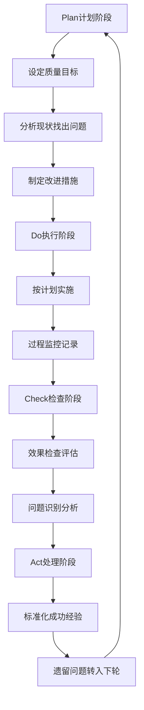

# SPA Quality Management & Standardization (SPA质量管理与标准化)

> 🏆 **质量概览**: 本文档建立完整的SPA服务质量管理体系，涵盖标准化操作流程、质量控制指标、持续改进机制和服务认证体系。通过科学的质量管理确保SPA服务的一致性、安全性和客户满意度。

## 质量管理体系框架 (Quality Management System Framework)

### ISO 9001质量管理原则应用

#### 八大质量管理原则在SPA中的体现
| 管理原则 | SPA具体应用 | 实施要点 | 效果指标 | 持续改进 |
| :--- | :--- | :--- | :--- | :--- |
| **以客户为关注焦点** | 个性化服务设计、满意度追踪 | 建立客户需求数据库 | 客户满意度≥90% | 定期调研、需求分析 |
| **领导作用** | 质量方针制定、资源配置 | 管理层质量承诺 | 员工质量意识≥95% | 领导力培训、文化建设 |
| **全员参与** | 团队协作、责任分工 | 建立质量责任制 | 员工参与度≥85% | 激励机制、团队建设 |
| **过程方法** | 流程标准化、节点控制 | 绘制详细服务流程图 | 流程执行率≥98% | 流程优化、效率提升 |
| **管理的系统方法** | 整体规划、协调统一 | 建立质量管理系统 | 系统运行效率≥90% | 系统整合、资源共享 |
| **持续改进** | PDCA循环、创新优化 | 设立改进目标和指标 | 年度改进项目≥10项 | 改进建议征集、效果评估 |
| **基于事实的决策方法** | 数据分析、科学决策 | 建立数据收集分析系统 | 决策准确率≥85% | 数据质量提升、分析能力增强 |
| **与供方互利的关系** | 供应商管理、合作共赢 | 建立供应商评估体系 | 供应商满意度≥85% | 伙伴关系深化、共同发展 |

### 全面质量管理(TQM)实施

#### 质量环PDCA循环应用


#### 关键质量控制点(KPI)
| 控制点 | 质量指标 | 测量方法 | 目标值 | 监控频次 |
| :--- | :--- | :--- | :--- | :--- |
| **服务准备** | 环境清洁度、设备完好率 | 检查表评分 | ≥95分 | 每日开业前 |
| **技师表现** | 手法标准符合率、客户反馈 | 现场观察+问卷调查 | ≥90% | 每次服务后 |
| **产品品质** | 护肤品合格率、精油纯度 | 供应商资质+检测报告 | 100% | 每批次验收 |
| **安全管理** | 安全事故发生率、应急响应时间 | 事故记录+演练评估 | 0事故，≤3分钟 | 实时监控 |
| **客户满意度** | 整体满意度、推荐意愿 | 标准化问卷调查 | ≥90分，≥85% | 每月统计 |

## 客户体验管理体系 (Customer Experience Management System)

### 客户旅程优化
#### 全触点体验设计
| 客户触点 | 体验要素 | 质量标准 | 优化策略 | 测量指标 |
| :--- | :--- | :--- | :--- | :--- |
| **预约阶段** | 便捷性、专业性 | 响应时间≤30秒 | 智能预约系统、个性化推荐 | 预约成功率≥95% |
| **到店体验** | 接待礼仪、环境氛围 | 第一印象评分≥4.5分 | 标准化接待流程、环境优化 | 到店满意度≥90% |
| **服务过程** | 专业水准、舒适度 | 技术满意度≥4.7分 | 技师能力提升、个性化服务 | 过程满意度≥92% |
| **离店关怀** | 后续跟进、增值服务 | 跟进及时性100% | 客户关系管理、会员服务 | 复购率≥65% |

#### 情感化服务设计
| 情感维度 | 设计要素 | 实施方法 | 效果目标 | 评估方式 |
| :--- | :--- | :--- | :--- | :--- |
| **安全感** | 隐私保护、专业保障 | 独立空间设计、资质公示 | 安全感评分≥4.8分 | 客户访谈+问卷调查 |
| **舒适感** | 环境氛围、服务态度 | 温度湿度控制、柔和音乐 | 舒适度评分≥4.6分 | 环境评估+体验反馈 |
| **尊贵感** | 个性化服务、VIP待遇 | 定制方案、专属服务 | 尊贵感评分≥4.5分 | 客户感知评估 |
| **惊喜感** | 超预期服务、小礼品 | 节日关怀、生日祝福 | 惊喜度评分≥4.3分 | 客户口碑传播 |

## 数字化转型与智能化升级 (Digital Transformation & Intelligent Upgrade)

### 智慧SPA生态系统
#### 技术架构设计
| 技术层级 | 核心组件 | 功能特点 | 应用场景 | 发展前景 |
| :--- | :--- | :--- | :--- | :--- |
| **感知层** | IoT传感器、可穿戴设备 | 实时数据采集、环境监测 | 健康状态监测、环境调节 | 智能化基础 |
| **网络层** | 5G网络、边缘计算 | 高速传输、低延迟处理 | 远程监控、实时交互 | 连接性保障 |
| **平台层** | 云计算、大数据平台 | 数据存储、分析处理 | 客户画像、精准营销 | 智能决策支持 |
| **应用层** | AI算法、应用程序 | 智能服务、用户体验 | 个性化推荐、自动化服务 | 价值实现 |

#### 智能服务应用场景
| 应用场景 | 技术实现 | 服务价值 | 客户收益 | 商业模式 |
| :--- | :--- | :--- | :--- | :--- |
| **智能诊断** | AI健康评估+症状分析 | 精准需求识别、个性化方案 | 节省时间、提高效果 | 增值服务收费 |
| **预测性维护** | 设备状态监测+故障预警 | 降低运营成本、提升服务稳定性 | 减少等待时间、保障体验 | 预防性维护 |
| **个性化推荐** | 用户画像+偏好分析 | 精准营销、提高转化率 | 获得心仪服务、节省选择成本 | 会员制+套餐销售 |
| **远程指导** | AR/VR技术+专家连线 | 专业指导、突破地域限制 | 在家享受专业服务 | 线上线下融合 |

### 数据驱动的质量管理
#### 关键数据指标体系
| 数据维度 | 核心指标 | 数据来源 | 分析方法 | 应用价值 |
| :--- | :--- | :--- | :--- | :--- |
| **运营效率** | 客户流转时间、技师利用率 | 预约系统、工时记录 | 流程分析、瓶颈识别 | 优化资源配置 |
| **服务质量** | 技术标准符合率、客户满意度 | 质量检查、客户反馈 | 趋势分析、对标管理 | 持续质量改进 |
| **财务绩效** | 客单价、毛利率、客户生命周期价值 | 收银系统、CRM系统 | 盈利分析、价值评估 | 商业决策支持 |
| **市场竞争** | 市场份额、品牌知名度 | 第三方调研、网络监测 | 竞争分析、战略调整 | 市场定位优化 |

#### 智能决策支持系统
- **实时监控仪表板**: 可视化展示关键指标和运营状态
- **预警机制**: 异常情况自动识别和预警通知
- **预测分析**: 基于历史数据的趋势预测和需求预测
- **优化建议**: AI驱动的流程优化和资源配置建议

### 服务流程标准化 (Service Process Standardization)

#### 客户接待标准流程
| 流程环节 | 标准操作 | 时间要求 | 质量要点 | 责任岗位 |
| :--- | :--- | :--- | :--- | :--- |
| **预约确认** | 电话/在线确认预约信息 | 服务前24小时 | 信息准确完整 | 前台接待 |
| **到店迎接** | 热情问候、引导至休息区 | 客户到达后2分钟内 | 专业形象、微笑服务 | 迎宾人员 |
| **健康评估** | 填写健康问卷、测量基础指标 | 10-15分钟 | 评估全面准确 | 健康顾问 |
| **方案制定** | 根据评估结果制定个性化方案 | 5-10分钟 | 科学合理、客户认同 | 服务技师 |
| **服务实施** | 按标准流程提供专业服务 | 预定时间±10分钟 | 技术规范、客户舒适 | 专业技师 |
| **效果评估** | 询问客户感受、记录反馈 | 服务结束后5分钟 | 真实客观、详细记录 | 服务技师 |
| **后续跟进** | 提供护理建议、预约下次服务 | 服务结束后24小时内 | 专业建议、贴心关怀 | 客户经理 |

#### 核心技术服务标准

##### 瑞典式按摩标准操作程序
| 操作步骤 | 技术要点 | 质量标准 | 时间分配 | 注意事项 |
| :--- | :--- | :--- | :--- | :--- |
| **准备工作** | 环境温度22-24°C，准备按摩油 | 温度适宜、用品齐全 | 5分钟 | 检查设备安全 |
| **抚摩法开始** | 手掌贴合、力度轻柔均匀 | 压力1-3级、节奏舒缓 | 10分钟 | 观察客户反应 |
| **揉捏法主体** | 捏起肌肉、挤压扭转动作 | 压力4-6级、深度适中 | 25分钟 | 避开骨骼突出 |
| **摩擦法深层** | 圆形或直线深层摩擦 | 压力5-7级、定点操作 | 15分钟 | 注意客户耐受度 |
| **叩击法结束** | 快速节律性敲击 | 压力4-6级、节奏明快 | 8分钟 | 激活肌肉张力 |
| **整理收尾** | 轻柔抚摩、整理被褥 | 压力1-2级、动作轻缓 | 2分钟 | 确保客户舒适 |

##### 芳香疗法标准配比
| 使用方式 | 精油浓度 | 稀释比例 | 适用人群 | 安全考虑 |
| :--- | :--- | :--- | :--- | :--- |
| **面部护理** | 0.5-1% | 1滴精油:20滴基础油 | 所有人群 | 敏感肌测试 |
| **身体按摩** | 2-3% | 3滴精油:15滴基础油 | 健康成人 | 避开敏感部位 |
| **足部护理** | 3-5% | 5滴精油:15滴基础油 | 耐受性较好 | 热水稀释后使用 |
| **香薰扩散** | 1-3滴/10㎡ | 直接使用 | 室内环境 | 通风良好、时间控制 |
| **泡澡添加** | 5-10滴/浴缸 | 牛奶或浴盐载体 | 全身使用 | 水温适宜、时间控制 |

### 设备维护标准化 (Equipment Maintenance Standardization)

#### 设备保养计划
| 设备类型 | 保养项目 | 保养频次 | 质量标准 | 责任人员 |
| :--- | :--- | :--- | :--- | :--- |
| **按摩床椅** | 结构检查、垫材清洁、机械部件润滑 | 每日使用后+每月深度保养 | 无损坏、运行顺畅 | 技师+维修员 |
| **水疗设备** | 水质检测、管路清洁、过滤系统维护 | 每4小时水质检测+每周全面清洁 | 水质达标、设备正常 | 水质管理员 |
| **加热设备** | 温度校准、安全阀检查、加热元件维护 | 每日校准+每季度检修 | 温度准确±1°C、安全可靠 | 技术员 |
| **电气设备** | 绝缘测试、接地检查、线路维护 | 每月检测+年度全面检修 | 绝缘电阻≥1MΩ、接地良好 | 电工 |
| **空气净化设备** | 滤网更换、风道清洁、性能检测 | 每月检查+按需更换滤网 | PM2.5<35μg/m³、CO₂<1000ppm | 环境管理员 |

#### 设备故障处理流程
1. **故障识别**: 现场人员立即识别并报告设备异常
2. **安全隔离**: 立即停止使用故障设备，设置警示标识
3. **初步诊断**: 技术人员进行故障原因初步判断
4. **维修安排**: 联系专业维修人员或厂家技术支持
5. **替代方案**: 启用备用设备或调整服务安排
6. **验证恢复**: 维修完成后进行功能测试和安全检查
7. **记录归档**: 详细记录故障情况、维修过程和预防措施

## 质量控制体系 (Quality Control System)

### 内部质量审核 (Internal Quality Audit)

#### 审核计划制定
| 审核类型 | 审核频次 | 审核范围 | 审核重点 | 审核人员 |
| :--- | :--- | :--- | :--- | :--- |
| **日常巡查** | 每日 | 服务现场、环境卫生 | 操作规范性、清洁度 | 质量管理员 |
| **专项审核** | 每月 | 特定服务项目或流程 | 技术标准执行情况 | 专业审核员 |
| **全面审核** | 每季度 | 整体运营体系 | 管理体系运行有效性 | 外部专家+内部管理层 |
| **管理评审** | 每年 | 战略方向、资源配置 | 质量方针适宜性 | 最高管理者 |

#### 审核检查表模板
```markdown
# SPA服务质量审核检查表

## 基础环境检查 (满分100分)
□ 温度控制: 22-24°C (10分)
□ 空气质量: PM2.5<35μg/m³ (10分)
□ 照明亮度: 150-300lux (10分)
□ 噪音水平: ≤50dB(A) (10分)
□ 清洁度: 无灰尘、异味 (20分)
□ 安全设施: 消防设备完好 (10分)
□ 隐私保护: 隔音效果良好 (10分)
□ 装饰布置: 舒适美观 (10分)
□ 设备状态: 运行正常 (10分)

## 服务流程检查 (满分100分)
□ 预约管理: 信息系统完善 (10分)
□ 接待礼仪: 专业热情 (10分)
□ 健康评估: 全面准确 (15分)
□ 方案制定: 个性化合理 (15分)
□ 技术执行: 标准规范 (20分)
□ 沟通交流: 清晰有效 (10分)
□ 效果反馈: 及时记录 (10分)
□ 后续跟进: 专业建议 (10分)

## 人员素质检查 (满分100分)
□ 专业资质: 持证上岗 (20分)
□ 技能水平: 熟练规范 (20分)
□ 服务态度: 热情耐心 (15分)
□ 沟通能力: 清晰友善 (15分)
□ 应急处理: 冷静专业 (15分)
□ 团队协作: 配合默契 (15分)
```

### 客户满意度监测 (Customer Satisfaction Monitoring)

#### 满意度调查体系
| 调查维度 | 调查内容 | 调查方式 | 调查频次 | 目标值 |
| :--- | :--- | :--- | :--- | :--- |
| **整体满意度** | 对SPA服务的整体评价 | 5分制量表 | 每次服务后 | ≥4.5分 |
| **技师专业性** | 技术水平、服务态度 | 专项评分 | 每次服务后 | ≥4.7分 |
| **环境舒适度** | 清洁度、氛围、隐私 | 环境评分 | 每月抽查 | ≥4.6分 |
| **性价比感知** | 价格合理性、价值获得 | 价值评估 | 季度调查 | ≥4.3分 |
| **推荐意愿** | 向他人推荐的可能性 | NPS净推荐值 | 半年度调查 | ≥70分 |

#### 投诉处理机制
| 处理阶段 | 处理时限 | 处理要求 | 跟踪方式 | 改进应用 |
| :--- | :--- | :--- | :--- | :--- |
| **受理登记** | 即时 | 详细记录投诉内容 | 投诉登记表 | 建立投诉数据库 |
| **调查核实** | 24小时内 | 全面了解事情经过 | 现场调查、相关人员访谈 | 根因分析 |
| **解决方案** | 48小时内 | 制定合理解决方案 | 与客户协商确认 | 个性化处理 |
| **执行反馈** | 一周内 | 落实解决方案并反馈 | 书面回复、电话确认 | 效果追踪 |
| **总结改进** | 月底前 | 分析投诉原因、制定预防措施 | 月度质量分析会 | 流程优化 |

### 关键绩效指标(KPI)体系 (Key Performance Indicators System)

#### 运营效率指标
| 指标名称 | 计算公式 | 目标值 | 监测方法 | 改进方向 |
| :--- | :--- | :--- | :--- | :--- |
| **客户平均停留时间** | 总停留时间÷客户数量 | 90-120分钟 | 系统自动统计 | 服务流程优化 |
| **技师利用率** | 实际工作时间÷可用时间 | ≥85% | 工时管理系统 | 人力资源优化 |
| **预约满足率** | 成功预约数÷总需求量 | ≥95% | 预约系统统计 | 容量规划调整 |
| **客户回头率** | 回头客户数÷总客户数 | ≥60% | CRM系统分析 | 客户关系维护 |
| **服务准时率** | 准时开始服务次数÷总服务次数 | ≥98% | 签到系统记录 | 时间管理优化 |

#### 财务绩效指标
| 指标名称 | 计算公式 | 目标值 | 分析周期 | 管理意义 |
| :--- | :--- | :--- | :--- | :--- |
| **客单价** | 营业收入÷客户数量 | 行业平均水平以上 | 月度 | 服务价值提升 |
| **毛利率** | (营业收入-直接成本)÷营业收入 | ≥60% | 月度 | 成本控制优化 |
| **客户生命周期价值** | 平均消费额×平均服务次数 | 持续提升 | 年度 | 长期价值管理 |
| **投资回报率** | 净利润÷总投资额 | ≥20% | 年度 | 投资效益评估 |
| **成本收入比** | 运营成本÷营业收入 | ≤40% | 月度 | 运营效率监控 |

## 持续改进机制 (Continuous Improvement Mechanism)

### 质量改进PDCA循环

#### 改进项目管理
| 项目阶段 | 主要活动 | 输出成果 | 时间要求 | 责任主体 |
| :--- | :--- | :--- | :--- | :--- |
| **问题识别** | 收集质量问题、分析根本原因 | 问题清单、原因分析报告 | 每月初 | 质量管理团队 |
| **方案制定** | 制定改进目标、设计实施方案 | 改进计划书、资源配置方案 | 问题识别后1周内 | 项目经理 |
| **试点实施** | 选择试点区域、执行改进措施 | 试点运行记录、初步效果数据 | 方案制定后2周内 | 试点团队 |
| **效果评估** | 收集数据、分析改进效果 | 效果评估报告、效益分析 | 试点运行1个月后 | 质量分析师 |
| **标准化推广** | 完善标准、全面推广应用 | 新标准文件、培训材料 | 效果确认后1个月内 | 标准化委员会 |

#### 改进建议征集系统
- **员工建议箱**: 鼓励员工提出质量改进建议
- **客户意见簿**: 收集客户对服务的改进建议
- **匿名调查**: 定期开展匿名满意度调查
- **头脑风暴**: 组织跨部门质量改进研讨会
- **标杆学习**: 学习行业领先企业的最佳实践

### 员工能力提升计划 (Staff Capability Enhancement Program)

#### 分层培训体系
| 培训层级 | 培训对象 | 培训内容 | 培训方式 | 考核标准 |
| :--- | :--- | :--- | :--- | :--- |
| **基础培训** | 新入职员工 | SPA基础知识、服务礼仪、安全规范 | 理论授课+实操演练 | 笔试80分+实操合格 |
| **技能提升** | 在职技师 | 高级技法、客户沟通、应急处理 | 进修培训+导师指导 | 技能考核90分以上 |
| **管理培训** | 基层管理者 | 团队管理、质量控制、客户服务 | MBA课程+案例研讨 | 管理能力评估优秀 |
| **专业深造** | 骨干员工 | 行业前沿、技术创新、研究方法 | 外出进修+学术交流 | 专业认证或发表论文 |

#### 能力认证体系
| 认证等级 | 要求标准 | 认证方式 | 有效期 | 晋升机制 |
| :--- | :--- | :--- | :--- | :--- |
| **初级技师** | 基础SPA技能、安全知识 | 内部考核+实操测试 | 2年 | 完成中级培训课程 |
| **中级技师** | 熟练掌握多项技术、客户管理 | 外部认证+案例分析 | 3年 | 业绩考核+继续教育 |
| **高级技师** | 技术专家、培训指导能力 | 专业认证+同行评议 | 5年 | 技术创新+管理经验 |
| **首席技师** | 行业权威、标准制定参与 | 国际认证+学术贡献 | 终身 | 持续贡献+终身学习 |

## 认证与标准化体系 (Certification & Standardization System)

### 行业认证标准 (Industry Certification Standards)

#### 国际认证体系对接
| 认证机构 | 认证标准 | 适用范围 | 认证价值 | 获取路径 |
| :--- | :--- | :--- | :--- | :--- |
| **ISPA国际SPA协会** | 全球SPA服务标准 | 全球认可 | 提升品牌价值 | 会员申请+现场审核 |
| **CIDESCO国际美容治疗师委员会** | 美容SPA专业标准 | 欧洲及英联邦国家 | 专业资质认证 | 培训考核+实践评估 |
| **ITEC国际治疗师考试委员会** | 综合治疗技术标准 | 全球多个国家 | 技术能力证明 | 课程学习+统一考试 |
| **ISO 9001质量管理体系** | 质量管理国际标准 | 所有行业 | 管理体系认证 | 第三方审核+持续改进 |

#### 国内认证标准
| 认证类型 | 颁发机构 | 认证要求 | 适用对象 | 认证周期 |
| :--- | :--- | :--- | :--- | :--- |
| **职业技能等级证书** | 人社部门 | 理论知识+技能操作 | SPA技师 | 3年复审 |
| **健康服务业规范认证** | 商务部门 | 服务标准+安全管理 | SPA机构 | 2年复审 |
| **公共场所卫生许可证** | 卫健部门 | 卫生标准+管理制度 | 所有SPA场所 | 年度审核 |
| **消防安全合格证** | 消防部门 | 消防设施+应急预案 | 经营场所 | 年度检查 |

### 标准化建设推进 (Standardization Promotion)

#### 企业标准制定
| 标准类别 | 标准内容 | 制定依据 | 实施要求 | 持续维护 |
| :--- | :--- | :--- | :--- | :--- |
| **服务标准** | 服务流程、技术规范、质量要求 | 行业标准+客户需求 | 全员培训、严格执行 | 定期修订更新 |
| **产品标准** | 护肤品、精油、器具质量要求 | 国家标准+企业要求 | 供应商管理、进货检验 | 质量追溯体系 |
| **环境标准** | 温度、湿度、光照、噪音控制 | 人体工程学+舒适度研究 | 设备投入、日常监控 | 持续优化改善 |
| **安全标准** | 操作安全、设备安全、环境安全 | 法律法规+行业规范 | 风险管控、应急准备 | 定期安全评估 |

#### 标杆对比管理 (Benchmarking Management)
| 对比维度 | 对比对象 | 对比指标 | 改进目标 | 实施计划 |
| :--- | :--- | :--- | :--- | :--- |
| **服务水平** | 行业领先企业 | 客户满意度、服务效率 | 达到行业前20%水平 | 学习先进经验、流程再造 |
| **技术实力** | 专业培训机构 | 技师技能水平、创新能力 | 获得权威认证资质 | 人才培养、技术研发 |
| **运营管理** | 成功商业模式 | 运营效率、盈利能力 | 提升20%以上关键指标 | 管理优化、资源整合 |
| **品牌形象** | 知名SPA品牌 | 品牌知名度、美誉度 | 进入区域知名品牌行列 | 品牌建设、市场营销 |

## 质量文化建设 (Quality Culture Building)

### 质量价值观培育 (Quality Values Cultivation)

#### 核心质量理念
- **质量第一**: 将质量视为企业生存发展的根本
- **客户至上**: 一切工作围绕客户满意开展
- **持续改进**: 追求卓越，永不满足现状
- **全员参与**: 每个员工都是质量的责任人
- **预防为主**: 重视事前控制，减少事后补救

#### 质量文化传播
| 传播渠道 | 传播内容 | 传播频次 | 参与对象 | 效果评估 |
| :--- | :--- | :--- | :--- | :--- |
| **质量月活动** | 质量理念宣传、技能竞赛 | 每年一次 | 全体员工 | 参与度、满意度调查 |
| **质量标语** | 质量警示语、激励口号 | 持续展示 | 客户和员工 | 文化氛围营造 |
| **质量分享会** | 成功案例分享、经验交流 | 每月一次 | 管理层+骨干员工 | 学习效果评估 |
| **质量奖励** | 质量标兵评选、改进建议奖励 | 季度评选 | 全体员工 | 激励效果追踪 |

### 质量激励机制 (Quality Incentive Mechanism)

#### 正面激励措施
| 激励类型 | 激励标准 | 奖励形式 | 实施频次 | 预算安排 |
| :--- | :--- | :--- | :--- | :--- |
| **质量标兵奖** | 客户满意度最高、零投诉 | 奖金+荣誉证书 | 月度评选 | 月工资总额1% |
| **改进建议奖** | 提出有效改进建议并被采纳 | 现金奖励+积分 | 即时奖励 | 年度预算5万元 |
| **技术创新奖** | 开发新的服务技术或流程 | 专利奖励+晋升机会 | 年度评选 | 特殊预算支持 |
| **团队协作奖** | 跨部门质量改进项目成功 | 团队奖金+集体表彰 | 项目完成后 | 项目预算2% |

#### 负面约束机制
| 约束措施 | 触发条件 | 处理方式 | 教育整改 | 预防措施 |
| :--- | :--- | :--- | :--- | :--- |
| **质量警告** | 轻微质量问题、首次违规 | 口头警告+限期整改 | 质量培训补课 | 加强日常检查 |
| **经济处罚** | 一般质量问题、重复违规 | 扣发奖金+承担损失 | 深入原因分析 | 完善操作规程 |
| **暂停资格** | 严重质量问题、安全隐患 | 暂停服务资格+重新培训 | 一对一辅导 | 强化监督管理 |
| **解除合同** | 重大质量事故、屡教不改 | 解除劳动合同+法律责任 | 事故教训总结 | 建立淘汰机制 |

---

*本质量管理体系文档为企业SPA服务的质量管理标准，通过系统化的质量管理确保服务的一致性和卓越性。建议定期评审和更新质量标准，以适应行业发展和客户需求的变化。*