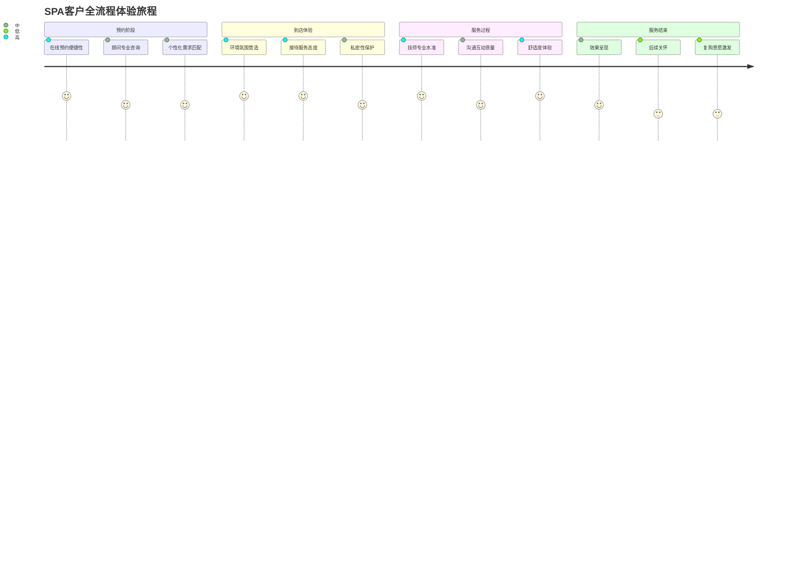
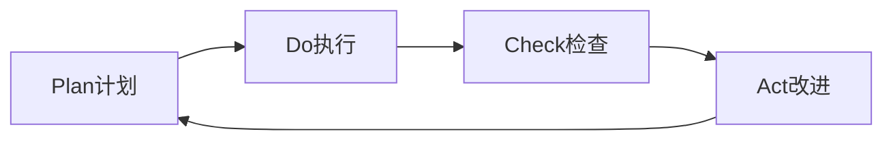

# SPA用户体验优化与质量管理体系 (SPA User Experience Optimization & Quality Management System)

> 🎯 **卓越服务理念**: 本文档建立以客户为中心的SPA服务体验优化体系，通过科学的质量管理方法和用户体验设计，打造超越期望的服务品质，实现客户满意度的最大化和品牌价值的持续提升。

## 用户体验设计体系 (User Experience Design System)

### 客户旅程地图优化 (Customer Journey Mapping Optimization)

#### 全触点体验设计框架


#### 关键体验触点优化策略
##### 预约体验优化
| 触点环节 | 痛点识别 | 优化方案 | 预期效果 |
| :--- | :--- | :--- | :--- |
| **在线预约** | 系统复杂、信息不透明 | AI智能推荐+实时技师展示 | 预约转化率提升35% |
| **电话咨询** | 等待时间长、回答不专业 | 智能客服+专业顾问轮值 | 客户满意度提升40% |
| **需求沟通** | 个性化不足、匹配度低 | 大数据画像+精准需求分析 | 服务匹配准确率85% |

##### 到店体验升级
| 环境要素 | 设计标准 | 感官体验 | 心理效应 |
| :--- | :--- | :--- | :--- |
| **视觉设计** | 自然色调、柔和照明 | 视觉舒适度↑60% | 放松感增强 |
| **听觉环境** | 自然音效、轻柔音乐 | 噪音降低至35dB以下 | 压力水平下降 |
| **嗅觉氛围** | 天然精油、空气净化 | 空气质量优良率100% | 情绪愉悦度提升 |
| **触觉感受** | 优质材质、适宜温度 | 体感舒适度↑50% | 身心放松加速 |

### 个性化服务设计 (Personalized Service Design)

#### 客户画像与需求分析系统
##### 多维度客户分型模型
| 客户类型 | 行为特征 | 心理需求 | 服务策略 | 产品匹配 |
| :--- | :--- | :--- | :--- | :--- |
| **健康养生型** | 定期护理、注重效果 | 追求身心健康 | 功能性项目+健康管理 | 中医调理套餐 |
| **压力释放型** | 工作繁忙、情绪紧张 | 寻求放松减压 | 舒缓项目+心理咨询 | 深层放松疗程 |
| **美容塑形型** | 关注外表、追求完美 | 美容抗衰老需求 | 美容项目+营养指导 | 美肌焕活系列 |
| **社交体验型** | 喜欢分享、注重氛围 | 社交娱乐需求 | 主题项目+社群活动 | 情侣套餐、闺蜜时光 |

##### 动态需求预测算法
```
客户需求预测模型 = α×历史偏好 + β×生活节律 + γ×社会因素 + δ×季节变化

其中:
- α, β, γ, δ 为权重系数(通过机器学习优化)
- 历史偏好: 基于消费记录和反馈数据
- 生活节律: 工作作息、生理周期等
- 社会因素: 节假日、流行趋势等
- 季节变化: 气候、时令养生需求
```

#### 智能化服务推荐引擎
##### 个性化项目组合设计
| 推荐维度 | 算法逻辑 | 输出形式 | 更新频率 |
| :--- | :--- | :--- | :--- |
| **功效导向** | 症状匹配度算法 | 项目组合方案 | 每次服务前 |
| **时间优化** | 效率最大化模型 | 时间分配建议 | 实时动态调整 |
| **性价比** | 成本效益分析 | 优惠套餐推荐 | 每月更新 |
| **创新体验** | 趋势热度排序 | 新项目试用邀请 | 季度推送 |

## 客户满意度评估体系 (Customer Satisfaction Evaluation System)

### 多维度满意度测评模型

#### 综合满意度指标体系
| 一级指标 | 二级指标 | 测评方法 | 权重分配 | 目标值 |
| :--- | :--- | :--- | :--- | :--- |
| **服务质量** | 技师专业度、服务准确性 | 现场观察+客户评价 | 30% | ≥4.5分 |
| **环境体验** | 环境舒适度、私密性 | 神秘顾客+仪器检测 | 20% | ≥4.2分 |
| **价值感知** | 性价比、效果满意度 | 问卷调查+复购率 | 25% | ≥4.0分 |
| **情感体验** | 服务态度、关怀程度 | 情感分析+深度访谈 | 15% | ≥4.3分 |
| **便利性** | 预约便捷、交通便利 | 用户行为分析 | 10% | ≥4.0分 |

#### 实时满意度监测机制
##### 数字化反馈收集系统
```
反馈收集渠道:
├── 服务结束后即时评价 (权重: 40%)
├── 离店后短信/微信回访 (权重: 25%)
├── 月度会员满意度调研 (权重: 20%)
├── 社交媒体舆情监测 (权重: 15%)
```

##### 满意度预警与干预机制
| 满意度水平 | 预警等级 | 响应机制 | 处理时限 | 跟踪要求 |
| :--- | :--- | :--- | :--- | :--- |
| **优秀 (≥4.5分)** | 绿色 | 持续优化 | 7天内 | 定期回顾 |
| **良好 (4.0-4.4分)** | 黄色 | 分析改进 | 3天内 | 专项提升 |
| **一般 (3.5-3.9分)** | 橙色 | 重点关注 | 24小时内 | 立即整改 |
| **较差 (<3.5分)** | 红色 | 紧急处理 | 立即响应 | 持续跟进 |

### 客户忠诚度管理 (Customer Loyalty Management)

#### 会员生命周期价值优化
##### 分层会员管理体系
| 会员等级 | 消费门槛 | 权益配置 | 服务标准 | 维护策略 |
| :--- | :--- | :--- | :--- | :--- |
| **普通会员** | 单次消费 | 基础折扣 | 标准服务 | 新客转化 |
| **银卡会员** | 年消费≥5000元 | 专属优惠+生日礼遇 | 优先预约 | 关怀维护 |
| **金卡会员** | 年消费≥20000元 | VIP待遇+私人订制 | 一对一服务 | 深度绑定 |
| **钻石会员** | 年消费≥50000元 | 私人管家+免费项目 | 顶级配置 | 情感维系 |

##### 客户流失预警与挽回
| 流失信号 | 识别指标 | 预警阈值 | 挽回策略 | 成功率目标 |
| :--- | :--- | :--- | :--- | :--- |
| **消费频次下降** | 月均到店次数 | <历史平均值50% | 专属优惠+关怀致电 | 65% |
| **消费金额减少** | 单次消费金额 | <历史平均值30% | 升级体验+增值服务 | 55% |
| **服务评价下滑** | 满意度评分 | 连续2次<4.0分 | 深度沟通+补偿方案 | 70% |
| **社交媒体负面** | 网络口碑 | 负面评论≥2条 | 公开回应+私下沟通 | 80% |

## 服务质量标准化体系 (Service Quality Standardization System)

### 服务流程标准化 (Service Process Standardization)

#### SOP标准化操作流程
##### 核心服务环节标准
| 服务环节 | 标准作业程序 | 关键控制点 | 质量要求 | 检查方法 |
| :--- | :--- | :--- | :--- | :--- |
| **接待准备** | 环境布置+物品检查 | 清洁度、温度、用品齐全 | 100%合格率 | 交接班检查 |
| **客户接待** | 问候引导+需求了解 | 30秒内响应、专业咨询 | 客户满意度≥4.5分 | 现场观察 |
| **服务实施** | 按摩手法+沟通互动 | 力度适中、节奏合理 | 技术达标率100% | 技师互检 |
| **服务结束** | 效果确认+关怀提醒 | 客户确认满意、后续指导 | 复购意向≥70% | 客户反馈 |

##### 服务时间标准化管理
| 项目类型 | 标准时长 | 弹性范围 | 超时处理 | 质量保证 |
| :--- | :--- | :--- | :--- | :--- |
| **基础护理** | 60分钟 | ±10分钟 | 免费延长时间 | 效果不打折 |
| **深度调理** | 90分钟 | ±15分钟 | 按比例收费 | 个性化调整 |
| **特色疗程** | 120分钟 | ±20分钟 | 协商确定 | 价值最大化 |

### 质量监控与持续改进 (Quality Monitoring & Continuous Improvement)

#### 关键绩效指标(KPI)体系
##### 运营质量指标
| 指标类别 | 具体指标 | 目标值 | 监测频率 | 改进措施 |
| :--- | :--- | :--- | :--- | :--- |
| **服务效率** | 客户等待时间 | ≤15分钟 | 实时监测 | 流程优化 |
| **技术水平** | 手法标准符合率 | ≥95% | 每月评估 | 培训提升 |
| **环境卫生** | 清洁合格率 | 100% | 每日检查 | 标准化管理 |
| **客户体验** | 一次满意度 | ≥4.2分 | 每次服务后 | 立即改进 |

##### 财务绩效指标
| 指标名称 | 计算公式 | 目标水平 | 影响因素 | 优化方向 |
| :--- | :--- | :--- | :--- | :--- |
| **客单价** | 营业收入÷服务人次 | ≥300元 | 项目组合、消费升级 | 价值提升 |
| **复购率** | 回头客占比 | ≥60% | 服务质量、客户关系 | 忠诚度建设 |
| **坪效** | 营业收入÷营业面积 | ≥800元/㎡·月 | 空间利用、时段优化 | 效率提升 |
| **人效** | 营业收入÷员工人数 | ≥15000元/人·月 | 人员配置、技能提升 | 人力资源优化 |

#### PDCA循环改进机制


##### 持续改进实施步骤
1. **问题识别**: 通过数据分析和客户反馈发现改进机会
2. **根因分析**: 运用鱼骨图、5Why等工具深入分析问题根源
3. **方案制定**: 制定具体的改进措施和实施计划
4. **试点验证**: 选择部分门店或项目进行小范围测试
5. **效果评估**: 对比改进前后的各项指标变化
6. **标准化推广**: 将成功经验形成标准并在全系统推广
7. **持续监控**: 建立长效机制确保改进效果的可持续性

### 数字化质量管理平台 (Digital Quality Management Platform)

#### 智能质量管理系统架构
```
质量管理云平台
├── 数据采集层
│   ├── IoT传感器(温湿度、空气质量)
│   ├── 客户反馈系统(评价、投诉)
│   └── 员工操作记录(打卡、服务日志)
├── 数据处理层  
│   ├── 实时监控引擎
│   ├── 异常检测算法
│   └── 趋势分析模型
├── 应用服务层
│   ├── 质量仪表板
│   ├── 预警通知系统
│   └── 改进建议引擎
└── 决策支持层
    ├── 绩效分析报告
    ├── 资源优化建议
    └── 战略规划支持
```

#### 质量可视化管理看板
##### 实时监控大屏展示
- **服务质量热力图**: 各门店服务质量和客户满意度分布
- **异常事件预警**: 实时显示各类质量问题和处理进度
- **改进项目跟踪**: 展示各改进措施的实施状态和效果
- **标杆对比分析**: 与行业标准和优秀门店的横向对比

通过建立完善的用户体验优化和质量管理体系，SPA服务能够在激烈的市场竞争中脱颖而出，实现可持续的高质量发展。