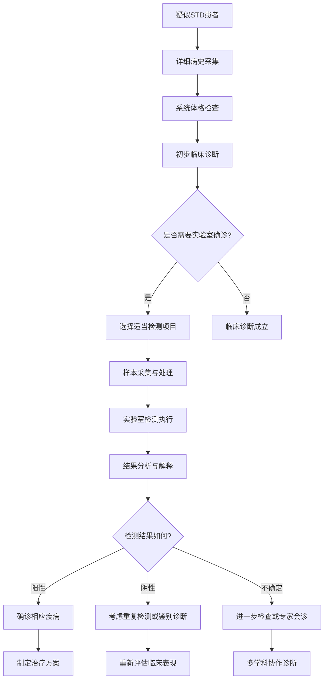
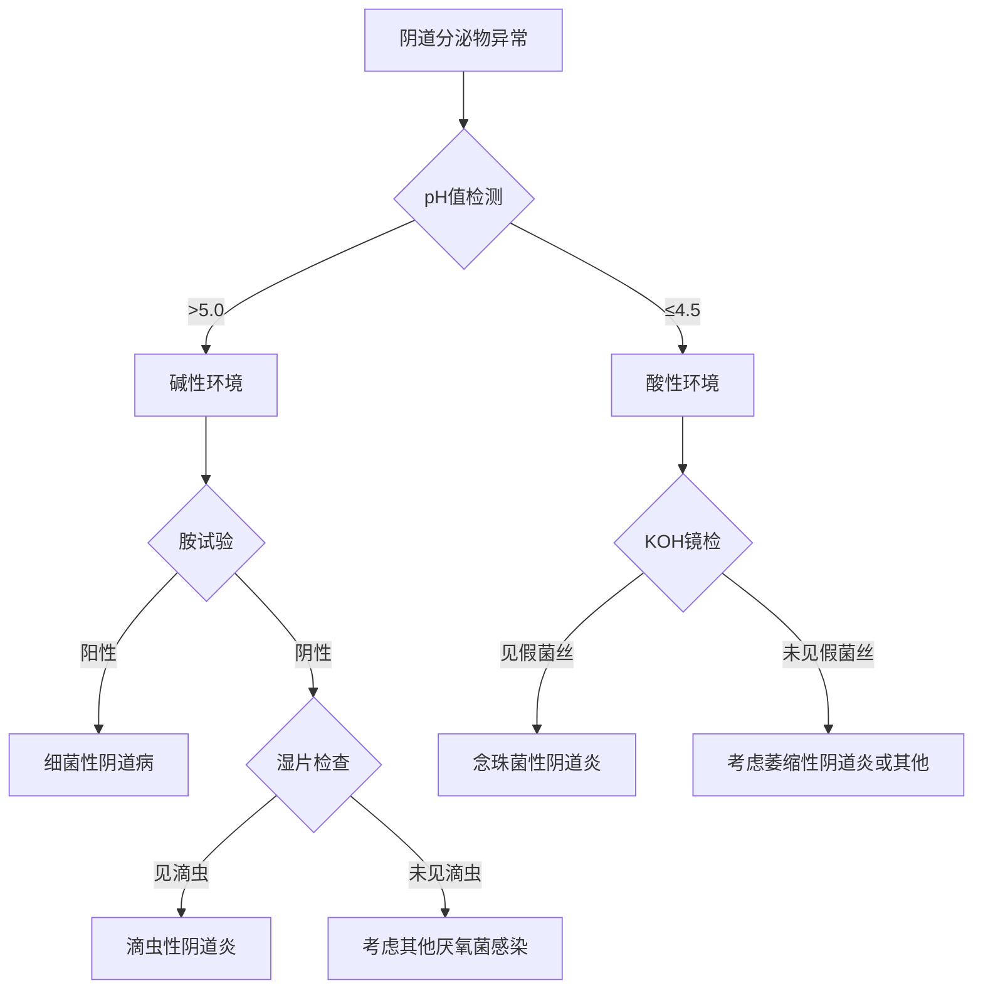
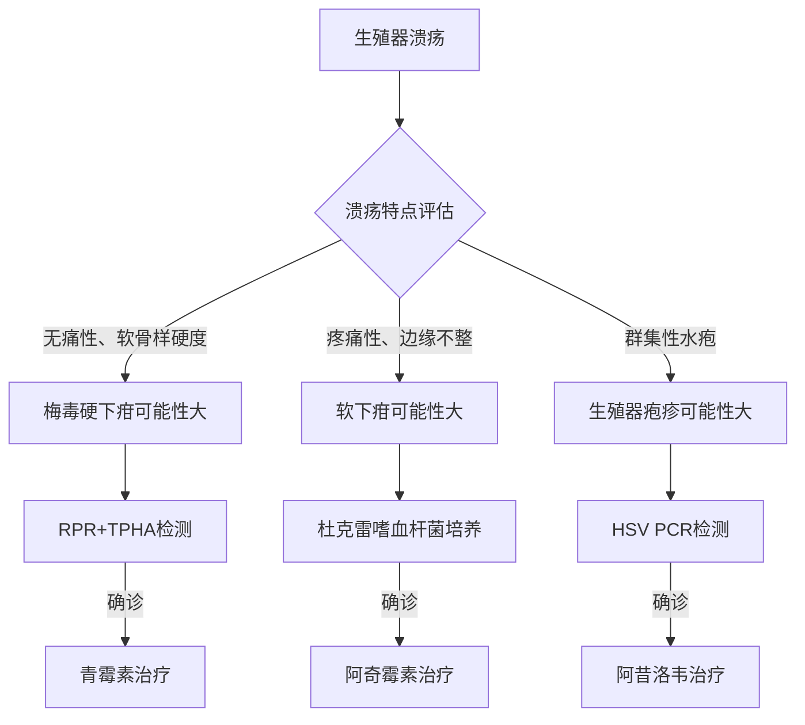

# Sexually Transmitted Diseases Diagnosis and Assessment (性传播疾病诊断评估)

> 🧪 **诊断指南**: 本文档详细介绍性传播疾病的诊断方法、实验室检测技术、影像学检查和鉴别诊断策略。建议结合[临床表现](STD_Clinical_Features.md)和[治疗管理](STD_Treatment_Management.md)文档进行系统学习。

## 诊断策略框架 (Diagnostic Strategy Framework)

### 综合诊断模式 (Comprehensive Diagnostic Approach)

| 诊断层次 | 评估内容 | 方法工具 | 临床意义 | 质量控制 |
| :--- | :--- | :--- | :--- | :--- |
| **病史采集** | 流行病学史、症状史、性行为史 | 标准化问卷、访谈技巧 | 确定风险因素、指导检测 | 培训考核、质量监控 |
| **体格检查** | 全身检查、局部检查、系统评估 | 标准化检查流程、图示记录 | 发现客观体征、定位病变 | 检查者资质、互检机制 |
| **实验室检测** | 病原学检测、血清学检测、分子诊断 | 自动化设备、质量控制品 | 确诊依据、疗效监测 | 室间质评、内部质控 |
| **影像学检查** | 超声、CT、MRI等 | 专业影像设备、报告系统 | 评估病变范围、并发症 | 影像医师资质、报告审核 |
| **鉴别诊断** | 排除其他疾病、确认诊断 | 循证医学、专家共识 | 避免误诊漏诊、精准治疗 | 多学科会诊、病例讨论 |

### 循证诊断流程 (Evidence-Based Diagnostic Process)



## 病史采集要点 (History Taking Essentials)

### 核心病史要素 (Core History Elements)

#### 流行病学史 (Epidemiological History)
**性行为史详细询问**
- **性伴侣情况**: 数量、稳定性、性取向
- **性行为方式**: 阴道性交、肛交、口交
- **保护措施**: 安全套使用情况、PrEP使用
- **高危行为**: 商业性行为、药物滥用相关性行为

**暴露史评估**
- **时间**: 最近一次性行为时间
- **地点**: 不同地区感染风险差异
- **频率**: 性行为频度与感染风险关系
- **症状出现时间**: 有助于判断潜伏期

#### 现病史采集 (Present Illness History)
**症状详细描述**
- **首发症状**: 出现时间、严重程度
- **症状演变**: 进展过程、缓解因素
- **伴随症状**: 全身症状、局部症状
- **诱发因素**: 与症状相关的触发因素

**既往史询问**
- **STD病史**: 既往感染、治疗情况
- **过敏史**: 药物过敏、其他过敏
- **手术史**: 可能影响诊断的相关手术
- **用药史**: 当前用药、近期用药情况

### 标准化问诊工具 (Standardized Interview Tools)

#### CDC推荐性健康史采集表
```
性健康史采集要点：
□ 性取向和性别认同
□ 性伴侣数量和关系类型
□ 性行为方式和频率
□ 安全套使用习惯
□ 性传播疾病史
□ HIV检测史
□ PrEP/PEP使用史
□ 症状详细描述
□ 月经史（女性）
□ 妊娠史（女性）
```

#### 风险评估量表 (Risk Assessment Scale)
| 风险因素 | 评分标准 | 风险等级 |
| :--- | :--- | :--- |
| **多性伴侣** | 1个=1分，2-3个=2分，>3个=3分 | 低(<3分)/中(3-5分)/高(>5分) |
| **无保护性行为** | 偶尔=1分，经常=2分，总是=3分 |  |
| **物质滥用** | 无=0分，偶尔=1分，经常=2分 |  |
| **既往STD史** | 无=0分，有=2分 |  |
| **HIV暴露风险** | 无=0分，低风险=1分，高风险=2分 |  |

## 体格检查标准 (Physical Examination Standards)

### 系统性检查流程 (Systematic Examination Protocol)

#### 一般检查 (General Examination)
**全身状况评估**
- **生命体征**: 体温、脉搏、血压、呼吸
- **营养状态**: 体重变化、营养不良征象
- **精神状态**: 意识清晰度、焦虑抑郁表现
- **淋巴结检查**: 全身淋巴结触诊

#### 皮肤粘膜检查 (Skin and Mucous Membrane Examination)
**皮肤病变观察**
- **颜色改变**: 红斑、色素沉着、苍白
- **形态特征**: 丘疹、水疱、溃疡、结节
- **分布特点**: 对称性、局限性、播散性
- **伴随表现**: 瘙痒、疼痛、渗出

**粘膜检查重点**
- **口腔粘膜**: 白斑、溃疡、疱疹
- **生殖器粘膜**: 红肿、糜烂、分泌物
- **肛周粘膜**: 裂隙、赘生物、炎症

### 局部专科检查 (Local Specialty Examination)

#### 男性生殖器检查 (Male Genital Examination)
**外部检查顺序**
1. **阴茎检查**:
   - 龟头、冠状沟观察
   - 包皮是否过长
   - 有无溃疡、丘疹、赘生物
2. **尿道口检查**:
   - 有无分泌物
   - 是否红肿
   - 挤压是否有分泌物流出
3. **阴囊检查**:
   - 睾丸大小、质地
   - 附睾有无肿大压痛
   - 精索静脉曲张

#### 女性生殖器检查 (Female Genital Examination)
**妇科检查步骤**
1. **外阴检查**:
   - 大小阴唇形态
   - 前庭腺开口情况
   - 有无溃疡、赘生物
2. **阴道窥器检查**:
   - 阴道壁观察
   - 宫颈外观检查
   - 分泌物性状记录
3. **双合诊检查**:
   - 子宫位置、大小
   - 附件区有无压痛
   - 宫颈举痛评估

#### 肛门直肠检查 (Anal Rectal Examination)
**检查适应症**
- 肛交史患者
- 肛门症状患者
- 高危人群筛查

**检查方法**
- **视诊**: 肛周皮肤、有无病变
- **指诊**: 直肠壁触诊、有无肿块
- **肛门镜检查**: 直视下观察病变

## 实验室检测技术 (Laboratory Testing Technologies)

### 病原学检测 (Microbiological Testing)

#### 直接镜检 (Direct Microscopy)
**湿片检查**
- **滴虫检查**: 生理盐水悬滴法观察活动滋养体
- **念珠菌检查**: 10% KOH溶液检查假菌丝和芽孢
- **线索细胞检查**: 细菌性阴道病诊断

**革兰染色**
- **淋球菌检查**: 革兰阴性双球菌，肾形排列
- **加德纳菌检查**: 革兰阴性或可变的小杆菌
- **形态学观察**: 细胞内外病原体形态

#### 培养检测 (Culture Methods)
**细菌培养**
- **淋球菌培养**: 巧克力琼脂培养基，5-10% CO₂环境
- **衣原体培养**: McCoy细胞培养法（已较少使用）
- **梅毒螺旋体培养**: 需特殊厌氧条件（临床很少开展）

**真菌培养**
- **念珠菌培养**: 沙氏培养基，25-30°C孵育
- **菌种鉴定**: 芽管试验、厚膜孢子试验
- **药敏试验**: 抗真菌药物敏感性检测

#### 分子生物学检测 (Molecular Diagnostics)
**核酸检测技术**
- **PCR技术**: 聚合酶链反应扩增特异性基因片段
- **实时荧光PCR**: 定量检测、快速结果
- **基因测序**: 病原体分型、耐药基因检测

**多重检测平台**
- **多重PCR**: 同时检测多种病原体
- **基因芯片**: 高通量病原体筛查
- **质谱检测**: MALDI-TOF MS快速鉴定

### 血清学检测 (Serological Testing)

#### 非特异性试验 (Non-treponemal Tests)
**RPR试验**（快速血浆反应素试验）
- **原理**: 检测反应素（心磷脂抗体）
- **临床应用**: 梅毒筛查、疗效监测
- **结果解释**: 滴度变化反映疾病活动性

**USR试验**（不加热血清反应素试验）
- **特点**: 操作简便、成本较低
- **局限性**: 特异性相对较差
- **临床价值**: 初筛和随访监测

#### 特异性试验 (Treponemal Tests)
**TPHA试验**（梅毒螺旋体血凝试验）
- **原理**: 检测特异性抗梅毒螺旋体抗体
- **特点**: 特异性高，感染后终身阳性
- **临床意义**: 确诊试验，不能用于疗效判断

**FTA-ABS试验**（荧光密螺旋体抗体吸收试验）
- **敏感性**: 较TPHA更高
- **应用**: 早期梅毒、神经梅毒诊断
- **优势**: 可检测IgM抗体

#### 病毒血清学检测
**HIV抗体检测**
- **初筛试验**: ELISA、化学发光法
- **确证试验**: Western blot、免疫印迹法
- **核酸检测**: HIV RNA定量检测

**HSV血清学检测**
- **IgG/IgM抗体**: 区分原发和复发感染
- **型别特异性**: HSV-1和HSV-2抗体区分
- **临床应用**: 流行病学调查、诊断辅助

### 快速检测技术 (Rapid Testing Technologies)

#### POCT检测 (Point-of-Care Testing)
**即时检测优势**
- **快速出结果**: 15-30分钟获得结果
- **操作简便**: 非实验室人员可操作
- **现场应用**: 适用于基层医疗机构

**常用POCT产品**
- **HIV快速检测**: 胶体金免疫层析法
- **梅毒快速检测**: TRUST卡片试验
- **妊娠试验**: hCG检测（相关性检查）

#### 自检试剂盒 (Self-Testing Kits)
**居家检测产品**
- **HIV自检**: 口腔液或指尖血检测
- **HPV自采样**: 阴道拭子自采样检测
- **质量保证**: FDA批准、CE认证产品

## 影像学检查 (Imaging Studies)

### 超声检查 (Ultrasound Examination)

#### 经阴道超声 (Transvaginal Ultrasound)
**适应症**
- 盆腔炎性疾病评估
- 输卵管卵巢脓肿诊断
- 不孕症相关检查
- 异位妊娠排查

**检查要点**
- **子宫附件**: 形态、大小、回声
- **盆腔积液**: 位置、量、性质
- **血流信号**: 彩色多普勒评估

#### 经直肠超声 (Transrectal Ultrasound)
**男性适应症**
- 前列腺疾病评估
- 精囊病变检查
- 直肠周围脓肿诊断

**技术要求**
- **探头频率**: 5-10MHz专用探头
- **检查准备**: 清洁灌肠、适量充盈
- **图像质量**: 多切面观察、动态评估

### CT/MRI检查 (Computed Tomography/Magnetic Resonance Imaging)

#### CT检查应用
**腹部盆腔CT**
- **淋巴结肿大**: 评估转移情况
- **脓肿形成**: 定位和范围评估
- **并发症检查**: 肠梗阻、穿孔等

**增强CT价值**
- **血管评估**: 血供情况分析
- **病变定性**: 良恶性鉴别
- **分期评估**: 肿瘤分期需要

#### MRI检查优势
**软组织分辨率**
- **神经系统**: 神经梅毒、HIV脑病
- **盆腔器官**: 精细解剖结构显示
- **炎症评估**: 水肿、纤维化程度

**功能成像**
- **弥散加权**: 急性炎症检测
- **灌注成像**: 血流动力学评估
- **波谱分析**: 代谢产物检测

## 鉴别诊断策略 (Differential Diagnostic Strategy)

### 常见鉴别诊断表 (Common Differential Diagnosis Table)

#### 溃疡性疾病鉴别
| 疾病 | 病原体 | 潜伏期 | 溃疡特点 | 伴随症状 | 实验室检查 |
| :--- | :--- | :--- | :--- | :--- | :--- |
| **梅毒硬下疳** | 梅毒螺旋体 | 10-90天 | 圆形、软骨样硬度、无痛 | 局部淋巴结肿大 | 暗视野、血清学阳性 |
| **软下疳** | 杜克雷嗜血杆菌 | 1-14天 | 疼痛性、边缘不整、基底污秽 | 痛性淋巴结肿大 | 培养阳性 |
| **生殖器疱疹** | HSV-1/2 | 2-12天 | 群集性水疱、易破溃、疼痛 | 灼热感、发热 | PCR、病毒培养阳性 |
| **白塞病** | 自身免疫 | 反复发作 | 口生殖器溃疡、眼部病变 | 系统性表现 | 临床诊断 |
| **固定性药疹** | 药物过敏 | 数小时至数天 | 单发、边界清楚、停药后好转 | 用药史明确 | 停药后缓解 |

#### 分泌物疾病鉴别
| 疾病 | 病原体 | 分泌物特点 | pH值 | 伴随症状 | 特殊检查 |
| :--- | :--- | :--- | :--- | :--- | :--- |
| **淋病** | 淋球菌 | 脓性、黄色、量多 | 6.0-7.0 | 排尿灼痛、尿频 | 革兰染色、培养阳性 |
| **衣原体感染** | 衣原体 | 粘液性、量少、透明 | 6.0-7.0 | 症状轻微 | PCR、抗原检测阳性 |
| **滴虫病** | 阴道毛滴虫 | 泡沫状、黄绿色、腥臭 | >5.0 | 瘙痒、异味 | 湿片见活动滋养体 |
| **细菌性阴道病** | 混合菌群 | 灰白色、均质、鱼腥味 | >5.0 | 轻度瘙痒 | 线索细胞、胺试验阳性 |
| **念珠菌病** | 白色念珠菌 | 豆腐渣样、白色 | ≤4.5 | 剧烈瘙痒 | KOH镜检见假菌丝 |

#### 系统性疾病鉴别
| 疾病 | 主要症状 | 皮肤表现 | 实验室特点 | 鉴别要点 |
| :--- | :--- | :--- | :--- | :--- |
| **二期梅毒** | 发热、淋巴结肿大 | 多形性皮疹、手掌足底铜红色斑 | RPR滴度高、TPHA阳性 | 对称性、不痛不痒 |
| **HIV急性感染** | 流感样症状 | 斑丘疹、咽炎 | HIV RNA高、抗体阴性 | 病毒载量检测关键 |
| **传染性单核细胞增多症** | 发热、咽峡炎、淋巴结肿大 | 斑丘疹、咽部充血 | EBV抗体阳性 | 异型淋巴细胞增多 |
| **风疹** | 发热、皮疹、淋巴结肿大 | 斑丘疹、耳后淋巴结肿大 | 风疹IgM抗体阳性 | 流行病学史重要 |

### 诊断算法图 (Diagnostic Algorithm Diagrams)

#### 阴道分泌物异常诊断流程


#### 生殖器溃疡诊断流程


## 质量控制标准 (Quality Control Standards)

### 实验室质量管理 (Laboratory Quality Management)

#### ISO 15189认证要求
**质量管理体系**
- **人员资质**: 检验医师、技术人员资格要求
- **设备管理**: 仪器校准、维护保养程序
- **试剂管理**: 有效期监控、批次验证
- **环境控制**: 温湿度、洁净度标准

**检验过程控制**
- **样本采集**: 标准化操作程序(SOP)
- **样本处理**: 预处理、保存条件规范
- **检测执行**: 标准化检测流程
- **结果报告**: 审核、发放程序

#### 室间质量评价 (External Quality Assessment)
**参与项目**
- **国家卫健委EQA**: 定期参加能力验证
- **国际质评项目**: WHO、CDC组织的质评
- **区域性质评**: 省市级质控中心组织
- **厂家质评**: 试剂厂商提供的质控品

**质量指标监控**
- **准确性**: 与参考方法比对结果
- **精密度**: 批内、批间变异系数
- **灵敏度**: 最低检出限验证
- **特异性**: 交叉反应性评估

### 诊断准确性评估 (Diagnostic Accuracy Assessment)

#### 敏感性与特异性 (Sensitivity and Specificity)
**检测性能指标**
- **敏感性**: 真阳性率，反映检出能力
- **特异性**: 真阴性率，反映排除能力
- **阳性预测值**: 阳性结果中真正患病的比例
- **阴性预测值**: 阴性结果中真正未患病的比例

**临床应用场景**
- **筛查试验**: 高敏感性优先，减少漏诊
- **确诊试验**: 高特异性优先，减少误诊
- **联合检测**: 提高整体诊断效能

#### ROC曲线分析 (ROC Curve Analysis)
**诊断效能评估**
- **曲线下面积(AUC)**: 0.5-1.0，越接近1.0越好
- **最佳临界值**: 约登指数最大处
- **似然比计算**: 阳性似然比、阴性似然比
- **置信区间**: 统计学可靠性评估

## 新兴诊断技术 (Emerging Diagnostic Technologies)

### 多组学诊断 (Multi-omics Diagnostics)
**整合诊断方法**
- **基因组学**: 病原体全基因组测序
- **蛋白质组学**: 宿主反应蛋白标志物
- **代谢组学**: 感染相关代谢产物
- **微生物组学**: 微生态平衡评估

### 人工智能辅助诊断 (AI-Assisted Diagnosis)
**机器学习应用**
- **图像识别**: 皮损自动识别分类
- **模式分析**: 临床症状组合分析
- **风险预测**: 个体化感染风险评估
- **决策支持**: 诊疗方案智能推荐

### 纳米技术检测 (Nanotechnology-Based Detection)
**前沿检测方法**
- **纳米传感器**: 超高敏感性病原体检测
- **量子点标记**: 多色荧光同时检测
- **微流控芯片**: 集成化小型检测系统
- **生物条形码**: 数字化分子检测技术

---

*本文档基于最新的诊断技术标准和临床实践指南编制，为性传播疾病的精准诊断提供专业指导。*