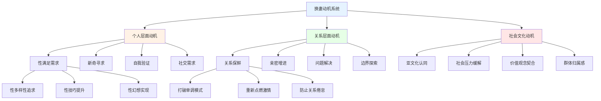

# 换妻研究框架与专业分析 (Swinging Research Framework & Professional Analysis)

> 📘 **文档导航**: 本文件提供换妻行为的综合性学术研究框架，涵盖社会学、心理学、关系科学和伦理学等多个维度。如需了解具体实践应用，请参考相关专题文档。

## 核心概念与定义体系

### 学术定义标准

换妻(Swinging)指已婚或长期伴侣关系中的成年人，在双方知情同意的前提下，与其他伴侣进行性活动的实践行为。这是一种经过协商的非单偶制关系形式。

### 换妻实践类型学

| 分类维度 | 实践类型 | 核心特征 | 动机机制 | 关系影响 | 风险等级 |
|---------|---------|---------|---------|---------|---------|
| **参与形式** | 软换妻 | 仅限于亲吻、抚摸等边缘性行为 | 探索性好奇、增加情趣 | 关系新鲜感提升 | 低 |
| **参与形式** | 硬换妻 | 包括完全性交行为 | 更强烈的刺激寻求 | 情感边界挑战较大 | 中高 |
| **场所设置** | 私人聚会 | 在私人住宅进行 | 注重隐私和熟悉感 | 安全感相对较高 | 低-中 |
| **场所设置** | 俱乐部场所 | 在专门的换妻俱乐部 | 专业化环境、规则明确 | 标准化程度高 | 中 |
| **伴侣参与** | 同时参与 | 夫妻同时与其他伴侣互动 | 共享体验、减少嫉妒 | 协调难度大 | 中高 |
| **伴侣参与** | 轮流参与 | 夫妻分别参与不同的性活动 | 降低直接竞争感 | 时间协调复杂 | 中 |

### 换妻动机的多层次分析

## 心理学理论与机制分析

### 关系动力学理论模型

#### 协商非单偶制理论

换妻行为建立在复杂的协商和同意机制基础上，涉及多个心理过程：

**协商过程要素：**
1. **动机澄清阶段**
   - 个人需求和期望的明确表达
   - 对伴侣感受的敏感性评估
   - 风险和收益的理性分析

2. **边界设定阶段**
   - 具体行为类型的详细讨论
   - 安全措施和保护机制确定
   - 紧急情况的应对预案

3. **实施监控阶段**
   - 过程中的持续沟通
   - 情绪状态的实时关注
   - 必要时的及时调整

#### 情感调节机制

| 调节维度 | 适应性策略 | 潜在风险 | 成功关键 |
|---------|-----------|---------|---------|
| **嫉妒管理** | 开放沟通、情感支持 | 嫉妒失控、关系破裂 | 情绪智力和沟通技能 |
| **安全感维护** | 明确承诺、定期确认 | 不安全感加剧 | 信任基础和一致性行为 |
| **亲密维持** | 独特时光、深度连接 | 亲密感稀释 | 创造专属的亲密空间 |
| **身份整合** | 价值观澄清、意义建构 | 身份混乱、价值冲突 | 自我觉察和价值澄清 |

### 人格特征与适应性

#### 参与者人格特征模式

**典型人格特征组合：**
1. **开放性维度**
   - 高开放性：对新体验的强烈好奇心
   - 高冒险倾向：愿意尝试非常规行为
   - 文化敏感性：能够理解和适应不同价值观

2. **关系技能维度**
   - 高沟通能力：能够清晰表达复杂情感
   - 情绪调节能力：有效管理负面情绪反应
   - 协商技巧：善于达成双赢的解决方案

3. **心理成熟度**
   - 自我觉察能力：清楚了解自己的需求和边界
   - 责任承担意识：对自己的选择负责
   - 长远规划能力：考虑行为的长期后果

## 社会学与文化视角

### 亚文化特征分析

#### 换妻社区的组织结构

**社区运作模式：**
1. **正式组织形式**
   - 注册会员制度
   - 严格的筛选程序
   - 明确的行为准则和惩罚机制

2. **非正式网络**
   - 基于信任的私人推荐
   - 小规模的熟人圈子
   - 灵活的参与方式

3. **数字平台发展**
   - 专门的交友网站和应用程序
   - 在线社区和论坛
   - 虚拟现实技术的应用

### 文化接受度变迁

#### 历史发展轨迹

| 时代阶段 | 社会态度 | 法律地位 | 实践特点 | 影响因素 |
|---------|---------|---------|---------|---------|
| **1960年代** | 高度禁忌，地下活动 | 非法或灰色地带 | 极度隐蔽，风险极高 | 性解放运动兴起 |
| **1970-80年代** | 逐渐宽容，但仍受质疑 | 部分地区合法化 | 场所专门化，规则形成 | AIDS危机影响 |
| **1990年代** | 相对接受，媒体关注 | 法律地位明确 | 社区正规化，研究增多 | 互联网技术发展 |
| **2000年代至今** | 多元包容，学术研究 | 法律保护完善 | 数字化平台，全球化 | 社会观念进一步开放 |

### 跨文化比较研究

#### 不同文化背景下的实践差异

| 文化维度 | 西方国家 | 东方国家 | 伊斯兰国家 | 拉丁美洲 |
|---------|---------|---------|-----------|---------|
| **社会接受度** | 相对较高，学术研究多 | 中等偏低，偏向保守 | 极低，严厉禁止 | 中等，宗教影响大 |
| **实践形式** | 公开俱乐部，规则明确 | 私人聚会为主，低调 | 几乎不存在，风险极高 | 混合形式，灵活多样 |
| **法律框架** | 多数合法，有监管机制 | 法律模糊，执法不一 | 严格禁止，刑罚严厉 | 法律宽松，社会容忍 |
| **性别角色** | 相对平等，女性参与积极 | 男性主导，女性被动 | 严格限制，女性禁止 | 男性主导，女性有限参与 |

## 关系影响与后果评估

### 积极效应分析

#### 关系质量提升机制

**正面影响维度：**
1. **情感亲密增强**
   - 通过共同探索增进理解
   - 增加彼此间的信任深度
   - 创造独特的共享体验

2. **性生活质量改善**
   - 减少性单调和倦怠感
   - 学习新的性技巧和偏好
   - 重新点燃性激情

3. **沟通技能发展**
   - 强制性的深度对话需求
   - 情感表达能力的提升
   - 冲突解决技巧的磨练

#### 个人成长机会

**发展性收益：**
- 自我认知的深化
- 情感调节能力的增强
- 人际关系技能的提高
- 价值观和边界的澄清

### 风险因素与挑战

#### 关系稳定性威胁

| 风险类型 | 具体表现 | 发生概率 | 影响程度 | 预防策略 |
|---------|---------|---------|---------|---------|
| **情感出轨** | 发展真实的感情连接 | 中等 | 高 | 明确边界，定期检查 |
| **嫉妒失控** | 情绪爆发，关系紧张 | 高 | 高 | 情绪管理训练，沟通技巧 |
| **价值观冲突** | 对行为意义理解不同 | 中高 | 中高 | 事先充分讨论，价值观澄清 |
| **安全风险** | STI传播，意外怀孕 | 中等 | 中 | 安全措施严格执行 |
| **社会压力** | 来自外界的负面评价 | 高 | 中 | 心理准备，支持系统建立 |

#### 心理健康风险

**潜在负面影响：**
1. **身份认同困扰**
   - 社会标签带来的心理压力
   - 自我价值感的质疑
   - 归属感的缺失

2. **关系焦虑**
   - 对伴侣忠诚度的持续担心
   - 比较心理和不安全感
   - 未来关系走向的不确定性

3. **社会孤立**
   - 朋友圈子的缩小
   - 家庭关系的紧张
   - 职业发展的潜在影响

## 实践指导与风险管理

### 前期准备阶段

#### 参与决策框架

**决策评估清单：**
1. **个人准备度评估**
   - [ ] 对换妻概念的充分理解
   - [ ] 个人价值观的清晰认知
   - [ ] 心理承受能力的客观评估
   - [ ] 风险接受度的现实判断

2. **关系状态检查**
   - [ ] 伴侣关系的基本稳定性
   - [ ] 沟通质量的充分保障
   - [ ] 共同意愿的一致确认
   - [ ] 应急预案的预先制定

3. **实际条件准备**
   - [ ] 安全措施的知识储备
   - [ ] 场所选择的标准制定
   - [ ] 时间安排的合理规划
   - [ ] 经济预算的充分考虑

### 实施过程管理

#### 安全协议标准

**身体健康保护：**
1. **疾病预防措施**
   - 定期健康检查和STI筛查
   - 安全套等屏障方法的正确使用
   - 疫苗接种(如HPV、乙肝等)
   - 紧急情况的医疗联系

2. **心理安全保障**
   - 事前详细的规则约定
   - 过程中的持续沟通确认
   - 安全词或信号的设立
   - 紧急退出机制的准备

#### 情感管理策略

**实时情绪调节：**
1. **过程中监控**
   - 观察伴侣的情绪变化
   - 及时询问感受和需求
   - 必要时暂停或调整活动
   - 保持开放和支持的态度

2. **事后处理**
   - 立即的情感交流和反馈
   - 积极体验的分享和庆祝
   - 负面感受的承认和处理
   - 关系状态的重新确认

### 长期维护机制

#### 关系质量监控

**定期评估系统：**
1. **月度检查点**
   - 关系满意度的量化评估
   - 情感连接质量的主观评价
   - 沟通效果的反思总结
   - 问题和挑战的及时识别

2. **年度深度回顾**
   - 整体关系发展方向的审视
   - 个人成长和收获的盘点
   - 实践模式的必要调整
   - 未来规划的共同制定

#### 持续学习发展

**能力提升路径：**
- 参加相关的工作坊和培训
- 阅读专业书籍和研究文献
- 与经验丰富的实践者交流
- 寻求专业咨询师的指导

## 伦理与法律考量

### 专业伦理原则

#### 心理健康从业者指导原则

**服务提供标准：**
1. **价值中立原则**
   - 不将自己的道德判断强加给来访者
   - 尊重当事人的选择和决定
   - 提供客观信息和专业建议

2. **知情同意要求**
   - 充分告知相关的风险和收益
   - 确保当事人理解所有相关信息
   - 获得明确的书面同意

3. **专业边界维护**
   - 避免与当事人建立多重关系
   - 保持客观和专业的态度
   - 及时转介超出能力范围的情况

### 法律合规框架

#### 不同地区的法律地位

| 法律管辖 | 合法性状态 | 监管要求 | 处罚规定 | 执法实践 |
|---------|-----------|---------|---------|---------|
| **美国** | 多数州合法 | 需要成年人同意，公共场所违法 | 违法者面临刑事指控 | 执法相对宽松 |
| **加拿大** | 合法 | 类似美国的规定 | 刑事处罚 | 执法较为宽松 |
| **欧洲** | 多数国家合法 | 各国具体规定不同 | 刑事或行政处罚 | 态度相对开放 |
| **中国** | 法律灰色地带 | 无明确法规，按社会秩序管理 | 可能面临治安处罚 | 执法谨慎处理 |
| **伊斯兰国家** | 严格禁止 | 完全不允许任何形式 | 严厉的刑事处罚 | 执法极其严格 |

## 研究前沿与发展趋势

### 学术研究现状

#### 当前研究热点领域

**主要研究方向：**
1. **心理健康影响研究**
   - 长期的心理适应机制
   - 与传统单偶制关系的比较
   - 特定人群的心理特征分析

2. **关系动力学探索**
   - 沟通模式的特殊性
   - 冲突解决的独特机制
   - 亲密关系的维持策略

3. **社会学意义研究**
   - 亚文化的形成和发展
   - 社会接受度的变化趋势
   - 对传统婚姻观念的挑战

### 技术发展影响

#### 数字化平台的作用

**技术创新应用：**
- 安全可靠的匹配算法
- 虚拟现实体验的可能性
- 区块链技术的身份验证
- 人工智能的风险评估

#### 研究方法革新

**新兴研究手段：**
- 大数据分析的应用
- 纵向追踪研究的设计
- 跨文化比较研究的深化
- 混合方法研究的推广

---
---
*本框架整合了社会学、心理学、性学和关系科学的最新研究成果，为换妻行为的研究、理解和实践提供了科学的理论基础和指导原则。*

**相关文档链接：**
- [乱伦研究专业分析](../incest/Incest_Research_Framework.md) - 乱伦现象的学术研究框架
- [性学研究概览](../sexuality/Sexuality_Overview.md) - 性学研究的基础理论和方法
- [出轨心理学与关系干预](../relationships/infidelity/Infidelity_Psychology.md) - 相关关系背叛行为的分析
- [换妻术语词典](Swinging_Terminology_Dictionary.md) - 专业术语标准化定义
- [换妻实践工具箱](Swinging_Practice_Toolkit.md) - 实用实践工具和模板