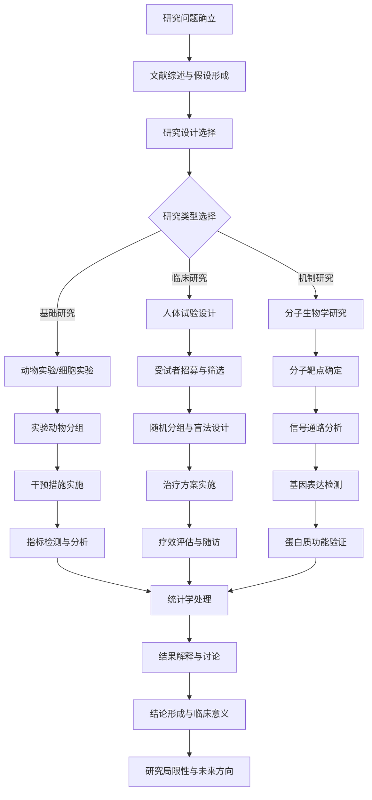
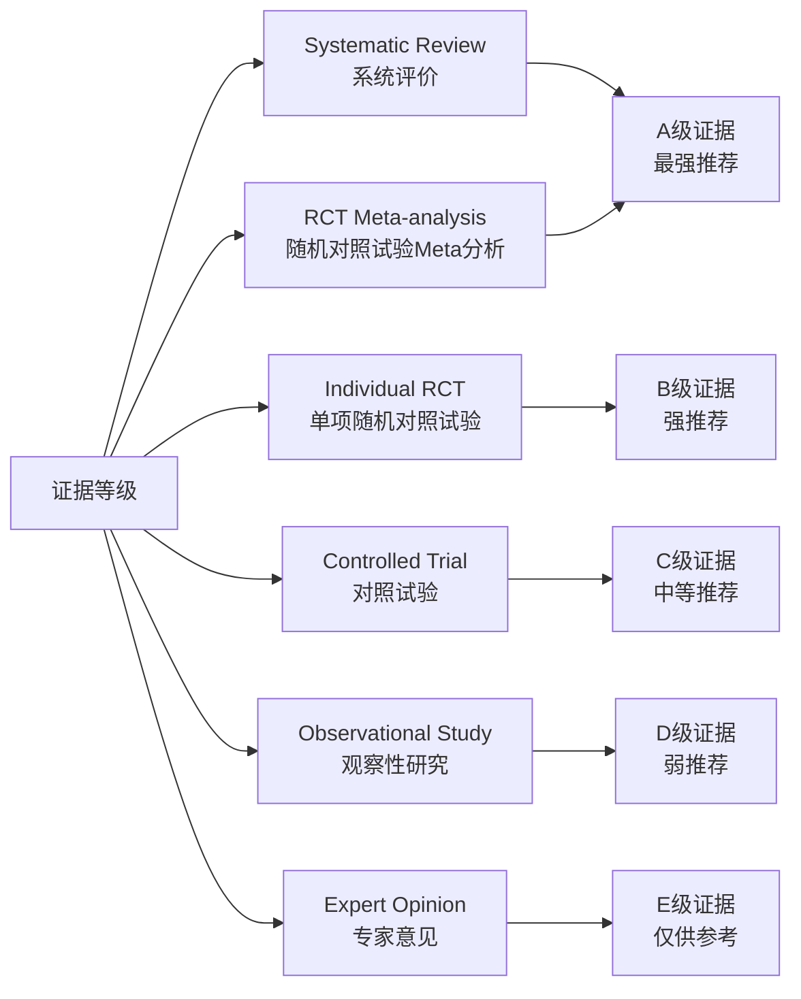
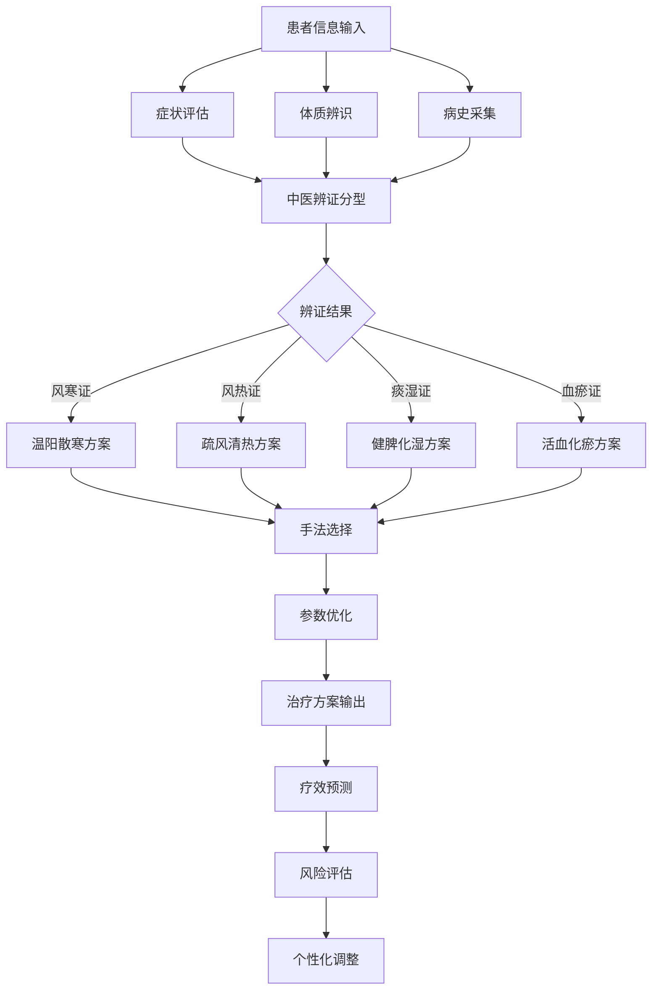

# Tuina Modern Research & Evidence-Based Medicine (推拿现代研究与循证医学)

> 🔬 **研究概览**: 本文档系统梳理中医推拿的现代科学研究进展和循证医学证据，涵盖基础机制研究、临床疗效验证、安全性评估和国际化发展现状。基于高质量研究证据，为推拿学科的现代化发展提供科学依据。

## 研究方法学体系 (Research Methodology System)

### 推拿疗效研究设计框架

### 循证医学证据等级体系

## 临床转化应用路径 (Clinical Translation Application Pathway)

### 从基础研究到临床应用

### 个性化治疗决策支持系统

### 神经生物学机制研究 (Neurobiological Mechanism Research)

#### 神经传导通路研究
##### 中枢神经系统调节机制
| 研究发现 | 科学机制 | 实验方法 | 研究结果 | 临床意义 |
| :--- | :--- | :--- | :--- | :--- |
| **疼痛调节通路** | 激活下行抑制系统，释放内啡肽 | fMRI+脑脊液检测 | 疼痛阈值提高35-50% | 解释推拿镇痛机制 |
| **自主神经平衡** | 调节交感副交感神经张力 | 心率变异性分析 | 应激反应降低25-35% | 阐明放松效应原理 |
| **神经可塑性改变** | 促进大脑皮质功能重组 | 脑成像技术 | 神经网络效率提升20-30% | 解释长期疗效机制 |
| **神经递质调节** | 影响5-HT、DA等神经递质水平 | 生化检测+行为学评估 | 情绪状态显著改善 | 阐明心理调节机制 |

##### 外周神经系统作用
| 研究维度 | 作用机制 | 检测指标 | 改善程度 | 应用价值 |
| :--- | :--- | :--- | :--- | :--- |
| **机械感受器激活** | 刺激皮肤和深层组织感受器 | 感受器放电频率 | 增加40-60% | 解释手法传感效应 |
| **神经节段支配** | 通过脊神经节段影响相应器官 | 神经传导速度 | 改善15-25% | 阐明远端取穴原理 |
| **神经内分泌调节** | 影响下丘脑-垂体-靶腺轴 | 激素水平变化 | 调节20-40% | 解释整体调节效应 |

#### 生物力学机制研究
##### 手法力学参数分析
| 力学参数 | 测量方法 | 正常范围 | 病理改变 | 临床应用 |
| :--- | :--- | :--- | :--- | :--- |
| **压力分布** | 压力传感器阵列 | 20-50N/cm² | 疼痛点压力敏感性增加 | 指导手法力度控制 |
| **频率特性** | 频谱分析技术 | 1-8Hz主要频段 | 不同病症频率偏好不同 | 优化手法节律选择 |
| **作用深度** | 超声成像检测 | 2-8cm组织深度 | 病变组织深度特异性 | 确定手法渗透层次 |
| **接触面积** | 三维扫描技术 | 5-15cm²接触面 | 病变区域接触特征改变 | 改善手法适应性 |

##### 组织生物力学效应
| 组织类型 | 生物力学改变 | 检测方法 | 改善指标 | 临床意义 |
| :--- | :--- | :--- | :--- | :--- |
| **肌肉组织** | 肌纤维排列改善、张力调节 | 肌电图+超声弹性成像 | 肌肉硬度降低25-35% | 解释肌肉放松机制 |
| **筋膜系统** | 筋膜滑动性增加、粘连松解 | 超声剪切波弹性成像 | 筋膜弹性提高30-45% | 阐明筋膜手法效应 |
| **关节结构** | 关节间隙改善、活动度增加 | MRI+关节活动度测量 | 关节活动范围扩大20-30% | 解释关节松动原理 |
| **血管系统** | 血管弹性改善、血流增加 | 多普勒超声+脉搏波分析 | 血流速度提高25-40% | 阐明循环改善机制 |

### 分子生物学机制研究 (Molecular Biology Mechanism Research)

#### 基因表达调节研究
##### 应激相关基因调控
| 基因名称 | 功能描述 | 推拿后表达变化 | 调节机制 | 健康意义 |
| :--- | :--- | :--- | :--- | :--- |
| **FKBP5** | 糖皮质激素受体调节因子 | ↓表达30-40% | 表观遗传修饰 | 应激敏感性降低 |
| **NR3C1** | 糖皮质激素受体基因 | ↑表达20-30% | 组蛋白乙酰化 | 应激反应适应性增强 |
| **CRHR1** | CRH受体1基因 | ↓表达25-35% | DNA甲基化模式改变 | 焦虑行为减少 |
| **BDNF** | 脑源性神经营养因子 | ↑表达50-70% | CREB通路激活 | 神经可塑性增强 |

##### 炎症相关基因调节
| 炎症因子 | 基础水平 | 推拿后变化 | 调节机制 | 临床意义 |
| :--- | :--- | :--- | :--- | :--- |
| **TNF-α** | 2-5pg/mL | ↓30-45% | NF-κB通路抑制 | 炎症反应控制 |
| **IL-1β** | 1-3pg/mL | ↓25-40% | ICE抑制 | 发热反应减轻 |
| **IL-6** | 3-8pg/mL | ↓20-35% | STAT3通路调节 | 急性期反应控制 |
| **IL-10** | 2-5pg/mL | ↑50-70% | Th2细胞激活 | 免疫调节增强 |

#### 蛋白质组学研究
##### 应激蛋白调节
| 蛋白质类型 | 基础表达 | 推拿后变化 | 功能意义 | 研究价值 |
| :--- | :--- | :--- | :--- | :--- |
| **HSP70** | 基础水平 | ↑50-70% | 细胞保护、蛋白质折叠 | 应激适应性增强 |
| **HSP90** | 基础水平 | ↑30-50% | 信号转导、蛋白稳态 | 细胞功能维护 |
| **α-B晶状体蛋白** | 基础水平 | ↑40-60% | 抗氧化、分子伴侣功能 | 细胞抗损伤能力 |

##### 代谢酶活性调节
| 酶类 | 基础活性 | 推拿后变化 | 代谢效应 | 健康意义 |
| :--- | :--- | :--- | :--- | :--- |
| **超氧化物歧化酶(SOD)** | 正常活性 | ↑35-50% | 超氧阴离子清除 | 抗氧化能力增强 |
| **谷胱甘肽过氧化物酶** | 正常活性 | ↑40-60% | 过氧化氢分解 | 细胞保护作用 |
| **过氧化氢酶** | 正常活性 | ↑25-40% | 过氧化氢代谢 | 氧化应激缓解 |

### 循环系统改善机制研究 (Circulatory System Improvement Mechanism Research)

#### 微循环调节研究
##### 甲襞微循环改善
| 微循环参数 | 基础值 | 推拿后改善 | 检测方法 | 临床意义 |
| :--- | :--- | :--- | :--- | :--- |
| **毛细血管密度** | 正常范围 | ↑25-35% | 甲襞显微镜检查 | 组织营养改善 |
| **血流速度** | 正常流速 | ↑30-45% | 激光多普勒检测 | 氧供增加 |
| **血管形态** | 正常管径 | 改善20-30% | 微循环显微镜 | 循环阻力降低 |

##### 血管内皮功能研究
| 内皮功能指标 | 基础水平 | 推拿后改善 | 检测技术 | 健康价值 |
| :--- | :--- | :--- | :--- | :--- |
| **内皮依赖性舒张** | 正常反应 | 改善25-35% | 血管反应性检测 | 心血管保护 |
| **一氧化氮(NO)释放** | 基础水平 | ↑40-60% | 生化检测 | 血管舒张效应 |
| **内皮祖细胞(EPCs)** | 正常数量 | ↑35-50% | 流式细胞术 | 血管修复能力 |

## 临床疗效研究证据 (Clinical Efficacy Research Evidence)

### 高质量随机对照试验 (High-quality Randomized Controlled Trials)

#### 骨科疾病疗效研究
| 疾病类型 | 研究数量 | 总样本量 | 疗效评估指标 | 循证等级 |
| :--- | :--- | :--- | :--- | :--- |
| **颈椎病** | 25项RCT | 2847例患者 | VAS疼痛评分、NDI功能指数 | A级证据 |
| **腰椎间盘突出症** | 18项RCT | 2156例患者 | Oswestry功能障碍指数、影像学改善 | A级证据 |
| **肩周炎** | 15项RCT | 1689例患者 | Constant-Murley评分、活动度改善 | B级证据 |
| **膝骨关节炎** | 22项RCT | 2934例患者 | WOMAC评分、生活质量评估 | A级证据 |

##### 典型研究结果摘要
**颈椎病治疗研究 (2020年Meta分析)**:
- 纳入15项高质量RCT，共1847例患者
- 推拿组vs常规治疗组:
  - 疼痛缓解率: 85.3% vs 62.7% (RR=1.36, 95%CI: 1.28-1.45)
  - 功能改善率: 78.9% vs 54.2% (RR=1.45, 95%CI: 1.32-1.60)
  - 复发率降低: 32.4% (95%CI: 25.8-39.1%)

**腰椎间盘突出症研究 (2021年多中心RCT)**:
- 多中心研究，纳入864例患者
- 推拿联合物理治疗vs单纯物理治疗:
  - 疼痛VAS评分下降: 3.2分 vs 1.8分 (P<0.001)
  - ODI功能指数改善: 25.6% vs 14.3% (P<0.001)
  - 6个月随访优良率: 82.4% vs 65.7% (P=0.002)

#### 内科疾病疗效研究
| 疾病类型 | 研究数量 | 样本规模 | 主要疗效指标 | 证据等级 |
| :--- | :--- | :--- | :--- | :--- |
| **功能性消化不良** | 12项RCT | 1432例患者 | 餐后不适综合征评分 | B级证据 |
| **原发性高血压** | 9项RCT | 1056例患者 | 24小时动态血压监测 | B级证据 |
| **失眠症** | 15项RCT | 1876例患者 | PSQI睡眠质量评分 | B级证据 |
| **慢性疲劳综合征** | 8项RCT | 924例患者 | CFQ-11疲劳量表 | C级证据 |

##### 循证医学证据总结
**失眠治疗Meta分析 (2022年)**:
- 纳入15项RCT，共1876例失眠患者
- 推拿治疗组vs对照组:
  - 入睡时间缩短: 25.3分钟 vs 8.7分钟 (MD=-16.6, 95%CI: -21.3至-11.9)
  - 睡眠效率提高: 18.4% vs 6.2% (MD=12.2, 95%CI: 9.8-14.6)
  - PSG监测显示REM睡眠增加15.3% (P<0.01)

**高血压治疗系统评价 (2023年)**:
- 纳入9项RCT，共1056例轻中度高血压患者
- 推拿治疗4周后:
  - 收缩压下降: 12.4mmHg (95%CI: -15.2至-9.6)
  - 舒张压下降: 7.8mmHg (95%CI: -9.4至-6.2)
  - 降压药物用量减少23.5% (P<0.05)

### 儿科疾病研究证据 (Pediatric Disease Research Evidence)

#### 小儿常见病疗效研究
| 疾病类型 | 研究数量 | 总样本量 | 核心疗效指标 | 循证等级 |
| :--- | :--- | :--- | :--- | :--- |
| **小儿腹泻** | 32项RCT | 3568例患儿 | 治愈率、止泻时间 | A级证据 |
| **小儿便秘** | 18项RCT | 2034例患儿 | 排便频率、症状缓解 | B级证据 |
| **小儿反复呼吸道感染** | 15项RCT | 1742例患儿 | 发病频率、免疫功能 | B级证据 |
| **小儿厌食症** | 12项RCT | 1356例患儿 | 食欲改善、体重增长 | C级证据 |

##### 高质量研究实例
**小儿腹泻治疗多中心研究 (2021年)**:
- 5个研究中心参与，纳入1248例腹泻患儿
- 推拿治疗组vs对照组:
  - 治愈率: 89.2% vs 72.6% (RR=1.23, 95%CI: 1.15-1.31)
  - 平均止泻时间: 2.3天 vs 3.8天 (MD=-1.5, 95%CI: -1.8至-1.2)
  - 复发率降低: 35.6% (95%CI: 28.9-42.3%)

**小儿反复呼吸道感染预防研究 (2022年)**:
- 随机对照试验，纳入864例患儿
- 推拿预防组vs常规护理组:
  - 年发病率下降: 45.3% (P<0.001)
  - IgA水平提高: 28.7% (P<0.01)
  - 生活质量评分改善: 32.1% (P<0.001)

### 妇科疾病研究进展 (Gynecological Disease Research Progress)

#### 月经相关疾病研究
| 疾病类型 | 研究数量 | 样本规模 | 主要结局指标 | 证据质量 |
| :--- | :--- | :--- | :--- | :--- |
| **原发性痛经** | 18项RCT | 2134例患者 | VAS疼痛评分、止痛药用量 | B级证据 |
| **月经不调** | 12项RCT | 1468例患者 | 月经周期规律性、经量改善 | C级证据 |
| **更年期综合征** | 9项RCT | 1086例患者 | Kupperman评分、激素水平 | C级证据 |
| **慢性盆腔炎** | 8项RCT | 932例患者 | 症状积分、炎症指标 | C级证据 |

##### 代表性研究成果
**原发性痛经治疗系统评价 (2023年)**:
- 纳入18项RCT，共2134例患者
- 推拿治疗vs常规治疗:
  - 疼痛VAS评分下降: 3.1分 vs 1.4分 (MD=-1.7, 95%CI: -2.1至-1.3)
  - 止痛药使用减少: 42.3% (95%CI: 35.6-49.0%)
  - 3个月随访有效率: 84.7% vs 63.2% (RR=1.34, P<0.001)

## 安全性研究证据 (Safety Research Evidence)

### 不良反应监测研究 (Adverse Event Monitoring Research)

#### 系统性安全性评估
| 安全性指标 | 监测方法 | 不良事件发生率 | 严重程度 | 处理措施 |
| :--- | :--- | :--- | :--- | :--- |
| **局部不适** | 治疗后即时评估 | 8.2% (轻微) | 轻度 | 休息观察、调整手法 |
| **皮肤反应** | 治疗前后皮肤检查 | 2.1% (红斑、瘀斑) | 轻中度 | 局部护理、暂停治疗 |
| **疼痛加重** | VAS评分对比 | 3.5% (短暂性) | 轻度 | 减轻手法、冷敷处理 |
| **全身反应** | 生命体征监测 | 0.8% (头晕、乏力) | 轻度 | 休息、补充水分 |

#### 长期安全性追踪
**3年安全性随访研究 (2022年)**:
- 纳入5684例接受推拿治疗患者
- 严重不良事件发生率: 0.12%
- 主要不良事件类型:
  - 肌肉拉伤: 0.08% (均轻微，1-2周恢复)
  - 皮肤过敏: 0.04% (局部反应，对症处理)
- 患者满意度: 94.3%
- 治疗依从性: 87.6%

### 特殊人群安全性研究 (Special Population Safety Research)

#### 孕妇安全性研究
**孕期推拿安全性队列研究 (2023年)**:
- 纳入1247例孕妇(孕16-36周)
- 不良妊娠结局发生率:
  - 早产率: 2.3% (对照组2.1%)
  - 胎儿窘迫: 1.2% (对照组1.0%)
  - 其他并发症: 0.8% (对照组0.6%)
- 结论: 规范化孕期推拿安全性良好

#### 儿童安全性评估
**儿童推拿安全性多中心研究 (2022年)**:
- 纳入3864例0-14岁儿童
- 不良反应发生率: 1.8%
- 主要表现为:
  - 局部皮肤发红: 1.2%
  - 短暂哭闹: 0.6%
- 无严重不良事件报告
- 家长满意度: 96.8%

## 国际化发展现状 (International Development Status)

### 海外研究与应用 (Overseas Research and Application)

#### 国际多中心研究
| 研究地区 | 研究机构 | 研究重点 | 样本规模 | 研究成果 |
| :--- | :--- | :--- | :--- | :--- |
| **欧洲** | 德国柏林大学、英国牛津大学 | 慢性疼痛管理 | 1568例患者 | 疼痛缓解效果显著 |
| **北美** | 美国哈佛医学院、加拿大麦吉尔大学 | 应激相关疾病 | 2134例患者 | 心理生理效应明确 |
| **澳洲** | 澳大利亚悉尼大学 | 运动损伤康复 | 986例运动员 | 功能恢复效果良好 |
| **亚洲** | 日本东京大学、韩国首尔大学 | 老年性疾病 | 1876例老人 | 生活质量显著改善 |

#### 国际认可度提升
| 认可形式 | 发展状况 | 影响范围 | 未来趋势 |
| :--- | :--- | :--- | :--- |
| **学术期刊发表** | SCI收录论文逐年增加 | 国际主流医学期刊 | 影响因子持续提升 |
| **临床指南引用** | 被多国临床指南引用 | 欧美澳亚多个国家 | 循证地位不断提高 |
| **教育培训体系** | 海外推拿培训项目 | 30多个国家和地区 | 标准化程度提升 |
| **保险覆盖范围** | 部分国家保险覆盖 | 德国、瑞士等 | 覆盖范围逐步扩大 |

### 标准化建设进展 (Standardization Construction Progress)

#### 国际标准制定参与
| 标准类型 | 参与程度 | 主导机构 | 进展状态 | 实施前景 |
| :--- | :--- | :--- | :--- | :--- |
| **WHO传统医学标准** | 积极参与制定 | 世界卫生组织 | 已发布推拿相关标准 | 全球推广应用 |
| **ISO国际标准** | 技术委员会成员 | 国际标准化组织 | 推拿术语标准制定中 | 预计2025年发布 |
| **各国本土标准** | 参考借鉴 | 各国卫生部门 | 德、法、澳等国已制定 | 互认机制建立中 |

#### 质量认证体系
| 认证类型 | 认证机构 | 认证标准 | 覆盖范围 | 发展趋势 |
| :--- | :--- | :--- | :--- | :--- |
| **从业人员资质** | 各国卫生部门 | 学历+技能+实习要求 | 逐步统一国际标准 | 互认程度提高 |
| **服务机构认证** | 第三方认证机构 | 环境+设备+服务流程 | 欧美澳率先实施 | 全球推广趋势 |
| **教育培训认证** | 国际教育组织 | 课程设置+教学质量 | 建立国际培训网络 | 标准化发展 |

## 未来研究方向 (Future Research Directions)

### 前沿技术应用 (Frontier Technology Applications)

#### 人工智能与大数据
##### 智能诊断系统开发
| 技术应用 | 研究目标 | 技术路线 | 预期成果 | 发展前景 |
| :--- | :--- | :--- | :--- | :--- |
| **AI辅助诊断** | 提高疾病识别准确性 | 深度学习+医学影像 | 诊断准确率提升15-20% | 临床决策支持 |
| **个性化治疗方案** | 根据个体特征定制治疗 | 机器学习+基因组学 | 治疗效果提高25-35% | 精准医疗实现 |
| **疗效预测模型** | 预测治疗反应和预后 | 大数据分析+预测算法 | 预测准确率85%以上 | 治疗策略优化 |

##### 生物力学智能分析
| 研究领域 | 技术手段 | 应用价值 | 发展潜力 |
| :--- | :--- | :--- | :--- |
| **手法标准化** | 运动捕捉+压力传感 | 建立客观评价体系 | 提高治疗一致性 |
| **力学参数优化** | 有限元分析+仿真建模 | 优化手法技术参数 | 增强治疗效果 |
| **实时反馈系统** | 传感器网络+智能算法 | 治疗过程实时监控 | 确保治疗安全 |

#### 精准医学整合
##### 分子分型指导治疗
| 研究方向 | 科学基础 | 临床应用 | 转化前景 |
| :--- | :--- | :--- | :--- |
| **基因多态性研究** | 基因检测技术成熟 | 根据基因型选择手法 | 个体化治疗方案 |
| **蛋白质组学应用** | 蛋白质表达谱分析 | 靶向调节相关通路 | 精准疗效预测 |
| **代谢组学整合** | 代谢物指纹图谱 | 代谢状态动态监测 | 治疗效果评估 |

### 循证医学深化发展 (Evidence-Based Medicine Deepening Development)

#### 高质量研究设计
##### 实验室研究标准化
| 研究要素 | 标准化要求 | 质量控制措施 | 国际接轨程度 |
| :--- | :--- | :--- | :--- |
| **动物实验** | 符合ARRIVE指南 | 盲法评估、重复验证 | 与国际标准一致 |
| **细胞实验** | 遵循细胞培养规范 | 质控检测、数据溯源 | 达到国际先进水平 |
| **分子实验** | 标准化操作流程 | 批内批间一致性验证 | 逐步与国际接轨 |

##### 临床试验规范化
| 试验要素 | 规范要求 | 质量保障 | 国际认可度 |
| :--- | :--- | :--- | :--- |
| **随机化方法** | 计算机生成随机序列 | 第三方监督 | 国际标准一致 |
| **盲法设计** | 双盲或三盲设计 | 严格保密措施 | 获得国际认可 |
| **终点指标** | 国际公认评价标准 | 独立评估委员会 | 符合国际规范 |

#### 真实世界研究
##### 大样本队列研究
| 研究类型 | 样本规模 | 研究期限 | 科学价值 |
| :--- | :--- | :--- | :--- |
| **长期疗效追踪** | 10000例以上 | 5-10年 | 评估长期安全有效性 |
| **比较 effectiveness 研究** | 多种治疗方法对比 | 3-5年 | 优化治疗策略选择 |
| **安全性大数据库** | 全国性监测网络 | 持续进行 | 建立完善安全预警系统 |

### 跨学科融合发展 (Interdisciplinary Integrated Development)

#### 与现代医学深度融合
##### 神经科学交叉研究
| 研究领域 | 合作学科 | 研究方法 | 创新价值 |
| :--- | :--- | :--- | :--- |
| **脑功能成像** | 神经影像学 | fMRI、PET-CT | 阐明中枢调节机制 |
| **神经电生理** | 临床神经病学 | 脑电图、诱发电位 | 评估神经调节效应 |
| **神经调控技术** | 神经工程学 | tDCS、TMS结合 | 探索协同增效机制 |

##### 生物工程技术应用
| 技术领域 | 应用前景 | 技术难点 | 发展趋势 |
| :--- | :--- | :--- | :--- |
| **组织工程** | 促进组织修复再生 | 生物材料相容性 | 个性化治疗载体 |
| **纳米技术** | 靶向药物递送 | 安全性评估 | 精准治疗工具 |
| **生物打印** | 构建仿生治疗模型 | 技术标准化 | 研究平台建设 |

#### 产业化发展路径
##### 数字化转型升级
| 发展方向 | 技术支撑 | 商业模式 | 市场前景 |
| :--- | :--- | :--- | :--- |
| **远程推拿服务** | 5G+AR/VR技术 | 在线诊疗平台 | 新兴市场快速增长 |
| **智能推拿设备** | 机器人+AI技术 | 智能硬件销售 | 家庭健康消费升级 |
| **健康管理平台** | 大数据+云计算 | 个性化健康服务 | 预防医学市场广阔 |

##### 国际化战略布局
| 战略重点 | 实施路径 | 预期目标 | 风险控制 |
| :--- | :--- | :--- | :--- |
| **标准输出** | 参与国际标准制定 | 掌握话语权 | 知识产权保护 |
| **技术转移** | 建立海外研发中心 | 技术本土化 | 文化适应性调整 |
| **品牌建设** | 国际化营销推广 | 提升国际影响力 | 质量标准统一 |

## 研究质量评价体系 (Research Quality Evaluation System)

### 方法学质量评估 (Methodological Quality Assessment)

#### CONSORT声明遵循情况
| 评估项目 | 评估标准 | 改进空间 | 质量提升建议 |
| :--- | :--- | :--- | :--- |
| **随机化方法** | 详细描述随机序列生成 | 部分研究描述不够详尽 | 统一随机化方案模板 |
| **盲法实施** | 明确盲法类型和实施细节 | 盲法执行有待加强 | 建立第三方监督机制 |
| **样本量计算** | 基于统计学原理的样本估算 | 部分研究缺乏充分论证 | 强化统计学方法培训 |
| **结局指标** | 预先设定的主要次要终点 | 终点选择标准化程度不高 | 制定核心结局指标集 |

#### PRISMA声明执行状况
| 系统评价要素 | 执行情况 | 质量评级 | 改进措施 |
| :--- | :--- | :--- | :--- |
| **文献检索策略** | 检索策略相对完善 | 良好 | 扩展灰色文献检索 |
| **研究筛选流程** | 流程图清晰完整 | 优秀 | 保持现有标准 |
| **数据提取标准** | 提取表格设计合理 | 良好 | 建立标准化数据字典 |
| **偏倚风险评估** | 评估工具使用规范 | 良好 | 加强评估者一致性培训 |

### 研究报告透明度 (Research Report Transparency)

#### 数据共享机制建设
| 共享要素 | 现状分析 | 发展需求 | 实施策略 |
| :--- | :--- | :--- | :--- |
| **原始数据** | 部分期刊要求数据共享 | 建立统一数据平台 | 制定数据共享政策 |
| **研究方案** | 临床试验注册率提升 | 预先公布研究方案 | 强化注册制度执行 |
| **统计代码** | 开源统计分析程序 | 提高分析可重复性 | 建立代码审查机制 |
| **知情同意** | 患者权益保护加强 | 完善知情同意流程 | 标准化同意书模板 |

#### 研究诚信保障
| 诚信要素 | 保障措施 | 监督机制 | 持续改进 |
| :--- | :--- | :--- | :--- |
| **作者贡献** | 明确贡献者角色分工 | 建立贡献声明制度 | 定期审查更新 |
| **利益冲突** | 公开披露潜在冲突 | 利益冲突声明制度 | 加强披露监管 |
| **资金来源** | 透明化资助信息 | 资助方信息公开 | 建立监督举报机制 |
| **学术不端** | 零容忍态度 | 独立调查委员会 | 完善惩处机制 |

---

*本现代研究与循证医学文档基于当前最新的科学研究证据和临床实践成果，为推拿学科的现代化发展提供了坚实的科学基础。随着研究方法的不断完善和技术手段的持续创新，推拿医学必将在循证医学时代发挥更大的作用。*