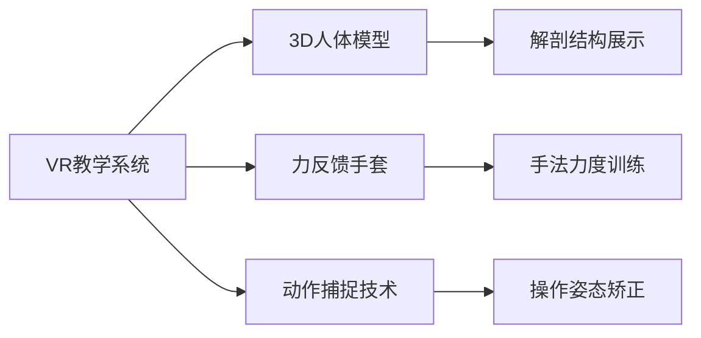

# 中医推拿技术培训与认证体系 (Tuina Massage Training & Certification System)

> 🎓 **专业人才培养**: 本文档构建系统化的中医推拿人才培养体系，涵盖从基础教育到高级研修的完整培训路径，建立科学的资质认证标准，确保推拿从业人员具备扎实的理论基础和精湛的实践技能。

## 教育培训体系架构 (Education & Training System Architecture)

### 分层培训体系设计 (Hierarchical Training System Design)

#### 基础教育层级 (Foundation Education Level)
##### 中等职业教育阶段
| 培养层次 | 学制要求 | 核心课程 | 实践要求 | 就业方向 |
| :--- | :--- | :--- | :--- | :--- |
| **中专层次** | 3年全日制 | 中医基础、推拿手法、解剖学 | 临床实习8个月 | SPA中心、养生馆 |
| **大专层次** | 3年全日制 | 中医理论、经络腧穴、诊断学 | 临床实习10个月 | 康复中心、社区卫生 |
| **本科层次** | 4年全日制 | 中西医结合、科研方法、管理学 | 临床实习12个月 | 医院推拿科、教学机构 |

##### 核心课程体系设置
```
专业基础课程 (40%)
├── 中医基础理论 (8学分)
├── 中医诊断学 (6学分)
├── 中药学 (4学分)
├── 正常人体解剖学 (6学分)
├── 生理学 (4学分)
├── 病理学 (4学分)
└── 医学心理学 (2学分)

专业核心课程 (45%)
├── 推拿学基础 (8学分)
├── 推拿手法学 (10学分)
├── 经络腧穴学 (6学分)
├── 推拿治疗学 (8学分)
├── 中医内科学 (6学分)
├── 中医伤科学 (4学分)
└── 康复医学 (3学分)

实践技能课程 (15%)
├── 临床推拿实习 (8学分)
├── 社区实践 (3学分)
└── 毕业设计/论文 (4学分)
```

#### 继续教育体系 (Continuing Education System)
##### 职业发展进阶路径
| 发展阶段 | 能力要求 | 培训内容 | 认证标准 | 职业前景 |
| :--- | :--- | :--- | :--- | :--- |
| **初级技师** (0-2年) | 掌握基础手法 | 基础理论强化+技能提升 | 国家职业资格四级 | SPA技师、保健按摩师 |
| **中级技师** (2-5年) | 熟练临床应用 | 专科疾病治疗+案例分析 | 国家职业资格三级 | 推拿治疗师、康复师 |
| **高级技师** (5-10年) | 专家级技术水平 | 疑难病症处理+技术创新 | 国家职业资格二级 | 高级推拿师、技术主管 |
| **专家级** (10年以上) | 学科带头人 | 理论研究+教学指导 | 国家职业资格一级 | 学科主任、教授级专家 |

##### 专项技能培训模块
###### 疼痛治疗专业方向
| 培训模块 | 培训内容 | 学时安排 | 考核方式 | 证书颁发 |
| :--- | :--- | :--- | :--- | :--- |
| **脊柱推拿治疗** | 颈椎、胸椎、腰椎手法 | 40学时 | 理论考试+实操考核 | 专项技能证书 |
| **关节疾病推拿** | 肩周炎、膝关节炎等 | 32学时 | 病例分析+手法演示 | 专业资格认证 |
| **软组织损伤** | 肌肉拉伤、韧带扭伤 | 24学时 | 实际操作+效果评估 | 技能等级证书 |

###### 儿科推拿专业方向
| 培训内容 | 教学重点 | 实践要求 | 适用人群 | 就业领域 |
| :--- | :--- | :--- | :--- | :--- |
| **小儿推拿基础** | 儿童生理特点、手法特色 | 模拟练习+临床观摩 | 0-12岁儿童 | 儿童医院、儿科诊所 |
| **常见病治疗** | 发热、咳嗽、腹泻等 | 真实病例处理 | 家长陪护下操作 | 儿童保健机构 |
| **生长发育调理** | 体质改善、增高助长 | 长期跟踪指导 | 健康儿童预防 | 儿童养生中心 |

### 数字化培训平台建设 (Digital Training Platform Construction)

#### 虚拟仿真教学系统
##### VR/AR技术应用


##### 智能化学习管理系统(LMS)
| 系统功能 | 技术特点 | 应用场景 | 学习效果 |
| :--- | :--- | :--- | :--- |
| **个性化学习路径** | AI算法推荐 | 根据基础水平定制 | 学习效率提升40% |
| **实时技能评估** | 传感器数据采集 | 操作过程全程监控 | 技能掌握度量化 |
| **互动式案例教学** | 虚拟病人系统 | 真实病例模拟演练 | 临床思维培养 |
| **远程协作学习** | 视频会议+共享白板 | 师生异地实时互动 | 教学资源共享 |

#### 在线培训资源库
##### 多媒体教学资源整合
| 资源类型 | 内容构成 | 更新频率 | 使用方式 |
| :--- | :--- | :--- | :--- |
| **视频教程** | 标准手法演示、临床案例 | 每季度更新 | 在线观看+下载 |
| **图文资料** | 理论讲解、操作要点 | 每月更新 | 阅读学习+打印参考 |
| **音频课程** | 经络讲解、功法指导 | 每月更新 | 随时收听+复习巩固 |
| **交互课件** | 自测练习、模拟考试 | 实时更新 | 在线测试+成绩分析 |

## 资质认证体系 (Qualification Certification System)

### 国家职业标准对接 (National Occupational Standards Alignment)

#### 职业技能等级标准
##### 四级/中级工(推拿按摩师)
**基本要求**:
- 掌握中医基础理论和推拿基本知识
- 熟练运用15种以上基本推拿手法
- 能够处理常见亚健康问题和轻微疾病
- 具备基本的安全防护和应急处理能力

**技能要求**:
| 工作领域 | 技能要点 | 考核标准 | 合格标准 |
| :--- | :--- | :--- | :--- |
| **手法操作** | 力度控制、节奏把握 | 手法规范性评分≥80分 | 操作流畅、无失误 |
| **病症处理** | 适应症识别、禁忌症规避 | 病例分析正确率≥85% | 诊断准确、方案合理 |
| **沟通服务** | 客户交流、健康指导 | 服务满意度≥4.0分 | 态度友善、解释清楚 |

##### 三级/高级工(推拿治疗师)
**基本要求**:
- 精通中医理论体系和经络腧穴知识
- 熟练掌握复合手法和专科治疗技术
- 具备独立处理常见疾病的临床能力
- 掌握推拿治疗的科研和教学基本方法

**技能要求**:
| 专业能力 | 具体标准 | 评估方式 | 认证要求 |
| :--- | :--- | :--- | :--- |
| **临床诊疗** | 独立接诊、辨证施治 | 病例考核+实际操作 | 治疗有效率≥80% |
| **技术创新** | 手法改良、疗效提升 | 技术答辩+成果展示 | 具备创新思维 |
| **团队协作** | 带教指导、科室管理 | 同行评议+业绩考核 | 领导能力认可 |

### 行业协会认证体系 (Industry Association Certification System)

#### 专业化认证项目
##### 中华中医药学会推拿分会认证
| 认证类型 | 申请条件 | 认证流程 | 有效期 |
| :--- | :--- | :--- | :--- |
| **注册推拿师** | 中专以上学历+1年实践 | 资格审查→理论考试→实操考核 | 3年 |
| **专业推拿师** | 大专以上学历+3年经验 | 综合评审→论文答辩→临床考核 | 5年 |
| **资深推拿师** | 本科以上学历+8年经验 | 专家评审→学术成果→影响力评估 | 终身 |

##### 国际认证体系对接
| 国际组织 | 认证项目 | 互认标准 | 申请途径 |
| :--- | :--- | :--- | :--- |
| **世界中医药学会联合会** | 国际中医推拿师 | 学历+经验+外语能力 | WFASO统一考试 |
| **国际传统医学协会** | 注册按摩治疗师 | 基础理论+实践技能 | ITEC标准考核 |
| **亚太传统医学会** | 亚洲推拿专家 | 专业技术+研究成果 | 区域认证互认 |

### 质量保证与监督机制 (Quality Assurance & Supervision Mechanism)

#### 认证质量控制体系
##### 考核评价标准体系
| 评价维度 | 评价指标 | 权重分配 | 评分标准 |
| :--- | :--- | :--- | :--- |
| **理论知识** | 中医基础、诊断学 | 30% | 笔试成绩≥75分 |
| **操作技能** | 手法规范、力度控制 | 40% | 实操评分≥80分 |
| **临床能力** | 病例分析、治疗效果 | 20% | 病例考核≥70分 |
| **职业素养** | 医德医风、服务态度 | 10% | 综合评议≥85分 |

##### 持续质量改进机制
```
质量监控循环:
认证前准备 → 考核实施 → 结果分析 → 问题反馈 → 改进措施 → 标准更新
```

#### 认证监督管理制度
##### 动态监管机制
| 监管内容 | 监管方式 | 监管频率 | 处理措施 |
| :--- | :--- | :--- | :--- |
| **执业行为** | 现场检查+投诉受理 | 年度例行检查 | 警告、暂停、撤销资格 |
| **继续教育** | 学分记录核查 | 每两年一次 | 补修要求、不予续证 |
| **技术更新** | 新技术掌握情况 | 不定期抽查 | 培训要求、能力评估 |
| **职业道德** | 诚信记录查询 | 实时监控 | 信用惩戒、行业禁入 |

## 国际化人才培养 (International Talent Development)

### 海外市场人才需求分析 (Overseas Market Talent Demand Analysis)

#### 不同地区人才标准对比
| 地区市场 | 需求特点 | 能力要求 | 培养重点 |
| :--- | :--- | :--- | :--- |
| **欧美发达国家** | 注重循证医学、规范化操作 | 英语能力+现代医学知识 | 国际标准接轨 |
| **东南亚地区** | 传统文化认同、实用性强 | 本土化适应能力 | 文化融合教学 |
| **中东地区** | 宗教文化敏感、性别要求 | 跨文化沟通能力 | 宗教文化培训 |
| **非洲地区** | 基础设施薄弱、需求多样 | 适应性强、综合能力 | 实用技能培训 |

#### 国际化课程体系设计
##### 双语教学模式
| 课程模块 | 中文内容 | 英文内容 | 教学比重 |
| :--- | :--- | :--- | :--- |
| **理论基础** | 中医经典理论 | 现代医学解释 | 6:4 |
| **技术操作** | 传统手法演示 | 国际标准说明 | 7:3 |
| **临床应用** | 病例中文分析 | 英文病历书写 | 5:5 |
| **学术交流** | 中文学术写作 | 英文论文发表 | 4:6 |

##### 跨文化能力培养
| 能力维度 | 培养目标 | 实施方式 | 评估标准 |
| :--- | :--- | :--- | :--- |
| **语言沟通** | 专业英语流利 | 双语授课+外教授课 | 托福/雅思成绩 |
| **文化理解** | 了解目标文化 | 文化体验+实地考察 | 跨文化适应性测试 |
| **法律合规** | 熟悉当地法规 | 法律讲座+案例分析 | 合规知识考核 |
| **商业意识** | 国际市场认知 | 商学院合作+企业实习 | 商业计划书评估 |

### 海外实习与就业支持 (Overseas Internship & Employment Support)

#### 国际合作办学项目
##### 海外实训基地建设
| 合作国家 | 合作机构 | 实训内容 | 时间安排 |
| :--- | :--- | :--- | :--- |
| **泰国** | 泰式按摩学院 | 传统泰式按摩技法 | 3个月轮训 |
| **日本** | 柔道整复专门学校 | 日式指压技术 | 2个月深度学习 |
| **德国** | 自然疗法中心 | 欧式按摩结合 | 4个月综合实训 |
| **美国** | 整脊医学院 | 脊柱矫正技术 | 6个月临床实习 |

##### 海外就业指导服务
| 服务内容 | 实施方式 | 目标群体 | 服务效果 |
| :--- | :--- | :--- | :--- |
| **职业规划咨询** | 一对一指导 | 毕业生群体 | 就业率提升25% |
| **海外机构对接** | 校企合作平台 | 有出国意愿学生 | 海外就业机会增加 |
| **签证办理协助** | 专业代理服务 | 获得海外offer学生 | 签证通过率95%以上 |
| **文化适应培训** | 行前集训营 | 即将出国人员 | 文化冲突减少60% |

通过建立完善的教育培训和认证体系，为中医推拿事业培养高素质的专业人才，推动这一传统医学瑰宝在全球范围内的传承与发展。