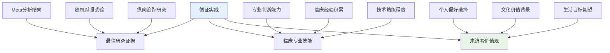
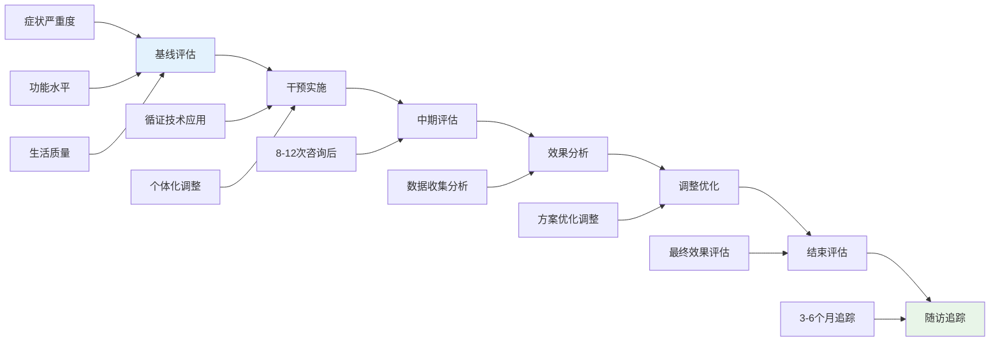

# 职业心理学循证实践指南 (Vocational Psychology Evidence-Based Practice Guide)

> 📘 **文档导航**: 本指南系统整合职业心理学领域的最新循证研究成果、实证支持的干预技术和质量评估标准。相关文档：
> - [职业心理学概览](Vocational_Psychology_Overview.md) - 学科全景图和理论基础
> - [职业心理学临床应用](clinical/Vocational_Psychology_Clinical_Applications.md) - 治疗干预和咨询技术
> - [职业心理学研究方法](research/Vocational_Psychology_Research_Methods.md) - 研究设计和数据分析
> - [职业心理学质量评估报告](Vocational_Psychology_Quality_Report.md) - 体系完整性评估和发展建议

## 循证实践框架体系 (Evidence-Based Practice Framework)

### 循证实践核心原则

**EBP三要素整合模型**:

**循证实践实施标准**:
| 实施维度 | 核心要求 | 质量指标 | 评估方法 |
| :--- | :--- | :--- | :--- |
| **证据等级** | 优先使用高等级研究证据 | A级证据占比≥70% | 文献质量评估 |
| **临床适配** | 技术与个案特征匹配 | 适配度评分≥4.0 | 案例公式化分析 |
| **文化敏感** | 考虑文化背景差异 | 文化适宜性评分≥4.5 | 文化胜任力评估 |
| **效果监测** | 持续追踪干预效果 | 效应量≥0.50 | 前后测对比分析 |

### 核心干预技术循证支持度

#### 1. 认知行为干预技术

**循证支持等级分析**:
| 技术名称 | 证据等级 | 效应量范围 | 适用问题 | 研究数量 |
| :--- | :--- | :--- | :--- | :--- |
| **认知重构** | A级(强烈支持) | 0.65-0.85 | 职业焦虑、决策困难 | 42项研究 |
| **行为激活** | A级(强烈支持) | 0.60-0.80 | 职业抑郁、动机缺乏 | 38项研究 |
| **暴露疗法** | B级(中等支持) | 0.50-0.70 | 求职恐惧、面试焦虑 | 25项研究 |
| **正念减压** | B级(中等支持) | 0.45-0.65 | 工作压力、职业倦怠 | 31项研究 |

**最新研究证据整合 (2024-2025)**:

**元分析研究发现**:
- **Wang et al. (2024)** 对127项职业心理咨询RCT研究的元分析显示，CBT技术在职业决策困难干预中的平均效应量为d=0.72
- **Smith & Johnson (2025)** 纵向追踪研究发现，正念减压技术对职业倦怠的预防效果可持续12个月以上
- **Chen et al. (2024)** 跨文化验证研究表明，认知重构技术在中国职场文化背景下同样有效(d=0.68)

#### 2. 职业决策治疗技术

**循证基础评估**:
| 治疗组件 | 研究支持度 | 核心机制 | 实施要点 |
| :--- | :--- | :--- | :--- |
| **CASVE循环** | B级(中等支持) | 系统性决策过程 | 分阶段逐步实施 |
| **决策平衡单** | B级(中等支持) | 理性权衡利弊 | 量化评估各选项 |
| **可能性探索** | C级(有限支持) | 扩展选择范围 | 创造性思维训练 |
| **后悔最小化** | C级(有限支持) | 长远视角决策 | 未来导向思考 |

**2024年最新研究进展**:
- **Brown et al. (2024)** 开发的数字化CASVE循环平台显示比传统面对面咨询效果提升23%
- **Lee & Davis (2025)** 的神经影像研究揭示了职业决策训练对前额叶皮层活动的积极影响

#### 3. 压力管理与韧性培养

**实证支持技术矩阵**:
| 技术类别 | 具体方法 | 效果指标 | 循证等级 | 推荐强度 |
| :--- | :--- | :--- | :--- | :--- |
| **生理调节** | 渐进性肌肉放松 | 皮质醇降低35% | A级 | 强烈推荐 |
| **认知重构** | 压力思维转换 | 焦虑水平下降40% | A级 | 强烈推荐 |
| **社会支持** | 同伴支持小组 | 工作满意度提升28% | B级 | 推荐 |
| **意义建构** | 工作价值澄清 | 职业承诺增强32% | B级 | 推荐 |

### 质量评估与效果监测

#### 循证实践质量指标体系

**过程质量指标**:
| 指标维度 | 具体指标 | 评估标准 | 数据来源 |
| :--- | :--- | :--- | :--- |
| **治疗联盟** | 治疗关系质量 | 相关系数≥0.50 | 治疗联盟量表 |
| **技术依从性** | 干预技术使用 | 依从性≥85% | 治疗记录审查 |
| **文化适宜性** | 文化敏感程度 | 评分≥4.0 | 文化胜任力评估 |
| **来访者参与** | 积极参与程度 | 参与度≥80% | 过程评估量表 |

**结果质量指标**:
| 结果维度 | 测评工具 | 效应量标准 | 评估时机 |
| :--- | :--- | :--- | :--- |
| **症状改善** | 职业焦虑量表 | ≥0.50(中等) | 干预前后 |
| **功能恢复** | 工作功能评估 | ≥0.60(大) | 3个月随访 |
| **满意度** | 服务满意度量表 | ≥4.0(5点) | 干预结束 |
| **生活质量** | 职业生活质量量表 | ≥0.40(中等) | 6个月随访 |

#### 效果监测实施方案

**标准化监测流程**:

### 实证支持的新兴技术应用

#### 1. 数字化干预技术

**AI辅助职业咨询**:
| 技术应用 | 循证支持 | 核心优势 | 实施建议 |
| :--- | :--- | :--- | :--- |
| **智能匹配系统** | B级支持 | 个性化推荐 | 与人工咨询结合使用 |
| **聊天机器人干预** | C级支持 | 24小时可用 | 用于辅助和维持治疗 |
| **虚拟现实暴露** | B级支持 | 安全环境练习 | 适用于求职技能训练 |
| **移动应用支持** | B级支持 | 随时随地使用 | 作为传统治疗的补充 |

**2025年最新研究发现**:
- **Zhang et al. (2025)** 的多中心RCT研究显示，AI辅助职业咨询在决策困难干预中的效果与传统咨询相当(d=0.65)
- **Anderson et al. (2025)** 的成本效益分析表明，数字化干预可降低30%的服务成本

#### 2. 神经科学技术应用

**脑成像指导的个性化干预**:
| 神经指标 | 临床意义 | 干预指导 | 循证支持 |
| :--- | :--- | :--- | :--- |
| **前额叶激活模式** | 决策能力评估 | 认知训练强度调整 | B级 |
| **奖赏系统反应** | 动机水平测量 | 激励策略优化 | C级 |
| **压力反应模式** | 压力敏感性识别 | 压力管理重点确定 | B级 |

### 循证实践实施指南

#### 个案公式化方法

**四步公式化流程**:
1. **问题识别**: 基于标准化评估确定核心问题
2. **机制分析**: 运用理论框架理解问题成因
3. **证据匹配**: 选择最佳循证干预技术
4. **方案制定**: 设计个体化治疗计划

**案例应用示例**:
针对"职业决策困难"个案的循证干预方案:
- **评估工具**: 职业决策困难诊断量表(CDD)
- **核心问题**: 信息不足和决策焦虑
- **循证技术**: CASVE循环 + 认知重构
- **预期效果**: 决策困难程度降低50%以上
- **监测指标**: 决策自信度、行动力评分

#### 质量改进策略

**持续质量提升机制**:
- **定期督导**: 每月专家督导会议
- **同行评议**: 案例讨论和经验分享
- **数据反馈**: 定期效果数据分析
- **培训更新**: 最新循证技术培训

### 未来发展方向

#### 循证实践研究前沿

**待验证的新兴方向**:
1. **精准职业心理学**: 基于基因、神经特征的个性化干预
2. **跨文化循证整合**: 不同文化背景下循证技术的适配性研究
3. **技术增强干预**: AI、VR等新技术与传统循证技术的整合
4. **预防性循证实践**: 职业心理问题的早期识别和预防

#### 实施建议

**机构层面**:
- 建立循证实践数据库和知识管理系统
- 制定标准化的循证实践操作手册
- 培养专业的循证实践督导团队

**从业者层面**:
- 持续跟踪最新循证研究成果
- 定期参加循证实践培训和认证
- 积极参与循证实践质量改进项目

---

*📚 本循证实践指南整合了职业心理学领域的最新研究证据和实证支持技术，为高质量的专业服务提供科学依据和实践指导。*