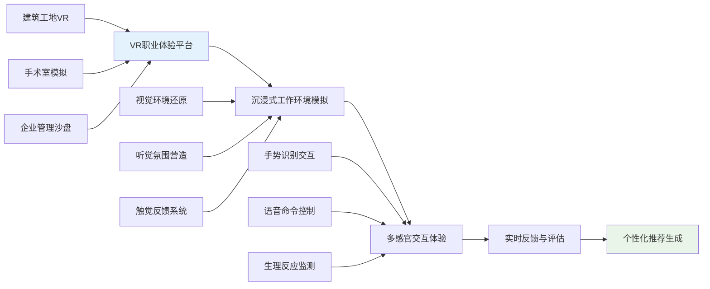

# 职业心理学前沿发展与未来趋势 (Vocational Psychology Frontiers & Future Trends)

> 📘 **文档导航**: 本指南探讨职业心理学领域的前沿研究、新兴技术和未来发展方向。相关文档：
> - [职业心理学研究方法](../research/Vocational_Psychology_Research_Methods.md) - 研究设计和数据分析
> - [职业心理学细分领域](../specialized/Vocational_Psychology_Specialized_Areas.md) - 特定职业群体和行业应用
> - [职业心理学质量评估报告](../Vocational_Psychology_Quality_Report.md) - 体系完整性评估和发展建议

## 前沿研究领域 (Frontier Research Areas)

### 1. 神经科学与职业决策

**脑成像研究进展**:

**研究发现与应用**:
| 研究领域 | 核心发现 | 实践应用 | 发展前景 |
| :--- | :--- | :--- | :--- |
| **奖赏系统研究** | 职业选择激活腹侧纹状体等奖赏脑区 | 个性化职业推荐系统 | 精准匹配算法优化 |
| **风险处理机制** | 不同风险偏好激活不同神经网络 | 决策风格评估工具 | 神经反馈训练 |
| **不确定性容忍** | 高不确定容忍者前额叶皮层活动更强 | 适应性职业指导 | 认知训练程序 |

### 2. 人工智能与职业心理学

**AI在职业评估中的应用**:
| 应用领域 | 技术方法 | 核心优势 | 挑战与限制 |
| :--- | :--- | :--- | :--- |
| **智能匹配系统** | 机器学习算法、自然语言处理 | 大规模数据处理、个性化推荐 | 算法偏见、解释性不足 |
| **虚拟面试官** | 语音识别、情感计算、行为分析 | 标准化评估、24小时可用 | 文化敏感性、技术接受度 |
| **职业发展预测** | 深度学习、时间序列分析 | 趋势预测、路径规划 | 数据质量、隐私保护 |
| **心理健康监测** | 可穿戴设备、行为模式识别 | 实时监测、早期预警 | 误报率、用户依从性 |

**伦理考量与治理框架**:
- **算法公平性**: 确保AI系统不产生基于性别、年龄、种族的偏见
- **透明度要求**: 提供算法决策的可解释性说明
- **隐私保护**: 建立严格的数据收集和使用规范
- **人类监督**: 保持专业人士在关键决策中的主导地位

### 3. 跨文化职业心理学

**全球化背景下的文化适应**:
| 文化维度 | 东西方差异 | 适应策略 | 研究意义 |
| :--- | :--- | :--- | :--- |
| **个体vs集体** | 西方强调个人成就，东方重视团队和谐 | 平衡个人发展与集体利益 | 国际团队管理优化 |
| **权力距离** | 东方接受等级差异，西方追求平等沟通 | 建立包容性沟通模式 | 跨文化冲突预防 |
| **不确定性规避** | 东方风险规避倾向强，西方更愿意承担风险 | 提供渐进式变革方案 | 组织变革管理改进 |
| **长期vs短期导向** | 东方注重长远规划，西方关注短期收益 | 整合不同时间视角 | 战略规划方法创新 |

**多元文化职场研究**:
- **文化智力**(Cultural Intelligence)对跨文化工作适应的影响
- **包容性领导**在多元化团队中的作用机制
- **文化适应策略**对职业成功的影响路径
- **语言多样性**对工作绩效和创新的影响

### 4. 可持续发展职业心理学

**绿色职业心理健康研究**:
| 研究主题 | 核心内容 | 实践价值 | 未来方向 |
| :--- | :--- | :--- | :--- |
| **环保使命感** | 环境价值观对职业满意度的影响 | 提升绿色职业吸引力 | 使命感测量工具开发 |
| **可持续发展压力** | 环境焦虑对工作表现的影响 | 压力管理策略设计 | 心理韧性培养方案 |
| **社会责任认同** | CSR参与对企业员工心理的影响 | 组织文化建设指导 | 认同感增强技术 |
| **生态焦虑应对** | 气候变化焦虑的职业心理干预 | 心理健康促进措施 | 适应性干预模式 |

## 新兴技术应用 (Emerging Technology Applications)

### 1. 虚拟现实职业体验

**VR职业探索系统**:

**技术优势与挑战**:
- **优势**: 安全的试错环境、真实的感官体验、标准化的评估条件
- **挑战**: 设备成本较高、技术普及度有限、晕动症等副作用

### 2. 大数据分析职业行为

**职业行为数据挖掘**:
| 数据来源 | 分析维度 | 应用场景 | 隐私保护 |
| :--- | :--- | :--- | :--- |
| **招聘网站数据** | 求职行为模式、技能需求变化 | 人才市场趋势预测 | 数据匿名化处理 |
| **社交媒体数据** | 职业兴趣表达、网络关系结构 | 个人品牌建设指导 | 用户授权获取 |
| **企业人事数据** | 员工流动模式、绩效影响因素 | 人才保留策略优化 | 内部数据治理 |
| **政府统计数据** | 劳动力市场结构、行业发展趋势 | 政策制定参考依据 | 公开数据使用 |

### 3. 生物反馈技术应用

**生理指标职业监测**:
- **压力水平实时监测**: 通过心率变异性、皮肤电反应等指标评估工作压力
- **注意力状态检测**: 利用脑电图监测专注力水平和认知负荷
- **情绪状态识别**: 通过面部表情识别和语音情感分析评估情绪状态
- **疲劳程度评估**: 结合眼动追踪和反应时测量判断疲劳水平

## 未来发展趋势 (Future Development Trends)

### 1. 个性化职业心理健康服务

**精准职业心理干预**:

**发展趋势特征**:
- **预防导向**: 从治疗转向预防，提前识别职业心理风险
- **精准匹配**: 基于个体特征提供定制化的干预方案
- **实时监测**: 利用可穿戴设备进行持续的心理状态跟踪
- **微干预**: 通过短时高频的干预技术维持心理健康

### 2. 终身学习与技能发展

**学习型组织建设**:
| 发展阶段 | 核心特征 | 支持技术 | 实施策略 |
| :--- | :--- | :--- | :--- |
| **被动学习** | 强制性培训、统一内容 | 传统课堂、在线课程 | 制定学习计划、考核评估 |
| **主动学习** | 自主选择、个性化路径 | 微学习平台、移动学习 | 激发动机、提供选择 |
| **协作学习** | 团队共创、知识共享 | 社交学习平台、虚拟社区 | 建立学习社群、促进交流 |
| **自适应学习** | AI驱动、实时调整 | 智能推荐、学习分析 | 个性化路径、动态优化 |

### 3. 工作-生活整合新模式

**未来工作模式演变**:
- **混合办公常态化**: 远程与现场工作有机结合成为主流
- **项目制工作普及**: 基于项目的灵活就业模式增加
- **技能银行制度**: 个人技能资产化，实现跨组织流动
- **四天工作制探索**: 工作时间压缩与效率提升并行

**心理适应挑战**:
- **边界模糊管理**: 如何在工作与生活间建立健康边界
- **孤独感应对**: 远程工作带来的社交隔离问题
- **身份认同重构**: 多重角色下的自我概念整合
- **意义感维持**: 非传统工作模式下的成就感获得

### 4. 社会责任与职业伦理

**职业心理学的社会使命**:
| 责任领域 | 具体内容 | 实践路径 | 价值创造 |
| :--- | :--- | :--- | :--- |
| **促进就业公平** | 消除就业歧视、保障机会平等 | 政策倡导、标准制定 | 社会公正推进 |
| **提升工作福祉** | 改善工作条件、促进心理健康 | 组织咨询、员工援助 | 人文关怀体现 |
| **支持弱势群体** | 关注残疾人、农民工等特殊群体 | 专项服务、能力建设 | 社会包容增强 |
| **推动可持续发展** | 培养环保意识、支持绿色就业 | 教育宣传、研究创新 | 生态文明建设 |

## 创新研究方法 (Innovative Research Methods)

### 1. 混合方法研究设计

**定量质性整合**:
- **序贯解释设计**: 先进行定量调查，再通过质性研究解释结果
- **序贯探索设计**: 先开展质性探索，再进行大规模量化验证
- **并行三角设计**: 同时收集定量和质性数据，相互验证补充
- **嵌入式设计**: 在主要研究方法中嵌入次要方法作为补充

### 2. 纵向追踪研究

**生涯发展追踪**:
- **密集追踪设计**: 短期内频繁测量，捕捉动态变化过程
- **间歇追踪设计**: 长时间间隔测量，观察长期发展趋势
- **多世代追踪**: 跨越几代人的职业发展模式研究
- **关键节点追踪**: 重点关注职业转换等关键事件的影响

### 3. 大规模在线实验

**数字实验平台**:
- **A/B测试**: 在真实工作环境中测试不同干预措施的效果
- **自然实验**: 利用政策变化或突发事件作为准实验条件
- **模拟实验**: 通过虚拟环境研究职业行为和决策过程
- **田野实验**: 在实际工作场所进行受控实验研究

## 教育培训发展 (Education & Training Development)

### 1. 专业人才培养体系

**学位教育创新**:
- **跨学科课程设计**: 整合心理学、管理学、数据科学等多学科知识
- **实践导向教学**: 增加实习实训、案例分析等实践环节
- **技术技能培养**: 加强数据分析、AI应用等新兴技术能力
- **国际视野拓展**: 开展海外交流、国际合作项目

### 2. 继续教育模式

**终身学习支持**:
- **微证书制度**: 针对特定技能的小型认证项目
- **在线学习平台**: 灵活便捷的专业发展资源
- **同行学习网络**: 专业人士间的经验分享和互助学习
- **导师指导计划**: 资深专家对新人的职业发展指导

### 3. 实践能力提升

**技能发展重点**:
- **数字化素养**: 适应数字时代的职业心理学实践需求
- **跨文化能力**: 在全球化背景下的多元文化服务能力
- **创新思维**: 面对新挑战的创造性解决方案能力
- **伦理决策**: 复杂情境下的专业伦理判断能力

## 政策建议与发展展望 (Policy Recommendations & Development Prospects)

### 1. 制度环境优化

**政策支持建议**:
- **职业心理健康立法**: 建立职业心理健康的法律保障体系
- **行业标准制定**: 完善职业心理学服务的行业规范和质量标准
- **人才培养投入**: 增加对职业心理学教育和研究的资金支持
- **国际合作推进**: 加强与其他国家和地区的职业心理学交流合作

### 2. 社会认知提升

**公众教育推广**:
- **科普宣传**: 提高社会对职业心理学的认知和接受度
- **媒体合作**: 通过各种媒体平台传播职业心理健康知识
- **企业参与**: 鼓励企业重视员工职业心理健康投资
- **社区服务**: 在社区层面提供职业心理支持服务

### 3. 技术标准建立

**质量控制体系**:
- **技术准入标准**: 建立AI、大数据等新技术应用的准入门槛
- **数据安全规范**: 制定职业心理数据收集和使用的安全标准
- **效果评估体系**: 建立科学的干预效果评价和质量监控机制
- **伦理审查制度**: 完善新技术应用的伦理审查和监督机制

## 总结与展望 (Conclusion & Outlook)

职业心理学作为一门应用性很强的心理学分支，正面临着前所未有的发展机遇和挑战。随着技术进步、社会变迁和全球化发展，这一领域呈现出以下主要趋势：

**技术融合深化**: AI、大数据、VR等新兴技术与传统职业心理学理论方法深度融合，推动服务模式创新和效率提升。

**个性化服务兴起**: 基于个体差异的精准化、定制化职业心理服务将成为主流发展方向。

**全球化视野拓展**: 跨文化、跨国界的职业心理学研究和服务需求日益增长。

**社会责任增强**: 职业心理学在促进社会公平、提升民生福祉方面的使命更加凸显。

面向未来，职业心理学需要在保持专业性的同时，积极拥抱变化、创新发展，为个体的职业幸福和社会的和谐发展贡献更大的力量。

---

*📚 本文档旨在把握职业心理学发展的前沿动态和未来趋势，为学科建设和实践应用提供前瞻性的指导和参考。*