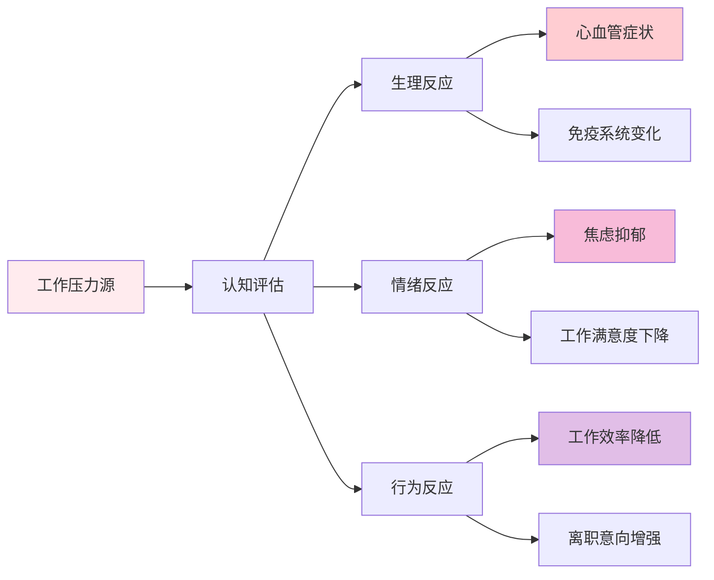

# 职业心理学专业体系概览 (Vocational Psychology Professional System Overview)

> 📘 **文档导航**: 本指南系统阐述职业心理学的核心理论、评估工具、临床应用和研究方法。相关文档：
> - [职业心理学理论基础](theory/Vocational_Psychology_Theory_Framework.md) - 理论体系、核心概念、发展模型
> - [职业心理学评估工具](assessment/Vocational_Psychology_Assessment_Tools.md) - 测量标准、评估量表、诊断方法
> - [职业心理学临床应用](clinical/Vocational_Psychology_Clinical_Applications.md) - 治疗干预、咨询技术、危机管理
> - [职业心理学研究方法](research/Vocational_Psychology_Research_Methods.md) - 研究设计、数据分析、质量控制
> - [职业心理学细分领域](specialized/Vocational_Psychology_Specialized_Areas.md) - 特定职业群体、行业应用、新兴领域

## 职业心理学全景图 (Vocational Psychology Panorama)

### 核心概念定义与学科定位

职业心理学(Vocational Psychology)是心理学的一个重要分支，专注于研究个体与职业环境之间的相互作用关系，探讨职业选择、职业发展、工作满意度、职业适应等核心议题。该学科整合了心理学、教育学、管理学、社会学等多学科理论，为个人职业发展和组织人力资源管理提供科学指导。

**学科核心特征**:
- **应用导向**: 强调理论与实践的紧密结合
- **发展视角**: 关注职业生涯的动态发展过程
- **系统思维**: 考虑个体、组织、社会多层次因素
- **循证基础**: 基于科学研究和实证数据

### 理论基础与核心框架

#### 1. 职业发展理论体系

**经典理论模型**:

#### 2. 职业适应与匹配模型

**人职匹配理论框架**:
| 匹配维度 | 理论基础 | 核心要素 | 测评工具 | 应用价值 |
| :--- | :--- | :--- | :--- | :--- |
| **兴趣匹配** | Holland理论 | RIASEC六边形模型 | Holland职业兴趣量表 | 职业选择指导 |
| **能力匹配** | 特质因素理论 | 能力倾向分析 | 能力倾向测验 | 岗位胜任力评估 |
| **价值观匹配** | Super理论 | 工作价值观澄清 | 工作价值观量表 | 职业满意度预测 |
| **人格匹配** | 大五人格理论 | 人格特质分析 | NEO-PI-R量表 | 组织文化适应 |

### 职业心理学核心领域 (Core Domains)

#### 1. 职业选择与决策心理学
**决策过程模型**:
- **信息搜集阶段**: 职业信息获取、市场调研
- **评价比较阶段**: 方案评估、利弊分析
- **选择执行阶段**: 决策实施、行动计划
- **反馈调整阶段**: 结果评估、策略修正

**影响因素分析**:
| 因素类别 | 具体因素 | 影响机制 | 干预策略 |
| :--- | :--- | :--- | :--- |
| **个体内在因素** | 兴趣、能力、价值观、人格 | 自我认知与职业匹配 | 自我探索训练 |
| **环境外在因素** | 家庭期望、社会文化、经济状况 | 外部约束与机遇 | 环境适应指导 |
| **认知加工因素** | 决策风格、信息处理方式 | 决策质量与效率 | 认知技能提升 |
| **情感调节因素** | 决策焦虑、风险偏好 | 情绪稳定性 | 情绪管理训练 |

#### 2. 职业发展与转换心理学
**发展阶段理论**:
| 发展阶段 | 年龄范围 | 核心任务 | 心理特征 | 挑战与机遇 |
| :--- | :--- | :--- | :--- | :--- |
| **探索期** | 15-25岁 | 职业兴趣探索、技能培养 | 好奇心强、试错学习 | 职业方向不确定 |
| **建立期** | 25-45岁 | 职业能力提升、地位确立 | 责任感增强、竞争激烈 | 工作-生活平衡 |
| **维持期** | 45-65岁 | 技能更新、角色转换 | 经验丰富、创新动力下降 | 职业高原现象 |
| **衰退期** | 65岁以上 | 退休适应、经验传承 | 成就感满足、身体机能下降 | 退休生活规划 |

#### 3. 工作压力与职业倦怠心理学
**压力反应机制**:

**倦怠综合征维度**:
- **情感耗竭**: 情感资源枯竭、疲惫感
- **去人格化**: 对工作对象冷漠疏离
- **成就感降低**: 自我效能感下降、无力感

#### 4. 职业心理健康与幸福感
**心理健康指标体系**:
| 维度 | 具体指标 | 测评工具 | 干预重点 |
| :--- | :--- | :--- | :--- |
| **主观幸福感** | 生活满意度、积极情感 | SWLS、PANAS量表 | 积极心理建设 |
| **工作投入度** | 专注力、活力、奉献 | UWES工作投入量表 | 工作意义感培养 |
| **心理韧性** | 压力适应、挫折承受 | CD-RISC韧性量表 | 抗逆力训练 |
| **工作-生活平衡** | 时间分配、角色冲突 | WLI工作生活平衡量表 | 边界管理技能 |

### 职业心理学应用领域 (Application Areas)

#### 1. 组织与人力资源管理
**人才测评与发展**:
- 员工选拔与配置优化
- 领导力发展与继任规划
- 团队建设与冲突管理
- 绩效管理与激励机制

#### 2. 职业咨询与生涯指导
**个体咨询服务**:
- 职业兴趣与能力评估
- 求职技能与面试指导
- 职业转换与再就业支持
- 退休规划与生活转型

#### 3. 教育与培训领域
**生涯教育体系**:
- 职业启蒙教育
- 职业技能培训
- 创业教育指导
- 终身学习支持

#### 4. 特殊群体职业服务
**针对性服务**:
- 残疾人职业康复
- 军人职业转型
- 女性职业发展
- 青少年职业探索

### 职业心理学研究前沿 (Research Frontiers)

#### 新兴研究方向
1. **数字化职业心理学**: 人工智能、远程工作对职业行为的影响
2. **跨文化职业心理学**: 全球化背景下的职业价值观差异
3. **积极职业心理学**: 工作中的积极体验与幸福感提升
4. **可持续发展职业心理学**: 绿色职业、社会责任职业的心理特征

#### 技术方法创新
- 大数据分析在职业研究中的应用
- 虚拟现实技术的职业体验研究
- 神经科学技术的职业决策研究
- 移动设备的职业行为追踪

### 专业伦理与社会责任

#### 伦理原则框架
- **保密原则**: 保护当事人隐私信息
- **知情同意**: 确保服务对象充分了解
- **专业胜任**: 在能力范围内提供服务
- **公正公平**: 避免偏见和歧视
- **社会责任**: 促进社会公正和福祉

#### 质量标准要求
- 评估工具的信效度验证
- 干预方法的循证基础
- 服务质量的持续监控
- 专业发展的终身学习

---

*📚 本文档整合职业心理学核心理论与最新研究成果，为职业心理健康服务、人力资源管理和生涯发展指导提供全面的理论框架和实践指导。*