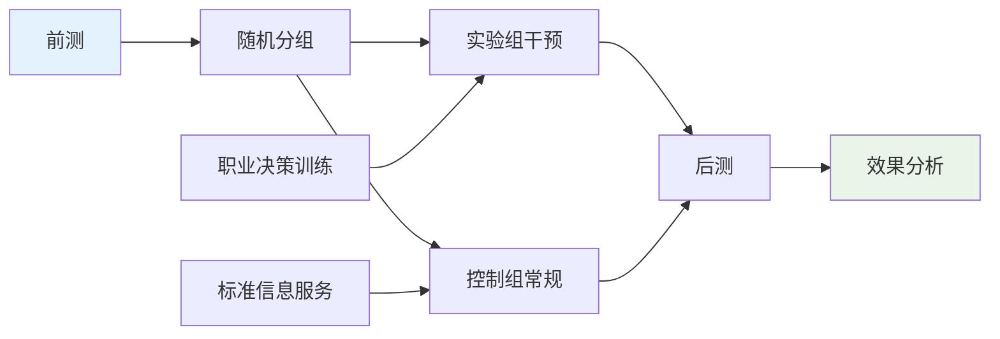
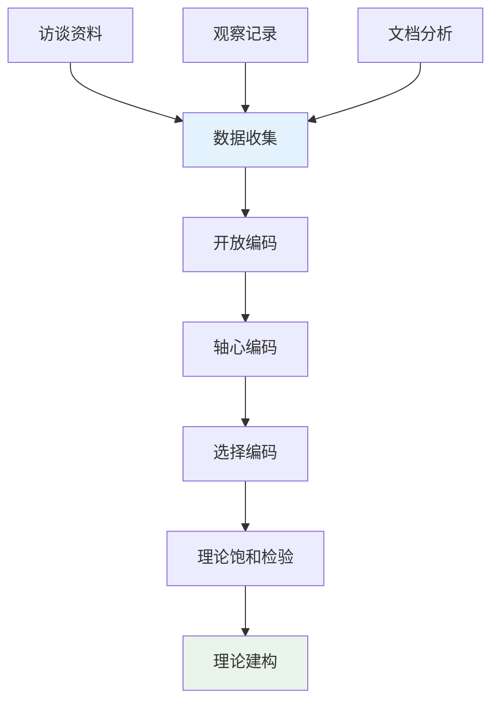

# 职业心理学研究方法与数据分析体系 (Vocational Psychology Research Methods & Data Analysis System)

> 📘 **文档导航**: 本指南系统阐述职业心理学研究的方法论体系、数据分析技术和质量控制标准。相关文档：
> - [职业心理学概览](../Vocational_Psychology_Overview.md) - 学科全景图和理论基础
> - [职业心理学理论框架](../theory/Vocational_Psychology_Theory_Framework.md) - 核心理论体系
> - [职业心理学评估工具](../assessment/Vocational_Psychology_Assessment_Tools.md) - 测量标准和评估方法
> - [职业心理学临床应用](../clinical/Vocational_Psychology_Clinical_Applications.md) - 治疗干预和咨询技术
> - [职业心理学前沿趋势](../Vocational_Psychology_Frontiers_Trends.md) - 新兴研究领域和技术应用

## 研究方法论体系 (Research Methodology System)

### 职业心理学研究范式

**多元化研究取向**:

**研究范式特征对比**:

| 研究范式 | 哲学基础 | 研究目标 | 数据特征 | 适用场景 |
| :--- | :--- | :--- | :--- | :--- |
| **实证主义** | 客观现实存在 | 验证因果关系 | 数值化、可测量 | 变量关系研究 |
| **诠释主义** | 主观意义建构 | 理解现象本质 | 描述性、情境化 | 深层理解研究 |
| **批判理论** | 社会结构批判 | 揭示权力关系 | 批判性、反思性 | 社会公正研究 |
| **实用主义** | 问题解决导向 | 解决实际问题 | 多元化、实用性 | 应用导向研究 |

### 核心研究设计类型

#### 1. 实验研究设计

**实验室实验设计**:
| 设计类型 | 特征描述 | 控制要点 | 内在效度 |
| :--- | :--- | :--- | :--- |
| **真实验设计** | 随机分组、控制组设置 | 随机化、双盲控制 | 高(因果推断强) |
| **准实验设计** | 无法随机分组 | 匹配控制、协变量 | 中(需谨慎解释) |
| **现场实验** | 自然环境中的实验 | 环境控制、伦理考虑 | 中(生态效度高) |

**职业干预实验示例**:

**实验质量控制要点**:
- **随机化**: 确保组间可比性
- **盲法**: 减少期望效应
- **控制变量**: 排除混淆因素
- **样本量**: 满足统计检验力要求

#### 2. 调查研究设计

**横断面调查设计**:
| 调查类型 | 设计特点 | 数据收集 | 分析方法 |
| :--- | :--- | :--- | :--- |
| **描述性调查** | 现状描述、特征分析 | 一次性数据收集 | 频数分析、描述统计 |
| **相关性调查** | 变量关系探索 | 同时测量多变量 | 相关分析、回归分析 |
| **预测性调查** | 未来趋势预测 | 历史数据分析 | 时间序列分析、预测模型 |

**纵向追踪设计**:
| 追踪类型 | 时间跨度 | 数据特点 | 分析挑战 |
| :--- | :--- | :--- | :--- |
| **短期追踪** | 6个月-2年 | 变化敏感性高 | 样本流失控制 |
| **中期追踪** | 2-5年 | 发展趋势明显 | 测量工具稳定性 |
| **长期追踪** | 5年以上 | 成熟发展模式 | 时代效应控制 |

#### 3. 质性研究设计

**现象学研究设计**:
| 研究阶段 | 核心任务 | 数据收集 | 分析方法 |
| :--- | :--- | :--- | :--- |
| **悬置判断** | 搁置先入为主观点 | 深度访谈、观察 | 意向性分析 |
| **现象描述** | 详述体验本质 | 参与式观察 | 水平化分析 |
| **意义阐释** | 揭示深层含义 | 焦点小组 | 结构化综合 |

**扎根理论研究流程**:

### 数据收集方法体系

#### 1. 问卷调查方法

**问卷设计原则**:
| 设计维度 | 具体要求 | 实施要点 | 质量保障 |
| :--- | :--- | :--- | :--- |
| **内容效度** | 题项覆盖理论构念 | 专家评议、预测试 | 内容专家审核 |
| **语言表达** | 清晰简洁、无歧义 | 通俗化表述、避免专业术语 | 认知访谈验证 |
| **结构安排** | 逻辑清晰、便于回答 | 分块组织、过渡自然 | 用户体验测试 |
| **长度控制** | 适度长度、避免疲劳 | 15-20分钟完成 | 时间预估验证 |

**在线调查技术优势**:
- **覆盖面广**: 突破地理限制，扩大样本规模
- **成本效益**: 降低数据收集成本，提高效率
- **实时监控**: 实时跟踪回收进度，及时调整策略
- **数据质量**: 自动逻辑检查，减少填答错误

#### 2. 深度访谈技术

**半结构化访谈设计**:
| 访谈要素 | 设计要点 | 实施技巧 | 质量控制 |
| :--- | :--- | :--- | :--- |
| **开场建立** | 营造信任氛围 | 自我介绍、说明目的 | 录音许可确认 |
| **核心探询** | 深入了解体验 | 开放式提问、追问技巧 | 话题引导控制 |
| **结束总结** | 确认理解准确 | 要点回顾、感谢参与 | 信息完整性核查 |

**访谈质量保障措施**:
- **访谈者培训**: 统一培训标准和技巧
- **录音转录**: 完整记录并准确转录
- **三角验证**: 多源数据交叉验证
- **反思日志**: 记录研究过程和主观感受

#### 3. 观察研究方法

**参与观察技术**:
| 观察类型 | 参与程度 | 数据特点 | 伦理考虑 |
| :--- | :--- | :--- | :--- |
| **完全观察** | 不参与活动 | 客观记录、外部视角 | 隐蔽性问题 |
| **作为观察者参与** | 轻度参与 | 平衡内外视角 | 身份披露时机 |
| **作为参与者观察** | 深度参与 | 内部视角、丰富细节 | 主观性控制 |

**行为编码系统设计**:
- **行为分类**: 建立清晰的行为类别体系
- **编码标准**: 制定详细的编码规则和示例
- **一致性检验**: 多名编码员间的一致性验证
- **可靠性分析**: 计算编码者间信度系数

### 数据分析技术体系

#### 1. 定量数据分析

**描述性统计分析**:
| 分析类型 | 统计量 | 适用场景 | 报告要点 |
| :--- | :--- | :--- | :--- |
| **集中趋势** | 均值、中位数、众数 | 数据分布特征描述 | 结合数据分布形态 |
| **离散程度** | 标准差、四分位距 | 变异程度衡量 | 考虑极端值影响 |
| **分布形状** | 偏度、峰度 | 正态性检验 | 选择合适统计方法 |

**推断统计分析**:
| 分析方法 | 适用条件 | 假设检验 | 效应量指标 |
| :--- | :--- | :--- | :--- |
| **t检验** | 两组均值比较 | 独立样本/配对样本 | Cohen's d |
| **方差分析** | 多组均值比较 | F检验、事后检验 | η²(eta平方) |
| **相关分析** | 变量关系强度 | Pearson/Spearman相关 | r相关系数 |
| **回归分析** | 预测关系建模 | 多元回归、逻辑回归 | R²、OR值 |

**高级统计技术**:

#### 2. 质性数据分析

**主题分析方法**:
| 分析阶段 | 核心任务 | 技术要点 | 质量标准 |
| :--- | :--- | :--- | :--- |
| **熟悉数据** | 深入理解原始资料 | 反复阅读、标注要点 | 数据饱和度 |
| **生成初始编码** | 识别重要概念 | 开放编码、概念提取 | 编码完整性 |
| **寻找主题** | 整合相关编码 | 轴心编码、主题归纳 | 主题一致性 |
| **审查主题** | 验证主题有效性 | 成员检查、同行评议 | 信效度检验 |

**软件辅助分析工具**:
- **NVivo**: 定性数据分析专业软件
- **Atlas.ti**: 质性研究编码和分析平台
- **MAXQDA**: 混合方法研究分析工具
- **RQDA**: R语言质性数据分析包

#### 3. 混合方法数据分析

**数据整合策略**:
| 整合层次 | 整合方式 | 实施要点 | 优势特点 |
| :--- | :--- | :--- | :--- |
| **数据层整合** | 同时收集定量质性数据 | 协调收集时间、统一抽样 | 互补性验证 |
| **分析层整合** | 分别分析后比较结果 | 独立分析、结果对比 | 三角验证 |
| **解释层整合** | 质性数据解释定量结果 | 用质性资料丰富定量发现 | 深度理解 |

### 研究质量控制体系

#### 信效度保障机制

**定量研究质量指标**:
| 质量维度 | 评估指标 | 提升策略 | 报告要求 |
| :--- | :--- | :--- | :--- |
| **内部效度** | 因果关系可信度 | 控制混淆变量、随机化 | 详细描述控制措施 |
| **外部效度** | 结果推广性 | 样本代表性、情境描述 | 明确适用边界条件 |
| **构念效度** | 测量准确性 | 多方法测量、因子分析 | 报告验证结果 |
| **统计结论效度 | 统计推断正确性 | 适当样本量、正确统计方法 | 说明检验力和误差 |

**质性研究质量标准**:
| 标准维度 | 具体要求 | 保障措施 | 评估方法 |
| :--- | :--- | :--- | :--- |
| **可信度** | 研究结果的真实性 | 三角验证、成员检查 | 同行评议 |
| **可转移性** | 结果的适用范围 | 详细情境描述 | 读者判断 |
| **可靠性** | 研究过程的一致性 | 详细方法描述 | 方法复制验证 |
| **可确认性** | 研究者的中立性 | 反思日志、审计追踪 | 独立审查 |

#### 伦理审查与合规

**研究伦理原则**:
| 伦理原则 | 具体要求 | 实施要点 | 文档记录 |
| :--- | :--- | :--- | :--- |
| **知情同意** | 参与者充分了解研究 | 详细说明研究目的、风险、权利 | 签署同意书 |
| **自愿参与** | 无强制性参与要求 | 明确告知可随时退出 | 退出机制说明 |
| **隐私保护** | 个人信息严格保密 | 数据匿名化处理 | 保密协议签署 |
| **风险最小化** | 避免不必要风险 | 风险评估、应急预案 | 风险评估报告 |

**数据安全管理**:
- **存储安全**: 加密存储、访问权限控制
- **传输安全**: 安全协议传输、中途不截留
- **销毁规范**: 到期数据按规定程序销毁
- **备份机制**: 定期备份防止数据丢失

### 新兴研究技术发展

#### 大数据研究方法

**数据来源多样化**:
- **社交媒体数据**: LinkedIn、职场社交平台的职业行为数据
- **在线招聘数据**: 求职网站的职位搜索和申请行为
- **企业人事数据**: 组织内部的员工流动和绩效数据
- **政府统计数据**: 劳动力市场和就业统计信息

**分析技术革新**:
- **机器学习算法**: 随机森林、支持向量机等预测模型
- **文本挖掘技术**: 自然语言处理分析职业文本信息
- **网络分析方法**: 社会网络分析职业关系结构
- **可视化技术**: 交互式数据可视化展示复杂关系

#### 神经科学技术应用

**脑成像研究**:
- **fMRI研究**: 探索职业决策的神经机制
- **ERP研究**: 分析职业刺激的认知加工过程
- **眼动追踪**: 研究职业信息的注意分配模式

**生理测量技术**:
- **皮质醇测量**: 评估职业压力的生理反应
- **心率变异性**: 监测职业紧张状态
- **皮肤电反应**: 测量职业焦虑水平

### 研究报告撰写规范

#### 学术论文结构标准

**IMRaD格式要求**:
| 部分 | 内容要求 | 写作要点 | 质量标准 |
| :--- | :--- | :--- | :--- |
| **引言** | 研究背景、问题陈述 | 理论依据充分、逻辑清晰 | 文献综述完整 |
| **方法** | 研究设计、实施过程 | 详细可重复、透明度高 | 程序描述准确 |
| **结果** | 数据分析、研究发现 | 客观呈现、图表清晰 | 统计分析正确 |
| **讨论** | 结果解释、理论贡献 | 理论联系实际、局限性承认 | 贡献价值明确 |

**质量评估清单**:
- [ ] 研究问题明确且有意义
- [ ] 方法选择恰当且详细描述
- [ ] 数据分析正确且充分
- [ ] 结果解释合理且有理论支撑
- [ ] 局限性诚实承认且有改进建议
- [ ] 参考文献完整且格式规范

#### 实践研究报告特色

**应用导向报告结构**:
- **执行摘要**: 核心发现和实践建议
- **背景介绍**: 实际问题和研究动机
- **方法描述**: 实用性和可操作性强调
- **结果呈现**: 图表直观、重点突出
- **建议方案**: 具体可行的实施建议
- **影响评估**: 预期效果和评估指标

---

*📚 本文档提供职业心理学研究的系统性方法论指导和技术支持，为高质量研究实践奠定方法学基础。*