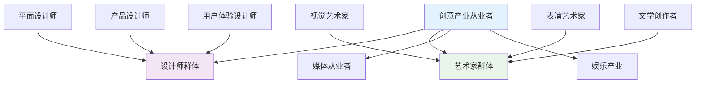
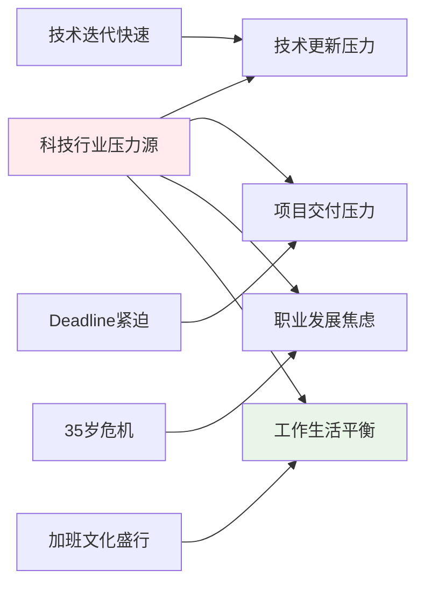

# 职业心理学细分领域专业体系 (Vocational Psychology Specialized Areas)

> 📘 **文档导航**: 本指南深入探讨职业心理学在不同职业群体、行业领域和新兴趋势中的专业化应用。相关文档：
> - [职业心理学概览](../Vocational_Psychology_Overview.md) - 学科全景图和理论基础
> - [职业心理学理论框架](../theory/Vocational_Psychology_Theory_Framework.md) - 核心理论体系
> - [职业心理学评估工具](../assessment/Vocational_Psychology_Assessment_Tools.md) - 测量标准和评估方法
> - [职业心理学临床应用](../clinical/Vocational_Psychology_Clinical_Applications.md) - 治疗干预和咨询技术
> - [职业心理学前沿趋势](../Vocational_Psychology_Frontiers_Trends.md) - 新兴研究领域和技术应用

## 职业群体专业化分析 (Professional Groups Specialized Analysis)

### 1. 创意产业职业心理学

**创意工作者心理特征**:

**创意职业心理特点**:

**内在动机驱动**:
| 动机类型 | 表现特征 | 激励策略 | 管理要点 |
| :--- | :--- | :--- | :--- |
| **自主性需求** | 渴望创作自由、反对过度管控 | 弹性工作制、项目责任制 | 平衡自由与责任 |
| **胜任感追求** | 追求技艺精湛、作品完美 | 技能发展机会、专业认可 | 提供成长空间 |
| **关联性渴望** | 希望作品被理解、产生共鸣 | 作品展示平台、受众反馈 | 建立沟通桥梁 |

**职业发展挑战**:
- **收入不稳定**: 项目制工作导致收入波动较大
- **评价主观性**: 创作价值难以客观量化评估
- **竞争激烈**: 行业门槛相对较低，竞争压力大
- **知识产权**: 创作成果保护和商业化难题

**心理健康风险**:
| 风险类型 | 具体表现 | 预防策略 | 支持措施 |
| :--- | :--- | :--- | :--- |
| **完美主义倾向** | 过度追求完美、自我苛求 | 认知重构、标准调整 | 心理咨询服务 |
| **创意枯竭** | 灵感匮乏、创作瓶颈 | 休息调整、跨界学习 | 创意工作坊 |
| **价值认同危机** | 作品不被认可、自我怀疑 | 同伴支持、价值重构 | 专业社群建设 |
| **工作边界模糊** | 工作生活界限不清 | 时间管理训练 | 边界设定指导 |

### 2. 科技行业职业心理学

**科技从业者职业特征**:
| 职业类型 | 核心技能 | 心理特点 | 发展需求 |
| :--- | :--- | :--- | :--- |
| **软件开发** | 编程能力、系统思维 | 逻辑性强、注重效率 | 技术更新、团队协作 |
| **数据科学** | 统计分析、机器学习 | 精确性要求高、压力大 | 持续学习、结果导向 |
| **产品经理** | 用户洞察、项目管理 | 沟通协调能力强 | 商业思维、用户体验 |
| **网络安全** | 风险识别、防护技术 | 责任重大、压力持续 | 专业认证、应急处理 |

**行业特殊心理压力**:

**职业倦怠预防体系**:
- **技术能力更新**: 建立持续学习机制，避免技能过时
- **项目管理优化**: 合理安排工作量，设置缓冲时间
- **团队文化建设**: 营造支持性工作环境
- **个人发展规划**: 协助制定清晰的职业发展路径

### 3. 医疗卫生职业心理学

**医护人员职业压力特征**:
| 医疗岗位 | 压力来源 | 心理影响 | 干预重点 |
| :--- | :--- | :--- | :--- |
| **临床医生** | 生死决策、医患关系 | 责任压力、道德困扰 | 决策支持、伦理咨询 |
| **护士群体** | 工作强度、情感耗竭 | 身心疲惫、同情疲劳 | 休息保障、情感支持 |
| **医技人员** | 精准要求、重复劳动 | 枯燥厌倦、成就感低 | 工作丰富化、价值重塑 |

**创伤暴露后心理反应**:
- **急性应激反应**: 面对突发医疗事件的即时心理冲击
- **替代性创伤**: 长期接触患者创伤经历产生的间接创伤
- **道德伤害**: 因医疗资源限制或制度约束产生的道德冲突

**心理韧性培养方案**:
- **正念减压训练**: 提高情绪调节能力和专注力
- **同伴支持小组**: 建立医护同行间的互助网络
- **意义建构工作坊**: 帮助重新审视职业价值和意义
- **边界管理培训**: 学会在关怀患者和自我保护间找到平衡

### 4. 教育行业职业心理学

**教师职业心理特点**:
| 教育阶段 | 心理特征 | 职业挑战 | 支持需求 |
| :--- | :--- | :--- | :--- |
| **基础教育** | 责任重大、情感投入深 | 学生成长压力、家长期望 | 情感支持、专业发展 |
| **高等教育** | 学术压力、科研要求 | 发表压力、职业竞争 | 研究支持、工作生活平衡 |
| **职业教育** | 技能传授、就业导向 | 实用性要求高、社会认知度 | 行业联系、能力提升 |

**职业倦怠预防策略**:

**积极心理建设**:
- **教学效能感培养**: 通过成功体验增强教学自信
- **师生关系优化**: 建立良性互动的师生关系模式
- **专业成长支持**: 提供持续的专业发展机会
- **工作意义强化**: 帮助发现教育工作的深层价值

## 行业应用专业化体系 (Industry Application Specialization)

### 1. 金融服务职业心理学

**金融从业者心理特征**:
| 岗位类型 | 心理压力源 | 风险表现 | 干预策略 |
| :--- | :--- | :--- | :--- |
| **投资银行** | 高强度工作、业绩压力 | 焦虑失眠、决策疲劳 | 压力管理、时间平衡 |
| **资产管理** | 市场波动、客户期望 | 情绪不稳定、风险厌恶 | 情绪调节、风险教育 |
| **保险精算** | 精确性要求、长期责任 | 完美主义、责任感过重 | 标准调整、支持系统 |

**行业特殊心理需求**:
- **风险决策心理**: 研究金融决策中的认知偏差和情绪影响
- **高压环境适应**: 开发金融业特有的压力管理和韧性培养方案
- **职业道德建设**: 加强金融从业人员的职业操守和伦理意识

### 2. 制造业职业心理学

**制造业员工心理特点**:
| 工作类型 | 心理特征 | 管理挑战 | 改善策略 |
| :--- | :--- | :--- | :--- |
| **一线操作工** | 重复性工作、体力消耗大 | 工作单调、技能单一 | 工作丰富化、技能培训 |
| **技术工程师** | 精密度要求高、责任重大 | 技术更新压力、完美主义 | 持续学习、标准合理化 |
| **管理人员** | 协调压力大、决策责任重 | 上下沟通困难、绩效压力 | 沟通技能、决策支持 |

**工业4.0心理适应**:
- **自动化转型焦虑**: 帮助员工适应智能制造带来的岗位变化
- **技能转型升级**: 设计针对性的再培训和技能提升方案
- **人机协作心理**: 研究人与智能设备协同工作的心理机制

### 3. 服务业职业心理学

**服务行业从业者特征**:
| 服务类型 | 心理挑战 | 情绪劳动 | 支持策略 |
| :--- | :--- | :--- | :--- |
| **餐饮服务** | 高强度、不规律作息 | 情绪调节、微笑服务 | 轮班管理、情绪支持 |
| **零售销售** | 业绩压力、客户投诉 | 情绪伪装、压力应对 | 销售技巧、压力疏导 |
| **客户服务** | 投诉处理、情绪消耗 | 同理心疲劳、情感耗竭 | 同伴支持、专业培训 |

**情绪劳动管理**:
- **表面表演训练**: 教授在不适情况下维持专业表现的技巧
- **深层表演培养**: 帮助真正理解和感受客户需求
- **情绪恢复机制**: 建立工作间隙的情绪调节和恢复程序

## 新兴职业领域心理学 (Emerging Professional Fields Psychology)

### 1. 数字经济职业心理学

**新兴数字职业分析**:
| 职业类型 | 心理特点 | 发展挑战 | 适应策略 |
| :--- | :--- | :--- | :--- |
| **电商运营** | 数据驱动、快节奏 | 信息过载、竞争激烈 | 信息筛选、节奏管理 |
| **直播主播** | 表现导向、粉丝经济 | 形象压力、收入不稳定 | 自我管理、风险分散 |
| **自媒体创作者** | 内容创新、个人品牌 | 创意枯竭、平台依赖 | 多元发展、品牌建设 |

**远程工作心理适应**:

**数字游民心理支持**:
- **流动性适应**: 帮助适应频繁的地理位置变化
- **文化融合**: 处理不同文化环境中的身份认同
- **社会连接**: 建立稳定的虚拟和现实社交网络

### 2. 绿色经济职业心理学

**环保职业心理特征**:
| 环保领域 | 心理动机 | 工作挑战 | 支持需求 |
| :--- | :--- | :--- | :--- |
| **可再生能源** | 环境使命感、技术创新 | 技术风险、市场不确定性 | 技术支持、风险分担 |
| **环保咨询** | 专业价值实现、社会贡献 | 项目周期长、成效显现慢 | 长期激励、成果认可 |
| **循环经济** | 可持续发展理念、系统思维 | 产业链协调复杂、标准不统一 | 协作平台、标准建设 |

**使命感与现实压力平衡**:
- **理想与现实协调**: 帮助在崇高使命和现实约束间找到平衡
- **长期坚持动力**: 维持对环保事业的长期投入和热情
- **成就感获得**: 在缓慢的环境改善过程中保持工作满足感

### 3. 人工智能相关职业心理学

**AI从业者心理特点**:
| 职业角色 | 心理特征 | 伦理挑战 | 发展需求 |
| :--- | :--- | :--- | :--- |
| **算法工程师** | 逻辑思维强、创新欲望高 | 算法偏见、隐私保护 | 伦理培训、价值引导 |
| **AI产品经理** | 用户导向、商业敏感 | 技术伦理、社会责任 | 伦理决策、风险评估 |
| **AI伦理专家** | 价值敏感、批判思维 | 利益平衡、标准制定 | 跨学科合作、政策影响 |

**技术变革心理适应**:
- **失业焦虑缓解**: 帮助适应AI带来的职业结构变化
- **技能转型升级**: 支持向AI协作和管理角色的转变
- **人机关系调适**: 建立健康的人工智能协作心理模式

## 职业心理学未来发展趋势 (Future Development Trends)

### 1. 个性化职业心理健康服务

**精准心理干预**:
- **基因心理学应用**: 基于遗传特征的职业心理倾向分析
- **生物标志物监测**: 通过生理指标预测职业压力反应
- **AI个性化推荐**: 智能匹配最适合的干预方案和服务

### 2. 跨文化职业心理学

**全球化背景下的职业心理**:
- **文化适应研究**: 不同文化背景下的职业价值观和行为模式
- **跨国企业管理**: 跨文化团队的心理建设和冲突管理
- **移民职业适应**: 帮助移民群体的职业融入和身份认同

### 3. 可持续发展职业心理学

**绿色职业心理健康**:
- **环保使命感研究**: 探索环境使命感对职业满意度的影响
- **可持续发展压力**: 分析绿色转型带来的心理适应挑战
- **社会责任职业**: 研究承担社会责任对职业心理健康的影响

### 4. 职业心理学技术融合

**新兴技术应用**:
- **虚拟现实治疗**: VR环境中的职业场景模拟和技能训练
- **脑机接口应用**: 直接测量职业决策的神经活动模式
- **区块链技术**: 职业信用和技能认证的去中心化管理

---

*📚 本文档系统梳理了职业心理学在各专业领域的应用特色和发展趋势，为职业心理健康服务的精准化和专业化提供指导。*