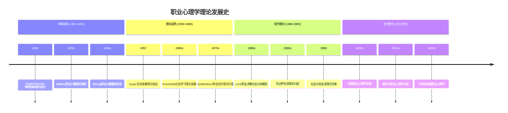
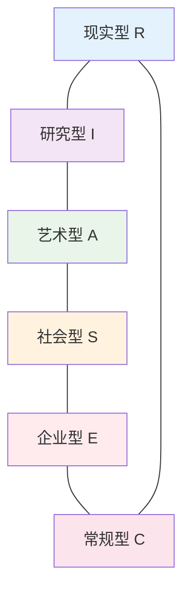
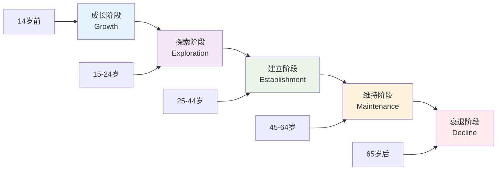
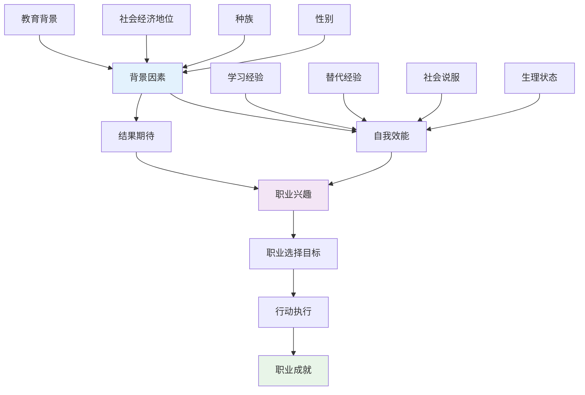

# 职业心理学理论基础与框架体系 (Vocational Psychology Theory Framework)

> 📘 **文档导航**: 本指南深入阐述职业心理学的核心理论体系、概念模型和发展框架。相关文档：
> - [职业心理学概览](../Vocational_Psychology_Overview.md) - 学科全景图和应用领域
> - [职业心理学评估工具](../assessment/Vocational_Psychology_Assessment_Tools.md) - 测量标准和评估方法
> - [职业心理学临床应用](../clinical/Vocational_Psychology_Clinical_Applications.md) - 治疗干预和咨询技术
> - [职业心理学术语标准](../Vocational_Psychology_Terminology_Standards.md) - 专业术语定义和使用规范
> - [职业心理学案例指南](../Vocational_Psychology_Case_Studies_Guide.md) - 典型案例分析和实践应用

## 理论体系架构 (Theoretical System Architecture)

### 职业心理学理论发展历程

职业心理学作为应用心理学的重要分支，经历了从特质因素理论到系统理论的发展演进过程，形成了多元化的理论体系。

**理论发展时间线**:

### 核心理论模型详解

#### 1. 特质因素理论 (Trait-Factor Theory)

**理论创始人**: Frank Parsons (1909)

**核心假设**:
- 个体具有稳定的特质和能力倾向
- 职业岗位有明确的要求和特征
- 人职匹配程度决定职业适应性

**理论要素分析**:
| 要素维度 | 理论内涵 | 测评方法 | 应用价值 |
| :--- | :--- | :--- | :--- |
| **个体特质** | 能力、兴趣、人格特征 | 能力倾向测验、人格量表 | 人才选拔基础 |
| **职业因素** | 工作要求、环境特征 | 职业分析、岗位描述 | 岗位设计依据 |
| **匹配机制** | 特质与因素的对应关系 | 匹配系数计算 | 职业指导核心 |

**现代发展**:
- 整合大数据分析技术
- 考虑动态匹配过程
- 引入机器学习算法

#### 2. Holland职业兴趣理论 (Holland's Theory of Career Choice)

**理论创始人**: John Holland (1959)

**六边形模型**:

**六种人格类型特征**:

**现实型 (Realistic)**:
- **核心特征**: 实际、动手能力强、偏好具体操作
- **典型职业**: 工程师、技工、农民、机械师
- **行为表现**: 喜欢使用工具、解决实际问题、偏好户外活动

**研究型 (Investigative)**:
- **核心特征**: 分析、好奇、逻辑思维强
- **典型职业**: 科学家、研究员、医生、程序员
- **行为表现**: 喜欢思考、探索未知、追求精确性

**艺术型 (Artistic)**:
- **核心特征**: 创造、敏感、审美能力强
- **典型职业**: 艺术家、设计师、作家、音乐家
- **行为表现**: 喜欢创新、表达自我、追求美感

**社会型 (Social)**:
- **核心特征**: 助人、合作、沟通能力强
- **典型职业**: 教师、咨询师、社工、护士
- **行为表现**: 喜欢帮助他人、团队合作、善于沟通

**企业型 (Enterprising)**:
- **核心特征**: 领导、冒险、说服能力强
- **典型职业**: 销售经理、企业家、律师、政治家
- **行为表现**: 喜欢影响他人、承担风险、追求成就

**常规型 (Conventional)**:
- **核心特征**: 有序、准确、遵守规则
- **典型职业**: 会计师、行政人员、图书管理员、银行职员
- **行为表现**: 喜欢结构化工作、注重细节、偏好稳定

**一致性分析**:
| 一致性等级 | 相邻类型 | 职业适应性 | 发展建议 |
| :--- | :--- | :--- | :--- |
| **高度一致** | RI, IS, SA, AE, EC, CR | 职业满意度高、稳定性强 | 深化专业发展 |
| **中度一致** | RA, IE, AS, SE, CE, RC | 有一定适应性、发展潜力 | 拓展技能领域 |
| **低度一致** | RS, IC, AR, SI, EA, CS | 适应困难、冲突较大 | 重新评估匹配 |

#### 3. Super生涯发展理论 (Life-Span, Life-Space Theory)

**理论创始人**: Donald Super (1957)

**生涯彩虹模型**:

**生涯发展阶段特征**:

**成长阶段 (Growth Stage, 14岁前)**:
- **发展任务**: 自我概念形成、职业意识萌芽
- **关键经历**: 家庭影响、学校教育、同伴交往
- **心理特征**: 好奇心强、模仿学习、理想化倾向

**探索阶段 (Exploration Stage, 15-24岁)**:
- **发展任务**: 职业兴趣探索、能力培养、价值观澄清
- **关键经历**: 教育深造、实习体验、求职尝试
- **心理特征**: 试错学习、身份认同困惑、选择焦虑

**建立阶段 (Establishment Stage, 25-44岁)**:
- **发展任务**: 职业能力提升、地位确立、稳定发展
- **关键经历**: 工作实践、技能精进、责任承担
- **心理特征**: 责任感增强、竞争意识强烈、成就动机高涨

**维持阶段 (Maintenance Stage, 45-64岁)**:
- **发展任务**: 技能更新、角色转换、经验传承
- **关键经历**: 职业转型、指导后辈、平衡调整
- **心理特征**: 经验丰富但创新动力可能下降、面临职业高原

**衰退阶段 (Decline Stage, 65岁后)**:
- **发展任务**: 退休适应、经验传承、生活转型
- **关键经历**: 退出职场、休闲生活、代际互动
- **心理特征**: 成就感满足但身体机能下降、寻找新的人生意义

**生涯角色理论**:
| 生涯角色 | 核心内容 | 发展时期 | 平衡策略 |
| :--- | :--- | :--- | :--- |
| **子女角色** | 家庭责任、情感支持 | 全生命周期 | 时间管理、边界设定 |
| **学生角色** | 学习发展、知识积累 | 青少年期 | 优先级排序、资源整合 |
| **休闲者角色** | 娱乐放松、兴趣发展 | 全生命周期 | 压力释放、创造力激发 |
| **公民角色** | 社会参与、公共责任 | 成年期 | 社会连接、价值实现 |
| **工作者角色** | 职业发展、经济贡献 | 青壮年期 | 能力提升、目标导向 |
| **持家者角色** | 家庭经营、生活管理 | 成年期 | 协调配合、资源共享 |

#### 4. 社会认知生涯理论 (Social Cognitive Career Theory, SCCT)

**理论创始人**: Lent, Brown & Hackett (1994)

**核心理论框架**:

**三大核心构念**:

**自我效能感 (Self-Efficacy)**:
- **定义**: 个体对自己在特定情境中完成任务能力的信念
- **形成机制**: 
  - **掌握经验**: 成功或失败的经历
  - **替代经验**: 观察他人成功或失败
  - **社会说服**: 他人鼓励或批评
  - **生理状态**: 情绪和身体反应
- **影响维度**:
  - 职业兴趣发展
  - 目标设定水平
  - 行动坚持程度
  - 挫折应对能力

**结果期待 (Outcome Expectations)**:
- **定义**: 个体对特定行为会产生何种结果的预期
- **类型分类**:
  - **积极结果期待**: 行为带来正面结果的预期
  - **消极结果期待**: 行为带来负面结果的预期
- **影响机制**:
  - 决策偏好形成
  - 风险评估标准
  - 行为动机强度

**职业兴趣 (Career Interests)**:
- **发展过程**: 自我效能和结果期待共同作用的结果
- **功能作用**:
  - 信息注意偏向
  - 活动参与选择
  - 职业目标设定
  - 持续发展动力

### 现代理论整合与发展

#### 1. 系统理论视角 (Systems Theory Framework)

**理论核心**: 将职业生涯视为复杂的开放系统，强调多重因素的相互作用。

**系统要素分析**:
| 系统层面 | 核心要素 | 相互关系 | 动态特征 |
| :--- | :--- | :--- | :--- |
| **个体系统** | 能力、兴趣、价值观、人格 | 内在一致性与冲突 | 自我调节、适应发展 |
| **微系统** | 家庭、朋友、同事、导师 | 直接互动影响 | 支持网络、榜样作用 |
| **中系统** | 组织文化、行业环境、教育机构 | 间接环境影响 | 制度约束、机会结构 |
| **宏系统** | 社会文化、经济制度、政策法规 | 宏观背景制约 | 价值导向、结构性机会 |

#### 2. 积极职业心理学 (Positive Vocational Psychology)

**理论焦点**: 关注工作中的积极体验、优势发挥和幸福感提升。

**核心构念体系**:
- **工作投入 (Work Engagement)**: 活力、奉献、专注的工作状态
- **职业繁荣 (Career Flourishing)**: 职业成长与幸福感的结合
- **意义感 (Meaningfulness)**: 工作与个人价值的契合程度
- **优势运用 (Strengths Use)**: 在工作中充分发挥个人优势

**干预策略**:
- 积极心理资本培养
- 工作意义建构技术
- 优势识别与发展
- 积极组织行为促进

#### 3. 数字化职业心理学 (Digital Vocational Psychology)

**新兴领域**: 研究数字技术对职业行为和心理的影响。

**重点关注**:
- 远程工作的心理适应
- 人工智能对职业决策的影响
- 数字平台的职业发展机会
- 虚拟环境中的职业身份建构

### 理论应用指导原则

#### 1. 理论选择标准
- **问题适配性**: 理论与具体问题的匹配程度
- **证据支持度**: 理论的实证研究基础
- **文化适宜性**: 理论在特定文化背景下的适用性
- **实践可操作性**: 理论指导实践的可行性

#### 2. 理论整合策略
- **互补性整合**: 结合不同理论的优势
- **层次性整合**: 在不同分析层面应用相应理论
- **动态性整合**: 根据发展阶段调整理论应用
- **个体化整合**: 考虑个体差异进行理论选择

#### 3. 理论发展建议
- 加强跨文化验证研究
- 整合新兴技术方法
- 关注特殊群体需求
- 建立本土化理论体系

---

*📚 本文档基于职业心理学经典理论和最新研究成果，为理论学习、研究设计和实践应用提供系统的理论框架指导。*